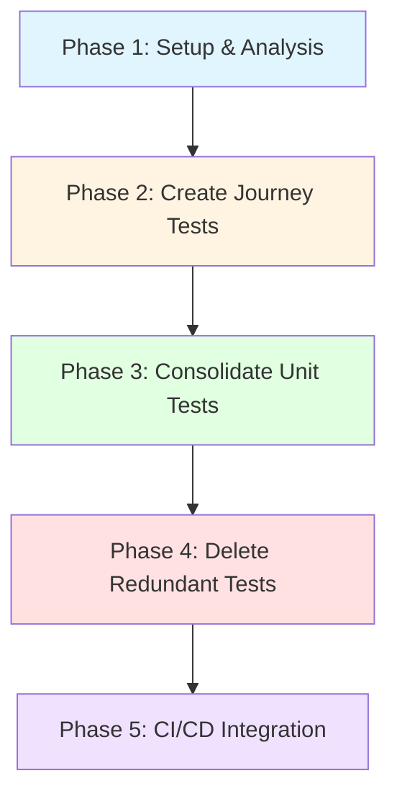

# Test Suite Migration: User-Centric Restructuring Plan

**Status**: 🟡 Planning Phase
**Priority**: High
**Effort**: ~40-60 hours (4-6 work sessions)
**Start Date**: TBD
**Target Completion**: TBD (4-6 weeks, 1 phase per week)

---

## 📊 Current State

- **402 test files** with 195,527 lines of test code
- **18 files exceed 1,000 lines** (monolithic)
- **7 skipped test blocks**
- **45% tests focus on implementation details** ❌ (should be 10-15%)
- **35% tests focus on user value** (should be 70-80%)

**Goal**: Reduce to **50 test files** with **40,000 lines** focused on user value.

---

## 🎯 Success Criteria

- [ ] 7 Core User Journeys pass with 100% reliability
- [ ] Test execution time < 2 minutes (currently ~5 minutes)
- [ ] 70% of tests focus on user-facing behavior
- [ ] Zero skipped tests in CI/CD pipeline
- [ ] No test file > 600 lines
- [ ] Test coverage maintained ≥85% for critical paths

---

## 📋 Phase Dependency Graph

---

## 🚀 Phase 1: Setup & Analysis (4-6 hours)

- [ ] 1.1 Create Migration Tracking (30 min)
- [ ] 1.2 Create New Directory Structure (30 min)
- [ ] 1.3 Analyze Duplicate Test Coverage (2 hours)
- [ ] 1.4 Create Test Mapping Document (1 hour)
- [ ] 1.5 Run Baseline Coverage Report (30 min)
- [ ] 1.6 Setup Migration CI Job (1 hour)

**Exit Criteria**:
- [ ] All directories created
- [ ] Baseline metrics documented
- [ ] Test mapping complete
- [ ] Migration CI job passes

---

## 🧪 Phase 2: Create Journey Tests (8-12 hours)

- [ ] 2.1 Journey 1: Init & Bootstrap (2 hours)
- [ ] 2.2 Journey 2: Test Generation (2 hours)
- [ ] 2.3 Journey 3: Test Execution (2 hours)
- [ ] 2.4 Journey 4: Coverage Analysis (2 hours)
- [ ] 2.5 Journey 5: Quality Gate (1.5 hours)
- [ ] 2.6 Journey 6: Flaky Detection (1.5 hours)
- [ ] 2.7 Journey 7: Learning & Improvement (1 hour)

**Exit Criteria**:
- [ ] All 7 journey tests pass with 100% reliability
- [ ] Journey tests use real database (no mocks)
- [ ] Average journey test execution < 10 seconds each
- [ ] Migration CI job passes all journey tests

---

## 🔧 Phase 3: Consolidate Unit Tests (12-16 hours)

- [ ] 3.1 Consolidate BaseAgent Tests (3 hours)
  - Merge 6 files (4,500 lines) → 2 files (1,200 lines)
- [ ] 3.2 Consolidate TestGeneratorAgent Tests (3 hours)
  - Merge 3 files (3,000 lines) → 1 file (800 lines)
- [ ] 3.3 Consolidate LearningEngine Tests (2 hours)
  - Merge 2 files (2,000 lines) → 1 file (600 lines)
- [ ] 3.4 Consolidate FlakyTestDetector Tests (2 hours)
  - Merge 2 files (1,500 lines) → 1 file (500 lines)
- [ ] 3.5 Create Contract Tests (2 hours)
  - 102 MCP tools + 8 CLI commands + 18 agents

**Exit Criteria**:
- [ ] All consolidated tests pass
- [ ] No test file > 600 lines
- [ ] Unit test execution time < 30 seconds total
- [ ] Test coverage maintained ≥85%

---

## 🗑️ Phase 4: Delete Redundant Tests (4-6 hours)

- [ ] 4.1 Delete Implementation Detail Tests (1 hour)
  - Delete 51K lines of TypeScript semantic tests
- [ ] 4.2 Delete Duplicate BaseAgent Tests (1 hour)
- [ ] 4.3 Delete Duplicate TestGeneratorAgent Tests (1 hour)
- [ ] 4.4 Delete Duplicate Learning Tests (1 hour)
- [ ] 4.5 Clean Up Old Directory Structure (30 min)
- [ ] 4.6 Update Test Configuration (1 hour)

**Exit Criteria**:
- [ ] ~60K lines of test code deleted
- [ ] No duplicate test files remain
- [ ] Old directory structure removed
- [ ] All CI/CD pipelines still pass

---

## 🔄 Phase 5: CI/CD Integration (4-6 hours)

- [ ] 5.1 Create Optimized Test Scripts (1 hour)
- [ ] 5.2 Update GitHub Actions Workflow (1.5 hours)
- [ ] 5.3 Add Test Coverage Gates (1 hour)
- [ ] 5.4 Create Test Dashboard (1.5 hours)
- [ ] 5.5 Update Documentation (1 hour)

**Exit Criteria**:
- [ ] CI/CD pipeline runs in < 2 minutes
- [ ] Coverage gates enforced automatically
- [ ] Test dashboard generated on every run
- [ ] Documentation updated and reviewed

---

## ⚠️ Risks & Mitigations

| Risk | Impact | Mitigation |
|------|--------|------------|
| Coverage drops | High | Run coverage after each consolidation. Rollback if drops > 2%. |
| Journey tests flaky | High | Use real database with isolation. Add retry logic. |
| Takes longer than estimated | Medium | Break into smaller PRs (one phase at a time). |
| Existing bugs exposed | Medium | Create regression tests. Don't block migration. |

---

## 📈 Success Metrics

| Metric | Baseline | Target | Current |
|--------|----------|--------|---------|
| Test Files | 402 | 50 | 402 |
| Test Lines | 195,527 | 40,000 | 195,527 |
| Execution Time | ~5 min | < 2 min | ~5 min |
| Files > 1K Lines | 18 | 0 | 18 |
| Skipped Tests | 7 | 0 | 7 |

---

## 📚 Documentation

Full migration plan: [docs/migration/test-suite-restructuring-plan.md](../../../docs/migration/test-suite-restructuring-plan.md)

---

## 🚀 Getting Started

1. [ ] Assign migration lead
2. [ ] Schedule kick-off meeting (30 min)
3. [ ] Start Phase 1: Setup & Analysis
4. [ ] Update this issue daily with progress

---

**Migration Lead**: TBD
**Reviewers**: TBD

_Generated by GOAP Specialist • Template Version: 1.0.0_
