# QCSD CI/CD SWARM

## Swarm Architecture

```mermaid
flowchart TB
    subgraph INPUT["📥 INPUT"]
        pr["Pull Request<br/>+ Code Changes"]
    end

    subgraph CICD_SWARM["🚀 CI/CD QUALITY GATES SWARM"]
        direction TB

        subgraph GATE1["Gate 1: Static Analysis"]
            direction LR
            cc["📐 qe-code-complexity<br/><i>Complexity Metrics</i>"]
            ss["🔒 qe-security-scanner<br/><i>SAST/Secrets</i>"]
        end

        subgraph GATE2["Gate 2: Test Execution"]
            direction LR
            pe["⚡ qe-parallel-executor<br/><i>Parallel Tests</i>"]
            fh["🎯 qe-flaky-hunter<br/><i>Flaky Detection</i>"]
            rh["🔄 qe-retry-handler<br/><i>Smart Retries</i>"]
        end

        subgraph GATE3["Gate 3: Coverage & Quality"]
            direction LR
            cs["📊 qe-coverage-specialist<br/><i>Gap Detection</i>"]
            qg["✅ qe-quality-gate<br/><i>Threshold Enforcement</i>"]
        end

        subgraph GATE4["Gate 4: Deployment Decision"]
            direction LR
            da["🚦 qe-deployment-advisor<br/><i>Go/No-Go Decision</i>"]
            ra["⚠️ qe-risk-assessor<br/><i>Release Risk</i>"]
        end
    end

    subgraph OUTPUT["📤 CI/CD VERDICT"]
        direction LR
        pass["✅ PASS<br/>Deploy"]
        fail["❌ FAIL<br/>Block"]
        warn["⚠️ WARN<br/>Review"]
    end

    pr --> cc
    pr --> ss
    cc --> pe
    ss --> pe
    pe --> fh
    fh --> rh
    rh --> cs
    cs --> qg
    qg --> da
    da --> ra

    ra -->|"Low Risk"| pass
    ra -->|"High Risk"| fail
    ra -->|"Medium Risk"| warn

    style cc fill:#2196F3,stroke:#1565C0,color:#fff
    style ss fill:#F44336,stroke:#C62828,color:#fff
    style pe fill:#4CAF50,stroke:#2E7D32,color:#fff
    style fh fill:#FF9800,stroke:#EF6C00,color:#fff
    style rh fill:#9C27B0,stroke:#6A1B9A,color:#fff
    style cs fill:#00BCD4,stroke:#00838F,color:#fff
    style qg fill:#4CAF50,stroke:#2E7D32,color:#fff
    style da fill:#673AB7,stroke:#4527A0,color:#fff
    style ra fill:#FF5722,stroke:#D84315,color:#fff
    style pass fill:#E8F5E9,stroke:#4CAF50,color:#1B5E20
    style fail fill:#FFEBEE,stroke:#F44336,color:#B71C1C
    style warn fill:#FFF3E0,stroke:#FF9800,color:#E65100
```



## Quality Gates Pipeline

```mermaid
flowchart LR
    subgraph PIPELINE["🔄 CI/CD PIPELINE"]
        direction LR

        G1["🔍 GATE 1<br/>━━━━━━━━<br/>Static Analysis<br/>Security Scan<br/>Complexity Check"]
        G2["🧪 GATE 2<br/>━━━━━━━━<br/>Unit Tests<br/>Integration Tests<br/>Flaky Detection"]
        G3["📊 GATE 3<br/>━━━━━━━━<br/>Coverage ≥80%<br/>Quality Metrics<br/>Threshold Check"]
        G4["🚦 GATE 4<br/>━━━━━━━━<br/>Risk Assessment<br/>Deploy Decision<br/>Go/No-Go"]

        G1 -->|"Pass"| G2
        G2 -->|"Pass"| G3
        G3 -->|"Pass"| G4
        G4 -->|"Approved"| DEPLOY["🚀 DEPLOY"]
    end

    style G1 fill:#2196F3,stroke:#1565C0,color:#fff
    style G2 fill:#4CAF50,stroke:#2E7D32,color:#fff
    style G3 fill:#00BCD4,stroke:#00838F,color:#fff
    style G4 fill:#673AB7,stroke:#4527A0,color:#fff
    style DEPLOY fill:#8BC34A,stroke:#558B2F,color:#fff
```



## Agent Coordination Sequence


## Quality Thresholds

```mermaid
flowchart TB
    subgraph THRESHOLDS["📏 QUALITY THRESHOLDS"]
        direction TB

        subgraph COVERAGE["Coverage"]
            cov["Line Coverage ≥ 80%<br/>Branch Coverage ≥ 75%<br/>Function Coverage ≥ 85%"]
        end

        subgraph SECURITY["Security"]
            sec["Critical: 0<br/>High: 0<br/>Medium: ≤ 5"]
        end

        subgraph COMPLEXITY["Complexity"]
            comp["Cyclomatic ≤ 10<br/>Cognitive ≤ 15<br/>Maintainability ≥ 70"]
        end

        subgraph TESTS["Tests"]
            test["Pass Rate ≥ 99%<br/>Flaky Rate ≤ 1%<br/>Duration ≤ 10min"]
        end
    end

    style cov fill:#E8F5E9,stroke:#4CAF50,color:#1B5E20
    style sec fill:#FFEBEE,stroke:#F44336,color:#B71C1C
    style comp fill:#E3F2FD,stroke:#2196F3,color:#0D47A1
    style test fill:#FFF3E0,stroke:#FF9800,color:#E65100
```



## MCP Integration

```typescript
// Initialize CI/CD Swarm
mcp__agentic_qe__fleet_init({
  topology: "hierarchical",
  enabledDomains: ["test-execution", "coverage-analysis", "security-compliance", "quality-assessment"],
  maxAgents: 8
})

// Execute Parallel Tests
mcp__agentic_qe__test_execute_parallel({
  testFiles: ["tests/**/*.test.ts"],
  parallel: true,
  shards: 4,
  retryFlaky: true
})

// Security Scan
mcp__agentic_qe__security_scan_comprehensive({
  target: "src/",
  sast: true,
  secretsDetection: true,
  dependencyAudit: true
})

// Quality Gate Check
mcp__agentic_qe__quality_gate_check({
  coverage: { line: 80, branch: 75 },
  security: { critical: 0, high: 0 },
  tests: { passRate: 99 }
})

// Deployment Decision
mcp__agentic_qe__deployment_assess({
  prId: "PR-123",
  environment: "production",
  riskThreshold: "medium"
})
```

---

## Color Legend

| Color | Meaning |
|-------|---------|
| 🔵 Blue | Static Analysis |
| 🔴 Red | Security Scanning |
| 🟢 Green | Test Execution / Pass |
| 🟠 Orange | Flaky Detection / Warning |
| 🔵 Cyan | Coverage Analysis |
| 🟣 Purple | Deployment Decision |
| ⚫ Gray | Pipeline Stages |
