# QCSD DEVELOPMENT SWARM

## Swarm Architecture

```mermaid
flowchart TB
    subgraph INPUT["📥 INPUT"]
        code["Code Changes<br/>+ BDD Scenarios"]
    end

    subgraph DEVELOPMENT_SWARM["💻 DEVELOPMENT SWARM"]
        direction TB

        subgraph TDD_CORE["TDD Core Agent"]
            tdd["🔴🟢🔵 qe-tdd-specialist<br/><i>Test-Driven Development</i><br/>━━━━━━━━━━━━━━━━━<br/>Red-Green-Refactor<br/>London/Chicago Schools"]
        end

        subgraph TDD_SUBAGENTS["TDD Sub-agents"]
            direction LR
            red["🔴 qe-tdd-red<br/><i>Write Failing Test</i>"]
            green["🟢 qe-tdd-green<br/><i>Make Test Pass</i>"]
            refactor["🔵 qe-tdd-refactor<br/><i>Improve Design</i>"]
        end

        subgraph SUPPORTING["Supporting Agents"]
            direction LR
            ta["🏗️ qe-test-architect<br/><i>Test Strategy</i>"]
            mt["🧬 qe-mutation-tester<br/><i>Test Effectiveness</i>"]
            cs["📊 qe-coverage-specialist<br/><i>Gap Detection</i>"]
        end

        subgraph CODE_REVIEW["Code Review Sub-agents"]
            direction LR
            cr["👁️ qe-code-reviewer<br/><i>Quality Review</i>"]
            sr["🔒 qe-security-reviewer<br/><i>Security Review</i>"]
            pr["⚡ qe-performance-reviewer<br/><i>Performance Review</i>"]
            ir["🔗 qe-integration-reviewer<br/><i>Integration Review</i>"]
        end
    end

    subgraph OUTPUT["📤 DEVELOPMENT ARTIFACTS"]
        direction LR
        o1["Unit<br/>Tests"]
        o2["Coverage<br/>Report"]
        o3["Mutation<br/>Score"]
        o4["Code<br/>Reviews"]
    end

    code --> tdd
    tdd --> red
    red --> green
    green --> refactor
    refactor --> tdd

    tdd --> ta
    ta --> cs
    cs --> mt

    refactor --> cr
    cr --> sr
    sr --> pr
    pr --> ir

    red --> o1
    cs --> o2
    mt --> o3
    ir --> o4

    style tdd fill:#4CAF50,stroke:#2E7D32,color:#fff
    style red fill:#F44336,stroke:#C62828,color:#fff
    style green fill:#4CAF50,stroke:#2E7D32,color:#fff
    style refactor fill:#2196F3,stroke:#1565C0,color:#fff
    style ta fill:#9C27B0,stroke:#6A1B9A,color:#fff
    style mt fill:#FF9800,stroke:#EF6C00,color:#fff
    style cs fill:#00BCD4,stroke:#00838F,color:#fff
    style cr fill:#607D8B,stroke:#37474F,color:#fff
    style sr fill:#607D8B,stroke:#37474F,color:#fff
    style pr fill:#607D8B,stroke:#37474F,color:#fff
    style ir fill:#607D8B,stroke:#37474F,color:#fff
    style o1 fill:#FFEBEE,stroke:#F44336,color:#B71C1C
    style o2 fill:#E0F7FA,stroke:#00BCD4,color:#006064
    style o3 fill:#FFF3E0,stroke:#FF9800,color:#E65100
    style o4 fill:#ECEFF1,stroke:#607D8B,color:#37474F
```



## TDD Red-Green-Refactor Cycle

```mermaid
flowchart LR
    subgraph CYCLE["🔄 TDD CYCLE"]
        direction LR

        R["🔴 RED<br/>━━━━━━━━<br/>qe-tdd-red<br/>Write failing test<br/>Define behavior"]
        G["🟢 GREEN<br/>━━━━━━━━<br/>qe-tdd-green<br/>Minimal code<br/>Make test pass"]
        B["🔵 REFACTOR<br/>━━━━━━━━<br/>qe-tdd-refactor<br/>Clean code<br/>Improve design"]

        R -->|"Test fails"| G
        G -->|"Test passes"| B
        B -->|"Next feature"| R
    end

    style R fill:#F44336,stroke:#C62828,color:#fff
    style G fill:#4CAF50,stroke:#2E7D32,color:#fff
    style B fill:#2196F3,stroke:#1565C0,color:#fff
```



## Agent Coordination Sequence

```mermaid
sequenceDiagram
    participant Dev as 👤 Developer
    participant Fleet as 🎛️ Fleet Commander
    participant TDD as 🔴🟢🔵 qe-tdd-specialist
    participant Red as 🔴 qe-tdd-red
    participant Green as 🟢 qe-tdd-green
    participant Refactor as 🔵 qe-tdd-refactor
    participant CR as 👁️ Code Reviewers
    participant Memory as 🧠 Memory Store

    Dev->>Fleet: Submit code change
    Fleet->>TDD: Orchestrate TDD cycle

    activate TDD
    TDD->>Memory: Query test patterns
    Memory-->>TDD: Historical patterns

    loop TDD Cycle
        TDD->>Red: Write failing test
        Red-->>TDD: Test (failing)

        TDD->>Green: Implement minimal code
        Green-->>TDD: Code (test passes)

        TDD->>Refactor: Improve design
        Refactor-->>TDD: Refactored code
    end
    deactivate TDD

    par Code Review
        Fleet->>CR: Review changes
        CR-->>Fleet: Review feedback
    end

    Fleet->>Memory: Store patterns
    Fleet-->>Dev: Development Report
```



## MCP Integration

```typescript
// Initialize Development Swarm
mcp__agentic_qe__fleet_init({
  topology: "hierarchical",
  enabledDomains: ["test-generation", "test-execution", "coverage-analysis"],
  maxAgents: 10
})

// Generate Tests via TDD
mcp__agentic_qe__test_generate_enhanced({
  sourceCode: "src/auth/login.ts",
  testType: "unit",
  approach: "tdd",
  school: "london"  // or "chicago"
})

// Run Mutation Testing
mcp__agentic_qe__mutation_test({
  testFiles: ["tests/auth/*.test.ts"],
  targetFiles: ["src/auth/*.ts"],
  threshold: 0.80
})

// Execute Code Review
mcp__agentic_qe__code_review({
  prDiff: "git diff main..feature",
  reviewers: ["security", "performance", "integration"]
})
```

---

## Color Legend

| Color | Meaning |
|-------|---------|
| 🔴 Red | TDD Red Phase (Failing Tests) |
| 🟢 Green | TDD Green Phase (Passing Tests) |
| 🔵 Blue | TDD Refactor Phase |
| 🟣 Purple | Test Architecture |
| 🟠 Orange | Mutation Testing |
| 🔵 Cyan | Coverage Analysis |
| ⚫ Gray | Code Review Sub-agents |
