# QCSD GROOMING SWARM

## Swarm Architecture

```mermaid
flowchart TB
    subgraph INPUT["📥 INPUT"]
        story["User Story<br/>+ Acceptance Criteria"]
    end

    subgraph GROOMING_SWARM["📋 GROOMING SWARM"]
        direction TB

        subgraph PRIMARY["Primary Agents"]
            direction LR
            pfa["🔍 qe-product-factors-assessor<br/><i>SFDIPOT Analysis</i><br/>━━━━━━━━━━━━━━━━━<br/>Structure, Function<br/>Data, Interfaces<br/>Platform, Operations, Time"]
            bdd["📝 qe-bdd-generator<br/><i>Scenario Generation</i><br/>━━━━━━━━━━━━━━━━━<br/>Given/When/Then<br/>Edge Cases<br/>Gherkin Syntax"]
        end

        subgraph SUPPORTING["Supporting Agents"]
            direction LR
            rv["✅ qe-requirements-validator<br/><i>Acceptance Criteria</i>"]
            ra["⚠️ qe-risk-assessor<br/><i>Story Risk Analysis</i>"]
            dm["🗺️ qe-dependency-mapper<br/><i>Story Dependencies</i>"]
        end

        subgraph SPECIALIZED["Specialized Support"]
            direction LR
            ct["🔗 qe-contract-validator<br/><i>API Contracts</i>"]
            ia["💥 qe-impact-analyzer<br/><i>Change Impact</i>"]
        end
    end

    subgraph OUTPUT["📤 GROOMING ARTIFACTS"]
        direction LR
        o1["SFDIPOT<br/>Analysis"]
        o2["BDD<br/>Scenarios"]
        o3["Risk<br/>Matrix"]
        o4["Dependencies<br/>Map"]
    end

    story --> pfa
    story --> bdd
    pfa --> rv
    bdd --> rv
    rv --> ra
    ra --> dm

    pfa --> o1
    bdd --> o2
    ra --> o3
    dm --> o4

    ct -.->|"API stories"| pfa
    ia -.->|"refactoring"| ra

    style pfa fill:#4CAF50,stroke:#2E7D32,color:#fff
    style bdd fill:#4CAF50,stroke:#2E7D32,color:#fff
    style rv fill:#9C27B0,stroke:#6A1B9A,color:#fff
    style ra fill:#FF9800,stroke:#EF6C00,color:#fff
    style dm fill:#2196F3,stroke:#1565C0,color:#fff
    style ct fill:#607D8B,stroke:#37474F,color:#fff
    style ia fill:#607D8B,stroke:#37474F,color:#fff
    style o1 fill:#E8F5E9,stroke:#4CAF50,color:#1B5E20
    style o2 fill:#E8F5E9,stroke:#4CAF50,color:#1B5E20
    style o3 fill:#FFF3E0,stroke:#FF9800,color:#E65100
    style o4 fill:#E3F2FD,stroke:#2196F3,color:#0D47A1
```



## Agent Coordination Sequence

```mermaid
sequenceDiagram
    participant User as 👤 Product Owner
    participant Fleet as 🎛️ Fleet Commander
    participant PFA as 🔍 qe-product-factors-assessor
    participant BDD as 📝 qe-bdd-generator
    participant RV as ✅ qe-requirements-validator
    participant RA as ⚠️ qe-risk-assessor
    participant Memory as 🧠 Memory Store

    User->>Fleet: Submit User Story
    Fleet->>Fleet: Orchestrate GROOMING

    par SFDIPOT + BDD Analysis
        Fleet->>PFA: Analyze product factors
        Fleet->>BDD: Generate scenarios
    end

    activate PFA
    PFA->>Memory: Query similar stories
    Memory-->>PFA: Historical patterns
    PFA->>PFA: Apply SFDIPOT lens
    PFA-->>Fleet: Factor analysis
    deactivate PFA

    activate BDD
    BDD->>Memory: Query scenario patterns
    BDD->>BDD: Generate Given/When/Then
    BDD-->>Fleet: BDD scenarios
    deactivate BDD

    Fleet->>RV: Validate completeness
    RV-->>Fleet: Validation report

    Fleet->>RA: Assess story risks
    RA-->>Fleet: Risk matrix

    Fleet->>Memory: Store grooming artifacts
    Fleet-->>User: Grooming Report
```



## SFDIPOT Product Factors

```mermaid
flowchart LR
    subgraph SFDIPOT["🔍 SFDIPOT MNEMONIC"]
        S["<b>S</b>tructure<br/>━━━━━━━━<br/>Components<br/>Architecture<br/>Code Organization"]
        F["<b>F</b>unction<br/>━━━━━━━━<br/>What it does<br/>Capabilities<br/>Features"]
        D["<b>D</b>ata<br/>━━━━━━━━<br/>Input/Output<br/>Storage<br/>Transformations"]
        I["<b>I</b>nterfaces<br/>━━━━━━━━<br/>APIs<br/>UI/UX<br/>Integration Points"]
        P["<b>P</b>latform<br/>━━━━━━━━<br/>OS/Browser<br/>Hardware<br/>Dependencies"]
        O["<b>O</b>perations<br/>━━━━━━━━<br/>Deployment<br/>Monitoring<br/>Maintenance"]
        T["<b>T</b>ime<br/>━━━━━━━━<br/>Performance<br/>Timeouts<br/>Scheduling"]
    end

    style S fill:#E3F2FD,stroke:#1565C0,color:#0D47A1
    style F fill:#E8F5E9,stroke:#2E7D32,color:#1B5E20
    style D fill:#FFF3E0,stroke:#EF6C00,color:#E65100
    style I fill:#F3E5F5,stroke:#6A1B9A,color:#4A148C
    style P fill:#FFEBEE,stroke:#C62828,color:#B71C1C
    style O fill:#E0F7FA,stroke:#00838F,color:#006064
    style T fill:#FFF8E1,stroke:#F9A825,color:#F57F17
```



## MCP Integration

```typescript
// Initialize Grooming Swarm
mcp__agentic_qe__fleet_init({
  topology: "hierarchical",
  enabledDomains: ["requirements-validation", "code-intelligence"],
  maxAgents: 6
})

// Orchestrate Grooming Analysis
mcp__agentic_qe__task_orchestrate({
  task: "grooming-story-analysis",
  strategy: "parallel",
  payload: {
    userStory: "As a user, I want to...",
    acceptanceCriteria: ["Given...", "When...", "Then..."]
  }
})

// Generate BDD Scenarios
mcp__agentic_qe__bdd_generate({
  story: "user-authentication",
  includeEdgeCases: true,
  format: "gherkin"
})
```

---

## Color Legend

| Color | Meaning |
|-------|---------|
| 🟢 Green | Primary Agents (SFDIPOT, BDD) |
| 🟣 Purple | Validation Agents |
| 🟠 Orange | Risk-focused Agents |
| 🔵 Blue | Dependency/Mapping Agents |
| ⚫ Gray | Optional/Specialized Support |
