# QCSD IDEATION SWARM

## Swarm Architecture

```mermaid
flowchart TB
    subgraph INPUT["📥 INPUT"]
        epic["Epic/Feature<br/>Specification"]
    end

    subgraph IDEATION_SWARM["🧠 IDEATION SWARM"]
        direction TB

        subgraph PRIMARY["Primary Agent"]
            qcr["🎯 qe-quality-criteria-recommender<br/><i>Quality Criteria Analysis</i><br/>━━━━━━━━━━━━━━━━━<br/>10 Quality Categories<br/>Evidence Collection<br/>Risk Recommendations"]
        end

        subgraph SUPPORTING["Supporting Agents & Skills"]
            direction LR
            ts["📊 testability-scoring<br/><i>(Skill)</i>"]
            ra["⚠️ qe-risk-assessor<br/><i>(Agent)</i>"]
            rv["✅ qe-requirements-validator<br/><i>(Agent)</i>"]
        end

        subgraph SPECIALIZED["Specialized Support"]
            direction LR
            qx["🤝 qe-qx-partner<br/><i>QE + UX Pairing</i>"]
            sa["🔒 qe-security-auditor<br/><i>Threat Modeling</i>"]
            aa["♿ qe-accessibility-auditor<br/><i>Early A11y Review</i>"]
        end
    end

    subgraph OUTPUT["📤 IDEATION REPORT"]
        direction LR
        o1["Quality<br/>Criteria<br/>(10 categories)"]
        o2["Testability<br/>Score"]
        o3["Risk<br/>Assessment"]
        o4["Requirements<br/>Validation"]
    end

    epic --> qcr
    qcr --> ts
    qcr --> ra
    qcr --> rv
    ts --> o2
    ra --> o3
    rv --> o4
    qcr --> o1

    qx -.->|"optional"| qcr
    sa -.->|"optional"| qcr
    aa -.->|"optional"| qcr

    style qcr fill:#4CAF50,stroke:#2E7D32,color:#fff
    style ts fill:#2196F3,stroke:#1565C0,color:#fff
    style ra fill:#FF9800,stroke:#EF6C00,color:#fff
    style rv fill:#9C27B0,stroke:#6A1B9A,color:#fff
    style qx fill:#607D8B,stroke:#37474F,color:#fff
    style sa fill:#607D8B,stroke:#37474F,color:#fff
    style aa fill:#607D8B,stroke:#37474F,color:#fff
    style o1 fill:#E8F5E9,stroke:#4CAF50,color:#1B5E20
    style o2 fill:#E3F2FD,stroke:#2196F3,color:#0D47A1
    style o3 fill:#FFF3E0,stroke:#FF9800,color:#E65100
    style o4 fill:#F3E5F5,stroke:#9C27B0,color:#4A148C
```



## Agent Coordination Sequence

```mermaid
sequenceDiagram
    participant User as 👤 User
    participant Fleet as 🎛️ Fleet Commander
    participant QCR as 🎯 qe-quality-criteria-recommender
    participant TS as 📊 testability-scoring
    participant RA as ⚠️ qe-risk-assessor
    participant RV as ✅ qe-requirements-validator
    participant Memory as 🧠 Memory Store

    User->>Fleet: Submit Epic/Feature
    Fleet->>QCR: Orchestrate IDEATION

    activate QCR
    QCR->>Memory: Query past patterns
    Memory-->>QCR: Historical insights

    par Parallel Analysis
        QCR->>TS: Assess testability
        QCR->>RA: Assess risks
        QCR->>RV: Validate requirements
    end

    TS-->>QCR: Testability score
    RA-->>QCR: Risk heat map
    RV-->>QCR: Validation results

    QCR->>QCR: Generate Quality Criteria analysis
    QCR->>Memory: Store learnings
    QCR-->>Fleet: IDEATION Report
    deactivate QCR

    Fleet-->>User: Quality Criteria Report
```



## MCP Integration

```typescript
// Initialize Ideation Swarm
mcp__agentic_qe__fleet_init({
  topology: "hierarchical",
  enabledDomains: ["requirements-validation", "coverage-analysis", "security-compliance"],
  maxAgents: 6
})

// Orchestrate Ideation Assessment
mcp__agentic_qe__task_orchestrate({
  task: "ideation-quality-assessment",
  strategy: "parallel",
  payload: {
    designDoc: "path/to/design.md",
    requirements: "path/to/requirements.md"
  }
})
```

---

## Color Legend

| Color | Meaning |
|-------|---------|
| 🟢 Green | Primary Agent (qe-quality-criteria-recommender) |
| 🔵 Blue | Skills |
| 🟠 Orange | Risk-focused Agents |
| 🟣 Purple | Validation Agents |
| ⚫ Gray | Optional/Specialized Support |
