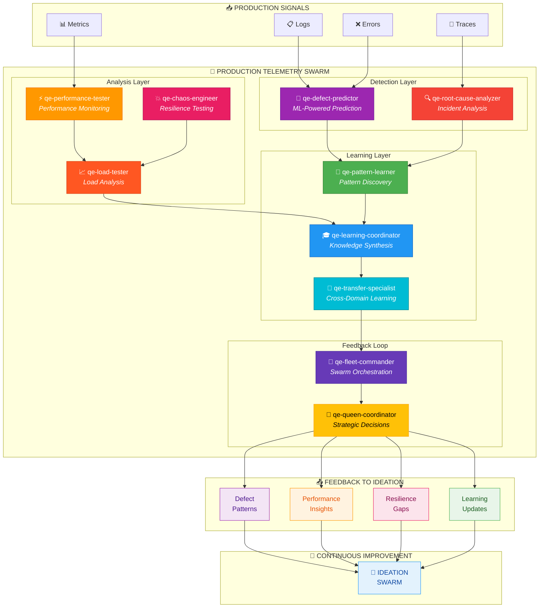
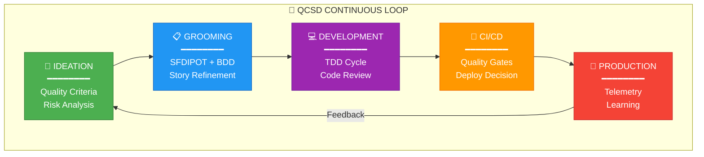
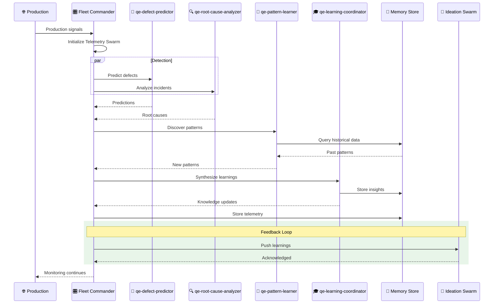

# QCSD PRODUCTION TELEMETRY SWARM

## Swarm Architecture



## Continuous Feedback Loop



## Agent Coordination Sequence



## Learning & Memory Flow

```mermaid
flowchart TB
    subgraph MEMORY["🧠 DISTRIBUTED MEMORY"]
        direction TB

        subgraph PATTERNS["Pattern Store"]
            defects["Defect Patterns"]
            perf["Performance Baselines"]
            chaos["Resilience Learnings"]
        end

        subgraph KNOWLEDGE["Knowledge Graph"]
            nodes["Code Intelligence"]
            relations["Dependency Maps"]
            impacts["Impact Analysis"]
        end

        subgraph LEARNING["Learning Store"]
            trajectories["Decision Trajectories"]
            verdicts["Outcome Verdicts"]
            transfer["Transfer Knowledge"]
        end
    end

    subgraph AGENTS["Learning Agents"]
        pl["qe-pattern-learner"]
        lc["qe-learning-coordinator"]
        tl["qe-transfer-specialist"]
    end

    pl --> defects
    pl --> perf
    pl --> chaos

    lc --> nodes
    lc --> relations
    lc --> impacts

    tl --> trajectories
    tl --> verdicts
    tl --> transfer

    style defects fill:#F3E5F5,stroke:#9C27B0
    style perf fill:#FFF3E0,stroke:#FF9800
    style chaos fill:#FCE4EC,stroke:#E91E63
    style nodes fill:#E3F2FD,stroke:#2196F3
    style relations fill:#E8F5E9,stroke:#4CAF50
    style impacts fill:#FFEBEE,stroke:#F44336
    style trajectories fill:#E0F7FA,stroke:#00BCD4
    style verdicts fill:#FFF8E1,stroke:#FFC107
    style transfer fill:#ECEFF1,stroke:#607D8B
```



## MCP Integration

```typescript
// Initialize Telemetry Swarm
mcp__agentic_qe__fleet_init({
  topology: "mesh",
  enabledDomains: ["defect-intelligence", "chaos-resilience", "learning-optimization"],
  maxAgents: 10
})

// Predict Defects from Production Signals
mcp__agentic_qe__defect_predict({
  target: "src/",
  signals: {
    logs: "cloudwatch://app-logs",
    metrics: "prometheus://app-metrics",
    traces: "jaeger://app-traces"
  }
})

// Analyze Root Cause
mcp__agentic_qe__root_cause_analyze({
  incident: "INC-456",
  symptoms: ["500 errors spike", "latency increase"],
  timeRange: "last 4 hours"
})

// Pattern Learning
mcp__agentic_qe__pattern_learn({
  domain: "production-incidents",
  input: "incident-INC-456",
  storeResults: true
})

// Knowledge Transfer to Ideation
mcp__agentic_qe__memory_share({
  sourceAgentId: "qe-learning-coordinator",
  targetAgentIds: ["qe-quality-criteria-recommender", "qe-risk-assessor"],
  knowledgeDomain: "production-learnings"
})
```

---

## Color Legend

| Color | Meaning |
|-------|---------|
| 🟣 Purple | Defect Prediction |
| 🔴 Red | Root Cause Analysis |
| 🟠 Orange | Performance Testing |
| 🩷 Pink | Chaos Engineering |
| 🟢 Green | Pattern Learning |
| 🔵 Blue | Learning Coordination |
| 🔵 Cyan | Transfer Learning |
| 🟡 Gold | Queen Coordinator |
| ⚫ Gray | Fleet Commander |
