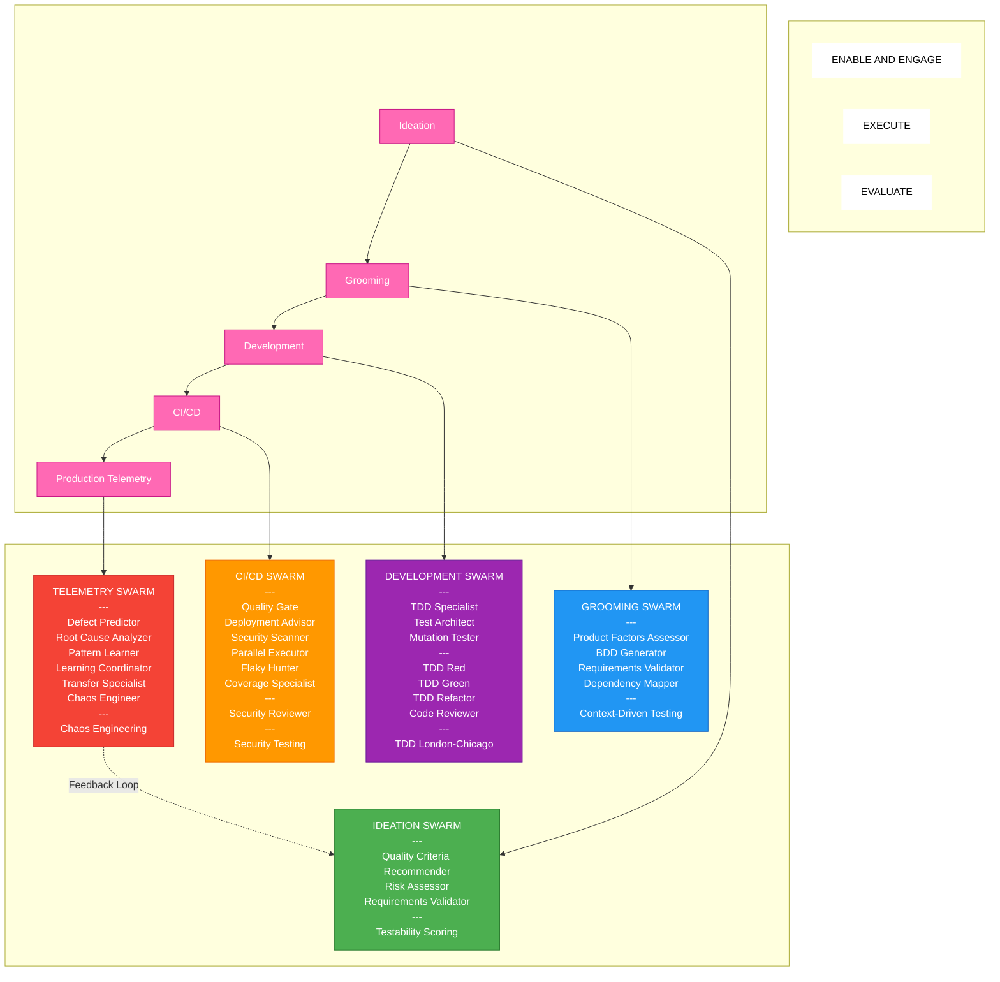

# QCSD 2.0: Agentic Quality Engineering

## Main Flow Diagram

---

## Swarm Details

### IDEATION SWARM (Green)
| Type | Name |
|------|------|
| Agent | Quality Criteria Recommender |
| Agent | Risk Assessor |
| Agent | Requirements Validator |
| Skill | Testability Scoring |

### GROOMING SWARM (Blue)
| Type | Name |
|------|------|
| Agent | Product Factors Assessor |
| Agent | BDD Generator |
| Agent | Requirements Validator |
| Agent | Dependency Mapper |
| Skill | Context-Driven Testing |

### DEVELOPMENT SWARM (Purple)
| Type | Name |
|------|------|
| Agent | TDD Specialist |
| Agent | Test Architect |
| Agent | Mutation Tester |
| Sub-agent | TDD Red |
| Sub-agent | TDD Green |
| Sub-agent | TDD Refactor |
| Sub-agent | Code Reviewer |
| Skill | TDD London-Chicago |

### CI/CD SWARM (Orange)
| Type | Name |
|------|------|
| Agent | Quality Gate |
| Agent | Deployment Advisor |
| Agent | Security Scanner |
| Agent | Parallel Executor |
| Agent | Flaky Hunter |
| Agent | Coverage Specialist |
| Sub-agent | Security Reviewer |
| Skill | Security Testing |

### TELEMETRY SWARM (Red)
| Type | Name |
|------|------|
| Agent | Defect Predictor |
| Agent | Root Cause Analyzer |
| Agent | Pattern Learner |
| Agent | Learning Coordinator |
| Agent | Transfer Specialist |
| Agent | Chaos Engineer |
| Skill | Chaos Engineering |

---

## Legend

| Section | Meaning |
|---------|---------|
| --- | Separator between Agents, Sub-agents, and Skills |
| Pink boxes | Original QCSD 1.0 phases |
| Colored boxes | QCSD 2.0 AI Swarms |

---

## Summary

| Swarm | Agents | Sub-agents | Skills |
|-------|--------|------------|--------|
| Ideation | 3 | 0 | 1 |
| Grooming | 4 | 0 | 1 |
| Development | 3 | 4 | 1 |
| CI/CD | 6 | 1 | 1 |
| Telemetry | 6 | 0 | 1 |
| **Total** | **22** | **5** | **5** |
