# QCSD 2.0: Agentic Quality Engineering

## Complete Flow with AI Swarms

---

## Simplified Version (PPT-Ready)

```mermaid
flowchart LR
    subgraph EE["ENABLE AND ENGAGE"]
        direction TB
        I["<b>Ideation</b>"]
        IS["🧠 Ideation Swarm<br/>qe-quality-criteria-recommender"]
        G["<b>Grooming</b>"]
        GS["📋 Grooming Swarm<br/>qe-product-factors-assessor"]
        I --> IS
        G --> GS
    end

    subgraph EX["EXECUTE"]
        direction TB
        D["<b>Development</b>"]
        DS["💻 Development Swarm<br/>qe-tdd-specialist + 7 sub-agents"]
        C["<b>CI/CD</b>"]
        CS["🚀 CI/CD Swarm<br/>qe-quality-gate"]
        D --> DS
        C --> CS
    end

    subgraph EV["EVALUATE"]
        direction TB
        P["<b>Production<br/>Telemetry</b>"]
        PS["📡 Telemetry Swarm<br/>qe-defect-predictor"]
        P --> PS
    end

    EE --> EX --> EV
    PS -.->|"Feedback"| IS

    style I fill:#FF69B4,stroke:#C71585,color:#fff
    style G fill:#FF69B4,stroke:#C71585,color:#fff
    style D fill:#FF69B4,stroke:#C71585,color:#fff
    style C fill:#FF69B4,stroke:#C71585,color:#fff
    style P fill:#FF69B4,stroke:#C71585,color:#fff

    style IS fill:#4CAF50,stroke:#2E7D32,color:#fff
    style GS fill:#2196F3,stroke:#1565C0,color:#fff
    style DS fill:#9C27B0,stroke:#6A1B9A,color:#fff
    style CS fill:#FF9800,stroke:#EF6C00,color:#fff
    style PS fill:#F44336,stroke:#C62828,color:#fff
```

---

## Inventory Summary

| QCSD Phase | AI Swarm | Primary Agent | Supporting Agents |
|------------|----------|---------------|-------------------|
| **Ideation** | 🧠 Ideation Swarm | qe-quality-criteria-recommender | qe-risk-assessor, testability-scoring (skill) |
| **Grooming** | 📋 Grooming Swarm | qe-product-factors-assessor | qe-bdd-generator, qe-requirements-validator |
| **Development** | 💻 Development Swarm | qe-tdd-specialist | qe-tdd-red/green/refactor, qe-code-reviewer, qe-mutation-tester |
| **CI/CD** | 🚀 CI/CD Swarm | qe-quality-gate | qe-deployment-advisor, qe-security-scanner, qe-parallel-executor |
| **Production** | 📡 Telemetry Swarm | qe-defect-predictor | qe-pattern-learner, qe-learning-coordinator, qe-chaos-engineer |

---

## Total Agentic QE Capability

| Category | Count |
|----------|-------|
| AI Agents | 44 |
| Sub-agents | 7 |
| Skills | 95 |
| DDD Domains | 12 |
