# CI/CD QUALITY GATES SWARM

```mermaid
flowchart LR
    subgraph IN["INPUT"]
        A["🔀 Pull Request"]
    end

    subgraph SWARM["🚀 AI AGENTS"]
        direction TB
        B["<b>qe-security-scanner</b> + <b>qe-parallel-executor</b><br/>Security Scan & Test Execution"]
        C["<b>qe-quality-gate</b> + <b>qe-deployment-advisor</b><br/>Threshold Check & Deploy Decision"]
    end

    subgraph OUT["OUTPUT"]
        D["✅ Safe to<br/>Deploy"]
    end

    A --> B
    B --> C
    C --> D

    style A fill:#E3F2FD,stroke:#1565C0,color:#0D47A1
    style B fill:#FF9800,stroke:#EF6C00,color:#fff
    style C fill:#FF9800,stroke:#EF6C00,color:#fff
    style D fill:#FFF3E0,stroke:#EF6C00,color:#E65100
```

| Component | Type | Role |
|-----------|------|------|
| qe-security-scanner | Agent | SAST, secrets detection, CVE scan |
| qe-parallel-executor | Agent | Runs tests in parallel shards |
| qe-flaky-hunter | Agent | Detects and quarantines flaky tests |
| qe-coverage-specialist | Agent | O(log n) coverage gap detection |
| qe-quality-gate | Agent | Enforces thresholds (coverage ≥80%, etc.) |
| qe-deployment-advisor | Agent | Risk-based go/no-go decision |

**Value**: Automated quality gates with intelligent go/no-go deployment decisions.
