# DEVELOPMENT SWARM

```mermaid
flowchart LR
    subgraph IN["INPUT"]
        A["💻 Code Changes"]
    end

    subgraph SWARM["🔴🟢🔵 AI AGENTS"]
        direction TB
        B["<b>qe-tdd-specialist</b><br/>+ 3 Sub-agents: red, green, refactor"]
        C["<b>Code Review Sub-agents</b><br/>security, performance, integration"]
    end

    subgraph OUT["OUTPUT"]
        D["✅ Tested &<br/>Reviewed Code"]
    end

    A --> B
    B --> C
    C --> D

    style A fill:#E3F2FD,stroke:#1565C0,color:#0D47A1
    style B fill:#9C27B0,stroke:#6A1B9A,color:#fff
    style C fill:#9C27B0,stroke:#6A1B9A,color:#fff
    style D fill:#F3E5F5,stroke:#6A1B9A,color:#4A148C
```

| Component | Type | Role |
|-----------|------|------|
| qe-tdd-specialist | Agent | Orchestrates TDD cycle |
| qe-tdd-red | Sub-agent | Writes failing tests |
| qe-tdd-green | Sub-agent | Implements minimal code |
| qe-tdd-refactor | Sub-agent | Improves design |
| qe-code-reviewer | Sub-agent | Quality review |
| qe-security-reviewer | Sub-agent | Security review |
| qe-performance-reviewer | Sub-agent | Performance review |
| qe-mutation-tester | Agent | Validates test effectiveness |

**Value**: Ensure code quality through AI-assisted test-driven development and multi-perspective review.
