# QCSD: Quality-Centric Software Delivery

## The Complete AI-Powered Quality Cycle

---

## Agentic QE Inventory

| Category | Count | Examples |
|----------|-------|----------|
| **Agents** | 44 | qe-quality-criteria-recommender, qe-tdd-specialist, qe-defect-predictor |
| **Sub-agents** | 7 | qe-tdd-red, qe-tdd-green, qe-tdd-refactor, qe-code-reviewer |
| **Skills** | 95 | testability-scoring, mutation-testing, chaos-engineering-resilience |
| **DDD Domains** | 12 | test-generation, coverage-analysis, defect-intelligence |

---

## Phase-by-Phase Agent Deployment

| Phase | Primary Agents | Sub-agents | Key Skills |
|-------|----------------|------------|------------|
| **Ideation** | qe-quality-criteria-recommender, qe-risk-assessor | — | testability-scoring |
| **Grooming** | qe-product-factors-assessor, qe-bdd-generator | — | context-driven-testing |
| **Development** | qe-tdd-specialist, qe-mutation-tester | qe-tdd-red/green/refactor, qe-code-reviewer | tdd-london-chicago |
| **CI/CD** | qe-quality-gate, qe-deployment-advisor, qe-security-scanner | qe-security-reviewer | security-testing |
| **Production** | qe-defect-predictor, qe-pattern-learner, qe-learning-coordinator | — | chaos-engineering-resilience |

---

## Key Metrics Impact

```mermaid
flowchart LR
    subgraph BEFORE["❌ TRADITIONAL QE"]
        B1["Defects in Production"]
        B2["Manual Test Creation"]
        B3["Siloed Knowledge"]
    end

    subgraph AFTER["✅ AGENTIC QE (QCSD)"]
        A1["Defects Prevented at Ideation"]
        A2["AI-Generated Test Suites"]
        A3["Shared Learning Memory"]
    end

    B1 -.->|"44 Agents"| A1
    B2 -.->|"95 Skills"| A2
    B3 -.->|"12 DDD Domains"| A3

    style B1 fill:#FFEBEE,stroke:#C62828,color:#B71C1C
    style B2 fill:#FFEBEE,stroke:#C62828,color:#B71C1C
    style B3 fill:#FFEBEE,stroke:#C62828,color:#B71C1C
    style A1 fill:#E8F5E9,stroke:#2E7D32,color:#1B5E20
    style A2 fill:#E8F5E9,stroke:#2E7D32,color:#1B5E20
    style A3 fill:#E8F5E9,stroke:#2E7D32,color:#1B5E20
```

---

## The QCSD Advantage

| Capability | Traditional QE | Agentic QE (QCSD) |
|------------|----------------|-------------------|
| Test Creation | Manual | **44 AI Agents** |
| Quality Gates | Static Rules | **Intelligent Risk-Based** |
| Defect Detection | Reactive | **ML-Powered Prediction** |
| Knowledge | Siloed | **Shared Memory + 12 Domains** |
| Scale | Linear (headcount) | **Autonomous Swarms** |
