# GROOMING SWARM

```mermaid
flowchart LR
    subgraph IN["INPUT"]
        A["📝 User Story"]
    end

    subgraph SWARM["📋 AI AGENTS"]
        direction TB
        B["<b>qe-product-factors-assessor</b><br/>SFDIPOT Decomposition"]
        C["<b>qe-bdd-generator</b><br/>Given/When/Then Scenarios"]
    end

    subgraph OUT["OUTPUT"]
        D["✅ Test-Ready<br/>Stories + BDD"]
    end

    A --> B
    B --> C
    C --> D

    style A fill:#E3F2FD,stroke:#1565C0,color:#0D47A1
    style B fill:#2196F3,stroke:#1565C0,color:#fff
    style C fill:#2196F3,stroke:#1565C0,color:#fff
    style D fill:#E3F2FD,stroke:#1565C0,color:#0D47A1
```

| Component | Type | Role |
|-----------|------|------|
| qe-product-factors-assessor | Agent | SFDIPOT analysis (Structure, Function, Data, Interfaces, Platform, Operations, Time) |
| qe-bdd-generator | Agent | Generates Gherkin scenarios |
| qe-requirements-validator | Agent | Acceptance criteria validation |
| qe-dependency-mapper | Agent | Maps story dependencies |

**Value**: Transform requirements into comprehensive test scenarios with full traceability.
