# IDEATION SWARM

```mermaid
flowchart LR
    subgraph IN["INPUT"]
        A["📋 Epic/Feature"]
    end

    subgraph SWARM["🧠 AI AGENTS"]
        direction TB
        B["<b>qe-quality-criteria-recommender</b><br/>10 Quality Categories"]
        C["<b>qe-risk-assessor</b> + <b>testability-scoring</b><br/>Risk & Testability Analysis"]
    end

    subgraph OUT["OUTPUT"]
        D["✅ Quality-Ready<br/>Specification"]
    end

    A --> B
    B --> C
    C --> D

    style A fill:#E3F2FD,stroke:#1565C0,color:#0D47A1
    style B fill:#4CAF50,stroke:#2E7D32,color:#fff
    style C fill:#4CAF50,stroke:#2E7D32,color:#fff
    style D fill:#E8F5E9,stroke:#2E7D32,color:#1B5E20
```

| Component | Type | Role |
|-----------|------|------|
| qe-quality-criteria-recommender | Agent | Analyzes 10 quality categories |
| qe-risk-assessor | Agent | Identifies and scores risks |
| qe-requirements-validator | Agent | Validates completeness |
| testability-scoring | Skill | Scores testability (0-100) |

**Value**: Shift-left quality by identifying risks and testability gaps before development begins.
