# PRODUCTION TELEMETRY SWARM

```mermaid
flowchart LR
    subgraph IN["INPUT"]
        A["📡 Production<br/>Signals"]
    end

    subgraph SWARM["🔮 AI AGENTS"]
        direction TB
        B["<b>qe-defect-predictor</b> + <b>qe-root-cause-analyzer</b><br/>ML Prediction & Incident Analysis"]
        C["<b>qe-pattern-learner</b> + <b>qe-learning-coordinator</b><br/>Knowledge Synthesis & Transfer"]
    end

    subgraph OUT["OUTPUT"]
        D["🔄 Feedback to<br/>Ideation"]
    end

    A --> B
    B --> C
    C --> D

    style A fill:#FFEBEE,stroke:#C62828,color:#B71C1C
    style B fill:#F44336,stroke:#C62828,color:#fff
    style C fill:#F44336,stroke:#C62828,color:#fff
    style D fill:#FFEBEE,stroke:#C62828,color:#B71C1C
```

| Component | Type | Role |
|-----------|------|------|
| qe-defect-predictor | Agent | ML-powered defect prediction |
| qe-root-cause-analyzer | Agent | Incident root cause analysis |
| qe-pattern-learner | Agent | Discovers patterns from production |
| qe-learning-coordinator | Agent | Synthesizes knowledge across domains |
| qe-transfer-specialist | Agent | Transfers learnings to other phases |
| qe-chaos-engineer | Agent | Proactive resilience testing |

**Value**: Learn from production to continuously improve quality across all QCSD phases.
