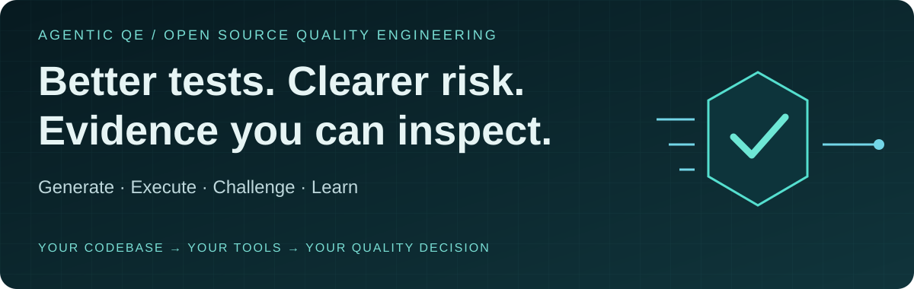
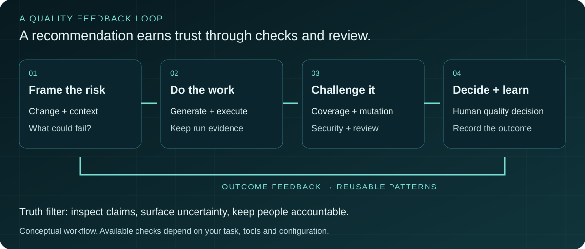

# Agentic QE

**Quality engineering tools for your coding agent.** Generate tests, investigate coverage gaps, analyze flaky behavior and coordinate quality checks across the software lifecycle. Keep the findings close to the code and use them to make a better quality decision.

[](https://www.npmjs.com/package/agentic-qe)
[](LICENSE)

[Start with one task](#start-with-one-task) · [Choose your client](#choose-your-client) · [Inspect the evidence](#inspect-the-evidence) · [Contribute](#contribute) · [Release notes](docs/releases/README.md)

## Put AQE to work

| Your QE problem | What AQE helps you do | What to inspect |
| --- | --- | --- |
| A changed service needs meaningful tests | Generate unit, integration, property-based or BDD tests | Assertions, edge cases and executed test results |
| Coverage is high but important behavior is missing | Analyze gaps and prioritize by risk | Uncovered branches and the rationale for priorities |
| A flaky suite is eroding trust | Investigate failure patterns and suggest stabilization | Reproduction and results before and after a change |
| A release needs a quality assessment | Coordinate coverage, security, contracts and resilience checks | Findings, tool output and unresolved risks |
| Your team repeats the same investigation | Store and retrieve QE patterns | Pattern relevance and recorded outcomes |

Supports framework-specific output for tools including Jest, Vitest, Playwright, Cypress, pytest and JUnit. Review generated tests and run them in your environment; an agent's recommendation is an input to your team's decision.

## Start with one task

Requires **Node.js ≥22.13.0** and **npm ≥10.0.0**. Use the coding agent/client you already have configured.

```bash
npm install -g agentic-qe
cd your-project
aqe init --auto
aqe health
```

`aqe init --auto` analyzes your project and configures the default Claude Code surface, including MCP. Review the generated project files. For another client, select its setup flag below and use its MCP connection flow.

In your coding agent, start with a narrow request:

```text
Generate tests for src/services/UserService.ts.
Explain the risks and edge cases each test covers.
Run the tests if execution is available, and report failures and anything you could not verify.
```

Then ask for a second view:

```text
Find coverage gaps in src/services/ and prioritize them by risk.
Challenge weak assertions in the generated tests and explain what still needs human review.
```

The paths are examples; use a real file in your project. Success means tests you can inspect and execute, plus a clear account of what remains untested. A coverage target is a request, not a promised result.

## Choose your client

| Client | Project setup |
| --- | --- |
| Claude Code | `aqe init --auto` |
| OpenAI Codex CLI | `aqe init --auto --with-codex` |
| GitHub Copilot | `aqe init --auto --with-copilot` |
| Cursor | `aqe init --auto --with-cursor` |
| Cline | `aqe init --auto --with-cline` |
| OpenCode | `aqe init --auto --with-opencode` |
| AWS Kiro | `aqe init --auto --with-kiro` |
| Kilo Code | `aqe init --auto --with-kilocode` |
| Roo Code | `aqe init --auto --with-roocode` |
| Windsurf | `aqe init --auto --with-windsurf` |
| Continue.dev | `aqe init --auto --with-continuedev` |

These are implemented setup paths, not a claim of identical behavior across clients. The default Claude Code files are also created unless you add `--no-claude` when targeting another client.

```bash
# Configure every supported client
aqe init --auto --with-all-platforms

# Inspect or add client configuration later
aqe platform list
aqe platform setup cursor
aqe platform verify cursor

# Standalone MCP server entry point
aqe-mcp
```

See the [Platform Setup Guide](docs/platform-setup-guide.md) for client-specific configuration.

### Claude Code plugin: a scoped alternative

Use the `agentic-qe-fleet` plugin when you want a smaller Claude Code surface with slash commands. The full `aqe init` path adds broader project configuration and persistent learning setup.

In Claude Code:

```text
/plugin install agentic-qe-fleet --marketplace proffesor-for-testing/agentic-qe
```

Or load it from a checkout:

```bash
git clone https://github.com/proffesor-for-testing/agentic-qe.git
claude --plugin-dir ./agentic-qe/plugins/agentic-qe-fleet
```

Start with `/aqe-fleet-status`, `/aqe-generate src/services/Auth.ts` or `/aqe-analyze src/`. The plugin registers its own MCP server, pinned to the matching package version (`npx -y agentic-qe@<plugin version> mcp`). See the [plugin README](plugins/agentic-qe-fleet/README.md) for the bundled agents, commands and skills.

<details>
<summary>Windows and native dependency setup</summary>


`agentic-qe` runs on Windows, but several of its performance-oriented native
dependencies (`hnswlib-node` for HNSW search, `@ruvector/gnn` for graph
neural networks, `@ruvector/rvf-node` for the RVF pattern store) ship as
optional native modules. `hnswlib-node` in particular has no prebuilt
binaries and compiles from source via `node-gyp`. `npm install` does not
fail when these modules can't build — they're declared optional and AQE
falls back to JavaScript paths at runtime.

**Important caveat about the fallback.** The pure-JavaScript HNSW fallback
(`ProgressiveHnswBackend`) is correct but degrades to O(N) brute-force search
when neither `hnswlib-node` nor `@ruvector/gnn` is available. That's fine for
small projects but **unsuitable for large indexes** (tens of thousands of
vectors and up). If you plan to run AQE against a sizeable codebase on
Windows, install the native build toolchain so `hnswlib-node` compiles:

- **Python 3** (added to `PATH`), and
- **Visual Studio 2022 Build Tools** with the *Desktop development with C++*
  workload — works with any node-gyp version, **or**
- **Visual Studio 2026** with the same workload **plus** an upgraded npm
  (`npm install -g npm@latest` — VS 2026 detection requires npm ≥ 11.6.3,
  shipped via node-gyp ≥ 12.1.0). Node 22 LTS still ships npm 10.x by
  default, which cannot detect VS 2026; either upgrade npm globally or use
  VS 2022 Build Tools instead.

If the native dep fails to build you'll see a `node-gyp` warning during
install (e.g. `gyp ERR! find VS`); the install itself completes. To verify
which backend is active:

```bash
aqe health
# Look for "HNSW backend: native" (hnswlib-node) or "HNSW backend: js"
# (ProgressiveHnswBackend — see caveat above).
```

On Linux and macOS, verify the active backend with `aqe health` as well; native module availability depends on your environment.

</details>

## How a quality task flows



The `qe-queen-coordinator` decomposes a quality assessment into domain tasks and combines findings. Domains cover test generation and execution, coverage, quality assessment, defect intelligence, requirements, code intelligence, security, contracts, visual accessibility, resilience, learning and enterprise integration.

Patterns can be stored and retrieved across sessions. AQE provides outcome feedback and consolidation mechanisms; retrieval alone does not prove that future tests are better. Model routing offers cost-aware task selection, while actual costs and quality depend on your provider and workload.

Anti-sycophancy checks examine weak or tautological tests. Adversarial review adds a way to challenge a verdict. See [quality gate features](docs/loki-mode-features.md) and [QE Court design](docs/implementation/adrs/ADR-124-qe-court-adversarial-verdict-service.md).

## Inspect the evidence

| Evidence | What it supports | Scope and limits |
| --- | --- | --- |
| [Shipped agent definitions](assets/agents/v3/) | Inspect each agent's intended role and instructions | Source definitions establish inventory, not demonstrated effectiveness |
| [Packaged skills](assets/skills/) and [validation guide](docs/guides/skill-validation.md) | Inspect workflows, validators and evaluations | Trust tiers describe validation artifacts; they do not guarantee production outcomes |
| [Interaction benchmark run records](benchmarks/interaction/results/README.md) | Compare QE-guided and bare interactions against ground truth | June 11, 2026: two scenarios; no demonstrated arm benefit, statistically underpowered |
| [MCP tests](tests/unit/mcp/) and [integration tests](tests/integration/mcp/) | Inspect protocol and handler checks | Repository tests are not a record of a fresh passing run |
| [Changelog](CHANGELOG.md) and [release notes](docs/releases/README.md) | Trace changes and fixes | Read the entry matching your installed version |

**Inventory verified October 9, 2026 at [`829d030`](https://github.com/proffesor-for-testing/agentic-qe/tree/829d03060d56ee82e6fa294b2be8f6c5fc9f2766):** 53 top-level `qe-*.md` agent definitions + 7 QE subagents; 86 packaged `SKILL.md` entry points; 13 domain directories. The scoped plugin separately contains 11 agents, 9 skills and 9 command files. Client setup flags above cover 11 clients. These counts exclude platform infrastructure agents and supporting Markdown files.

## Commands for everyday work

```bash
aqe agent list                  # Agent inventory
aqe fleet status                # Fleet status
aqe health                      # Runtime health
aqe learning stats              # Learning statistics
aqe learning dream              # Pattern consolidation
aqe brain export                # Export learned patterns

aqe code index src/             # Build code intelligence index
aqe code index src/ --incremental
aqe code index . --git-since HEAD~5
aqe code search "authentication"
aqe code impact src/
aqe code deps src/
aqe code complexity src/
aqe code c4 .                   # C4 diagrams with confidence
```

## LLM providers and local models


AQE Fleet's LLM-enhanced analysis (ADR-043, ADR-051) routes through a
HybridRouter that picks providers based on routing rules and your env
config. Set one or more API keys and Fleet auto-detects what's available:

| Provider | Env var(s) | Type | Notes |
|----------|-----------|------|-------|
| **Claude** | `ANTHROPIC_API_KEY` | Cloud | Default in routing rules |
| **OpenAI** | `OPENAI_API_KEY` | Cloud | Wide model coverage |
| **Gemini** | `GOOGLE_AI_API_KEY` / `GEMINI_API_KEY` / `GOOGLE_API_KEY` | Cloud | Cheap; free tier |
| **OpenRouter** | `OPENROUTER_API_KEY` | Cloud | Multiple models behind one key |
| **Ollama** | (local) | Local | Local inference |
| **Azure OpenAI** | `AZURE_OPENAI_API_KEY` | Cloud | Enterprise |
| **Bedrock** | `AWS_ACCESS_KEY_ID` | Cloud | AWS-native |

```bash
export GEMINI_API_KEY="..."  # or any supported provider
aqe init --auto
```

Persistent config (`aqe llm config --set` writes to `.agentic-qe/llm-config.json`):

```bash
aqe llm config --set mode=cost-optimized
aqe llm config --set defaultProvider=gemini
aqe llm config           # show current effective config
```

API keys are env-only — `aqe llm config --set apiKey=...` is refused
to keep secrets out of project-committed config.

### Opting out

To run Fleet without any LLM calls (deterministic-only mode):

```bash
export AQE_LLM_ROUTER_DISABLED=1   # env-only kill-switch
```

Or programmatically: `new QEKernelImpl({ llmRouter: { enabled: false } })`.

### Free local models (opt-in) — cheap-first test generation

Run test generation on a **free local model first** (local Ollama, cloud Ollama,
OpenRouter free models, or any OpenAI-compatible endpoint), with an automatic
**repair loop**, falling back to your normal LLM path only when needed. Off by
default — enable with `AQE_FREE_TIER=1`:

```bash
ollama pull qwen3-coder:30b
export AQE_FREE_TIER=1            # opt in (default model: qwen3-coder:30b)
```

`qwen3-coder:30b` needs ~18 GB of RAM. `qwen3:8b` fits smaller machines but
measured below the QE test-generation quality floor (ADR-111).

Local inference avoids per-call cloud charges; hardware costs and fallback cloud calls still apply. See the
[Free-Tier Local Models guide](docs/guides/free-tier-local-models.md) for
provider options and configuration.


## Documentation

| Guide | Use it for |
| --- | --- |
| [Platform setup](docs/platform-setup-guide.md) | Client configuration |
| [Free-tier local models](docs/guides/free-tier-local-models.md) | Opt-in local/free generation and fallback |
| [Skill validation](docs/guides/skill-validation.md) | Trust tiers and evaluations |
| [Learning system](docs/guides/reasoningbank-learning-system.md) | Pattern storage and feedback |
| [Code intelligence](docs/guides/fleet-code-intelligence-integration.md) | Indexing, graphs and search |
| [Architecture glossary](docs/v3-technical-architecture-glossary.md) | Technical terminology |

## Contribute

Bring a small problem we can reproduce. Useful starting points include a failing test, a client setup issue, a better example, or a validator that challenges an unsupported claim.

Read [CONTRIBUTING.md](CONTRIBUTING.md) and [AGENTS.md](AGENTS.md) before changing code. For bug reports, include your AQE version, Node version, operating system, client, expected behavior and a minimal reproduction. Use [Issues](https://github.com/proffesor-for-testing/agentic-qe/issues) for reproducible bugs, [Issues](https://github.com/proffesor-for-testing/agentic-qe/issues) for questions and use cases, and the [security policy](SECURITY.md) for security reports.

```bash
git clone https://github.com/proffesor-for-testing/agentic-qe.git
cd agentic-qe
npm install
npm run build
npm test -- --run
```

For a focused change, start with the relevant checks documented in [AGENTS.md](AGENTS.md), such as `npm run typecheck`, `npm run lint` and the relevant test suite. Keep production learning databases intact and test data changes against copies.

## License and support

**MIT** — see [LICENSE](LICENSE). Free to use, fork, build and contribute under its terms.

[Support the project](FUNDING.md) · [Project documentation](docs/) · [View all contributors](CONTRIBUTORS.md)

## Contributors

<!-- ALL-CONTRIBUTORS-LIST:START -->
| <br/>**[@proffesor-for-testing](https://github.com/proffesor-for-testing)**<br/>Project Lead | <br/>**[@fndlalit](https://github.com/fndlalit)**<br/>QX Partner, Testability | <br/>**[@shaal](https://github.com/shaal)**<br/>Core Development | <br/>**[@mondweep](https://github.com/mondweep)**<br/>Architecture |
|:---:|:---:|:---:|:---:|
| <br/>**[@rudycelekli](https://github.com/rudycelekli)**<br/>Reliability &amp; Security Fixes | <br/>**[@stuinfla](https://github.com/stuinfla)**<br/>Test Execution Evidence | <br/>**[@nagoodman](https://github.com/nagoodman)**<br/>OpenCode Integration | <br/>**[@Jordi-Izquierdo-DDS](https://github.com/Jordi-Izquierdo-DDS)**<br/>RVF/HNSW Fix |
| <br/>**[@JLMA-Agentic-Ai](https://github.com/JLMA-Agentic-Ai)**<br/>Package Exports | <br/>**[@amonkarsidhant](https://github.com/amonkarsidhant)**<br/>MCP-first Setup | <br/>**[@gurdasnijor](https://github.com/gurdasnijor)**<br/>Smithery Integration |  |
<!-- ALL-CONTRIBUTORS-LIST:END -->

## Acknowledgments

Agentic QE was developed with help from **[Ruflo](https://github.com/ruvnet/ruflo), formerly Claude Flow**, by **[rUv](https://github.com/ruvnet)**, for coordination during development. **[RuVector](https://github.com/ruvnet/ruvector) provides the vector and RVF database foundation** through the `@ruvector/*` packages; AQE also uses `better-sqlite3` for SQLite persistence. Ruflo is development tooling, not a required AQE runtime dependency.

<a href="https://github.com/ruvnet/ruflo"></a>

<a href="https://github.com/ruvnet/ruvector"></a>

Thanks also to [Agentic Flow](https://github.com/ruvnet/agentic-flow) for agent patterns and learning systems, and to the maintainers and contributors across the testing tools this project builds on. The cards are original AQE artwork and link to the upstream projects.
