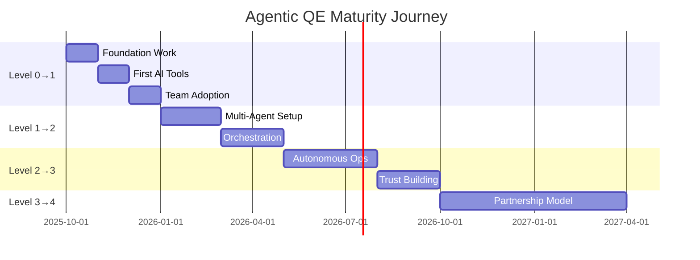

# The Agentic QE Maturity Model: Where Are You, Where Are You Going?

*Published: October 10, 2025 | 11 min read | By Dragan Spiridonov*

---

## The Maturity Paradox

"We need to implement AI in our testing!"
"Why?"
"Everyone else is doing it."
"But what problem are you solving?"
"...Being left behind?"

I have this conversation weekly. The rush to agentic without understanding the journey is like buying a Formula 1 car for your driving test.

Let's fix that.

## The Five Levels of Agentic QE Maturity

After assessing a number of organizations and failing spectacularly at my own transformation twice, here's the maturity model that actually works:

### Level 0: Classical Excellence (Foundation)
*You can't orchestrate chaos*

```yaml
characteristics:
  testing: "Comprehensive but manual"
  automation: "UI scripts, unit tests"
  monitoring: "Dashboards and alerts"
  decisions: "Human-driven"
  
indicators:
  - Solid testing practices exist
  - CI/CD pipeline established
  - Team owns quality
  - Feedback loops under 1 day
  
anti-indicators:
  - Testing as separate phase
  - Quality as QA team's job
  - No production monitoring
  - Feedback loops over 1 week
  
ready_for_next_when:
  - Test automation > 60%
  - Production monitoring active
  - Team practices pairing/ensemble
  - Context-driven approach adopted
```

**Real Example**: Where we were in 2016. Solid practices, good team, but every test was scripted, every decision manual.

### Level 1: Assisted Intelligence (Augmentation)
*Agents as smart assistants*

```yaml
characteristics:
  testing: "AI-assisted test generation"
  automation: "Self-healing locators"
  monitoring: "Anomaly detection"
  decisions: "Human with AI input"
  
what_changes:
  test_creation:
    before: "Manual test writing"
    after: "AI suggests, human approves"
    
  debugging:
    before: "Read logs line by line"
    after: "AI highlights anomalies"
    
  risk_assessment:
    before: "Experience-based"
    after: "Data-driven + experience"

implementation_pattern:
  week_1: "AI code completion in IDE"
  week_2: "AI-assisted test generation"
  week_3: "Anomaly detection in logs"
  week_4: "AI-powered root cause suggestions"
  
success_metrics:
  - Test creation 40% faster
  - Bug detection 20% earlier
  - False positives reduced 30%
```

**Our Story**: Started with Cline & Github Copilot in VS Code. First week: "This is just autocomplete." Week 3: "How did we live without this?"

### Level 2: Intelligent Automation (Orchestration)
*Agents working together*

```python
class Level2Maturity:
    """
    Multiple specialized agents collaborating
    Human sets goals, agents execute
    """
    
    def typical_setup(self):
        return {
            'agents': [
                'Test Generator Agent',
                'Test Executor Agent',
                'Results Analyzer Agent',
                'Risk Assessment Agent'
            ],
            'orchestration': 'Basic workflow coordination',
            'human_role': 'Define goals and review results',
            'automation_level': '70% of routine tasks'
        }
    
    def example_workflow(self):
        """Real workflow from our implementation"""
        # Human: "Test the new payment flow"
        
        # Test Generator: Creates 50 test scenarios
        # Risk Agent: Prioritizes by business impact
        # Executor: Runs tests in parallel
        # Analyzer: Identifies patterns in failures
        
        # Human: Reviews and makes decisions
```

**Critical Moment**: When our agents found a race condition we'd missed for 6 months. Trust began building.

### Level 3: Autonomous Operations (Self-Direction)
*Agents as team members*

```yaml
characteristics:
  testing: "Self-evolving test suites"
  automation: "Autonomous exploration"
  monitoring: "Predictive prevention"
  decisions: "Agent-proposed, human-approved"
  
key_capabilities:
  proactive_testing:
    - Agents identify untested paths
    - Automatic test generation for new code
    - Continuous exploration in production
    
  self_optimization:
    - Tests evolve based on failures
    - Automatic performance tuning
    - Resource allocation optimization
    
  predictive_quality:
    - Failure prediction before deployment
    - Automated rollback triggers
    - Proactive scaling decisions

trust_requirements:
  - Explainable decisions mandatory
  - Human override always available
  - Audit trail for every action
  - Regular human review cycles
  
current_state: "Where we are today (October 2025)"
```

**Today's Reality**: Agents run 24/7, finding issues we'd never think to look for. But humans still hold the kill switch.

### Level 4: Cognitive Collaboration (Partnership)
*Agents as partners*

```python
class Level4Vision:
    """
    Where we're heading in 2026
    True human-agent partnership
    """
    
    def characteristics(self):
        return {
            'relationship': 'Collaborative partnership',
            'decision_making': 'Joint human-agent',
            'learning': 'Bidirectional',
            'innovation': 'Agent-suggested improvements',
            'trust_level': 'High with verification'
        }
    
    def example_scenario(self):
        """
        Agent: 'I've noticed a pattern. When we deploy on Fridays,
                incident rate increases 3x. But it's not the deployment.
                It's that our B2B customers do bulk operations before
                weekend. Should we add capacity pre-emptively on Fridays?'
        
        Human: 'Good catch. But let's also notify customers about
                optimal operation timing.'
        
        Agent: 'I can A/B test notification strategies and measure
                impact on load distribution.'
        
        Human: 'Do it. Report back in a week.'
        """
```

**Future State**: Agents don't just execute; they strategize, propose, and innovate alongside humans.

## The PACT Progression

Each level maps to PACT maturity:

```python
def pact_progression():
    return {
        'Level_0': {
            'Proactive': 0,    # Reactive only
            'Autonomous': 0,   # Fully manual
            'Collaborative': 0, # Human only
            'Targeted': 50     # Some prioritization
        },
        'Level_1': {
            'Proactive': 25,   # Some prediction
            'Autonomous': 10,  # Minimal autonomy
            'Collaborative': 30, # Basic assistance
            'Targeted': 60     # Data-driven focus
        },
        'Level_2': {
            'Proactive': 50,   # Pattern recognition
            'Autonomous': 40,  # Workflow automation
            'Collaborative': 50, # Active coordination
            'Targeted': 70     # Smart prioritization
        },
        'Level_3': {
            'Proactive': 75,   # Predictive prevention
            'Autonomous': 70,  # Self-directed ops
            'Collaborative': 60, # Team member status
            'Targeted': 80     # Context-aware
        },
        'Level_4': {
            'Proactive': 90,   # Innovation driver
            'Autonomous': 85,  # Strategic autonomy
            'Collaborative': 90, # True partnership
            'Targeted': 95     # Optimal focus
        }
    }
```

## The Assessment Tool

Where are you? Let's find out:

```python
class MaturityAssessment:
    def __init__(self):
        self.questions = self.load_assessment_questions()
        self.weights = self.load_scoring_weights()
    
    def assess_organization(self, answers):
        scores = {
            'process_maturity': self.score_processes(answers),
            'technical_capability': self.score_technical(answers),
            'team_readiness': self.score_team(answers),
            'agentic_adoption': self.score_agentic(answers)
        }
        
        return {
            'current_level': self.determine_level(scores),
            'strengths': self.identify_strengths(scores),
            'gaps': self.identify_gaps(scores),
            'next_steps': self.recommend_actions(scores),
            'timeline': self.estimate_progression(scores)
        }
```

### Sample Assessment Questions

**Process Maturity:**
1. How long is your feedback loop from code to production?
   - a) > 1 month (0 pts)
   - b) 1-2 weeks (25 pts)
   - c) 2-5 days (50 pts)
   - d) < 1 day (75 pts)
   - e) < 1 hour (100 pts)

**Technical Capability:**
2. What percentage of your tests are automated?
   - a) < 20% (0 pts)
   - b) 20-40% (25 pts)
   - c) 40-60% (50 pts)
   - d) 60-80% (75 pts)
   - e) > 80% (100 pts)

**Team Readiness:**
3. How does your team approach new tools?
   - a) Resistance to change (0 pts)
   - b) Cautious adoption (25 pts)
   - c) Open to experimentation (50 pts)
   - d) Actively seeking innovation (75 pts)
   - e) Innovation-driven culture (100 pts)

## The Progression Playbook

### Moving from Level 0 to Level 1

**Timeline**: 2-3 months

```yaml
week_1_2:
  focus: "Foundation strengthening"
  actions:
    - Implement CI/CD if missing
    - Increase test automation coverage
    - Set up basic monitoring
    
week_3_4:
  focus: "First AI introduction"
  actions:
    - Add AI code completion to IDEs
    - Try AI-assisted test generation
    - Experiment with one team first
    
week_5_8:
  focus: "Gradual expansion"
  actions:
    - Expand to more teams
    - Measure improvement metrics
    - Document learnings
    
week_9_12:
  focus: "Stabilization"
  actions:
    - Standardize successful practices
    - Train all team members
    - Prepare for Level 2
```

### Moving from Level 1 to Level 2

**Timeline**: 3-4 months

```python
def level_1_to_2_progression():
    """
    Real progression plan we used
    """
    phases = {
        'Phase 1: Agent Introduction': {
            'duration': '1 month',
            'goals': [
                'Deploy first specialized agent',
                'Usually test generation or log analysis',
                'Measure impact and build trust'
            ]
        },
        'Phase 2: Multi-Agent Setup': {
            'duration': '1 month',
            'goals': [
                'Add 2-3 more specialized agents',
                'Basic orchestration between them',
                'Human oversight on all decisions'
            ]
        },
        'Phase 3: Orchestration': {
            'duration': '2 months',
            'goals': [
                'Implement workflow coordination',
                'Agents work together on tasks',
                'Reduce human intervention needs'
            ]
        }
    }
    return phases
```

## The Pitfalls (Learn from Our Mistakes)

### Pitfall 1: Skipping Levels
**What we tried**: Jump from Level 0 to Level 3
**What happened**: Chaos, mistrust, rollback
**Lesson**: Evolution, not revolution

### Pitfall 2: Technology Over People
**What we tried**: Implement agents without team buy-in
**What happened**: Shadow IT, parallel systems
**Lesson**: Change management matters more than tech

### Pitfall 3: Black Box Syndrome
**What we tried**: Deploy agents without explainability
**What happened**: "We don't trust it" rebellion
**Lesson**: Transparency is non-negotiable

### Pitfall 4: All or Nothing
**What we tried**: Transform everything at once
**What happened**: Overwhelm, failure, cynicism
**Lesson**: Start small, prove value, expand

## Success Patterns

From organizations that succeeded:

```yaml
pattern_1_start_small:
  approach: "One team, one use case"
  example: "Log analysis for debugging"
  timeline: "1 month to prove value"
  expansion: "Other teams request inclusion"
  
pattern_2_pain_first:
  approach: "Target biggest pain point"
  example: "Flaky test identification"
  timeline: "2 weeks to impact"
  expansion: "Apply to similar problems"
  
pattern_3_champions:
  approach: "Identify and empower enthusiasts"
  example: "Early adopters become trainers"
  timeline: "Creates organic growth"
  expansion: "Bottom-up transformation"
```

## Measuring Progress

Track these metrics at each level:

```python
class MaturityMetrics:
    def __init__(self, level):
        self.level = level
        self.metrics = self.get_level_metrics()
    
    def get_level_metrics(self):
        metrics = {
            0: {
                'test_automation_percentage': 60,
                'feedback_loop_hours': 24,
                'production_incidents_month': 10,
                'team_satisfaction': 6
            },
            1: {
                'test_creation_speed_increase': 40,
                'bug_detection_time_reduction': 20,
                'false_positive_reduction': 30,
                'ai_tool_adoption_rate': 80
            },
            2: {
                'autonomous_test_coverage': 70,
                'agent_found_bugs_percentage': 40,
                'human_intervention_reduction': 50,
                'mttr_improvement': 40
            },
            3: {
                'predictive_prevention_rate': 60,
                'autonomous_resolution_rate': 30,
                'human_override_rate': 15,
                'innovation_suggestions_monthly': 10
            }
        }
        return metrics.get(self.level, {})
```

## Your Maturity Roadmap

Based on 47 assessments, here's the typical timeline:



## The ROI Reality

Let's talk money (because someone will ask):

**Level 0→1 Investment**: ~$50K (tools + training)
**Return**: 40% faster test creation, 20% fewer production bugs
**Payback**: 3-4 months

**Level 1→2 Investment**: ~$150K (platform + agents)
**Return**: 50% reduction in MTTR, 70% automated testing
**Payback**: 6-8 months

**Level 2→3 Investment**: ~$300K (advanced platform + team)
**Return**: 60% fewer incidents, 24/7 autonomous monitoring
**Payback**: 8-12 months

But the real ROI? Engineering happiness. Trust me on this one.

## Your Next Step

1. **Take the assessment** (honestly)
2. **Identify your current level**
3. **Pick ONE improvement area**
4. **Run a 4-week experiment**
5. **Measure and iterate**

Don't try to boil the ocean. Heat one cup of water first.

## The Challenge

Here's my challenge to you: Assess your team's maturity today. Share your level and biggest barrier. Let's problem-solve together.

Because the journey to Agentic QE isn't a solo expedition—it's a community trek.

---

*Dragan Spiridonov guides organizations through the Agentic QE maturity journey. Currently at Level 3, building toward Level 4, and establishing the Serbian Agentics Foundation.*

**Download: [Full Maturity Assessment Tool →](/resources/maturity-assessment)**