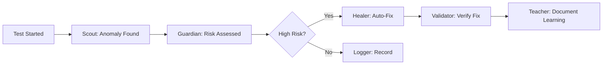

# Orchestration Strategies

*How to coordinate multiple agents without creating chaos*

---

## The Orchestration Challenge

Picture this: 5 talented musicians, each playing perfectly. But no conductor. That's not music—it's noise.

I learned this the hard way when my 5 specialized agents nearly brought down production. Each was doing its job perfectly. Together? They were fighting over resources, duplicating work, and creating more problems than they solved.

Orchestration isn't optional. It's the difference between an agent mob and an agent team.

---

## Core Orchestration Patterns

### Pattern 1: Sequential Pipeline

**When to Use:** Clear process flow, dependent steps

```python
class SequentialOrchestrator:
    """
    Like an assembly line - each agent does its part in order.
    Simple, predictable, debuggable.
    """
    
    def orchestrate(self, task):
        pipeline = [
            ('scout', self.discover_test_scenarios),
            ('validator', self.validate_scenarios),
            ('executor', self.run_tests),
            ('synthesizer', self.analyze_results),
            ('reporter', self.generate_report)
        ]
        
        context = {'task': task, 'results': {}}
        
        for agent_name, agent_function in pipeline:
            try:
                # Each agent builds on previous results
                result = agent_function(context)
                context['results'][agent_name] = result
                
                # Stop pipeline if critical failure
                if result.status == 'critical_failure':
                    return self.handle_pipeline_failure(context, agent_name)
                    
            except Exception as e:
                return self.handle_agent_error(agent_name, e, context)
        
        return context['results']
```

**Example Implementation:**
```yaml
test_execution_pipeline:
  stages:
    - name: "Test Discovery"
      agent: scout_agent
      timeout: 30s
      on_failure: stop
      
    - name: "Risk Assessment"
      agent: risk_analyzer
      timeout: 10s
      on_failure: continue_with_warning
      
    - name: "Test Execution"
      agent: test_runner
      timeout: 300s
      on_failure: retry_once
      
    - name: "Result Analysis"
      agent: analyzer
      timeout: 20s
      on_failure: stop
```

**Pros:** Simple, predictable, easy to debug
**Cons:** Slow (no parallelism), rigid, single point of failure

---

### Pattern 2: Parallel Burst

**When to Use:** Independent tasks, speed matters

```python
class ParallelOrchestrator:
    """
    Like a sprint start - everyone runs at once.
    Fast but needs careful coordination.
    """
    
    def orchestrate(self, tasks):
        from concurrent.futures import ThreadPoolExecutor, as_completed
        
        results = {}
        with ThreadPoolExecutor(max_workers=10) as executor:
            # Launch all agents simultaneously
            future_to_agent = {
                executor.submit(agent.execute, task): agent 
                for agent, task in self.prepare_agent_tasks(tasks)
            }
            
            # Collect results as they complete
            for future in as_completed(future_to_agent):
                agent = future_to_agent[future]
                try:
                    result = future.result(timeout=30)
                    results[agent.name] = result
                except TimeoutError:
                    results[agent.name] = self.handle_timeout(agent)
                except Exception as e:
                    results[agent.name] = self.handle_error(agent, e)
        
        return self.merge_results(results)
```

**Example:**
Our parallel burst pattern for API testing:
- 10 agents test different endpoints simultaneously
- 5-minute test suite reduced to 45 seconds
- But: Had to add resource pooling to prevent DB connection exhaustion

---

### Pattern 3: Event-Driven Choreography

**When to Use:** Complex workflows, reactive systems

```python
class EventDrivenOrchestrator:
    """
    Like a jazz ensemble - everyone responds to what they hear.
    Flexible but requires clear communication.
    """
    
    def __init__(self):
        self.event_bus = EventBus()
        self.agents = {}
        
    def register_agent(self, agent, subscribed_events):
        self.agents[agent.name] = agent
        for event_type in subscribed_events:
            self.event_bus.subscribe(event_type, agent.handle_event)
    
    def orchestrate(self):
        # Agents react to events, creating new events
        initial_event = Event('START_TESTING')
        self.event_bus.publish(initial_event)
        
        # Event chain example:
        # START_TESTING -> scout finds issue
        # ISSUE_FOUND -> validator confirms
        # ISSUE_CONFIRMED -> healer attempts fix
        # FIX_ATTEMPTED -> validator re-checks
        # VALIDATION_COMPLETE -> reporter summarizes
```

**Event Flow Example:**


---

### Pattern 4: Hierarchical Command

**When to Use:** Complex decisions, clear authority needed

```python
class HierarchicalOrchestrator:
    """
    Like a military operation - clear chain of command.
    Efficient but can be rigid.
    """
    
    def __init__(self):
        self.commander = CommanderAgent()
        self.squad_leaders = {}
        self.workers = {}
        
    def orchestrate(self, mission):
        # Commander creates strategy
        strategy = self.commander.plan_mission(mission)
        
        # Distribute to squad leaders
        for objective in strategy.objectives:
            squad_leader = self.assign_squad_leader(objective)
            squad_leader.receive_orders(objective)
            
            # Squad leaders coordinate workers
            workers = self.assign_workers(objective)
            results = squad_leader.coordinate_workers(workers)
            
            # Report back up chain
            squad_leader.report_to_commander(results)
        
        return self.commander.mission_summary()
```

**Example Hierarchy:**
```yaml
commander:
  name: "QE Mission Control"
  responsibilities:
    - "Strategic planning"
    - "Resource allocation"
    - "Final decisions"
  
squad_leaders:
  functional_testing:
    workers: [ui_tester, api_tester, integration_tester]
  
  performance_testing:
    workers: [load_generator, metric_collector, analyzer]
  
  security_testing:
    workers: [vulnerability_scanner, penetration_tester]
```

---

### Pattern 5: Adaptive Mesh

**When to Use:** Dynamic environments, self-organizing teams

```python
class AdaptiveMeshOrchestrator:
    """
    Like a flock of birds - no single leader, emergent coordination.
    Resilient but harder to predict.
    """
    
    def __init__(self):
        self.agents = []
        self.shared_state = SharedState()
        
    def orchestrate(self):
        while not self.objective_complete():
            # Each agent decides independently based on shared state
            for agent in self.agents:
                agent_decision = agent.analyze_situation(self.shared_state)
                
                if agent_decision.should_act:
                    # Broadcast intention to prevent conflicts
                    agent.broadcast_intention(agent_decision)
                    
                    # Wait for objections
                    if not self.any_objections(agent_decision):
                        result = agent.execute(agent_decision)
                        self.shared_state.update(result)
                
            # Emergent behavior from simple rules
            self.adapt_to_results()
```

---

## Coordination Mechanisms

### 1. Resource Management

```python
class ResourceCoordinator:
    """
    Prevents agents from fighting over resources
    """
    
    def __init__(self):
        self.resource_pools = {
            'database_connections': Pool(size=100),
            'api_rate_limit': RateLimiter(1000, 'per_minute'),
            'memory': MemoryManager(limit='4GB'),
            'cpu_cores': CPUScheduler(cores=8)
        }
    
    def request_resources(self, agent, requirements):
        allocated = {}
        
        try:
            for resource, amount in requirements.items():
                allocated[resource] = self.resource_pools[resource].acquire(amount)
            
            return ResourceGrant(agent, allocated)
            
        except ResourceUnavailable as e:
            # Return what we allocated
            self.release_partial(allocated)
            return self.handle_resource_conflict(agent, e)
```

### 2. Communication Protocols

```python
class AgentCommunicationProtocol:
    """
    How agents talk to each other (and to humans)
    """
    
    def __init__(self):
        self.message_types = {
            'DISCOVERY': 'Found something interesting',
            'REQUEST': 'Need something from another agent',
            'ALERT': 'Problem detected',
            'COMPLETE': 'Task finished',
            'HELP': 'Need human intervention'
        }
    
    def send_message(self, from_agent, to_agent, message_type, payload):
        message = Message(
            from_agent=from_agent,
            to_agent=to_agent,
            type=message_type,
            payload=payload,
            timestamp=now(),
            correlation_id=generate_id()
        )
        
        # Ensure delivery and track acknowledgment
        return self.reliable_send(message)
```

### 3. Conflict Resolution

```python
class ConflictResolver:
    """
    When agents disagree, someone needs to decide
    """
    
    def resolve(self, conflict):
        if conflict.type == 'resource_contention':
            # Priority-based resolution
            return self.highest_priority_wins(conflict)
            
        elif conflict.type == 'contradictory_findings':
            # Evidence-based resolution
            return self.strongest_evidence_wins(conflict)
            
        elif conflict.type == 'strategy_disagreement':
            # Escalate to human
            return self.escalate_to_human(conflict)
```

---

## Example Implementation: The Test Orchestra

Here's an example for production orchestration setup:

```yaml
name: "E2E Test Orchestra"
pattern: "Hierarchical with Event-Driven elements"

conductor:
  role: "Test Orchestration Manager"
  decisions:
    - "Test prioritization"
    - "Resource allocation"
    - "Failure handling"

sections:
  preparation:
    agents: [EnvironmentProvisioner, DataSeeder, ConfigValidator]
    pattern: "Sequential"
    
  discovery:
    agents: [FeatureScout, RiskAnalyzer, TestGenerator]
    pattern: "Parallel"
    
  execution:
    agents: [UITester, APITester, IntegrationTester]
    pattern: "Parallel with resource management"
    
  analysis:
    agents: [ResultAnalyzer, PatternDetector, ReportGenerator]
    pattern: "Sequential"

coordination:
  communication: "Event bus with message queue"
  resources: "Pooled with priority queuing"
  conflicts: "Conductor has final say"
  monitoring: "Real-time dashboard"

failure_handling:
  agent_failure: "Restart once, then skip"
  resource_exhaustion: "Queue and wait"
  timeout: "Kill and report"
  critical_failure: "Stop orchestra, alert humans"
```

---

## Orchestration Metrics

Track these to know if your orchestration is working:

```python
orchestration_metrics = {
    'efficiency': {
        'agent_utilization': '% time agents are working',
        'wait_time': 'Average time agents wait for resources',
        'throughput': 'Tasks completed per hour'
    },
    
    'reliability': {
        'failure_rate': 'Orchestration failures per day',
        'recovery_time': 'Mean time to recover from failure',
        'deadlock_frequency': 'How often agents get stuck'
    },
    
    'coordination': {
        'message_latency': 'Agent-to-agent communication time',
        'conflict_rate': 'Conflicts per 100 operations',
        'resource_contention': 'Resource wait incidents'
    }
}
```

---

## Common Orchestration Failures

### The Thundering Herd
**Problem:** All agents start simultaneously, overwhelming resources
**Solution:** Staged startup with resource pre-allocation

### The Deadly Embrace
**Problem:** Agent A waits for B, B waits for A
**Solution:** Timeout + deadlock detection

### The Broken Telephone
**Problem:** Message corruption/loss between agents
**Solution:** Message acknowledgment + retry logic

### The Leader Election Crisis
**Problem:** Multiple agents think they're in charge
**Solution:** Clear hierarchy or consensus protocol

---

## Choosing Your Strategy

```python
def choose_orchestration_strategy(context):
    if context.workflow == 'linear' and context.speed != 'critical':
        return 'Sequential Pipeline'
    
    elif context.tasks == 'independent' and context.speed == 'critical':
        return 'Parallel Burst'
    
    elif context.workflow == 'complex' and context.flexibility == 'high':
        return 'Event-Driven Choreography'
    
    elif context.decisions == 'complex' and context.authority == 'clear':
        return 'Hierarchical Command'
    
    elif context.environment == 'dynamic' and context.resilience == 'critical':
        return 'Adaptive Mesh'
    
    else:
        return 'Start with Sequential, evolve as needed'
```

---

## Your First Orchestration

Start simple. Here's a minimal orchestrator:

```python
class SimpleOrchestrator:
    def __init__(self):
        self.agents = []
        self.results = {}
        
    def add_agent(self, agent):
        self.agents.append(agent)
        
    def orchestrate(self, task):
        for agent in self.agents:
            try:
                # Sequential execution with error handling
                result = agent.execute(task)
                self.results[agent.name] = result
                
                # Pass results to next agent
                task.previous_results = self.results
                
            except Exception as e:
                print(f"Agent {agent.name} failed: {e}")
                # Continue with next agent
                
        return self.results
```

---

## The Golden Rules

1. **Start Sequential:** You can always parallelize later
2. **Monitor Everything:** You can't optimize what you don't measure
3. **Plan for Failure:** Agents will fail, orchestration must survive
4. **Human Override:** Always have a kill switch
5. **Clear Communication:** Agents must speak the same language

---

## Remember

Orchestration is about coordination, not control. The best orchestration is often the simplest one that works. Start simple, measure everything, and evolve based on actual needs, not imagined ones.

---

*Next: [Human-in-the-Loop Workflows →](/playbook/human-in-the-loop)*