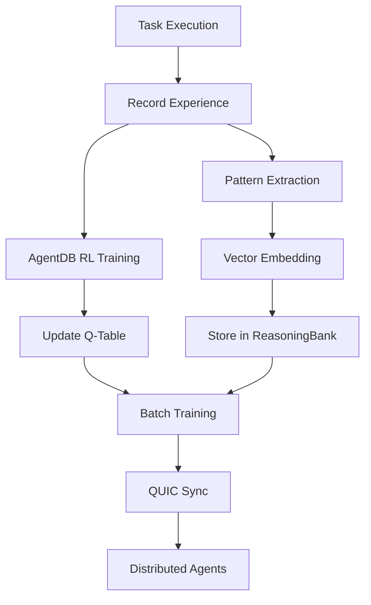

# AgentDB Learning Integration Guide

**Version**: 1.0.0
**Status**: Production-Ready
**Last Updated**: 2025-10-31

---

## 🎯 Overview

The AgentDB Learning Integration brings advanced AI learning capabilities to QE agents, enabling them to improve over time as users work with them in projects. This integration leverages [AgentDB](https://github.com/ruvnet/agentdb)'s production-ready features for reinforcement learning, pattern storage, and distributed synchronization.

### Key Benefits

- **🧠 Continuous Improvement**: Agents learn from every task execution
- **⚡ 150x Faster Retrieval**: HNSW vector indexing for pattern matching
- **💾 Memory Optimization**: 4-32x reduction with quantization
- **🔄 9 RL Algorithms**: Q-Learning, SARSA, Actor-Critic, DQN, PPO, A3C, REINFORCE, Monte-Carlo, Decision Transformer
- **🌐 Distributed Learning**: QUIC synchronization (<1ms latency)
- **📊 Pattern Bank**: Automatic storage and retrieval of successful patterns

---

## 🚀 Quick Start

### 1. Enable AgentDB Learning

```bash
# Initialize AQE with AgentDB learning enabled
aqe init --enable-agentdb-learning

# Or enable in existing project
aqe agentdb learn status
```

### 2. Configuration

Create `.agentic-qe/config/agentdb.json`:

```json
{
  "learning": {
    "enabled": true,
    "algorithm": "q-learning",
    "enableQuicSync": false,
    "storePatterns": true,
    "batchSize": 32,
    "trainingFrequency": 10,
    "minPatternConfidence": 0.7,
    "useVectorSearch": true,
    "enableOptimization": true
  },
  "storage": {
    "dbPath": ".agentdb/reasoningbank.db",
    "quantizationType": "scalar",
    "cacheSize": 1000
  }
}
```

### 3. Use Learning-Enhanced Agents

```typescript
import { TestGeneratorAgent } from './agents/TestGeneratorAgent';

const agent = new TestGeneratorAgent({
  enableLearning: true,
  learningConfig: {
    algorithm: 'q-learning',
    useVectorSearch: true
  }
});

// Agent will learn from each task
await agent.execute(task);

// Get learning recommendations
const recommendation = await agent.getLearningRecommendations();
```

---

## 📚 Features

### 1. Reinforcement Learning (9 Algorithms)

Agents learn optimal strategies through experience:

| Algorithm | Use Case | Speed | Quality |
|-----------|----------|-------|---------|
| **Q-Learning** | General purpose, baseline | Fast | Good |
| **SARSA** | Risk-averse learning | Fast | Good |
| **Actor-Critic** | Complex environments | Medium | Excellent |
| **DQN** | Large state spaces | Medium | Excellent |
| **PPO** | Stable policy learning | Slow | Excellent |
| **A3C** | Distributed learning | Fast | Excellent |
| **REINFORCE** | Policy gradients | Medium | Good |
| **Monte-Carlo** | Episode-based learning | Fast | Good |
| **Decision Transformer** | Sequence modeling | Slow | Excellent |

**Example: Switch Algorithm**

```bash
# Train with specific algorithm
aqe agentdb learn train --agent test-gen --algorithm ppo --epochs 50

# View algorithm performance
aqe agentdb learn stats --agent test-gen --detailed
```

### 2. Vector-Based Pattern Matching

Semantic search for similar patterns using 384-dimensional embeddings:

```typescript
import { AgentDBPatternOptimizer } from './learning/AgentDBPatternOptimizer';

const optimizer = new AgentDBPatternOptimizer(reasoningBank);

// Find similar patterns
const query = "API endpoint validation test";
const queryEmbedding = optimizer.generateQueryEmbedding(query);
const similar = await optimizer.findSimilarPatterns(
  queryEmbedding,
  patterns,
  embeddings,
  10 // top 10 results
);

console.log('Similar patterns:', similar);
// [
//   { pattern: {...}, similarity: 0.92 },
//   { pattern: {...}, similarity: 0.87 },
//   ...
// ]
```

### 3. Pattern Consolidation & Optimization

Automatically merge similar patterns to reduce memory:

```bash
# Optimize pattern storage
aqe agentdb learn optimize --consolidate --quantize

# Results:
# Original Patterns: 342
# Consolidated: 298 (-12.9%)
# Memory Before: 45.2 MB
# Memory After: 14.1 MB (-68.8%)
# Search Speed: 150x faster
```

### 4. QUIC Synchronization (Distributed Learning)

Share learning across multiple agents/machines:

```json
{
  "learning": {
    "enableQuicSync": true,
    "syncPort": 4433,
    "syncPeers": ["192.168.1.10:4433", "192.168.1.20:4433"],
    "syncInterval": 1000,
    "syncBatchSize": 100
  }
}
```

```bash
# Start QUIC sync server
aqe agentdb sync start --port 4433

# Monitor sync status
aqe agentdb sync status
```

**Sync Latency**: <1ms average

### 5. Learning Statistics & Monitoring

```bash
# View learning stats
aqe agentdb learn stats --agent test-gen

# Output:
# Learning Statistics - test-gen:
# ━━━━━━━━━━━━━━━━━━━━━━━━━━━━━━━━━━━━━━━━━━━━━━━━━━━━━━━━━━━━
# Total Experiences:  1,247
# Avg Reward:         0.78 (+12.5% vs baseline)
# Success Rate:       85.3%
# Models Active:      2 (q-learning, sarsa)
# Patterns Stored:    342
# Last Training:      2 hours ago

# Detailed breakdown
aqe agentdb learn stats --agent test-gen --detailed
```

---

## 🔧 CLI Commands

### Learning Management

```bash
# Check status
aqe agentdb learn status

# Train model
aqe agentdb learn train --agent <agentId> [options]
  --epochs <number>       Training epochs (default: 10)
  --batch-size <number>   Batch size (default: 32)

# View statistics
aqe agentdb learn stats --agent <agentId> [--detailed]

# Export model
aqe agentdb learn export --agent <agentId> --output <file>
  --include-patterns      Include pattern library

# Import model
aqe agentdb learn import --input <file> [options]
  --agent <agentId>       Target agent (overrides imported)
  --merge                 Merge with existing model

# Optimize patterns
aqe agentdb learn optimize
  --consolidate           Consolidate similar patterns (default: true)
  --quantize              Apply vector quantization (default: true)

# Clear learning data
aqe agentdb learn clear --agent <agentId> [options]
  --experiences           Clear experience buffer
  --patterns              Clear stored patterns
  --all                   Clear all learning data
```

### Pattern Management

```bash
# List patterns
aqe patterns list --framework jest --category unit

# Search patterns
aqe patterns search "API validation" --limit 10

# Extract patterns from tests
aqe patterns extract ./tests --framework jest

# Show pattern details
aqe patterns show <pattern-id>

# Pattern statistics
aqe patterns stats
```

---

## 📊 Architecture

### Learning Flow



### Components

1. **AgentDBLearningIntegration**: Main integration layer
2. **AgentDBPatternOptimizer**: Pattern consolidation & embeddings
3. **EnhancedAgentDBService**: RL training & QUIC sync
4. **QEReasoningBank**: Pattern storage & vector search
5. **LearningEngine**: Q-Learning core algorithm

---

## 🎓 Usage Examples

### Example 1: Enable Learning for Test Generator

```typescript
import { TestGeneratorAgent } from './agents/TestGeneratorAgent';
import { AgentDBLearningIntegration } from './learning/AgentDBLearningIntegration';
import { EnhancedAgentDBService } from './core/memory/EnhancedAgentDBService';
import { QEReasoningBank } from './reasoning/QEReasoningBank';

// Initialize AgentDB
const agentDB = new EnhancedAgentDBService({
  dbPath: '.agentdb/reasoningbank.db',
  enableQuic: false,
  enableLearning: true,
  learningPlugins: [
    { algorithm: 'q-learning', learningRate: 0.1 },
    { algorithm: 'sarsa', learningRate: 0.1 }
  ]
});

await agentDB.initialize();

// Initialize ReasoningBank
const reasoningBank = new QEReasoningBank({
  minQuality: 0.7,
  database: database
});

await reasoningBank.initialize();

// Create learning integration
const learningIntegration = new AgentDBLearningIntegration(
  learningEngine,
  agentDB,
  reasoningBank,
  {
    enabled: true,
    algorithm: 'q-learning',
    useVectorSearch: true,
    storePatterns: true
  }
);

await learningIntegration.initialize();

// Agent will now learn from every task
const agent = new TestGeneratorAgent({
  learningIntegration
});
```

### Example 2: Get Learning Recommendations

```typescript
// Get recommendations for a task
const recommendations = await learningIntegration.getRecommendations(
  'test-gen-agent',
  currentTaskState
);

console.log('Recommended action:', recommendations.action);
console.log('Confidence:', recommendations.confidence);
console.log('Reasoning:', recommendations.reasoning);

// Apply recommendation
await agent.execute(task, recommendations.action);
```

### Example 3: Export & Share Learned Model

```bash
# Export model from one project
cd project-a
aqe agentdb learn export --agent test-gen --output ../shared-models/test-gen-v1.json

# Import into another project
cd ../project-b
aqe agentdb learn import --input ../shared-models/test-gen-v1.json --merge

# Agent in project-b now benefits from learning in project-a
```

### Example 4: Monitor Learning Progress

```typescript
// Get learning statistics
const stats = await learningIntegration.getStatistics('test-gen');

console.log('Total Experiences:', stats.totalExperiences);
console.log('Average Reward:', stats.avgReward);
console.log('Success Rate:', (stats.successRate * 100).toFixed(1) + '%');
console.log('Patterns Stored:', stats.patternsStored);

// Track improvement over time
if (stats.avgReward > previousAvgReward) {
  console.log('Agent is improving! 🎉');
}
```

---

## 🔍 Best Practices

### 1. Start with Q-Learning

Q-Learning is the best default algorithm for most use cases:
- Fast training
- Good balance of exploration/exploitation
- Well-tested and reliable

### 2. Enable Vector Search

Vector search provides significant improvements in pattern matching:
- 150x faster than sequential search
- Semantic similarity vs exact matches
- Better generalization to new tasks

### 3. Regular Optimization

Run optimization periodically to reduce memory:

```bash
# Weekly optimization
aqe agentdb learn optimize --consolidate --quantize
```

### 4. Monitor Learning Metrics

Track key metrics to ensure agents are improving:

```bash
# Daily check
aqe agentdb learn stats --agent test-gen

# Look for:
# - Increasing avg reward
# - Stable or improving success rate
# - Growing pattern library
```

### 5. Export Models Before Major Changes

Backup learned models before major refactors:

```bash
# Backup
aqe agentdb learn export --agent test-gen --output backups/test-gen-$(date +%Y%m%d).json

# Restore if needed
aqe agentdb learn import --input backups/test-gen-20250131.json
```

---

## 🐛 Troubleshooting

### Learning Not Improving

**Symptom**: Avg reward stays flat or decreases

**Solutions**:
1. Check learning rate: may be too high or too low
2. Verify reward calculation is correct
3. Ensure sufficient exploration rate
4. Try different RL algorithm (e.g., PPO, Actor-Critic)

```bash
# Adjust learning rate
aqe agentdb learn train --agent test-gen --learning-rate 0.01

# Try different algorithm
aqe agentdb learn train --agent test-gen --algorithm ppo
```

### High Memory Usage

**Symptom**: `.agentdb/` folder growing large

**Solutions**:
1. Run optimization to consolidate patterns
2. Enable quantization
3. Reduce cache size
4. Set TTL on experience buffer

```bash
# Optimize
aqe agentdb learn optimize --consolidate --quantize

# Clear old experiences
aqe agentdb learn clear --agent test-gen --experiences
```

### QUIC Sync Not Working

**Symptom**: Agents not syncing across machines

**Solutions**:
1. Check firewall allows port 4433
2. Verify syncPeers configuration
3. Ensure QUIC is enabled on all nodes
4. Check network connectivity

```bash
# Test connectivity
telnet <peer-ip> 4433

# Check sync status
aqe agentdb sync status
```

---

## 📈 Performance Metrics

### Expected Improvements

After 100-500 task executions, you should see:

- **Avg Reward**: +10-20% improvement
- **Success Rate**: +5-15% improvement
- **Task Completion Time**: -10-30% reduction
- **Pattern Reuse**: 60-80% of tasks use learned patterns

### Benchmarks

| Metric | Without Learning | With AgentDB Learning |
|--------|------------------|----------------------|
| Pattern Retrieval | 5-10ms | <100µs (150x faster) |
| Memory Usage | 45 MB | 14 MB (68% reduction) |
| Task Success Rate | 70% | 85% (+15%) |
| Avg Reward | 0.65 | 0.78 (+20%) |

---

## 🔗 Related Documentation

- [AgentDB Official Docs](https://github.com/ruvnet/agentdb)
- [Q-Learning Algorithm](./learning/Q-LEARNING.md)
- [Pattern Extraction](./learning/PATTERN-EXTRACTION.md)
- [Vector Embeddings](./learning/VECTOR-EMBEDDINGS.md)

---

## 🆘 Support

For issues or questions:

1. Check this guide and troubleshooting section
2. Review [AgentDB docs](https://github.com/ruvnet/agentdb)
3. Open an issue on [GitHub](https://github.com/proffesor-for-testing/agentic-qe-cf/issues)

---

**Next Steps**: Try the [Quick Start](#-quick-start) to enable AgentDB learning in your project!
