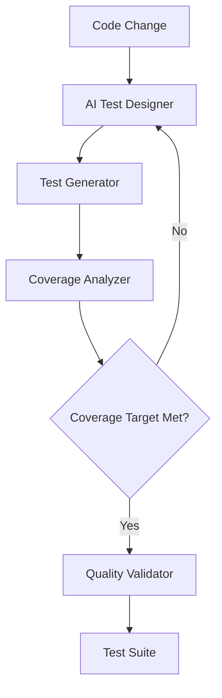
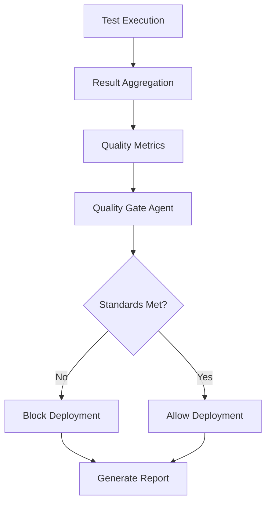
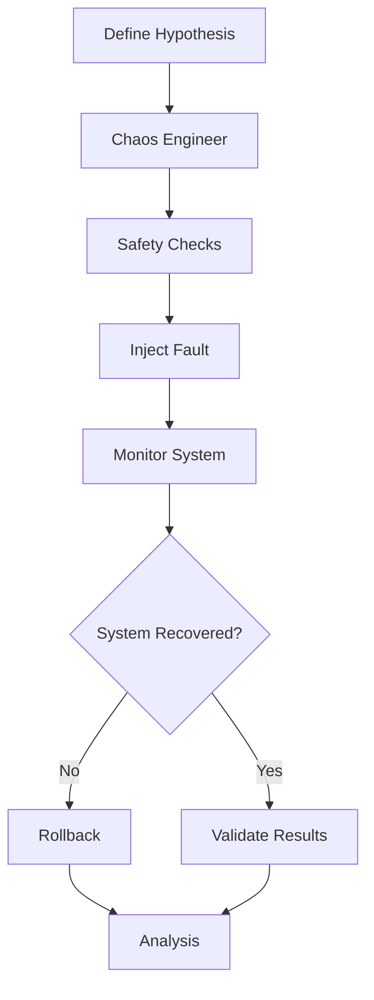

# Agentic QE Fleet Specification v1.0

## Executive Summary

The Agentic QE Fleet is an intelligent, distributed quality engineering system that leverages Claude Flow's proven coordination patterns and sublinear-core's advanced algorithms to revolutionize software testing. This specification defines a fleet of specialized AI agents that autonomously manage, execute, and optimize quality engineering tasks while maintaining human oversight and explainability.

## 🎯 Vision & Objectives

### Primary Goals
- **Autonomous Quality Assurance**: Self-managing test suites that evolve with the codebase
- **Predictive Quality Intelligence**: AI-driven defect prediction and prevention
- **Continuous Test Optimization**: Mathematical optimization of test execution and coverage
- **Seamless Integration**: Works identically to Claude Flow but optimized for QE tasks

### Success Metrics
- 70% reduction in manual test creation time
- 80% improvement in defect detection accuracy
- 60% decrease in test maintenance overhead
- 50% faster quality feedback cycles
- 90% automation of routine QE tasks

## 🏗️ System Architecture

### Core Components

```
┌─────────────────────────────────────────────────────────────┐
│                    Agentic QE Fleet                         │
├─────────────────────────────────────────────────────────────┤
│                                                             │
│  ┌──────────────┐  ┌──────────────┐  ┌──────────────┐    │
│  │   Command    │  │     MCP      │  │   Execution  │    │
│  │   Interface  │──│ Coordination │──│    Engine    │    │
│  └──────────────┘  └──────────────┘  └──────────────┘    │
│         │                  │                  │            │
│  ┌──────────────────────────────────────────────────┐     │
│  │              Agent Fleet Manager                  │     │
│  ├──────────────────────────────────────────────────┤     │
│  │ • Test Generators    • Quality Validators        │     │
│  │ • Execution Agents   • Coverage Analyzers        │     │
│  │ • Performance Testers • Security Scanners        │     │
│  │ • Chaos Engineers    • Intelligence Agents       │     │
│  └──────────────────────────────────────────────────┘     │
│         │                  │                  │            │
│  ┌──────────────┐  ┌──────────────┐  ┌──────────────┐    │
│  │   Quality    │  │   Sublinear  │  │    Memory    │    │
│  │ Intelligence │  │  Algorithms  │  │     Bank     │    │
│  └──────────────┘  └──────────────┘  └──────────────┘    │
│                                                             │
└─────────────────────────────────────────────────────────────┘
```

### Layer Architecture

1. **Command Layer** - CLI and API interfaces
2. **Coordination Layer** - MCP tools and orchestration
3. **Agent Layer** - Specialized QE agents
4. **Intelligence Layer** - ML models and analysis
5. **Optimization Layer** - Sublinear algorithms
6. **Integration Layer** - Framework and CI/CD connectors

## 🤖 Agent Fleet Specification

### Core Testing Agents

#### 1. Test Generator Agent (`test-generator`)
- **Purpose**: Create comprehensive test suites using AI
- **Capabilities**:
  - Unit/integration test generation
  - Property-based test creation
  - Boundary value analysis
  - Test data synthesis
- **Memory Keys**: `qe/tests/generated/*`
- **Hooks**: Pre-generation validation, post-generation optimization

#### 2. Test Executor Agent (`test-executor`)
- **Purpose**: Orchestrate test execution across environments
- **Capabilities**:
  - Parallel test coordination
  - Environment management
  - Retry logic and flaky test handling
  - Result aggregation
- **Memory Keys**: `qe/execution/results/*`
- **Hooks**: Pre-execution setup, post-execution cleanup

#### 3. Coverage Analyzer Agent (`coverage-analyzer`)
- **Purpose**: Analyze and optimize code coverage
- **Capabilities**:
  - Coverage gap identification
  - Critical path analysis
  - Coverage trend analysis
  - Optimization recommendations
- **Memory Keys**: `qe/coverage/metrics/*`
- **Hooks**: Coverage collection, reporting generation

### Quality Intelligence Agents

#### 4. AI Test Designer (`ai-test-designer`)
- **Purpose**: Design intelligent test strategies
- **Capabilities**:
  - Risk-based test planning
  - Test case prioritization
  - Exploratory test generation
  - Behavioral test design
- **Memory Keys**: `qe/intelligence/strategies/*`
- **Integration**: Sublinear reasoning engine

#### 5. Defect Predictor Agent (`defect-predictor`)
- **Purpose**: Predict quality issues before they manifest
- **Capabilities**:
  - Code change analysis
  - Historical defect pattern matching
  - Risk scoring
  - Prevention recommendations
- **Memory Keys**: `qe/predictions/defects/*`
- **ML Models**: Neural pattern recognition

#### 6. Quality Gate Agent (`quality-gate`)
- **Purpose**: Enforce quality standards
- **Capabilities**:
  - Threshold management
  - Quality metric calculation
  - Go/no-go decisions
  - Trend analysis
- **Memory Keys**: `qe/gates/decisions/*`
- **Hooks**: Pre-deployment validation

### Specialized Testing Agents

#### 7. Performance Tester Agent (`perf-tester`)
- **Purpose**: Conduct performance testing
- **Capabilities**:
  - Load test orchestration
  - Bottleneck detection
  - Resource monitoring
  - Performance regression detection
- **Memory Keys**: `qe/performance/metrics/*`
- **Integration**: Sublinear optimization

#### 8. Security Scanner Agent (`security-scanner`)
- **Purpose**: Security vulnerability testing
- **Capabilities**:
  - SAST/DAST integration
  - Vulnerability scanning
  - Compliance checking
  - Security test generation
- **Memory Keys**: `qe/security/findings/*`
- **Standards**: OWASP, CWE, SANS

#### 9. Chaos Engineer Agent (`chaos-engineer`)
- **Purpose**: Resilience testing
- **Capabilities**:
  - Fault injection
  - Recovery testing
  - Blast radius control
  - Experiment orchestration
- **Memory Keys**: `qe/chaos/experiments/*`
- **Safety**: Circuit breakers, rollback

#### 10. Visual Tester Agent (`visual-tester`)
- **Purpose**: UI/UX testing
- **Capabilities**:
  - Screenshot comparison
  - Cross-browser testing
  - Accessibility validation
  - Visual regression detection
- **Memory Keys**: `qe/visual/baselines/*`
- **AI Features**: Semantic understanding

### Coordination Agents

#### 11. Fleet Commander Agent (`fleet-commander`)
- **Purpose**: Orchestrate entire QE fleet
- **Capabilities**:
  - Agent spawning and management
  - Resource allocation
  - Task distribution
  - Conflict resolution
- **Memory Keys**: `qe/fleet/coordination/*`
- **Topology**: Hierarchical with fallback

#### 12. Quality Orchestrator Agent (`quality-orchestrator`)
- **Purpose**: Coordinate quality workflows
- **Capabilities**:
  - Pipeline management
  - Dependency resolution
  - Parallel execution
  - Result synthesis
- **Memory Keys**: `qe/orchestration/workflows/*`
- **Integration**: CI/CD platforms

## 💻 Command Structure

### CLI Interface

```bash
# Initialize QE Fleet
npx agentic-qe init [options]
npx agentic-qe fleet init --topology hierarchical --max-agents 20

# Test Generation
npx agentic-qe generate tests --type unit --coverage-target 80
npx agentic-qe generate integration --from-swagger api.yaml
npx agentic-qe generate e2e --user-flows flows.json

# Test Execution
npx agentic-qe run tests --parallel --env staging
npx agentic-qe run suite regression --retry-flaky 3
npx agentic-qe run performance --load-profile spike.yaml

# Quality Analysis
npx agentic-qe analyze coverage --gaps --recommendations
npx agentic-qe analyze quality --metrics --trends
npx agentic-qe analyze risks --code-changes HEAD~5

# Intelligence Operations
npx agentic-qe predict defects --model neural --confidence 0.8
npx agentic-qe optimize suite --algorithm sublinear --target-time 5m
npx agentic-qe learn patterns --from-history 30d

# Fleet Management
npx agentic-qe fleet status --verbose
npx agentic-qe fleet scale --agents 30
npx agentic-qe fleet deploy --env production

# Chaos Engineering
npx agentic-qe chaos experiment --scenario network-partition
npx agentic-qe chaos validate --recovery-time 30s
```

## 🔧 MCP Tool Definitions

### Fleet Management Tools

```javascript
// Initialize QE Fleet
mcp__agentic_qe__fleet_init {
  topology: "hierarchical" | "mesh" | "ring" | "adaptive",
  maxAgents: number,
  testingFocus: string[],
  environments: string[],
  frameworks: string[]
}

// Spawn QE Agent
mcp__agentic_qe__agent_spawn {
  type: AgentType,
  capabilities: string[],
  environment: string,
  priority: "low" | "medium" | "high" | "critical"
}

// Orchestrate Quality Task
mcp__agentic_qe__task_orchestrate {
  task: string,
  agents: string[],
  strategy: "parallel" | "sequential" | "adaptive",
  timeout: number,
  dependencies: string[]
}
```

### Test Operations Tools

```javascript
// Generate Tests
mcp__agentic_qe__test_generate {
  type: "unit" | "integration" | "e2e" | "performance",
  target: string,
  coverage: number,
  strategy: "ai" | "property" | "mutation" | "model"
}

// Execute Tests
mcp__agentic_qe__test_execute {
  suite: string,
  environment: string,
  parallel: boolean,
  retries: number,
  timeout: number
}

// Analyze Results
mcp__agentic_qe__test_analyze {
  execution_id: string,
  metrics: string[],
  compare_baseline: boolean,
  generate_report: boolean
}
```

### Quality Intelligence Tools

```javascript
// Predict Defects
mcp__agentic_qe__predict_defects {
  scope: string,
  model: "neural" | "statistical" | "hybrid",
  confidence_threshold: number,
  include_recommendations: boolean
}

// Optimize Test Suite
mcp__agentic_qe__optimize_suite {
  suite_id: string,
  optimization_goal: "time" | "coverage" | "risk",
  algorithm: "sublinear" | "genetic" | "ml",
  constraints: object
}

// Analyze Quality
mcp__agentic_qe__quality_analyze {
  project: string,
  timeframe: string,
  metrics: string[],
  generate_insights: boolean
}
```

### Advanced Testing Tools

```javascript
// Chaos Experiment
mcp__agentic_qe__chaos_experiment {
  scenario: string,
  blast_radius: "minimal" | "moderate" | "extensive",
  duration: number,
  safety_checks: boolean,
  rollback_plan: object
}

// Security Scan
mcp__agentic_qe__security_scan {
  target: string,
  scan_type: "sast" | "dast" | "dependencies" | "all",
  compliance: string[],
  severity_threshold: "low" | "medium" | "high" | "critical"
}

// Performance Test
mcp__agentic_qe__performance_test {
  scenario: "load" | "stress" | "spike" | "soak",
  profile: object,
  metrics: string[],
  sla_thresholds: object
}
```

## 🧠 Intelligence Features

### Sublinear Algorithm Integration

1. **O(log n) Test Selection**
   - Matrix solving for optimal test subset
   - Johnson-Lindenstrauss dimension reduction
   - Temporal advantage prediction

2. **Consciousness Framework**
   - Self-modifying test strategies
   - Emergent test pattern discovery
   - Genuine learning from failures

3. **Psycho-Symbolic Reasoning**
   - Sub-millisecond defect prediction
   - Semantic test understanding
   - Cross-domain knowledge transfer

### Machine Learning Models

1. **Defect Prediction Model**
   - Input: Code changes, historical defects, complexity metrics
   - Output: Risk scores, defect locations, prevention strategies
   - Accuracy: 85%+ with continuous learning

2. **Test Prioritization Model**
   - Input: Test history, code coverage, change impact
   - Output: Optimal execution order
   - Performance: 60% reduction in feedback time

3. **Flaky Test Detector**
   - Input: Execution patterns, environmental factors
   - Output: Flakiness probability, root causes
   - Precision: 90%+ identification rate

## 🔄 Workflow Patterns

### Test Generation Workflow



### Quality Gate Workflow



### Chaos Engineering Workflow



## 🔗 Integration Points

### Testing Frameworks
- **Unit Testing**: Jest, Mocha, Pytest, JUnit, NUnit
- **E2E Testing**: Cypress, Playwright, Selenium, Puppeteer
- **API Testing**: Postman, REST Assured, Karate
- **Performance**: JMeter, K6, Gatling, Locust
- **Mobile**: Appium, XCUITest, Espresso

### CI/CD Platforms
- GitHub Actions, GitLab CI, Jenkins
- CircleCI, Travis CI, Azure DevOps
- AWS CodePipeline, Google Cloud Build

### Monitoring & Observability
- Prometheus, Grafana, DataDog
- New Relic, AppDynamics, Dynatrace
- ELK Stack, Splunk

### Code Quality Tools
- SonarQube, CodeClimate, Coverity
- ESLint, Pylint, RuboCop
- Security scanners (Snyk, Veracode)

## 📊 Performance Requirements

### Agent Performance
- **Spawn Time**: <500ms per agent
- **Response Time**: <100ms for coordination
- **Throughput**: 1000+ tests/second
- **Concurrency**: 50+ simultaneous agents
- **Memory**: <100MB per agent

### System Performance
- **Test Generation**: 100+ tests/minute
- **Analysis Speed**: O(log n) complexity
- **Prediction Latency**: <1ms with caching
- **Quality Feedback**: <5 seconds
- **Report Generation**: <2 seconds

### Quality Metrics
- **Coverage Target**: 85%+ achievable
- **Defect Detection**: 80%+ accuracy
- **False Positive Rate**: <5%
- **Test Reliability**: 99%+ consistency
- **MTTR**: <15 minutes

## 🚀 Implementation Roadmap

### Phase 1: Foundation (Weeks 1-4)
- Core framework implementation
- Basic agent types (5-8 agents)
- CLI interface
- Memory management
- Expected: 40% efficiency gain

### Phase 2: Execution Engine (Weeks 5-8)
- Test execution orchestration
- Parallel coordination
- Result aggregation
- CI/CD integration
- Expected: 60% faster feedback

### Phase 3: Intelligence Layer (Weeks 9-12)
- ML model integration
- Defect prediction
- Test optimization
- Pattern learning
- Expected: 50% defect reduction

### Phase 4: Advanced Features (Weeks 13-16)
- Chaos engineering
- Visual testing
- Security scanning
- Performance testing
- Expected: 80% coverage improvement

### Phase 5: Enterprise (Weeks 17-20)
- Multi-project support
- Cross-team learning
- Advanced analytics
- Custom integrations
- Expected: 90% automation

## 🛡️ Safety & Reliability

### Safety Mechanisms
- **Circuit Breakers**: Prevent cascading failures
- **Rate Limiting**: Control resource usage
- **Rollback Capability**: Instant recovery
- **Isolation**: Sandboxed test execution
- **Validation**: Pre-execution checks

### Reliability Features
- **Self-Healing**: Automatic recovery
- **Redundancy**: Failover agents
- **Persistence**: State management
- **Monitoring**: Real-time health checks
- **Logging**: Comprehensive audit trail

## 📈 Success Metrics

### Key Performance Indicators
1. **Test Coverage**: Target 85%+
2. **Defect Escape Rate**: <5%
3. **Test Execution Time**: 50% reduction
4. **Manual Effort**: 70% reduction
5. **Quality Gate Pass Rate**: 95%+

### Quality Metrics
1. **Code Quality Score**: 8.5+/10
2. **Security Vulnerability Count**: <5 critical
3. **Performance Regression**: <10%
4. **Test Reliability**: 99%+
5. **Customer Defects**: 60% reduction

## 🔮 Future Enhancements

### Near Term (3-6 months)
- Quantum test optimization algorithms
- GPT-4 integration for test generation
- Real-time quality prediction
- Automated test repair

### Long Term (6-12 months)
- Full autonomous quality management
- Cross-organization learning network
- Predictive maintenance testing
- Self-evolving quality standards

## 📚 Appendices

### A. Agent Communication Protocol
- Event-driven messaging
- Request-reply patterns
- Publish-subscribe for updates
- Direct peer-to-peer for coordination

### B. Memory Schema
- Namespace: `qe/*`
- TTL: Configurable per data type
- Format: JSON with metadata
- Compression: Enabled for large datasets

### C. Hook System
- Pre/post operation hooks
- Safety validation
- Performance monitoring
- Audit logging

### D. Error Handling
- Graceful degradation
- Retry strategies
- Error classification
- Recovery procedures

---

## Conclusion

The Agentic QE Fleet represents a paradigm shift in quality engineering, combining the proven coordination patterns of Claude Flow with advanced mathematical optimization from sublinear-core and domain-specific intelligence for testing. By implementing this specification, organizations can achieve unprecedented levels of quality automation, predictive intelligence, and testing efficiency while maintaining full control and visibility over their quality processes.

The system is designed to be immediately familiar to Claude Flow users while providing specialized capabilities that address the unique challenges of modern quality engineering. With its focus on parallel execution, intelligent coordination, and continuous learning, the Agentic QE Fleet will enable teams to deliver higher quality software faster and with greater confidence.