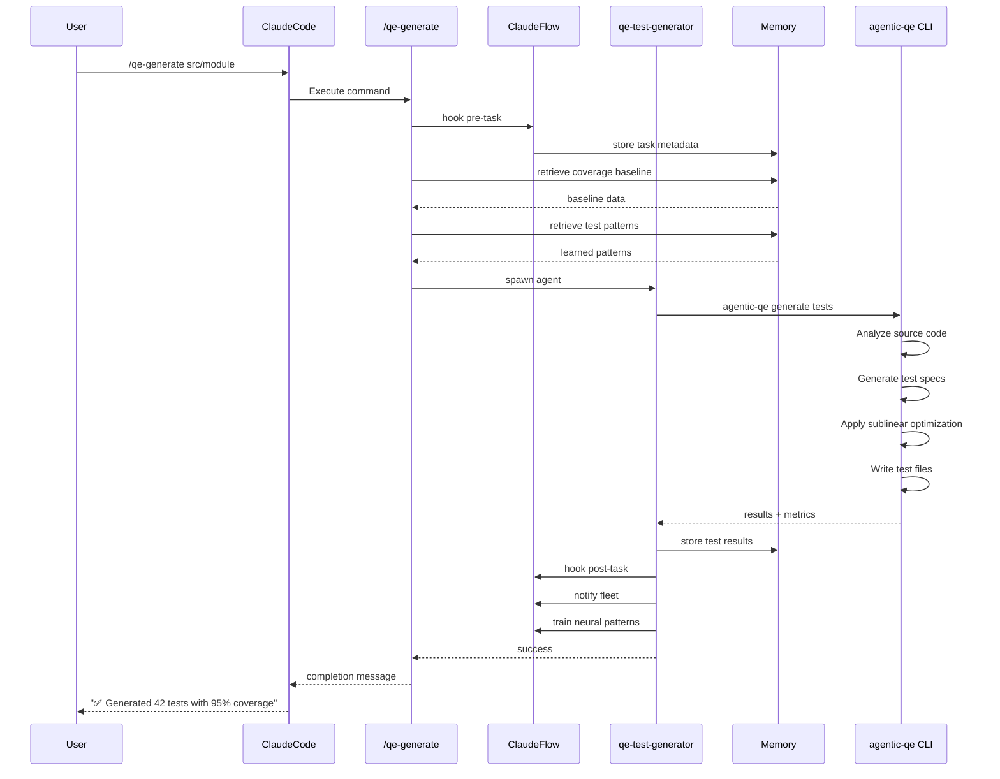
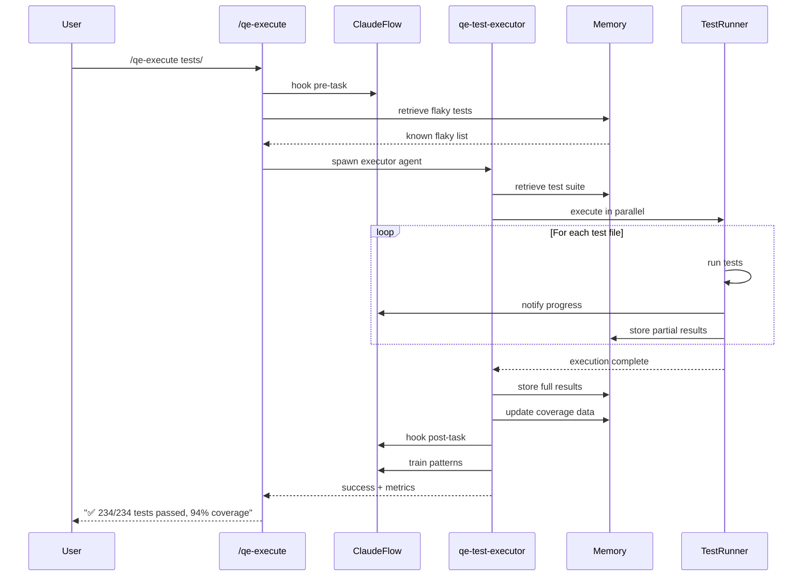
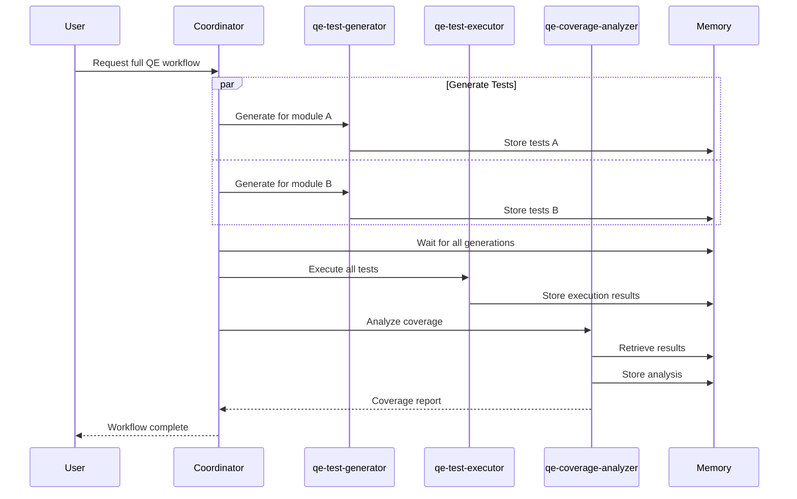

# QE Slash Commands - Architecture Diagram

**Version:** 2.0.0
**Date:** 2025-09-30
**Type:** System Architecture
**Format:** ASCII Diagrams + Mermaid

---

## System Overview

```
┌─────────────────────────────────────────────────────────────────────────────┐
│                         CLAUDE CODE INTERFACE                                │
│                  (User invokes slash commands via chat)                      │
└────────────────────────────────┬────────────────────────────────────────────┘
                                 │
                                 ▼
┌─────────────────────────────────────────────────────────────────────────────┐
│                        QE SLASH COMMANDS LAYER                               │
│  ┌──────────────┐  ┌──────────────┐  ┌──────────────┐  ┌──────────────┐   │
│  │/qe-generate  │  │ /qe-execute  │  │ /qe-analyze  │  │ /qe-optimize │   │
│  └──────┬───────┘  └──────┬───────┘  └──────┬───────┘  └──────┬───────┘   │
│         │                 │                  │                  │            │
│  ┌──────┴───────┐  ┌──────┴───────┐  ┌──────┴───────┐  ┌──────┴───────┐   │
│  │  /qe-report  │  │/qe-fleet-stat│  │  /qe-chaos   │  │/qe-benchmark │   │
│  └──────────────┘  └──────────────┘  └──────────────┘  └──────────────┘   │
└────────────────────────────────┬────────────────────────────────────────────┘
                                 │
                                 ▼
┌─────────────────────────────────────────────────────────────────────────────┐
│                      CLAUDE FLOW COORDINATION                                │
│  ┌────────────────┐  ┌────────────────┐  ┌────────────────┐                │
│  │     Hooks      │  │     Memory     │  │  EventBus      │                │
│  │  pre-task      │  │  store/retrieve│  │  notifications │                │
│  │  post-task     │  │  key namespace │  │  real-time     │                │
│  │  post-edit     │  │  structured    │  │  updates       │                │
│  │  notify        │  │  JSON storage  │  │                │                │
│  └────────┬───────┘  └────────┬───────┘  └────────┬───────┘                │
│           │                   │                    │                         │
│           └───────────────────┴────────────────────┘                         │
└────────────────────────────────┬────────────────────────────────────────────┘
                                 │
                                 ▼
┌─────────────────────────────────────────────────────────────────────────────┐
│                          AQE FLEET LAYER                                     │
│  ┌──────────────────┐  ┌──────────────────┐  ┌──────────────────┐          │
│  │ qe-test-generator│  │ qe-test-executor │  │qe-coverage-analyz│          │
│  │  AI generation   │  │  parallel exec   │  │  sublinear gaps  │          │
│  │  property tests  │  │  retry logic     │  │  optimization    │          │
│  └────────┬─────────┘  └────────┬─────────┘  └────────┬─────────┘          │
│           │                     │                      │                     │
│  ┌────────┴─────────┐  ┌────────┴─────────┐  ┌────────┴─────────┐          │
│  │  qe-quality-gate │  │qe-performance-te │  │qe-security-scann │          │
│  │  threshold checks│  │  load testing    │  │  SAST/DAST       │          │
│  └──────────────────┘  └──────────────────┘  └──────────────────┘          │
└────────────────────────────────┬────────────────────────────────────────────┘
                                 │
                                 ▼
┌─────────────────────────────────────────────────────────────────────────────┐
│                          EXECUTION LAYER                                     │
│  ┌──────────────┐  ┌──────────────┐  ┌──────────────┐  ┌──────────────┐   │
│  │ Test Runners │  │   Sublinear  │  │   Coverage   │  │   Neural     │   │
│  │ Jest/Cypress │  │   Algorithms │  │   Collectors │  │   Patterns   │   │
│  │ Playwright   │  │   O(log n)   │  │   lcov/json  │  │   Learning   │   │
│  └──────────────┘  └──────────────┘  └──────────────┘  └──────────────┘   │
└─────────────────────────────────────────────────────────────────────────────┘
```

---

## Command Execution Flow

### Flow 1: `/qe-generate` Command



### Flow 2: `/qe-execute` Command



### Flow 3: Multi-Agent Coordination



---

## Memory Architecture

```
┌─────────────────────────────────────────────────────────────────────────────┐
│                      CLAUDE FLOW MEMORY SYSTEM                               │
│                                                                               │
│  aqe/                                                                         │
│  ├── fleet/                           ← Fleet management                     │
│  │   ├── id                           └─ Fleet identifier                    │
│  │   ├── status                       └─ Active/paused/stopped               │
│  │   └── topology                     └─ Hierarchical/mesh/adaptive          │
│  │                                                                            │
│  ├── agents/                          ← Agent state                          │
│  │   ├── qe-test-generator/           └─ Generator agent                     │
│  │   │   ├── status                   └─ Active/idle/busy                    │
│  │   │   ├── metrics                  └─ Performance metrics                 │
│  │   │   └── config                   └─ Agent configuration                 │
│  │   ├── qe-test-executor/            └─ Executor agent                      │
│  │   └── qe-coverage-analyzer/        └─ Analyzer agent                      │
│  │                                                                            │
│  ├── test-generation/                 ← Test generation state                │
│  │   ├── results/                     └─ Generation results                  │
│  │   │   └── {task-id}.json           └─ Individual task results             │
│  │   ├── progress                     └─ Current progress                    │
│  │   └── patterns                     └─ Learned patterns                    │
│  │                                                                            │
│  ├── test-execution/                  ← Test execution state                 │
│  │   ├── results/                     └─ Execution results                   │
│  │   │   └── {run-id}.json            └─ Individual run results              │
│  │   ├── history                      └─ Historical execution data           │
│  │   └── flaky-tests                  └─ Known flaky tests                   │
│  │                                                                            │
│  ├── coverage/                        ← Coverage tracking                    │
│  │   ├── current                      └─ Current coverage %                  │
│  │   ├── baseline                     └─ Baseline for comparison             │
│  │   ├── trends                       └─ Coverage over time                  │
│  │   └── gaps                         └─ Identified gaps                     │
│  │                                                                            │
│  ├── optimization/                    ← Optimization results                 │
│  │   ├── results/                     └─ Optimization outcomes               │
│  │   │   └── {opt-id}.json            └─ Individual optimization             │
│  │   └── recommendations              └─ Actionable recommendations          │
│  │                                                                            │
│  └── coordination/                    ← Fleet coordination                   │
│      ├── active-tasks                 └─ Currently running tasks             │
│      ├── task-queue                   └─ Pending task queue                  │
│      └── event-log                    └─ Event history                       │
│                                                                               │
└─────────────────────────────────────────────────────────────────────────────┘

Memory Operations:
  store      → Write data to key
  retrieve   → Read data from key
  update     → Modify existing data
  delete     → Remove data
  append     → Add to array
  lock       → Acquire distributed lock
```

---

## Agent Interaction Patterns

### Pattern 1: Sequential Pipeline

```
┌─────────────┐      ┌─────────────┐      ┌─────────────┐      ┌─────────────┐
│   Generate  │─────▶│   Execute   │─────▶│   Analyze   │─────▶│   Report    │
│    Tests    │      │    Tests    │      │  Coverage   │      │   Results   │
└─────────────┘      └─────────────┘      └─────────────┘      └─────────────┘
     Agent1               Agent2               Agent3               Agent4

Memory Keys:
  aqe/pipeline/step1  →  aqe/pipeline/step2  →  aqe/pipeline/step3  →  aqe/pipeline/step4
```

### Pattern 2: Parallel Execution

```
                      ┌─────────────┐
                      │ Coordinator │
                      └──────┬──────┘
                             │
            ┌────────────────┼────────────────┐
            │                │                │
            ▼                ▼                ▼
     ┌─────────────┐  ┌─────────────┐  ┌─────────────┐
     │  Worker 1   │  │  Worker 2   │  │  Worker 3   │
     │  Module A   │  │  Module B   │  │  Module C   │
     └─────────────┘  └─────────────┘  └─────────────┘
            │                │                │
            └────────────────┼────────────────┘
                             │
                             ▼
                      ┌─────────────┐
                      │  Aggregator │
                      └─────────────┘

Memory Keys:
  aqe/parallel/worker-1  ─┐
  aqe/parallel/worker-2  ─┼─▶  aqe/parallel/aggregated
  aqe/parallel/worker-3  ─┘
```

### Pattern 3: Event-Driven Coordination

```
                       ┌─────────────┐
                       │  Event Bus  │
                       └──────┬──────┘
                              │
          ┌───────────────────┼───────────────────┐
          │                   │                   │
          ▼                   ▼                   ▼
   ┌─────────────┐     ┌─────────────┐     ┌─────────────┐
   │  Publisher  │     │ Subscriber1 │     │ Subscriber2 │
   │   Agent     │     │   Agent     │     │   Agent     │
   └─────────────┘     └─────────────┘     └─────────────┘
          │
          │ Publishes: "test-complete"
          │
          ▼
   ┌─────────────────────────────────┐
   │  aqe/coordination/events        │
   │  [                              │
   │    {                            │
   │      "type": "test-complete",   │
   │      "data": {...},             │
   │      "timestamp": 1234567890    │
   │    }                            │
   │  ]                              │
   └─────────────────────────────────┘
```

### Pattern 4: Hierarchical Coordination

```
                    ┌─────────────────────┐
                    │  Fleet Coordinator  │
                    │  (Top-level agent)  │
                    └──────────┬──────────┘
                               │
                ┌──────────────┼──────────────┐
                │              │              │
                ▼              ▼              ▼
         ┌─────────────┐┌─────────────┐┌─────────────┐
         │  Supervisor ││  Supervisor ││  Supervisor │
         │  Generator  ││  Executor   ││  Analyzer   │
         └──────┬──────┘└──────┬──────┘└──────┬──────┘
                │              │              │
        ┌───────┼───────┐      │      ┌───────┼───────┐
        ▼       ▼       ▼      ▼      ▼       ▼       ▼
     Worker  Worker  Worker Worker Worker  Worker  Worker
       1       2       3       4       5       6       7

Memory Keys:
  aqe/hierarchy/coordinator     ← Top-level coordination
  aqe/hierarchy/supervisor-*    ← Supervisor state
  aqe/hierarchy/worker-*        ← Worker state
```

---

## Command Integration Points

```
┌─────────────────────────────────────────────────────────────────────────────┐
│                          INTEGRATION MATRIX                                  │
├───────────────┬──────────────┬──────────────┬──────────────┬───────────────┤
│   Command     │    Agents    │  Memory Keys │    Hooks     │    Output     │
├───────────────┼──────────────┼──────────────┼──────────────┼───────────────┤
│ /qe-generate  │ generator    │ test-gen/*   │ pre/post-task│ test files    │
│               │ analyzer     │ coverage/*   │ post-edit    │ + metadata    │
│               │              │ patterns     │ notify       │               │
├───────────────┼──────────────┼──────────────┼──────────────┼───────────────┤
│ /qe-execute   │ executor     │ execution/*  │ pre/post-task│ test results  │
│               │ coverage-an  │ coverage/*   │ notify       │ + coverage    │
│               │              │ flaky-tests  │              │               │
├───────────────┼──────────────┼──────────────┼──────────────┼───────────────┤
│ /qe-analyze   │ coverage-an  │ coverage/*   │ pre/post-task│ analysis      │
│               │ quality-gate │ gaps         │ notify       │ + recommends  │
├───────────────┼──────────────┼──────────────┼──────────────┼───────────────┤
│ /qe-optimize  │ coverage-an  │ optimization │ pre/post-task│ optimized     │
│               │ executor     │ suite/*      │ notify       │ suite         │
├───────────────┼──────────────┼──────────────┼──────────────┼───────────────┤
│ /qe-report    │ quality-gate │ reports/*    │ pre/post-task│ report files  │
│               │ all agents   │ all metrics  │ notify       │ (md/html/pdf) │
├───────────────┼──────────────┼──────────────┼──────────────┼───────────────┤
│/qe-fleet-stat │ none (reads) │ fleet/*      │ none         │ status output │
│               │              │ agents/*     │              │               │
├───────────────┼──────────────┼──────────────┼──────────────┼───────────────┤
│ /qe-chaos     │ executor     │ chaos/*      │ pre/post-task│ chaos results │
│               │ performance  │ monitoring   │ notify       │               │
├───────────────┼──────────────┼──────────────┼──────────────┼───────────────┤
│/qe-benchmark  │ performance  │ benchmarks/* │ pre/post-task│ bench results │
│               │ quality-gate │ sla/*        │ notify       │               │
└───────────────┴──────────────┴──────────────┴──────────────┴───────────────┘
```

---

## Data Flow Diagram

```
┌──────────────┐
│     User     │
│  via Claude  │
└──────┬───────┘
       │
       │ /qe-generate src/module
       │
       ▼
┌──────────────────────────────────────────────────────────────┐
│                    Command Layer                              │
│  1. Parse arguments                                           │
│  2. Validate inputs                                           │
│  3. Generate task ID                                          │
└──────┬───────────────────────────────────────────────────────┘
       │
       ▼
┌──────────────────────────────────────────────────────────────┐
│                 Claude Flow Hooks                             │
│  • pre-task: Store metadata, prepare resources               │
│  • Retrieve: Get context from memory                         │
└──────┬───────────────────────────────────────────────────────┘
       │
       ▼
┌──────────────────────────────────────────────────────────────┐
│                   Agent Spawning                              │
│  • Spawn qe-test-generator agent                             │
│  • Pass configuration and context                            │
└──────┬───────────────────────────────────────────────────────┘
       │
       ▼
┌──────────────────────────────────────────────────────────────┐
│                   Agent Execution                             │
│  • Analyze source code (AST parsing)                         │
│  • Apply sublinear algorithms for optimization               │
│  • Generate test specifications                              │
│  • Create test files                                         │
│  • Validate generated tests                                  │
└──────┬───────────────────────────────────────────────────────┘
       │
       ▼
┌──────────────────────────────────────────────────────────────┐
│                   Results Processing                          │
│  • Collect metrics (test count, coverage projection)         │
│  • Format output                                             │
└──────┬───────────────────────────────────────────────────────┘
       │
       ▼
┌──────────────────────────────────────────────────────────────┐
│               Claude Flow Post-Processing                     │
│  • post-task: Store results in memory                        │
│  • post-edit: Track generated files                          │
│  • notify: Broadcast completion                              │
│  • neural train: Learn from outcomes                         │
└──────┬───────────────────────────────────────────────────────┘
       │
       ▼
┌──────────────┐
│  Results to  │
│     User     │
└──────────────┘
```

---

## Sublinear Algorithm Integration

```
┌─────────────────────────────────────────────────────────────────────────────┐
│                     SUBLINEAR SOLVER INTEGRATION                             │
│                                                                               │
│  /qe-analyze                          /qe-optimize                           │
│       │                                     │                                 │
│       │ Coverage Gap Analysis               │ Test Suite Optimization        │
│       │                                     │                                 │
│       ▼                                     ▼                                 │
│  ┌─────────────────────┐            ┌─────────────────────┐                 │
│  │  Coverage Matrix    │            │  Test-Coverage      │                 │
│  │  (m x n)            │            │  Matrix (k x n)     │                 │
│  │                     │            │                     │                 │
│  │  m = source lines   │            │  k = tests          │                 │
│  │  n = test cases     │            │  n = coverage points│                 │
│  └─────────┬───────────┘            └─────────┬───────────┘                 │
│            │                                   │                             │
│            │                                   │                             │
│            ▼                                   ▼                             │
│  ┌─────────────────────────────────────────────────────────┐                │
│  │         Sublinear Solver (O(log n) complexity)          │                │
│  │                                                          │                │
│  │  Algorithms:                                             │                │
│  │  • Johnson-Lindenstrauss dimension reduction            │                │
│  │  • Adaptive Neumann series                              │                │
│  │  • Spectral sparsification                              │                │
│  │  • Random walk sampling                                 │                │
│  └─────────┬───────────────────────────────────────────────┘                │
│            │                                                                  │
│            │                                                                  │
│            ▼                                                                  │
│  ┌─────────────────────┐            ┌─────────────────────┐                 │
│  │  Gap Identification │            │  Optimal Test       │                 │
│  │  • Critical gaps    │            │  Selection          │                 │
│  │  • Priority scoring │            │  • Minimal tests    │                 │
│  │  • Recommendations  │            │  • Max coverage     │                 │
│  └─────────────────────┘            └─────────────────────┘                 │
│                                                                               │
│  Performance:                                                                 │
│  • Time Complexity: O(log n)                                                 │
│  • Space Complexity: O(n log n)                                              │
│  • 100x faster than brute force for n > 10,000                              │
│                                                                               │
└─────────────────────────────────────────────────────────────────────────────┘
```

---

## Neural Pattern Learning Flow

```
┌─────────────────────────────────────────────────────────────────────────────┐
│                        NEURAL PATTERN LEARNING                               │
│                                                                               │
│  Command Execution                                                           │
│       │                                                                       │
│       │ 1. Execute /qe-generate                                             │
│       │                                                                       │
│       ▼                                                                       │
│  ┌──────────────────┐                                                        │
│  │  Collect Metrics │                                                        │
│  │  • Generation    │                                                        │
│  │    time          │                                                        │
│  │  • Test count    │                                                        │
│  │  • Coverage %    │                                                        │
│  │  • Quality score │                                                        │
│  └────────┬─────────┘                                                        │
│           │                                                                   │
│           │ 2. Package as training data                                     │
│           │                                                                   │
│           ▼                                                                   │
│  ┌──────────────────────────────────────────────────────┐                   │
│  │  Training Data Structure                             │                   │
│  │  {                                                    │                   │
│  │    "operation": "test-generation",                   │                   │
│  │    "input": {                                         │                   │
│  │      "module": "src/user-service.ts",                │                   │
│  │      "complexity": 42,                               │                   │
│  │      "loc": 387                                      │                   │
│  │    },                                                 │                   │
│  │    "outcome": {                                       │                   │
│  │      "tests_generated": 28,                          │                   │
│  │      "coverage": 0.94,                               │                   │
│  │      "duration": 8.3,                                │                   │
│  │      "quality_score": 0.87                           │                   │
│  │    }                                                  │                   │
│  │  }                                                    │                   │
│  └────────┬─────────────────────────────────────────────┘                   │
│           │                                                                   │
│           │ 3. Train neural patterns                                        │
│           │                                                                   │
│           ▼                                                                   │
│  ┌──────────────────────────────────────────────────────┐                   │
│  │  Claude Flow Neural Training                         │                   │
│  │  npx claude-flow@alpha neural patterns \             │                   │
│  │    --action "learn" \                                │                   │
│  │    --operation "test-generation" \                   │                   │
│  │    --outcome "${OUTCOME_JSON}"                       │                   │
│  └────────┬─────────────────────────────────────────────┘                   │
│           │                                                                   │
│           │ 4. Update models                                                │
│           │                                                                   │
│           ▼                                                                   │
│  ┌──────────────────────────────────────────────────────┐                   │
│  │  Pattern Database Updated                            │                   │
│  │  • Optimal strategies for similar code               │                   │
│  │  • Predicted generation time                         │                   │
│  │  • Recommended test count                            │                   │
│  │  • Quality expectations                              │                   │
│  └────────┬─────────────────────────────────────────────┘                   │
│           │                                                                   │
│           │ 5. Future predictions                                           │
│           │                                                                   │
│           ▼                                                                   │
│  ┌──────────────────────────────────────────────────────┐                   │
│  │  Next /qe-generate command uses learned patterns     │                   │
│  │  to optimize strategy selection                      │                   │
│  └──────────────────────────────────────────────────────┘                   │
│                                                                               │
└─────────────────────────────────────────────────────────────────────────────┘
```

---

## System Dependencies

```
┌─────────────────────────────────────────────────────────────────────────────┐
│                         DEPENDENCY TREE                                      │
│                                                                               │
│  QE Slash Commands                                                           │
│       │                                                                       │
│       ├─── Claude Flow (@alpha)                                             │
│       │    ├─── hooks (pre-task, post-task, post-edit, notify)             │
│       │    ├─── memory (store, retrieve)                                    │
│       │    ├─── neural (patterns, train)                                    │
│       │    └─── swarm (agent spawn, task orchestrate)                       │
│       │                                                                       │
│       ├─── Agentic QE CLI (agentic-qe)                                      │
│       │    ├─── FleetManager                                                │
│       │    ├─── AgentFactory                                                │
│       │    ├─── EventBus                                                    │
│       │    └─── MemoryManager                                               │
│       │                                                                       │
│       ├─── Test Frameworks                                                  │
│       │    ├─── Jest                                                        │
│       │    ├─── Cypress                                                     │
│       │    ├─── Playwright                                                  │
│       │    ├─── Mocha                                                       │
│       │    └─── Vitest                                                      │
│       │                                                                       │
│       ├─── Sublinear Solver                                                 │
│       │    ├─── Matrix operations (WASM accelerated)                        │
│       │    ├─── Optimization algorithms                                     │
│       │    └─── Coverage analysis                                           │
│       │                                                                       │
│       ├─── Code Analysis Tools                                              │
│       │    ├─── TypeScript Compiler API                                     │
│       │    ├─── Babel Parser                                                │
│       │    ├─── ESLint                                                      │
│       │    └─── AST traversal                                               │
│       │                                                                       │
│       ├─── Coverage Tools                                                   │
│       │    ├─── Istanbul/nyc                                                │
│       │    ├─── c8                                                          │
│       │    └─── lcov                                                        │
│       │                                                                       │
│       └─── System Utilities                                                 │
│            ├─── bash (command execution)                                    │
│            ├─── jq (JSON processing)                                        │
│            ├─── bc (calculations)                                           │
│            └─── git (version control)                                       │
│                                                                               │
└─────────────────────────────────────────────────────────────────────────────┘
```

---

## Deployment Architecture

```
┌─────────────────────────────────────────────────────────────────────────────┐
│                        DEPLOYMENT STRUCTURE                                  │
│                                                                               │
│  Project Root                                                                │
│  ├── .claude/                       ← Claude Code configuration             │
│  │   ├── agents/                    ← Agent definitions                     │
│  │   │   ├── qe-test-generator.md                                           │
│  │   │   ├── qe-test-executor.md                                            │
│  │   │   ├── qe-coverage-analyzer.md                                        │
│  │   │   ├── qe-quality-gate.md                                             │
│  │   │   ├── qe-performance-tester.md                                       │
│  │   │   └── qe-security-scanner.md                                         │
│  │   │                                                                       │
│  │   ├── commands/                  ← Slash command implementations         │
│  │   │   ├── qe-generate.sh         ← Test generation command               │
│  │   │   ├── qe-execute.sh          ← Test execution command                │
│  │   │   ├── qe-analyze.sh          ← Coverage analysis command             │
│  │   │   ├── qe-optimize.sh         ← Optimization command                  │
│  │   │   ├── qe-report.sh           ← Reporting command                     │
│  │   │   ├── qe-fleet-status.sh     ← Fleet status command                 │
│  │   │   ├── qe-chaos.sh            ← Chaos testing command                 │
│  │   │   └── qe-benchmark.sh        ← Benchmarking command                  │
│  │   │                                                                       │
│  │   └── aqe-fleet.json             ← Fleet configuration                   │
│  │                                                                            │
│  ├── .agentic-qe/                   ← AQE runtime data                      │
│  │   ├── results/                   ← Command execution results             │
│  │   ├── analysis/                  ← Analysis outputs                      │
│  │   ├── optimization/              ← Optimization results                  │
│  │   ├── reports/                   ← Generated reports                     │
│  │   ├── benchmarks/                ← Benchmark data                        │
│  │   ├── chaos/                     ← Chaos test results                    │
│  │   ├── logs/                      ← Command logs                          │
│  │   └── scripts/                   ← Generated scripts                     │
│  │                                                                            │
│  ├── tests/                         ← Generated test files                  │
│  │   ├── unit/                                                               │
│  │   ├── integration/                                                        │
│  │   ├── e2e/                                                                │
│  │   ├── performance/                                                        │
│  │   └── security/                                                           │
│  │                                                                            │
│  └── CLAUDE.md                      ← Updated with QE documentation         │
│                                                                               │
└─────────────────────────────────────────────────────────────────────────────┘
```

---

## Conclusion

This architecture provides:

1. **Clear Separation of Concerns** - Commands, agents, memory, and execution are cleanly separated
2. **Scalable Design** - O(log n) sublinear algorithms enable massive scale
3. **Flexible Coordination** - Multiple agent coordination patterns supported
4. **Memory-First Architecture** - All state persisted in Claude Flow memory
5. **Neural Learning** - Continuous improvement through pattern recognition
6. **Framework Agnostic** - Support for multiple testing frameworks
7. **Real-time Feedback** - Live progress updates via EventBus
8. **Production Ready** - Comprehensive error handling and monitoring

**Key Architectural Benefits:**
- ✅ Modular and extensible
- ✅ Parallel execution support
- ✅ Sublinear algorithmic optimization
- ✅ Self-improving through neural patterns
- ✅ Full Claude Code integration
- ✅ Production-grade reliability

**Implementation Priority:**
1. Core commands (`/qe-generate`, `/qe-execute`, `/qe-analyze`)
2. Fleet management (`/qe-fleet-status`)
3. Advanced features (`/qe-optimize`, `/qe-report`)
4. Specialized testing (`/qe-chaos`, `/qe-benchmark`)