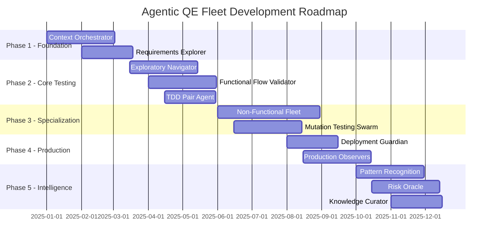

# Agentic QE Fleet: Agent Development Instructions

## Document Version: 1.0
## Framework: PACT-Based Agentic Quality Engineering
## Methodology: Context-Driven, RST, Holistic Testing

---

## Table of Contents

1. [Core Orchestration Layer](#core-orchestration-layer)
2. [Requirements & Design Phase Agents](#requirements--design-phase-agents)
3. [Development Phase Agents](#development-phase-agents)
4. [Testing Phase Agents](#testing-phase-agents)
5. [Deployment & Production Agents](#deployment--production-agents)
6. [Learning & Improvement Agents](#learning--improvement-agents)
7. [Collaboration & Reporting Layer](#collaboration--reporting-layer)

---

## Core Orchestration Layer

### 1. Context Orchestrator Agent

#### Purpose
Central intelligence hub that understands project context and dynamically adapts testing strategies based on contextual factors.

#### Core Responsibilities
- Analyze project context and constraints
- Route tasks to appropriate specialist agents
- Manage agent lifecycle and resource allocation
- Ensure alignment with stakeholder value definitions

#### Implementation Instructions

```python
class ContextOrchestratorAgent:
    """
    PACT Classification: Fully Autonomous (Level 4)
    Proactive: Anticipates testing needs based on context
    Autonomous: Self-manages agent coordination
    Collaborative: Interfaces with all other agents
    Targeted: Optimizes for stakeholder-defined quality
    """
    
    def __init__(self):
        self.context_model = {}
        self.agent_registry = {}
        self.quality_objectives = {}
        self.decision_history = []
```

#### Required Capabilities
1. **Context Analysis**
   - Parse project metadata (tech stack, team composition, domain)
   - Identify regulatory/compliance requirements
   - Assess team maturity and practices
   - Determine risk tolerance levels

2. **Strategy Selection**
   - Map context to testing strategies
   - Select appropriate heuristics from RST catalog
   - Configure agent behaviors based on context
   - Adjust coverage goals dynamically

3. **Resource Management**
   - Monitor agent resource consumption
   - Scale agents based on demand
   - Implement circuit breakers for resource protection
   - Optimize execution scheduling

#### Integration Points
- **Input**: Project configuration, stakeholder requirements, team preferences
- **Output**: Orchestration decisions, agent configurations, strategy recommendations
- **Dependencies**: All other agents, project management systems, CI/CD pipelines

#### Success Metrics
- Context recognition accuracy > 95%
- Agent routing efficiency (< 100ms decision time)
- Resource utilization optimization (> 80% efficiency)
- Stakeholder satisfaction with strategy alignment

#### Development Notes
- Implement using state machine pattern for context transitions
- Use rule engine for strategy selection (initially deterministic, evolve to ML)
- Maintain audit trail of all orchestration decisions
- Provide explainability for every routing decision

---

## Requirements & Design Phase Agents

### 2. Requirements Explorer Agent

#### Purpose
Proactively analyze requirements for ambiguity, testability, and completeness using RST heuristics.

#### Core Responsibilities
- Identify testability issues in requirements
- Generate risk assessments for each requirement
- Create exploratory testing charters
- Flag missing non-functional requirements

#### Implementation Instructions

```python
class RequirementsExplorerAgent:
    """
    PACT Classification: Collaborative (Level 3)
    Proactive: Identifies issues before development
    Autonomous: Analyzes requirements independently
    Collaborative: Works with human analysts
    Targeted: Focuses on testability and risk
    """
    
    def analyze_requirement(self, requirement):
        # Apply RST heuristics
        ambiguity_score = self.check_ambiguity(requirement)
        testability_score = self.assess_testability(requirement)
        risk_factors = self.identify_risks(requirement)
        return RequirementAnalysis(ambiguity_score, testability_score, risk_factors)
```

#### Required Capabilities
1. **Natural Language Processing**
   - Parse requirements in various formats (user stories, use cases, BDD)
   - Identify ambiguous language patterns
   - Extract testable assertions
   - Recognize missing context

2. **Heuristic Application**
   - CRUD heuristic (Create, Read, Update, Delete coverage)
   - SFDIPOT (Structure, Function, Data, Interfaces, Platform, Operations, Time)
   - FEW HICCUPPS (Familiar, Explainable, World, History, Image, Comparable, Claims, User's Desires, Product, Purpose, Statutes)
   - Risk catalogs application

3. **Test Charter Generation**
   - Create time-boxed exploration missions
   - Define areas of focus based on risk
   - Suggest testing personas
   - Propose testing tours (money tour, garbage collector tour, etc.)

#### Integration Points
- **Input**: Requirements documents, user stories, API specifications, design documents
- **Output**: Testability reports, risk heat maps, testing charters, improvement suggestions
- **Dependencies**: NLP libraries, requirements management tools, Context Orchestrator

#### Success Metrics
- Ambiguity detection rate > 90%
- Early defect prevention (requirements defects caught / total defects)
- Charter quality score (based on human tester feedback)
- Coverage of non-functional requirements > 95%

#### Development Notes
- Start with rule-based heuristics, evolve to ML-based pattern recognition
- Maintain a catalog of common requirement smells
- Implement feedback loop from actual defects to improve detection
- Use Few-shot learning with examples from your Test'RS Club materials

---

### 3. Design Challenger Agent

#### Purpose
Apply adversarial thinking to design decisions, questioning assumptions and identifying failure modes.

#### Core Responsibilities
- Challenge architectural decisions
- Identify potential failure modes
- Generate chaos engineering hypotheses
- Map design risks to production issues

#### Implementation Instructions

```python
class DesignChallengerAgent:
    """
    PACT Classification: Proactive (Level 3)
    Proactive: Anticipates design weaknesses
    Autonomous: Generates challenges independently
    Collaborative: Engages with architects
    Targeted: Focuses on resilience and reliability
    """
    
    def challenge_design(self, design_doc):
        failure_modes = self.fmea_analysis(design_doc)
        chaos_scenarios = self.generate_chaos_hypotheses(design_doc)
        architectural_risks = self.assess_architecture_risks(design_doc)
        return DesignChallenge(failure_modes, chaos_scenarios, architectural_risks)
```

#### Required Capabilities
1. **Failure Mode Analysis**
   - FMEA (Failure Mode and Effects Analysis)
   - Fault tree analysis
   - Single points of failure identification
   - Cascade failure prediction

2. **Chaos Engineering Planning**
   - Network partition scenarios
   - Resource exhaustion tests
   - Dependency failure simulations
   - Data corruption scenarios

3. **Architecture Assessment**
   - Coupling and cohesion analysis
   - Scalability bottleneck identification
   - Security surface analysis
   - Data consistency verification

#### Integration Points
- **Input**: Architecture diagrams, design documents, API contracts, infrastructure specs
- **Output**: Risk assessments, chaos test plans, architectural recommendations
- **Dependencies**: Architecture modeling tools, threat modeling frameworks

#### Success Metrics
- Failure mode prediction accuracy (validated in production)
- Chaos hypothesis value (issues found / hypotheses generated)
- Design improvement adoption rate
- Production incident prevention rate

#### Development Notes
- Implement domain-specific failure catalogs
- Use graph analysis for dependency mapping
- Integrate with threat modeling tools (STRIDE, PASTA)
- Learn from post-mortems to improve predictions

---

## Development Phase Agents

### 4. TDD Pair Agent

#### Purpose
Act as an intelligent pair programmer focused on test-first development, supporting both London and Chicago school TDD approaches.

#### Core Responsibilities
- Suggest test cases during red phase
- Identify missing edge cases
- Recommend refactoring opportunities
- Maintain test/code symmetry

#### Implementation Instructions

```python
class TDDPairAgent:
    """
    PACT Classification: Collaborative (Level 2)
    Proactive: Suggests tests before code
    Autonomous: Generates test cases independently
    Collaborative: Pairs with developers
    Targeted: Ensures test coverage and design quality
    """
    
    def suggest_next_test(self, current_tests, code_context):
        if self.detect_tdd_style() == "london":
            return self.suggest_mockist_test(current_tests, code_context)
        else:
            return self.suggest_state_based_test(current_tests, code_context)
```

#### Required Capabilities
1. **Test Generation**
   - Boundary value analysis
   - Equivalence partitioning
   - Property-based test suggestions
   - Example-based test creation

2. **TDD Flow Support**
   - Red phase: Suggest failing tests
   - Green phase: Validate minimal implementation
   - Refactor phase: Identify opportunities
   - Cycle tracking and metrics

3. **Style Adaptation**
   - London School: Mock generation, interaction testing
   - Chicago School: State verification, integration focus
   - Context-based style selection
   - Test isolation recommendations

#### Integration Points
- **Input**: Code context, existing tests, development environment
- **Output**: Test suggestions, refactoring recommendations, coverage reports
- **Dependencies**: IDE plugins, test frameworks, code analysis tools

#### Success Metrics
- Test suggestion acceptance rate > 70%
- Code coverage maintenance > 80%
- Refactoring success rate
- Developer satisfaction score

#### Development Notes
- Implement as IDE plugin initially
- Use AST analysis for code understanding
- Learn from accepted/rejected suggestions
- Support multiple testing frameworks (Jest, pytest, JUnit, etc.)

---

### 5. Mutation Testing Swarm

#### Purpose
Validate test suite effectiveness through intelligent code mutation and survival analysis.

#### Core Responsibilities
- Generate intelligent mutations
- Identify survived mutants
- Prioritize testing gaps
- Recommend test improvements

#### Implementation Instructions

```python
class MutationTestingSwarm:
    """
    PACT Classification: Autonomous (Level 3)
    Proactive: Identifies test weaknesses
    Autonomous: Runs mutation campaigns independently
    Collaborative: Coordinates multiple mutation agents
    Targeted: Focuses on test effectiveness
    """
    
    def spawn_mutation_agents(self, codebase, test_suite):
        agents = []
        for mutation_type in self.mutation_catalog:
            agent = MutationAgent(mutation_type)
            agents.append(agent)
        return self.coordinate_swarm(agents, codebase, test_suite)
```

#### Required Capabilities
1. **Mutation Generation**
   - Arithmetic operator mutations
   - Conditional boundary mutations
   - Return value mutations
   - Method call deletions
   - Domain-specific mutations

2. **Survival Analysis**
   - Track which mutants survive
   - Identify patterns in survivors
   - Map survivors to code regions
   - Calculate mutation score

3. **Test Enhancement**
   - Suggest tests to kill survivors
   - Identify redundant tests
   - Recommend assertion improvements
   - Generate mutation-killing tests

#### Integration Points
- **Input**: Source code, test suites, code coverage data
- **Output**: Mutation reports, test suggestions, quality metrics
- **Dependencies**: Build systems, test runners, coverage tools

#### Success Metrics
- Mutation score > 85%
- False positive rate < 5%
- Test improvement adoption rate
- Execution time optimization

#### Development Notes
- Start with standard mutation operators
- Implement intelligent mutation selection based on code patterns
- Use parallel execution for performance
- Learn from historical mutation results

---

## Testing Phase Agents

### 6. Exploratory Testing Navigator

#### Purpose
Autonomously explore application behavior to discover unknown unknowns using RST principles.

#### Core Responsibilities
- Generate and execute testing charters
- Document observations and questions
- Identify unusual patterns
- Report potential issues

#### Implementation Instructions

```python
class ExploratoryTestingNavigator:
    """
    PACT Classification: Autonomous (Level 4)
    Proactive: Seeks unknown issues
    Autonomous: Explores independently
    Collaborative: Shares findings with team
    Targeted: Risk-based exploration
    """
    
    def execute_session(self, charter, time_box):
        session = TestingSession(charter, time_box)
        while session.has_time():
            action = self.select_next_action(session.context)
            result = self.execute_action(action)
            session.record_observation(result)
            self.analyze_for_anomalies(result)
        return session.generate_report()
```

#### Required Capabilities
1. **Charter Execution**
   - Time-boxed session management
   - Dynamic path selection
   - State tracking
   - Observation recording

2. **Exploration Strategies**
   - Tours (money, garbage, landmark, etc.)
   - Persona-based testing
   - Time-based patterns
   - Data type variations

3. **Anomaly Detection**
   - Behavioral pattern recognition
   - Performance anomalies
   - UI inconsistencies
   - Data integrity issues

#### Integration Points
- **Input**: Application under test, risk areas, testing charters
- **Output**: Session reports, bug reports, test ideas, coverage maps
- **Dependencies**: Application interfaces, logging systems, monitoring tools

#### Success Metrics
- Unknown issue discovery rate
- Session productivity (issues/hour)
- False positive rate < 10%
- Coverage of risk areas > 90%

#### Development Notes
- Implement session recording and playback
- Use reinforcement learning for path optimization
- Maintain testing notebook with observations
- Learn from expert tester sessions

---

### 7. Functional Flow Validator

#### Purpose
Validate end-to-end business flows across system boundaries and microservices.

#### Core Responsibilities
- Construct operation dependency graphs
- Execute stateful scenarios
- Validate data consistency
- Test integration points

#### Implementation Instructions

```python
class FunctionalFlowValidator:
    """
    PACT Classification: Autonomous (Level 3)
    Proactive: Identifies flow issues
    Autonomous: Executes complex scenarios
    Collaborative: Coordinates across services
    Targeted: Business value validation
    """
    
    def validate_flow(self, flow_definition):
        dependency_graph = self.build_dependency_graph(flow_definition)
        test_sequence = self.generate_test_sequence(dependency_graph)
        state_manager = StateManager()
        
        for step in test_sequence:
            result = self.execute_step(step, state_manager)
            self.validate_assertions(result, step.expectations)
            state_manager.update(result)
        
        return FlowValidationReport(test_sequence, state_manager)
```

#### Required Capabilities
1. **Flow Modeling**
   - Dependency graph construction
   - State machine representation
   - Data flow analysis
   - Service interaction mapping

2. **Stateful Testing**
   - State extraction and injection
   - Transaction management
   - Rollback and recovery
   - Distributed transaction validation

3. **Cross-Service Validation**
   - API contract validation
   - Message queue verification
   - Database consistency checks
   - Event sourcing validation

#### Integration Points
- **Input**: Business flow definitions, API specifications, service maps
- **Output**: Flow validation reports, data inconsistencies, integration issues
- **Dependencies**: Service registries, API gateways, message brokers

#### Success Metrics
- Flow coverage > 95%
- Data consistency validation rate
- Integration issue detection rate
- Business rule validation accuracy

#### Development Notes
- Use semantic modeling for flow representation
- Implement distributed tracing integration
- Support multiple protocols (REST, GraphQL, gRPC)
- Learn optimal test data generation patterns

---

### 8. Non-Functional Guardian Fleet

A specialized sub-swarm for quality attributes testing.

#### 8.1 Performance Hunter

##### Implementation Instructions

```python
class PerformanceHunter:
    """
    Specialization: Performance bottleneck identification
    PACT Level: Autonomous (Level 3)
    """
    
    def hunt_bottlenecks(self, system_profile):
        load_pattern = self.generate_realistic_load(system_profile)
        metrics = self.execute_performance_test(load_pattern)
        bottlenecks = self.analyze_metrics(metrics)
        return PerformanceReport(bottlenecks, recommendations)
```

##### Required Capabilities
- Load pattern generation based on production profiles
- Resource utilization monitoring
- Response time analysis (percentiles, not just averages)
- Scalability testing and break point identification

#### 8.2 Security Sentinel

##### Implementation Instructions

```python
class SecuritySentinel:
    """
    Specialization: Proactive vulnerability detection
    PACT Level: Proactive (Level 4)
    """
    
    def scan_security(self, target):
        vulnerabilities = []
        vulnerabilities.extend(self.owasp_top10_scan(target))
        vulnerabilities.extend(self.authentication_tests(target))
        vulnerabilities.extend(self.injection_tests(target))
        return SecurityReport(vulnerabilities, risk_scores)
```

##### Required Capabilities
- OWASP Top 10 testing automation
- Authentication/authorization testing
- Injection attack simulation
- Sensitive data exposure detection

#### 8.3 Accessibility Advocate

##### Implementation Instructions

```python
class AccessibilityAdvocate:
    """
    Specialization: WCAG compliance and usability
    PACT Level: Collaborative (Level 2)
    """
    
    def validate_accessibility(self, ui_component):
        wcag_violations = self.check_wcag_compliance(ui_component)
        usability_issues = self.assess_usability(ui_component)
        return AccessibilityReport(wcag_violations, usability_issues)
```

##### Required Capabilities
- WCAG 2.1 AA/AAA validation
- Screen reader compatibility testing
- Keyboard navigation validation
- Color contrast analysis

#### 8.4 Resilience Challenger

##### Implementation Instructions

```python
class ResilienceChallenger:
    """
    Specialization: Chaos engineering and fault injection
    PACT Level: Proactive (Level 4)
    """
    
    def challenge_resilience(self, system):
        chaos_scenarios = self.generate_chaos_scenarios(system)
        for scenario in chaos_scenarios:
            result = self.inject_failure(scenario)
            recovery = self.measure_recovery(result)
            self.validate_graceful_degradation(result)
        return ResilienceReport(scenarios, recovery_metrics)
```

##### Required Capabilities
- Fault injection (network, resource, dependency)
- Recovery time measurement
- Graceful degradation validation
- Circuit breaker testing

---

## Deployment & Production Agents

### 9. Deployment Guardian Agent

#### Purpose
Ensure safe deployments through progressive validation and automated rollback decisions.

#### Core Responsibilities
- Generate deployment-specific tests
- Monitor canary deployments
- Analyze deployment metrics
- Trigger rollbacks when necessary

#### Implementation Instructions

```python
class DeploymentGuardianAgent:
    """
    PACT Classification: Proactive (Level 4)
    Proactive: Prevents bad deployments
    Autonomous: Makes rollback decisions
    Collaborative: Works with deployment systems
    Targeted: Zero-downtime deployments
    """
    
    def guard_deployment(self, deployment):
        smoke_tests = self.generate_smoke_tests(deployment.changes)
        canary_metrics = self.monitor_canary(deployment)
        
        if self.detect_regression(canary_metrics):
            self.trigger_rollback(deployment)
            return DeploymentResult.ROLLED_BACK
        
        return self.progressive_rollout(deployment)
```

#### Required Capabilities
1. **Smoke Test Generation**
   - Change-based test selection
   - Critical path validation
   - Configuration verification
   - Integration point checks

2. **Canary Analysis**
   - Statistical significance testing
   - Error rate comparison
   - Performance regression detection
   - Business metric validation

3. **Rollback Decision**
   - Automated rollback triggers
   - Partial rollback strategies
   - State preservation
   - Incident reporting

#### Integration Points
- **Input**: Deployment manifests, change logs, monitoring data
- **Output**: Deployment decisions, test results, rollback triggers
- **Dependencies**: CI/CD systems, monitoring platforms, feature flags

#### Success Metrics
- Deployment success rate > 99%
- Mean time to detection < 5 minutes
- False rollback rate < 1%
- Zero-downtime achievement rate

#### Development Notes
- Implement blue-green and canary strategies
- Use statistical analysis for metric comparison
- Integrate with feature flag systems
- Learn from deployment history

---

### 10. Production Observer Network

#### Purpose
Continuous production monitoring and learning through synthetic and real user monitoring.

#### Core Responsibilities
- Execute synthetic monitoring
- Detect anomalies in production
- Validate user journeys
- Correlate issues with test gaps

#### Implementation Instructions

```python
class ProductionObserverNetwork:
    """
    PACT Classification: Autonomous (Level 4)
    Proactive: Detects issues before user impact
    Autonomous: Self-organizing observer network
    Collaborative: Shares insights with test agents
    Targeted: Production quality assurance
    """
    
    def observe_production(self):
        observers = self.spawn_observers(self.production_topology)
        
        while True:
            observations = self.collect_observations(observers)
            anomalies = self.detect_anomalies(observations)
            self.validate_user_journeys()
            self.update_test_recommendations(anomalies)
```

#### Required Capabilities
1. **Synthetic Monitoring**
   - Critical user journey execution
   - API endpoint monitoring
   - Performance baseline tracking
   - Availability checking

2. **Anomaly Detection**
   - Statistical anomaly detection
   - Pattern recognition
   - Predictive analysis
   - Root cause analysis

3. **Learning Integration**
   - Test gap identification
   - Feedback to test generation
   - Pattern library updates
   - Risk model refinement

#### Integration Points
- **Input**: Production metrics, user analytics, error logs, traces
- **Output**: Anomaly alerts, test recommendations, quality reports
- **Dependencies**: APM tools, logging systems, analytics platforms

#### Success Metrics
- Mean time to detection < 2 minutes
- False positive rate < 5%
- User journey coverage > 95%
- Test gap closure rate

#### Development Notes
- Implement adaptive thresholds
- Use time-series analysis for patterns
- Integrate with distributed tracing
- Learn from incident responses

---

## Learning & Improvement Agents

### 11. Pattern Recognition Sage

#### Purpose
Identify patterns across the entire testing lifecycle to improve overall system intelligence.

#### Core Responsibilities
- Identify failure patterns
- Suggest optimizations
- Learn from incidents
- Build knowledge graphs

#### Implementation Instructions

```python
class PatternRecognitionSage:
    """
    PACT Classification: Autonomous (Level 4)
    Proactive: Anticipates patterns
    Autonomous: Self-learning system
    Collaborative: Shares wisdom across fleet
    Targeted: Continuous improvement
    """
    
    def recognize_patterns(self, historical_data):
        failure_patterns = self.analyze_failure_patterns(historical_data)
        test_effectiveness = self.measure_test_effectiveness()
        optimization_opportunities = self.identify_optimizations()
        knowledge_graph = self.update_knowledge_graph(patterns)
        
        return PatternInsights(failure_patterns, optimizations, knowledge_graph)
```

#### Required Capabilities
1. **Pattern Analysis**
   - Failure clustering
   - Root cause patterns
   - Test effectiveness correlation
   - Performance trends

2. **Knowledge Management**
   - Knowledge graph construction
   - Pattern cataloging
   - Insight generation
   - Wisdom preservation

3. **Optimization Recommendation**
   - Test suite optimization
   - Resource allocation
   - Coverage improvement
   - Execution optimization

#### Integration Points
- **Input**: Historical test data, production incidents, performance metrics
- **Output**: Pattern insights, optimization recommendations, knowledge updates
- **Dependencies**: Data warehouse, ML platforms, graph databases

#### Success Metrics
- Pattern prediction accuracy > 85%
- Optimization value delivered
- Knowledge reuse rate
- Learning curve improvement

#### Development Notes
- Implement incremental learning
- Use graph neural networks for pattern detection
- Build domain-specific pattern catalogs
- Create feedback loops for validation

---

### 12. Risk Oracle Agent

#### Purpose
Predictive risk assessment and intelligent test prioritization based on comprehensive risk analysis.

#### Core Responsibilities
- Calculate risk scores
- Prioritize test execution
- Predict failure likelihood
- Recommend mitigations

#### Implementation Instructions

```python
class RiskOracleAgent:
    """
    PACT Classification: Proactive (Level 4)
    Proactive: Predicts future risks
    Autonomous: Self-calculating risk models
    Collaborative: Informs all testing decisions
    Targeted: Risk-based testing optimization
    """
    
    def assess_risk(self, change_context):
        code_risk = self.analyze_code_changes(change_context)
        historical_risk = self.check_historical_patterns(change_context)
        dependency_risk = self.assess_dependencies(change_context)
        business_impact = self.calculate_business_impact(change_context)
        
        return RiskAssessment(
            risk_score=self.calculate_composite_risk(),
            test_priorities=self.prioritize_tests(),
            mitigations=self.recommend_mitigations()
        )
```

#### Required Capabilities
1. **Risk Calculation**
   - Code complexity analysis
   - Change impact assessment
   - Historical failure correlation
   - Business criticality scoring

2. **Prediction Models**
   - Failure likelihood prediction
   - Defect density estimation
   - Performance impact prediction
   - Security vulnerability assessment

3. **Prioritization Engine**
   - Test case prioritization
   - Resource allocation
   - Execution scheduling
   - Coverage optimization

#### Integration Points
- **Input**: Code changes, historical data, business context, dependencies
- **Output**: Risk scores, test priorities, mitigation plans
- **Dependencies**: Version control, static analysis, business systems

#### Success Metrics
- Risk prediction accuracy > 80%
- High-risk issue catch rate > 95%
- Test optimization efficiency
- Business impact prevention

#### Development Notes
- Start with rule-based risk assessment
- Evolve to ML-based prediction
- Integrate business impact metrics
- Learn from production incidents

---

## Collaboration & Reporting Layer

### 13. Quality Storyteller Agent

#### Purpose
Translate technical testing findings into meaningful narratives for different stakeholders.

#### Core Responsibilities
- Generate stakeholder-specific reports
- Create quality dashboards
- Produce trend analyses
- Facilitate quality discussions

#### Implementation Instructions

```python
class QualityStorytellerAgent:
    """
    PACT Classification: Collaborative (Level 2)
    Proactive: Anticipates information needs
    Autonomous: Generates reports independently
    Collaborative: Tailors to audience
    Targeted: Stakeholder value communication
    """
    
    def tell_quality_story(self, audience_type, data):
        narrative = self.create_narrative(audience_type, data)
        visualizations = self.generate_visualizations(audience_type, data)
        recommendations = self.tailor_recommendations(audience_type)
        
        return QualityStory(narrative, visualizations, recommendations)
```

#### Required Capabilities
1. **Narrative Generation**
   - Executive summaries
   - Technical deep-dives
   - Trend explanations
   - Risk communications

2. **Visualization Creation**
   - Dashboard generation
   - Trend charts
   - Heat maps
   - Risk matrices

3. **Audience Adaptation**
   - Language adjustment
   - Detail level selection
   - Metric translation
   - Context provision

#### Integration Points
- **Input**: Test results, metrics, trends, incidents
- **Output**: Reports, dashboards, presentations, alerts
- **Dependencies**: BI tools, communication platforms, documentation systems

#### Success Metrics
- Stakeholder satisfaction > 90%
- Report clarity score
- Action item adoption rate
- Communication effectiveness

#### Development Notes
- Use NLG for report generation
- Implement interactive dashboards
- Learn from stakeholder feedback
- Support multiple output formats

---

### 14. Knowledge Curator Agent

#### Purpose
Maintain and evolve institutional testing knowledge, making it accessible and actionable.

#### Core Responsibilities
- Document testing patterns
- Maintain knowledge base
- Share relevant context
- Facilitate knowledge transfer

#### Implementation Instructions

```python
class KnowledgeCuratorAgent:
    """
    PACT Classification: Collaborative (Level 3)
    Proactive: Captures knowledge continuously
    Autonomous: Organizes knowledge independently
    Collaborative: Shares across teams
    Targeted: Organizational learning
    """
    
    def curate_knowledge(self, new_learning):
        categorized = self.categorize_learning(new_learning)
        validated = self.validate_with_existing(categorized)
        indexed = self.index_for_retrieval(validated)
        
        self.update_knowledge_base(indexed)
        self.notify_relevant_teams(indexed)
        
        return KnowledgeUpdate(indexed, recommendations)
```

#### Required Capabilities
1. **Knowledge Capture**
   - Pattern documentation
   - Heuristic recording
   - Lesson extraction
   - Context preservation

2. **Knowledge Organization**
   - Taxonomic classification
   - Semantic indexing
   - Relationship mapping
   - Version control

3. **Knowledge Sharing**
   - Contextual retrieval
   - Proactive suggestions
   - Cross-project learning
   - Training material generation

#### Integration Points
- **Input**: Test results, patterns, incidents, team feedback
- **Output**: Knowledge articles, training materials, best practices
- **Dependencies**: Knowledge management systems, wikis, training platforms

#### Success Metrics
- Knowledge reuse rate > 60%
- Search effectiveness > 90%
- Cross-team learning instances
- Time to competency reduction

#### Development Notes
- Implement semantic search
- Use knowledge graphs for relationships
- Create learning paths
- Build feedback mechanisms

---

## Implementation Guidelines

### Technology Stack Recommendations

```yaml
Core Technologies:
  Language: Python 3.10+ / Rust (performance-critical components)
  ML Framework: PyTorch / TensorFlow
  NLP: Hugging Face Transformers
  Orchestration: Apache Airflow / Prefect
  Message Queue: RabbitMQ / NATS
  Storage: PostgreSQL + Vector DB (Pinecone/Weaviate)
  Observability: OpenTelemetry + Prometheus + Grafana

Agent Framework:
  Base: LangChain / AutoGen / Custom PACT implementation
  Communication: gRPC / REST APIs
  State Management: Redis / etcd
  Deployment: Kubernetes / Docker Swarm
```

### Development Phases



### Success Criteria

Each agent must meet these baseline criteria before production deployment:

1. **Explainability**: Every decision must have a traceable reasoning chain
2. **Performance**: Response time < 500ms for real-time agents
3. **Accuracy**: Domain-specific accuracy targets (defined per agent)
4. **Reliability**: 99.9% uptime for critical path agents
5. **Scalability**: Horizontal scaling capability
6. **Security**: Zero trust architecture compliance
7. **Observability**: Full telemetry and monitoring
8. **Human Override**: Manual intervention capability at all times

### Integration Patterns

```python
# Standard Agent Interface
class AgenticQEAgent(ABC):
    @abstractmethod
    def perceive(self, context: Context) -> Observation:
        """Gather information from environment"""
        pass
    
    @abstractmethod
    def decide(self, observation: Observation) -> Decision:
        """Make decision based on observation"""
        pass
    
    @abstractmethod
    def act(self, decision: Decision) -> Action:
        """Execute action based on decision"""
        pass
    
    @abstractmethod
    def explain(self, action: Action) -> Explanation:
        """Provide reasoning for action taken"""
        pass
    
    @abstractmethod
    def learn(self, feedback: Feedback) -> None:
        """Update internal model based on feedback"""
        pass
```

---

## Appendix: PACT Classification Reference

| Level | Name | Characteristics | Example Agents |
|-------|------|-----------------|----------------|
| 1 | Reactive | Simple stimulus-response | Basic validators |
| 2 | Collaborative | Human-in-the-loop | TDD Pair, Storyteller |
| 3 | Autonomous | Independent operation | Exploratory Navigator |
| 4 | Fully Autonomous | Self-directed, learning | Context Orchestrator, Risk Oracle |

---

## Version Control

- **Version**: 1.0
- **Date**: November 2024
- **Author**: Dragan Spiridonov
- **Framework**: Agentic QE with PACT Principles
- **Based on**: RST, Context-Driven Testing, Holistic Testing Model

---

## Next Steps

1. Select pilot agent for initial implementation
2. Set up development environment with recommended stack
3. Implement base agent framework with PACT principles
4. Create evaluation framework for agent effectiveness
5. Begin iterative development following roadmap
6. Establish feedback loops with development teams
7. Document patterns and learnings for Test'RS Club community

---

*"Without testing, orchestration is theater. Without context, testing is cargo cult. With both, we achieve quality."* - Agentic QE Manifesto
