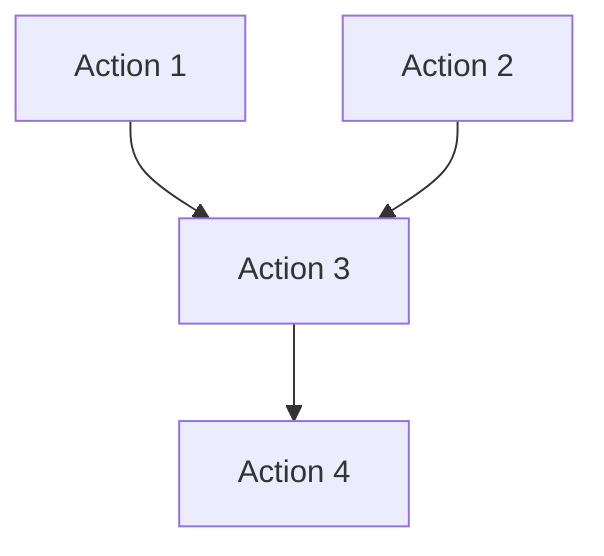

# Agentic Plans & Analysis

This directory contains Goal-Oriented Action Plans (GOAP) and technical analysis for complex multi-agent tasks in the Agentic QE Fleet.

---

## 📋 Active Plans

### RuVector Integration Fix
- **Plan:** [ruvector-integration-goap-plan.md](./ruvector-integration-goap-plan.md)
- **Analysis:** [ruvector-technical-analysis.md](./ruvector-technical-analysis.md)
- **Status:** ⏳ Ready for Execution
- **Priority:** P0 (Critical - False claims + Dead code)
- **Estimated Duration:** 8-12 hours
- **Agents Required:** 8 (coder, tester, reviewer, documentation specialist)

**Quick Start:**
```bash
# Execute with Claude Code
claude "Execute the RuVector integration GOAP plan in docs/agentics/ruvector-integration-goap-plan.md"

# Or with claude-flow
npx claude-flow sparc tdd "Fix RuVector integration using GOAP plan"
```

**Issues Addressed:**
1. ❌ Dead code in CoverageAnalyzerAgent (43+ lines unreachable)
2. ❌ False performance claims in README ("150x faster" not working)
3. ❌ Docker service requirements completely undocumented
4. ❌ Integration tests disable RuVector to avoid external dependencies
5. ❌ QualityGateAgent claims integration but never uses it

---

## 🎯 GOAP Methodology

### What is GOAP?

Goal-Oriented Action Planning (GOAP) is an AI planning technique that:

1. **Defines State Space:** Current state → Goal state
2. **Plans Action Sequences:** Optimal path through state transitions
3. **Considers Preconditions:** What must be true before each action
4. **Models Effects:** How each action changes state
5. **Optimizes Path:** Finds shortest/cheapest route to goal

### Why GOAP for Multi-Agent Systems?

**Traditional Approach:**
```
Task → Agent 1 → Agent 2 → Agent 3 → Done
(sequential, rigid, no adaptation)
```

**GOAP Approach:**
```
Goal → State Analysis → Action Planning → Agent Assignment → Execution → Verification
(parallel, adaptive, optimized)
```

**Benefits:**
- ✅ **Parallel Execution:** Actions run concurrently when dependencies allow
- ✅ **Dynamic Replanning:** Adapts to failures and changing conditions
- ✅ **Optimal Paths:** A* search finds efficient action sequences
- ✅ **Clear Preconditions:** Dependencies explicit, no hidden assumptions
- ✅ **Verifiable Effects:** Each action has measurable outcomes

---

## 🏗️ Plan Structure

Each GOAP plan contains:

### 1. State Space Definition
```typescript
CurrentState: {
  field: { status, metrics, state }
}
GoalState: {
  field: { target_status, target_metrics, desired_state }
}
```

### 2. Action Sequence
```typescript
Action {
  name: string;
  preconditions: StateCondition[];
  effects: StateChange[];
  agent: AgentType;
  duration: number;
  complexity: 'low' | 'medium' | 'high';
  verification: VerificationCriteria[];
}
```

### 3. Agent Assignments
| Task | Primary Agent | Backup Agent | Rationale |
|------|---------------|--------------|-----------|
| ... | ... | ... | ... |

### 4. Verification Criteria
- [ ] Observable outcome
- [ ] Measurable metric
- [ ] Testable condition

### 5. Dependencies Graph


---

## 🚀 Execution Patterns

### Pattern 1: Claude Code Direct
```bash
# Read plan and execute with Claude
claude "Read and execute the GOAP plan in docs/agentics/ruvector-integration-goap-plan.md"
```

**Advantages:**
- Single command execution
- Claude orchestrates all agents
- Natural language task descriptions

### Pattern 2: Claude-Flow Orchestration
```bash
# Use claude-flow for structured execution
npx claude-flow sparc tdd "Fix RuVector integration using GOAP plan"
```

**Advantages:**
- SPARC methodology integration
- Progress tracking
- Automatic verification gates

### Pattern 3: MCP Tools (Advanced)
```javascript
// Initialize swarm
mcp__claude-flow__swarm_init({
  topology: "hierarchical",
  maxAgents: 8
})

// Spawn agents
mcp__claude-flow__agent_spawn({ type: "coder" })
mcp__claude-flow__agent_spawn({ type: "tester" })

// Orchestrate task
mcp__claude-flow__task_orchestrate({
  task: { type: "comprehensive-testing" },
  strategy: "adaptive"
})
```

**Advantages:**
- Fine-grained control
- Real-time monitoring
- Advanced coordination

---

## 📊 Progress Tracking

### Execution Status

| Plan | Status | Progress | Duration | Last Updated |
|------|--------|----------|----------|--------------|
| RuVector Integration | ⏳ Ready | 0% | 0h / 12h | 2025-12-18 |

### Verification Gates

Each plan has verification criteria that must pass before proceeding:

```typescript
Phase {
  name: string;
  verificationCriteria: Criterion[];
  gateCondition: 'all-pass' | 'critical-pass' | 'majority-pass';
}
```

**Example:**
- ✅ Phase 1 Complete (Investigation done)
- ⏳ Phase 2 In Progress (Code fixes ongoing)
- ⏸️ Phase 3 Blocked (Waiting for Phase 2)

---

## 🔧 Creating New Plans

### Template Structure

```markdown
# GOAP Plan: [Task Name]

## State Space
- Current State: { ... }
- Goal State: { ... }

## Actions
1. Action Name
   - Preconditions: [...]
   - Effects: [...]
   - Agent: [agent-type]
   - Duration: [estimate]
   - Verification: [...]

## Agent Assignments
| Task | Agent | Rationale |
|------|-------|-----------|

## Dependencies
[Dependency graph]

## Verification
- [ ] Criterion 1
- [ ] Criterion 2

## Execution
```bash
# Command to execute
```
```

### Best Practices

1. **State-First Design:** Define states before actions
2. **Clear Preconditions:** No implicit dependencies
3. **Measurable Effects:** Observable outcomes only
4. **Agent Capabilities:** Match task to agent expertise
5. **Verification Gates:** Don't proceed on failures
6. **Rollback Plans:** Define failure recovery

---

## 🧪 Testing Plans

Before executing:

### 1. Dry Run
```bash
# Validate plan structure
aqe validate-plan docs/agentics/ruvector-integration-goap-plan.md
```

### 2. Precondition Check
```bash
# Verify environment meets preconditions
aqe check-preconditions docs/agentics/ruvector-integration-goap-plan.md
```

### 3. Simulation
```bash
# Simulate execution (no actual changes)
aqe simulate-plan docs/agentics/ruvector-integration-goap-plan.md
```

---

## 📈 Metrics & Analytics

### Plan Effectiveness

Track these metrics for each plan:

- **Completion Rate:** % of actions completed successfully
- **Time Accuracy:** Actual duration vs estimated
- **Replanning Events:** How often plan needed adjustment
- **Verification Pass Rate:** % of gates passed first time
- **Agent Utilization:** Idle time vs active time

### Success Criteria

A plan is successful when:
- ✅ All verification criteria passed
- ✅ Goal state achieved
- ✅ No critical failures
- ✅ Within 150% of estimated duration
- ✅ All agents terminated cleanly

---

## 🤝 Contributing

### Adding New Plans

1. Create plan in `docs/agentics/[name]-goap-plan.md`
2. Create analysis in `docs/agentics/[name]-technical-analysis.md`
3. Update this README with plan summary
4. Submit PR with:
   - Plan document
   - Technical analysis
   - Execution examples
   - Success criteria

### Plan Review Checklist

- [ ] State space clearly defined
- [ ] All preconditions explicit
- [ ] Effects measurable
- [ ] Agent assignments justified
- [ ] Dependencies visualized
- [ ] Verification criteria testable
- [ ] Rollback plan exists
- [ ] Execution commands provided

---

## 🔗 Related Documentation

- [SPARC Methodology](../architecture/sparc-methodology.md)
- [Agent Capabilities](../reference/agents.md)
- [Claude-Flow Integration](../integration/claude-flow.md)
- [Swarm Coordination](../architecture/swarm-coordination.md)

---

## 📞 Support

- **Issues:** [GitHub Issues](https://github.com/proffesor-for-testing/agentic-qe/issues)
- **Discussions:** [GitHub Discussions](https://github.com/proffesor-for-testing/agentic-qe/discussions)
- **Chat:** [Discord](https://discord.gg/agentic-qe)

---

**Maintained By:** Agentic QE Fleet Team
**Last Updated:** 2025-12-18
**Version:** 1.0.0
