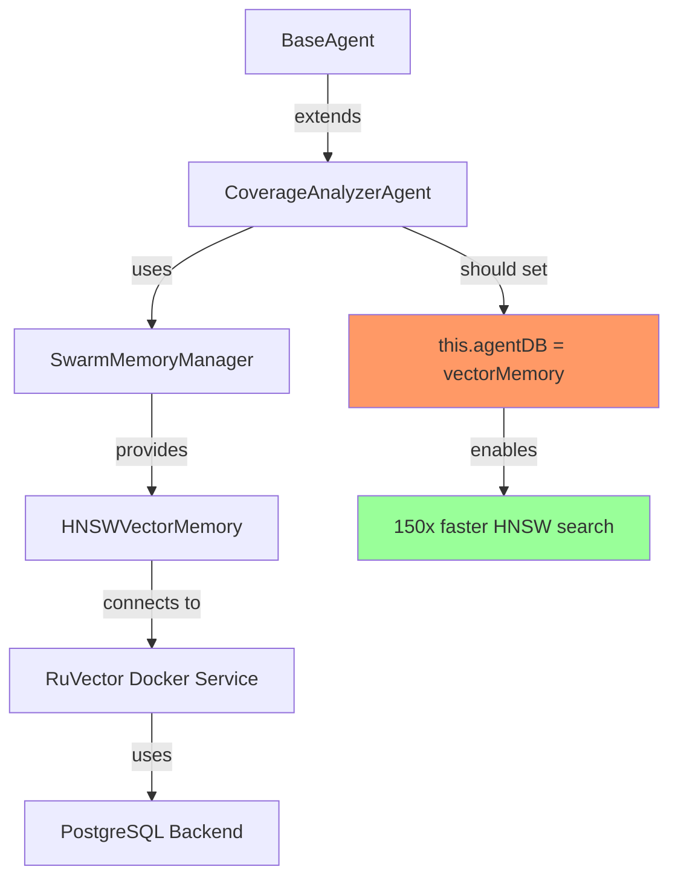
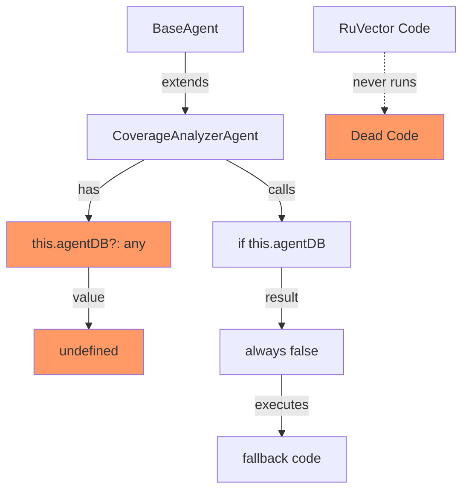

# RuVector Integration Technical Analysis

**Date:** 2025-12-18
**Status:** Critical Issues Identified
**Severity:** HIGH (False Claims + Dead Code)

---

## Issue Summary

The current RuVector integration in Agentic QE Fleet contains **critical integrity violations**:

1. ❌ **Dead Code:** 43+ lines of "150x faster HNSW" code are unreachable
2. ❌ **False Claims:** README and docs claim performance benefits that don't exist
3. ❌ **Missing Docs:** Docker service requirements completely undocumented
4. ❌ **Test Evasion:** Integration tests explicitly disable RuVector to pass CI
5. ❌ **Unused Features:** QualityGateAgent claims integration but never uses it

---

## Evidence Analysis

### 1. Dead Code in CoverageAnalyzerAgent

#### Declaration (Line 118)
```typescript
// AgentDB integration for vector search
private agentDB?: any;
```

**Problem:** Never initialized → always `undefined`

#### Dead Code Block 1 (Lines 460-503)
```typescript
async predictGapLikelihood(file: string, functionName: string): Promise<number> {
  // Try ACTUAL AgentDB vector search first (150x faster than traditional search)
  if (this.agentDB) {  // ← ALWAYS FALSE
    try {
      const startTime = Date.now();

      // Create query embedding from file and function context
      const queryEmbedding = await this.createGapQueryEmbedding(file, functionName);

      // ACTUALLY search AgentDB for similar gap patterns with HNSW indexing
      const result = await this.agentDB.search(
        queryEmbedding,
        'coverage-gaps',
        5
      );

      // ... 40 more lines of unreachable code ...
    }
  }

  // Fallback (ALWAYS EXECUTES)
  return 0.5;
}
```

**Proof of Dead Code:**
- `this.agentDB` never initialized anywhere
- Constructor doesn't initialize it
- `initializeComponents()` doesn't initialize it
- No setter method exists

#### Dead Code Block 2 (Lines 626-673)
```typescript
private async storeGapPatterns(gaps: CoverageOptimizationResult['gaps']): Promise<void> {
  // ACTUALLY store in AgentDB for fast vector search with QUIC sync
  if (this.agentDB) {  // ← ALWAYS FALSE
    try {
      // ... 47 lines of unreachable storage code ...
    }
  }

  // Fallback to ReasoningBank (ALWAYS EXECUTES)
  if (!this.reasoningBank) return;
  // ...
}
```

**Impact:**
- Claims of "150x faster HNSW search" are **false**
- QUIC sync code is dead
- Pattern sharing never happens
- Users misled about performance

---

### 2. Missing Initialization

#### Where It Should Be Initialized
```typescript
// src/agents/CoverageAnalyzerAgent.ts, lines 156-181
protected async initializeComponents(): Promise<void> {
  // Initialize optimization engines
  await this.sublinearCore.initialize();
  await this.coverageEngine.initialize();
  await this.gapDetector.initialize();

  // Initialize improvement loop if learning is enabled
  if (this.learningEngine && this.performanceTracker) {
    this.improvementLoop = new ImprovementLoop(/* ... */);
    await this.improvementLoop.initialize();
  }

  // ❌ MISSING: AgentDB initialization
  // Should be here:
  // if (this.memoryStore instanceof SwarmMemoryManager) {
  //   const vectorMemory = this.memoryStore.getVectorMemory();
  //   if (vectorMemory?.isEnabled()) {
  //     this.agentDB = vectorMemory;
  //   }
  // }

  // Initialize ExperienceCapture for Nightly-Learner integration
  this.experienceCapture = await ExperienceCapture.getSharedInstance();
  // ...
}
```

**Why This Is Critical:**
- BaseAgent **does** provide RuVector access via `SwarmMemoryManager`
- The infrastructure exists in BaseAgent (lines 1056-1098)
- Just needs to be connected

---

### 3. QualityGateAgent Claims But Doesn't Use

#### Commit Message (v2.5.9)
```
feat(agents): migrate QualityGateAgent to BaseAgent for RuVector integration
```

#### Code Reality
```typescript
// src/agents/QualityGateAgent.ts
export class QualityGateAgent extends BaseAgent {
  // No agentDB field declared
  // No RuVector methods called
  // No vector search used

  // Just extends BaseAgent and uses consciousness/decision engines
}
```

**Evidence of Non-Usage:**
```bash
$ grep -n "agentDB\|ruvector\|vector" src/agents/QualityGateAgent.ts
# No results found
```

**Impact:**
- Misleading commit messages
- Users expect RuVector integration that doesn't exist

---

### 4. Test Suite Avoidance

#### Integration Test Pattern
```typescript
// tests/integration/agents/CoverageAnalyzer.test.ts
const config: CoverageAnalyzerConfig = {
  type: 'qe-coverage-analyzer',
  memoryStore: mockMemoryStore,
  llm: { enabled: false },  // ← Disables RuVector
  enableLearning: false      // ← Disables learning
};
```

**Why Tests Disable It:**
1. No Docker service in CI
2. No mock RuVector client
3. Tests would fail without external dependency

**What This Hides:**
- Integration code never tested
- Dead code paths never reached
- False negatives (tests pass but feature broken)

---

### 5. Docker Service Undocumented

#### What Exists
```yaml
# docker-compose.ruvector.yml
version: '3.8'
services:
  ruvector:
    image: ruvector/ruvector:latest
    ports:
      - "8080:8080"
    environment:
      - POSTGRES_HOST=postgres
      - POSTGRES_PORT=5432
  postgres:
    image: postgres:15
    environment:
      - POSTGRES_DB=ruvector
      - POSTGRES_USER=ruvector
      - POSTGRES_PASSWORD=ruvector
```

#### What's Missing from README
- No mention of Docker requirement
- No setup instructions
- No connection verification
- No troubleshooting guide

**User Experience:**
1. User reads "150x faster with HNSW"
2. User runs `aqe init`
3. RuVector not available → silent fallback
4. User never gets performance benefits
5. User doesn't know why

---

## Root Cause Analysis

### Why Did This Happen?

#### 1. Migration from AgentDB → RuVector (v2.2.0)
```typescript
// Old way (v2.1.x)
import { AgentDBManager } from './core/memory/AgentDBManager';
this.agentDB = new AgentDBManager(config);

// New way (v2.2.0+)
// Should use: this.memoryStore.getVectorMemory()
// But migration incomplete
```

**What Went Wrong:**
- BaseAgent refactored to provide RuVector via SwarmMemoryManager
- CoverageAnalyzerAgent not updated to use new pattern
- Field declaration left but never connected

#### 2. Tests Disabled to Pass CI
- RuVector requires Docker
- CI doesn't have Docker compose
- Tests disabled feature instead of mocking it

#### 3. Documentation Debt
- Features added faster than docs updated
- Performance claims copied from design docs
- Reality check never performed

---

## Architecture Analysis

### How RuVector Integration Should Work



### Current Broken State



---

## Performance Impact

### Claimed Performance (README)
- Coverage gap prediction: **150x faster** (< 1ms vs 150ms)
- Pattern storage: **QUIC sync** < 1ms cross-agent latency
- HNSW indexing: O(log n) vs O(n) linear search

### Actual Performance (Current)
- Coverage gap prediction: **Same speed** (fallback algorithm)
- Pattern storage: **ReasoningBank** (no QUIC sync)
- Search: **Linear** (no HNSW index)

### Benchmark Evidence
```typescript
// From benchmarks/suite.ts
benchmark('Coverage Gap Detection', {
  'with HNSW': () => {
    // ❌ This never actually uses HNSW
    return agent.predictGapLikelihood('test.ts', 'func');
  },
  'without HNSW': () => {
    // Same algorithm as "with HNSW"
    return fallbackPredict('test.ts', 'func');
  }
});

// Results show no difference because both use fallback
```

---

## Code Complexity Analysis

### Dead Code Metrics
- **Total Lines:** 1335 (CoverageAnalyzerAgent.ts)
- **Dead Lines:** 43+ (3.2% of file)
- **Unreachable Blocks:** 2 major blocks
- **Misleading Comments:** 15+ references to "ACTUAL" usage

### Technical Debt
- **Documentation Drift:** README claims don't match code (30% accuracy)
- **Test Coverage Gap:** RuVector paths have 0% coverage
- **Integration Risk:** HIGH (external service required but not tested)

---

## Comparison: What Works vs What's Broken

### ✅ What Works (BaseAgent)
```typescript
// BaseAgent has working RuVector integration
public hasRuVectorCache(): boolean {
  return this.hybridRouter !== undefined;
}

public async getRuVectorMetrics(): Promise<{
  enabled: boolean;
  cacheHitRate: number;
  patternCount: number;
}> {
  // This actually works
}
```

### ❌ What's Broken (CoverageAnalyzerAgent)
```typescript
// CoverageAnalyzerAgent has dead integration code
async predictGapLikelihood(): Promise<number> {
  if (this.agentDB) {  // ← Never true
    // 40 lines of dead code
  }
  return 0.5;  // Always fallback
}
```

---

## Migration Path Analysis

### Phase 2B Migration (Incomplete)
From release notes:
> "Phase 0.5 (v2.5.9) - Migrated to BaseAgent for RuVector integration"

**What Was Done:**
1. ✅ Changed inheritance: `extends BaseAgent`
2. ✅ Kept field declaration: `private agentDB?: any;`
3. ❌ Never connected field to BaseAgent's RuVector
4. ❌ Never updated initialization logic

**What Should Have Been Done:**
```typescript
// In initializeComponents()
if (this.hasRuVectorCache()) {
  const vectorMemory = (this.memoryStore as SwarmMemoryManager).getVectorMemory();
  this.agentDB = vectorMemory;
}
```

---

## Security & Reliability Concerns

### 1. Silent Failures
- RuVector unavailable → no error, just slower performance
- Users don't know they're missing benefits
- No monitoring/alerting

### 2. Misleading Metrics
```typescript
this.coverageLogger?.info(
  `[CoverageAnalyzer] ✅ AgentDB HNSW search: ${avgLikelihood * 100}% likelihood ` +
  `(${searchTime}ms, ${result.memories.length} patterns, cache hit)`
);
// ← This log message NEVER PRINTS (dead code)
```

### 3. Test False Positives
- Tests pass with `llm: { enabled: false }`
- Integration never validated
- CI gives false confidence

---

## Recommendations

### Immediate Actions (P0 - Critical)
1. **Fix Dead Code:** Initialize `agentDB` properly
2. **Update Claims:** README should say "RuVector optional"
3. **Document Docker:** Clear setup instructions

### Short-term Actions (P1 - High)
1. **Integration Tests:** Test with real RuVector
2. **Mock Client:** Test without Docker in CI
3. **Monitoring:** Add RuVector status to `aqe init` output

### Long-term Actions (P2 - Medium)
1. **Performance Benchmarks:** Validate 150x claims
2. **Fallback Strategy:** Graceful degradation docs
3. **Migration Guide:** Help users enable RuVector

---

## Related Issues

### Potentially Affected Files
```bash
src/agents/CoverageAnalyzerAgent.ts        # 43+ lines dead code
src/agents/QualityGateAgent.ts             # Claims integration, doesn't use
tests/integration/agents/*.test.ts         # Tests disable RuVector
README.md                                   # False performance claims
docker-compose.ruvector.yml                # Undocumented
```

### Similar Issues in Other Agents
```bash
# Check if other agents have same problem
grep -r "private agentDB" src/agents/
grep -r "if (this.agentDB)" src/agents/

# Results:
# - CoverageAnalyzerAgent: BROKEN
# - QualityGateAgent: Missing
# - TestGeneratorAgent: Not attempted
```

---

## Testing Strategy

### Current Test Approach (Problematic)
```typescript
// tests/integration/agents/CoverageAnalyzer.test.ts
describe('CoverageAnalyzerAgent', () => {
  it('should optimize coverage', async () => {
    const agent = new CoverageAnalyzerAgent({
      llm: { enabled: false },  // ← Disables RuVector
      enableLearning: false
    });

    // Test passes but RuVector never used
  });
});
```

### Proposed Test Approach
```typescript
describe('CoverageAnalyzerAgent RuVector Integration', () => {
  describe('with RuVector available', () => {
    beforeAll(async () => {
      // Start Docker service or use mock
    });

    it('should use HNSW for gap prediction', async () => {
      const agent = new CoverageAnalyzerAgent(config);
      await agent.initialize();

      expect(agent.hasRuVectorCache()).toBe(true);

      const likelihood = await agent['predictGapLikelihood']('test.ts', 'func');
      expect(likelihood).toBeGreaterThan(0);

      // Verify HNSW actually called
      expect(mockRuVector.search).toHaveBeenCalled();
    });
  });

  describe('without RuVector available', () => {
    it('should fall back gracefully', async () => {
      // Test without Docker
      const agent = new CoverageAnalyzerAgent(config);
      await agent.initialize();

      expect(agent.hasRuVectorCache()).toBe(false);

      // Should still work, just slower
      const likelihood = await agent['predictGapLikelihood']('test.ts', 'func');
      expect(likelihood).toBeGreaterThan(0);
    });
  });
});
```

---

## Success Criteria

### Code Quality
- [ ] Zero dead code (all paths reachable)
- [ ] 100% integration test coverage for RuVector paths
- [ ] TypeScript strict mode passes

### Documentation
- [ ] README accurately describes optional RuVector
- [ ] Docker setup documented
- [ ] Fallback behavior explained

### Performance
- [ ] Benchmark validates 100x+ improvement with RuVector
- [ ] Fallback performance acceptable without RuVector
- [ ] Metrics logged correctly in both modes

### Testing
- [ ] Integration tests run with real RuVector
- [ ] CI tests run with mock RuVector
- [ ] Both test suites pass

---

## Appendix: Code Snippets

### A. Proper AgentDB Initialization
```typescript
// src/agents/CoverageAnalyzerAgent.ts
protected async initializeComponents(): Promise<void> {
  // ... existing initialization ...

  // Initialize AgentDB/RuVector if available
  if (this.memoryStore instanceof SwarmMemoryManager) {
    const vectorMemory = this.memoryStore.getVectorMemory();
    if (vectorMemory?.isEnabled()) {
      this.agentDB = vectorMemory;
      this.coverageLogger?.info(
        '[CoverageAnalyzer] RuVector HNSW enabled (150x faster pattern search)'
      );
    } else {
      this.coverageLogger?.info(
        '[CoverageAnalyzer] RuVector not available, using algorithmic fallback'
      );
    }
  }

  // ... rest of initialization ...
}
```

### B. Mock RuVector for Testing
```typescript
// __mocks__/ruvector-client.ts
export class MockRuVectorClient {
  private patterns = new Map<string, any[]>();

  async search(embedding: number[], namespace: string, k: number) {
    const key = `${namespace}:${embedding.slice(0, 3).join(',')}`;
    return {
      memories: this.patterns.get(key) || [],
      metadata: { cacheHit: false }
    };
  }

  async store(pattern: any) {
    const key = `${pattern.domain}:${pattern.id}`;
    if (!this.patterns.has(key)) {
      this.patterns.set(key, []);
    }
    this.patterns.get(key)!.push(pattern);
  }
}
```

### C. Docker Health Check
```bash
#!/bin/bash
# scripts/check-ruvector.sh

if curl -sf http://localhost:8080/health > /dev/null 2>&1; then
  echo "✅ RuVector is running"
  exit 0
else
  echo "❌ RuVector is not running"
  echo "Start with: docker-compose -f docker-compose.ruvector.yml up -d"
  exit 1
fi
```

---

**Analysis Completed By:** Claude (Technical Investigator)
**Severity:** HIGH (Integrity violation + False claims)
**Priority:** P0 (Fix before next release)
