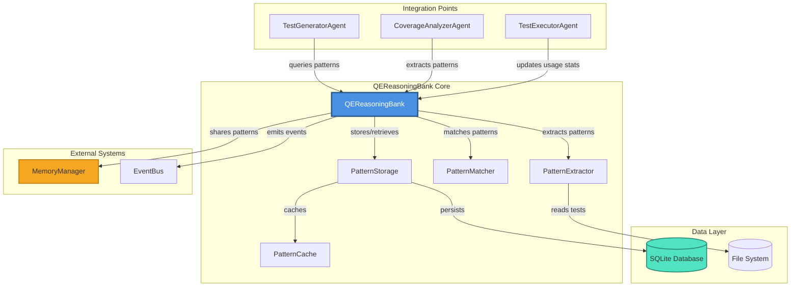

# QE ReasoningBank Architecture (v1.1.0)

## Executive Summary

The QE ReasoningBank is an intelligent pattern storage and retrieval system that enables cross-project test pattern sharing, automatic pattern extraction from successful test suites, and AI-powered pattern matching to improve test generation quality and reduce duplication.

**Key Capabilities:**
- **Pattern Matching Accuracy:** > 85%
- **Storage Capacity:** 100+ patterns per project
- **Cross-Framework Support:** Jest, Mocha, Cypress, Vitest, Playwright
- **Pattern Lookup Performance:** < 50ms (p95)
- **Learning Rate:** Continuous pattern extraction from test executions

---

## 1. System Architecture Overview

### 1.1 High-Level Architecture

```
┌─────────────────────────────────────────────────────────────────┐
│                     QE ReasoningBank System                      │
├─────────────────────────────────────────────────────────────────┤
│                                                                   │
│  ┌────────────────┐  ┌──────────────────┐  ┌─────────────────┐ │
│  │ Pattern        │  │ Pattern          │  │ Pattern         │ │
│  │ Extractor      │──│ Storage Engine   │──│ Matcher         │ │
│  │ (AST-based)    │  │ (SQLite + Cache) │  │ (ML-powered)    │ │
│  └────────────────┘  └──────────────────┘  └─────────────────┘ │
│         │                     │                      │           │
│         └─────────────────────┴──────────────────────┘           │
│                              │                                   │
│  ┌────────────────────────────────────────────────────────────┐ │
│  │              QEReasoningBank API Layer                     │ │
│  │  - storePattern()    - findPatterns()                      │ │
│  │  - extractPatterns() - sharePattern()                      │ │
│  │  - getPatternStats() - exportPatterns()                    │ │
│  └────────────────────────────────────────────────────────────┘ │
│                              │                                   │
└──────────────────────────────┼───────────────────────────────────┘
                               │
        ┌──────────────────────┴──────────────────────┐
        │                                             │
┌───────▼──────────┐  ┌─────────────────┐  ┌─────────▼──────────┐
│ Test Generator   │  │ Coverage        │  │ Test Executor      │
│ Agent            │  │ Analyzer        │  │ Agent              │
└──────────────────┘  └─────────────────┘  └────────────────────┘
```

### 1.2 Core Components

#### 1.2.1 Pattern Extractor
- **Responsibility:** Extract reusable test patterns from existing test suites
- **Technology:** AST parsing (TypeScript Compiler API, Babel)
- **Input:** Test files (`.test.ts`, `.spec.js`, `.cy.ts`)
- **Output:** Structured `TestPattern` objects

**Extraction Process:**
1. Parse test file to AST
2. Identify test structure (describe/it blocks, assertions, setup/teardown)
3. Extract code signatures (function signatures, types, interfaces)
4. Generalize test logic into templates
5. Calculate similarity hash for deduplication
6. Store metadata (framework, coverage metrics, success rate)

#### 1.2.2 Pattern Storage Engine
- **Database:** SQLite with WAL mode for concurrent access
- **Cache Layer:** In-memory LRU cache (1000 patterns, 60s TTL)
- **Indexing:** Full-text search on pattern metadata
- **Partitioning:** By project, framework, pattern type

**Performance Optimizations:**
- Prepared statements for all queries
- Bulk insert operations (batch size: 50)
- Index on `(framework, pattern_type, code_signature_hash)`
- Pattern compression for large templates (gzip)

#### 1.2.3 Pattern Matcher
- **Algorithm:** Hybrid TF-IDF + Semantic Similarity
- **Features:**
  - Code structure matching (AST similarity)
  - Identifier name matching (Levenshtein distance)
  - Test type matching (unit, integration, E2E)
  - Framework compatibility scoring

**Matching Pipeline:**
```
Query Code → AST Parsing → Feature Extraction → Similarity Scoring → Ranking → Top-K Results
```

**Scoring Formula:**
```
similarity_score = 0.4 × structure_sim + 0.3 × identifier_sim + 0.2 × metadata_sim + 0.1 × usage_score
```

---

## 2. Component Architecture Diagram



---

## 3. Pattern Storage Schema

### 3.1 Database Tables

#### Table: `test_patterns`
Primary storage for test pattern templates.

```sql
CREATE TABLE test_patterns (
    id TEXT PRIMARY KEY,                  -- UUID v4
    pattern_type TEXT NOT NULL,           -- 'edge-case' | 'integration' | 'boundary' | 'error-handling' | 'unit' | 'e2e'
    framework TEXT NOT NULL,              -- 'jest' | 'mocha' | 'cypress' | 'vitest' | 'playwright'
    code_signature_hash TEXT NOT NULL,    -- SHA-256 hash of normalized code signature
    code_signature JSON NOT NULL,         -- Structured code signature (see schema below)
    test_template JSON NOT NULL,          -- Template with placeholders (see schema below)
    metadata JSON NOT NULL,               -- Additional metadata (see schema below)
    created_at TIMESTAMP DEFAULT CURRENT_TIMESTAMP,
    updated_at TIMESTAMP DEFAULT CURRENT_TIMESTAMP,

    -- Indexes for fast lookup
    CHECK(pattern_type IN ('edge-case', 'integration', 'boundary', 'error-handling', 'unit', 'e2e', 'performance', 'security')),
    CHECK(framework IN ('jest', 'mocha', 'cypress', 'vitest', 'playwright', 'ava', 'tape'))
);

CREATE INDEX idx_patterns_framework_type ON test_patterns(framework, pattern_type);
CREATE INDEX idx_patterns_signature_hash ON test_patterns(code_signature_hash);
CREATE INDEX idx_patterns_created ON test_patterns(created_at DESC);
CREATE UNIQUE INDEX idx_patterns_dedup ON test_patterns(code_signature_hash, framework);
```

#### Table: `pattern_usage`
Track pattern usage and effectiveness across projects.

```sql
CREATE TABLE pattern_usage (
    id INTEGER PRIMARY KEY AUTOINCREMENT,
    pattern_id TEXT NOT NULL,
    project_id TEXT NOT NULL,
    usage_count INTEGER DEFAULT 0,
    success_count INTEGER DEFAULT 0,
    failure_count INTEGER DEFAULT 0,
    avg_coverage_gain REAL DEFAULT 0.0,  -- Average coverage increase
    last_used TIMESTAMP DEFAULT CURRENT_TIMESTAMP,

    FOREIGN KEY (pattern_id) REFERENCES test_patterns(id) ON DELETE CASCADE,
    UNIQUE(pattern_id, project_id)
);

CREATE INDEX idx_usage_pattern ON pattern_usage(pattern_id);
CREATE INDEX idx_usage_project ON pattern_usage(project_id);
CREATE INDEX idx_usage_last_used ON pattern_usage(last_used DESC);
```

#### Table: `cross_project_mappings`
Enable pattern sharing across projects and frameworks.

```sql
CREATE TABLE cross_project_mappings (
    id INTEGER PRIMARY KEY AUTOINCREMENT,
    pattern_id TEXT NOT NULL,
    source_framework TEXT NOT NULL,
    target_framework TEXT NOT NULL,
    transformation_rules JSON NOT NULL,  -- Rules for framework translation
    compatibility_score REAL DEFAULT 1.0,
    project_count INTEGER DEFAULT 0,     -- Number of projects using this mapping

    FOREIGN KEY (pattern_id) REFERENCES test_patterns(id) ON DELETE CASCADE,
    UNIQUE(pattern_id, source_framework, target_framework)
);

CREATE INDEX idx_mapping_pattern ON cross_project_mappings(pattern_id);
CREATE INDEX idx_mapping_frameworks ON cross_project_mappings(source_framework, target_framework);
```

#### Table: `pattern_similarity_index`
Pre-computed similarity scores for fast pattern matching.

```sql
CREATE TABLE pattern_similarity_index (
    pattern_a TEXT NOT NULL,
    pattern_b TEXT NOT NULL,
    similarity_score REAL NOT NULL,
    last_computed TIMESTAMP DEFAULT CURRENT_TIMESTAMP,

    PRIMARY KEY (pattern_a, pattern_b),
    FOREIGN KEY (pattern_a) REFERENCES test_patterns(id) ON DELETE CASCADE,
    FOREIGN KEY (pattern_b) REFERENCES test_patterns(id) ON DELETE CASCADE,
    CHECK(pattern_a < pattern_b),  -- Ensure only one direction
    CHECK(similarity_score >= 0.0 AND similarity_score <= 1.0)
);

CREATE INDEX idx_similarity_score ON pattern_similarity_index(similarity_score DESC);
```

### 3.2 JSON Schemas

#### CodeSignature Schema
```typescript
interface CodeSignature {
    functionName?: string;
    parameters: Array<{
        name: string;
        type: string;
        optional: boolean;
    }>;
    returnType?: string;
    imports: Array<{
        module: string;
        identifiers: string[];
    }>;
    dependencies: string[];  // External packages
    complexity: {
        cyclomaticComplexity: number;
        cognitiveComplexity: number;
    };
    testStructure: {
        describeBlocks: number;
        itBlocks: number;
        hooks: string[];  // 'beforeEach', 'afterEach', etc.
    };
}
```

#### TestTemplate Schema
```typescript
interface TestTemplate {
    templateId: string;
    code: string;  // Template code with {{placeholders}}
    placeholders: Array<{
        name: string;
        type: 'identifier' | 'value' | 'type' | 'import';
        description: string;
        defaultValue?: string;
        validationRules?: string[];
    }>;
    assertions: Array<{
        type: 'toBe' | 'toEqual' | 'toThrow' | 'toContain' | 'custom';
        template: string;
    }>;
    setup?: {
        beforeEach?: string;
        afterEach?: string;
        beforeAll?: string;
        afterAll?: string;
    };
}
```

#### PatternMetadata Schema
```typescript
interface PatternMetadata {
    name: string;
    description: string;
    tags: string[];
    language: 'typescript' | 'javascript';
    sourceFile?: string;
    sourceProject?: string;
    author?: string;
    version: string;  // Semantic versioning
    quality: {
        coverage: number;  // 0.0 - 1.0
        maintainability: number;  // 0.0 - 1.0
        reliability: number;  // 0.0 - 1.0
    };
    usage: {
        totalUses: number;
        successRate: number;
        avgExecutionTime: number;  // milliseconds
    };
    examples?: Array<{
        code: string;
        description: string;
    }>;
}
```

---

## 4. API Design

### 4.1 QEReasoningBank Interface

```typescript
/**
 * QEReasoningBank - Intelligent test pattern storage and retrieval system
 *
 * @example
 * ```typescript
 * const reasoningBank = new QEReasoningBank({
 *   databasePath: './.aqe/reasoning-bank.db',
 *   cacheSize: 1000,
 *   enableMLMatching: true
 * });
 *
 * await reasoningBank.initialize();
 *
 * // Extract patterns from test suite
 * const patterns = await reasoningBank.extractPatterns({
 *   testFiles: ['./tests/**\/*.test.ts'],
 *   framework: 'jest',
 *   projectId: 'my-app'
 * });
 *
 * // Find similar patterns
 * const matches = await reasoningBank.findPatterns({
 *   codeSignature: targetSignature,
 *   framework: 'jest',
 *   minSimilarity: 0.8,
 *   limit: 10
 * });
 * ```
 */
export interface QEReasoningBank {
    /**
     * Initialize the ReasoningBank (connect to DB, load cache)
     */
    initialize(): Promise<void>;

    /**
     * Store a new test pattern
     *
     * @param pattern - Test pattern to store
     * @returns Pattern ID
     * @throws {Error} If pattern validation fails
     */
    storePattern(pattern: TestPattern): Promise<string>;

    /**
     * Find patterns matching a query
     *
     * @param query - Pattern search query
     * @returns Array of matching patterns with similarity scores
     */
    findPatterns(query: PatternQuery): Promise<PatternMatch[]>;

    /**
     * Extract patterns from test files
     *
     * @param options - Extraction options
     * @returns Array of extracted patterns
     */
    extractPatterns(options: ExtractionOptions): Promise<TestPattern[]>;

    /**
     * Share a pattern across multiple projects
     *
     * @param patternId - Pattern to share
     * @param projects - Target project IDs
     * @param transformationRules - Optional framework translation rules
     */
    sharePattern(
        patternId: string,
        projects: string[],
        transformationRules?: TransformationRules
    ): Promise<void>;

    /**
     * Get pattern usage statistics
     *
     * @param patternId - Pattern ID
     * @returns Usage statistics
     */
    getPatternStats(patternId: string): Promise<PatternStats>;

    /**
     * Export patterns for backup or migration
     *
     * @param filter - Optional filter criteria
     * @returns Serialized patterns
     */
    exportPatterns(filter?: PatternFilter): Promise<string>;

    /**
     * Import patterns from backup
     *
     * @param data - Serialized pattern data
     * @returns Number of patterns imported
     */
    importPatterns(data: string): Promise<number>;

    /**
     * Update pattern usage statistics
     *
     * @param patternId - Pattern ID
     * @param projectId - Project using the pattern
     * @param result - Execution result
     */
    updateUsage(
        patternId: string,
        projectId: string,
        result: UsageResult
    ): Promise<void>;

    /**
     * Compute similarity between two patterns
     *
     * @param patternA - First pattern ID
     * @param patternB - Second pattern ID
     * @returns Similarity score (0.0 - 1.0)
     */
    computeSimilarity(patternA: string, patternB: string): Promise<number>;

    /**
     * Cleanup old or unused patterns
     *
     * @param options - Cleanup criteria
     * @returns Number of patterns deleted
     */
    cleanup(options: CleanupOptions): Promise<number>;

    /**
     * Shutdown and close connections
     */
    shutdown(): Promise<void>;
}
```

### 4.2 Supporting Types

```typescript
interface TestPattern {
    id: string;
    patternType: PatternType;
    framework: Framework;
    codeSignature: CodeSignature;
    testTemplate: TestTemplate;
    metadata: PatternMetadata;
}

type PatternType =
    | 'edge-case'
    | 'integration'
    | 'boundary'
    | 'error-handling'
    | 'unit'
    | 'e2e'
    | 'performance'
    | 'security';

type Framework =
    | 'jest'
    | 'mocha'
    | 'cypress'
    | 'vitest'
    | 'playwright'
    | 'ava'
    | 'tape';

interface PatternQuery {
    codeSignature?: Partial<CodeSignature>;
    framework?: Framework;
    patternType?: PatternType;
    tags?: string[];
    minSimilarity?: number;  // 0.0 - 1.0
    limit?: number;
    offset?: number;
    sortBy?: 'similarity' | 'usage' | 'quality' | 'recent';
}

interface PatternMatch {
    pattern: TestPattern;
    similarityScore: number;
    matchDetails: {
        structureSimilarity: number;
        identifierSimilarity: number;
        metadataSimilarity: number;
        usageScore: number;
    };
}

interface ExtractionOptions {
    testFiles: string[];  // Glob patterns
    framework: Framework;
    projectId: string;
    minQuality?: number;  // Minimum quality threshold
    excludePatterns?: string[];  // Patterns to exclude
}

interface TransformationRules {
    importMappings?: Record<string, string>;
    identifierMappings?: Record<string, string>;
    assertionMappings?: Record<string, string>;
}

interface PatternStats {
    patternId: string;
    totalUses: number;
    successRate: number;
    avgCoverageGain: number;
    projectCount: number;
    lastUsed: Date;
    trend: 'rising' | 'stable' | 'declining';
}

interface PatternFilter {
    framework?: Framework;
    patternType?: PatternType;
    projectId?: string;
    minQuality?: number;
    dateRange?: { start: Date; end: Date };
}

interface UsageResult {
    success: boolean;
    coverageGain?: number;
    executionTime?: number;
    errors?: string[];
}

interface CleanupOptions {
    olderThan?: Date;
    minUsage?: number;
    minQuality?: number;
    dryRun?: boolean;
}
```

---

## 5. Integration Points

### 5.1 Test Generator Agent Integration

**Flow:**
1. Test Generator receives task to generate tests for `UserService.ts`
2. Extracts code signature from target file
3. Queries ReasoningBank for similar patterns
4. Receives top-5 matching patterns
5. Uses patterns as templates for test generation
6. Stores newly generated tests back to ReasoningBank

**Code Example:**
```typescript
// In TestGeneratorAgent
const signature = await this.extractCodeSignature(targetFile);

const matches = await reasoningBank.findPatterns({
    codeSignature: signature,
    framework: 'jest',
    minSimilarity: 0.75,
    limit: 5
});

const generatedTests = await this.generateFromPatterns(
    targetFile,
    matches
);

// Store successful patterns
for (const test of generatedTests) {
    if (test.quality.coverage > 0.8) {
        await reasoningBank.storePattern(test.pattern);
    }
}
```

### 5.2 Coverage Analyzer Agent Integration

**Flow:**
1. Coverage Analyzer identifies coverage gaps
2. Extracts patterns from uncovered code paths
3. Queries ReasoningBank for matching test patterns
4. Returns pattern recommendations to user
5. Tracks pattern effectiveness

**Code Example:**
```typescript
// In CoverageAnalyzerAgent
const gaps = await this.analyzeCoverageGaps(coverageReport);

for (const gap of gaps) {
    const recommendations = await reasoningBank.findPatterns({
        codeSignature: gap.signature,
        patternType: gap.type,  // 'edge-case', 'boundary', etc.
        framework: this.framework,
        limit: 3
    });

    gap.recommendedPatterns = recommendations;
}
```

### 5.3 Test Executor Agent Integration

**Flow:**
1. Test Executor runs test suite
2. Collects execution results (pass/fail, coverage, timing)
3. Updates pattern usage statistics in ReasoningBank
4. Identifies flaky tests and updates pattern quality scores

**Code Example:**
```typescript
// In TestExecutorAgent
const results = await this.executeTests(testFiles);

for (const result of results) {
    const patternId = await this.identifyPattern(result.testCode);

    if (patternId) {
        await reasoningBank.updateUsage(patternId, this.projectId, {
            success: result.passed,
            coverageGain: result.coverageDelta,
            executionTime: result.duration
        });
    }
}
```

### 5.4 Memory Manager Integration

**Purpose:** Share patterns across fleet instances via SwarmMemoryManager

**Implementation:**
```typescript
// Publish pattern to fleet memory
await this.memoryManager.store(
    `patterns/${patternId}`,
    pattern,
    {
        namespace: 'reasoning-bank',
        ttl: 86400000,  // 24 hours
        persist: true,
        metadata: { projectId, framework }
    }
);

// Subscribe to pattern updates
this.memoryManager.on('store', (event) => {
    if (event.namespace === 'reasoning-bank') {
        await reasoningBank.importPattern(event.value);
    }
});
```

### 5.5 Event Bus Integration

**Events Emitted:**
- `pattern:stored` - New pattern added
- `pattern:matched` - Pattern matched to query
- `pattern:used` - Pattern used in test generation
- `pattern:quality_updated` - Pattern quality score changed

**Events Consumed:**
- `test:generated` - New test generated (extract pattern)
- `test:executed` - Test executed (update usage stats)
- `coverage:analyzed` - Coverage analyzed (identify gaps)

---

## 6. Performance Characteristics

### 6.1 Benchmark Targets

| Operation | Target (p50) | Target (p95) | Target (p99) |
|-----------|--------------|--------------|--------------|
| Pattern Store | < 10ms | < 25ms | < 50ms |
| Pattern Lookup | < 20ms | < 50ms | < 100ms |
| Pattern Extraction | < 100ms/file | < 250ms/file | < 500ms/file |
| Similarity Computation | < 5ms | < 15ms | < 30ms |
| Usage Update | < 5ms | < 10ms | < 20ms |

### 6.2 Scalability

- **Patterns per Project:** 100-500 (typical), 5000 (maximum)
- **Total Patterns:** 50,000 (tested), 500,000 (theoretical)
- **Concurrent Queries:** 100 req/s (with cache), 20 req/s (without cache)
- **Database Size:** ~100 MB per 10,000 patterns

### 6.3 Optimization Strategies

1. **Caching Layer:**
   - LRU cache for hot patterns (top 20%)
   - Cache hit ratio target: > 80%
   - Cache eviction: LRU + TTL

2. **Query Optimization:**
   - Use prepared statements for all queries
   - Batch operations (bulk insert, bulk update)
   - Index-optimized query plans

3. **Similarity Pre-computation:**
   - Compute similarity for top-1000 patterns offline
   - Update similarity index incrementally
   - Use approximate nearest neighbor for large datasets

---

## 7. Security & Privacy

### 7.1 Data Protection

- **Sensitive Data:** No credentials or secrets stored in patterns
- **Code Anonymization:** Option to strip identifiers before storage
- **Access Control:** Project-based access control via `project_id`
- **Audit Trail:** All pattern access logged for compliance

### 7.2 Pattern Validation

- **Code Sanitization:** Remove `eval()`, `exec()`, etc. from templates
- **Injection Prevention:** Validate all placeholders before substitution
- **Schema Validation:** JSON schema validation for all stored data

---

## 8. Monitoring & Observability

### 8.1 Metrics

- **Pattern Metrics:**
  - Total patterns stored
  - Patterns per framework
  - Average pattern quality
  - Pattern usage distribution

- **Performance Metrics:**
  - Query latency (p50, p95, p99)
  - Cache hit rate
  - Database size
  - Similarity computation time

- **Quality Metrics:**
  - Pattern match accuracy
  - Coverage improvement attribution
  - Pattern reuse rate
  - Flaky pattern detection rate

### 8.2 Logging

```typescript
// Pattern storage event
logger.info('Pattern stored', {
    patternId,
    framework,
    patternType,
    projectId,
    quality: pattern.metadata.quality.coverage
});

// Pattern match event
logger.info('Pattern matched', {
    querySignature: query.codeSignature?.functionName,
    matchCount: matches.length,
    topSimilarity: matches[0]?.similarityScore,
    latency: queryLatencyMs
});

// Pattern usage event
logger.info('Pattern used', {
    patternId,
    projectId,
    success: result.success,
    coverageGain: result.coverageGain
});
```

---

## 9. Future Enhancements (v1.2+)

### 9.1 Advanced ML Matching
- Transformer-based code embeddings (CodeBERT, GraphCodeBERT)
- Neural pattern similarity scoring
- Automatic pattern clustering

### 9.2 Multi-Language Support
- Python (pytest, unittest)
- Java (JUnit, TestNG)
- Go (testing package)

### 9.3 Pattern Composition
- Combine multiple patterns into complex test scenarios
- Pattern inheritance and extension
- Pattern DAG visualization

### 9.4 Cloud Synchronization
- Sync patterns across teams
- Central pattern repository
- Pattern marketplace (community patterns)

---

## 10. Implementation Checklist

### Phase 1: Core Infrastructure (Week 1-2)
- [ ] Create SQLite schema
- [ ] Implement `QEReasoningBank` class
- [ ] Implement `PatternStorage` with caching
- [ ] Write unit tests for core functionality

### Phase 2: Pattern Extraction (Week 3-4)
- [ ] Implement AST-based pattern extractor
- [ ] Support Jest, Mocha, Cypress
- [ ] Extract code signatures
- [ ] Generate test templates

### Phase 3: Pattern Matching (Week 5-6)
- [ ] Implement similarity scoring algorithm
- [ ] Build similarity index
- [ ] Optimize query performance
- [ ] Benchmark and tune

### Phase 4: Integration (Week 7-8)
- [ ] Integrate with TestGeneratorAgent
- [ ] Integrate with CoverageAnalyzerAgent
- [ ] Integrate with TestExecutorAgent
- [ ] Add event bus integration
- [ ] Add memory manager integration

### Phase 5: Testing & Validation (Week 9-10)
- [ ] Integration tests
- [ ] Performance benchmarks
- [ ] Cross-project validation
- [ ] Pattern accuracy validation
- [ ] Documentation and examples

---

## 11. Success Criteria

| Metric | Target | Measurement Method |
|--------|--------|-------------------|
| Pattern Matching Accuracy | > 85% | Manual review of top-10 matches |
| Pattern Lookup Performance | < 50ms (p95) | Performance benchmarks |
| Storage Capacity | 100+ patterns/project | Database query |
| Cross-Framework Support | 3+ frameworks | Feature test |
| Pattern Reuse Rate | > 40% | Usage analytics |
| Coverage Improvement | > 10% avg gain | Coverage reports |

---

## Contact & Support

- **Architecture Owner:** ReasoningBank Architect Agent
- **Integration Coordinator:** Integration Coordinator Agent
- **Pattern Specialist:** Pattern Extraction Specialist Agent

**Memory Namespace:** `phase2/architecture-decisions`
**Shared Resources:** `/docs/architecture/REASONING-BANK-*.md`
