# Agentic QE System Architecture Diagrams

## System Overview

This document provides visual representations of the Agentic QE fleet architecture using C4 model notation and UML diagrams to illustrate system components, interactions, and data flows.

## C4 Model Architecture

### Level 1: System Context Diagram

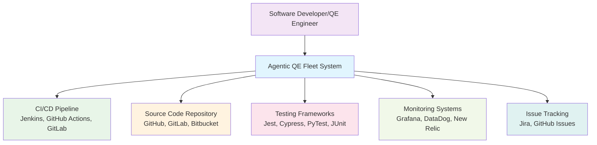

### Level 2: Container Diagram

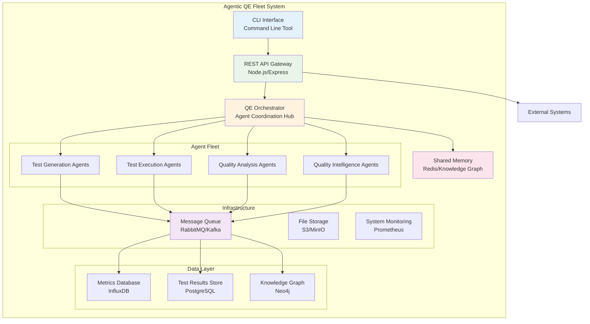

### Level 3: Component Diagram - QE Orchestrator

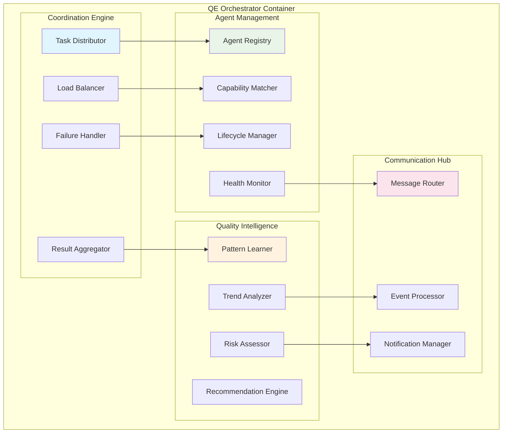

## Agent Fleet Architecture

### Agent Type Hierarchy

```mermaid
graph TD
    BaseAgent[Base QE Agent]

    subgraph "Test Generation Agents"
        UnitTestGen[Unit Test Generator]
        IntegrationTestGen[Integration Test Generator]
        APITestGen[API Test Generator]
        UITestGen[UI Test Generator]
        PerformanceTestGen[Performance Test Generator]
    end

    subgraph "Quality Validation Agents"
        CodeQualityAnalyzer[Code Quality Analyzer]
        CoverageAnalyzer[Coverage Analyzer]
        SecurityTestAgent[Security Test Agent]
        AccessibilityAgent[Accessibility Test Agent]
    end

    subgraph "Test Execution Agents"
        TestRunnerOrchestrator[Test Runner Orchestrator]
        EnvironmentManager[Environment Manager]
        DataManager[Data Manager]
        ResultAggregator[Result Aggregator]
    end

    subgraph "Intelligence Agents"
        AITestDesigner[AI Test Designer]
        ChaosAgent[Chaos Engineering Agent]
        MutationAgent[Mutation Test Agent]
        VisualTestAgent[Visual Test Agent]
    end

    BaseAgent --> UnitTestGen
    BaseAgent --> IntegrationTestGen
    BaseAgent --> APITestGen
    BaseAgent --> UITestGen
    BaseAgent --> PerformanceTestGen

    BaseAgent --> CodeQualityAnalyzer
    BaseAgent --> CoverageAnalyzer
    BaseAgent --> SecurityTestAgent
    BaseAgent --> AccessibilityAgent

    BaseAgent --> TestRunnerOrchestrator
    BaseAgent --> EnvironmentManager
    BaseAgent --> DataManager
    BaseAgent --> ResultAggregator

    BaseAgent --> AITestDesigner
    BaseAgent --> ChaosAgent
    BaseAgent --> MutationAgent
    BaseAgent --> VisualTestAgent

    style BaseAgent fill:#e1f5fe
    style UnitTestGen fill:#e8f5e8
    style CodeQualityAnalyzer fill:#fff3e0
    style TestRunnerOrchestrator fill:#fce4ec
    style AITestDesigner fill:#f3e5f5
```

### Agent Communication Flow

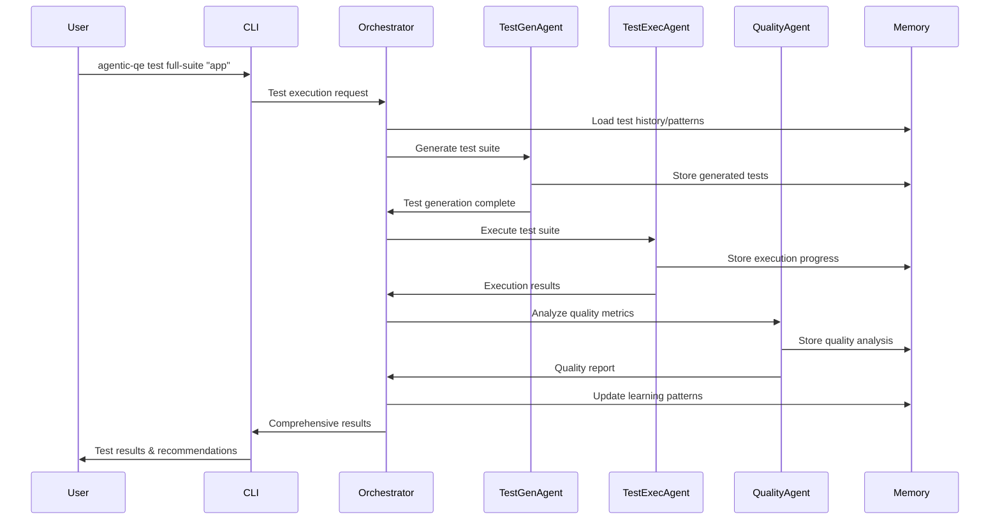

## Data Flow Architecture

### Quality Information Flow

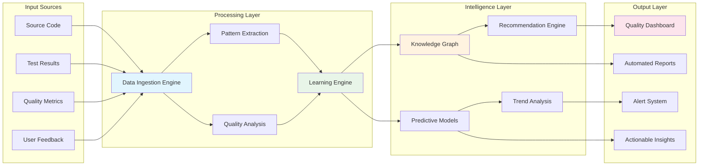

### Test Execution Flow

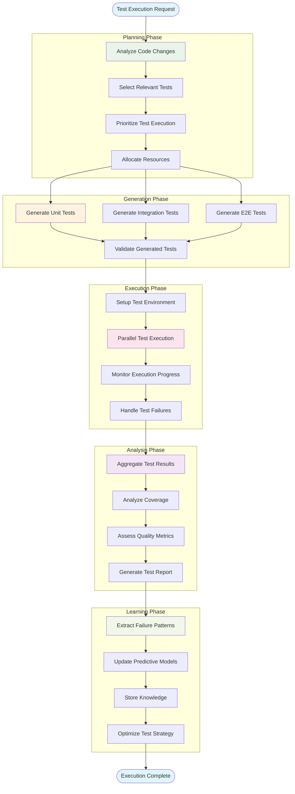

## Deployment Architecture

### Multi-Environment Deployment

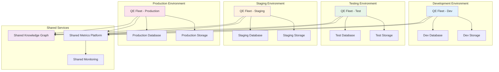

## Integration Architecture

### CI/CD Pipeline Integration

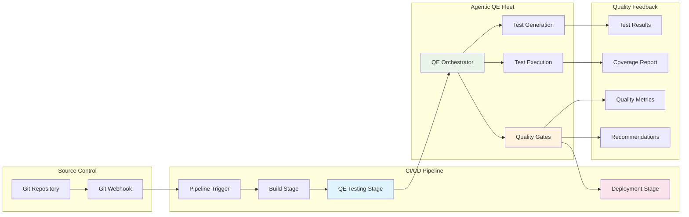

## Security Architecture

### Security Layers

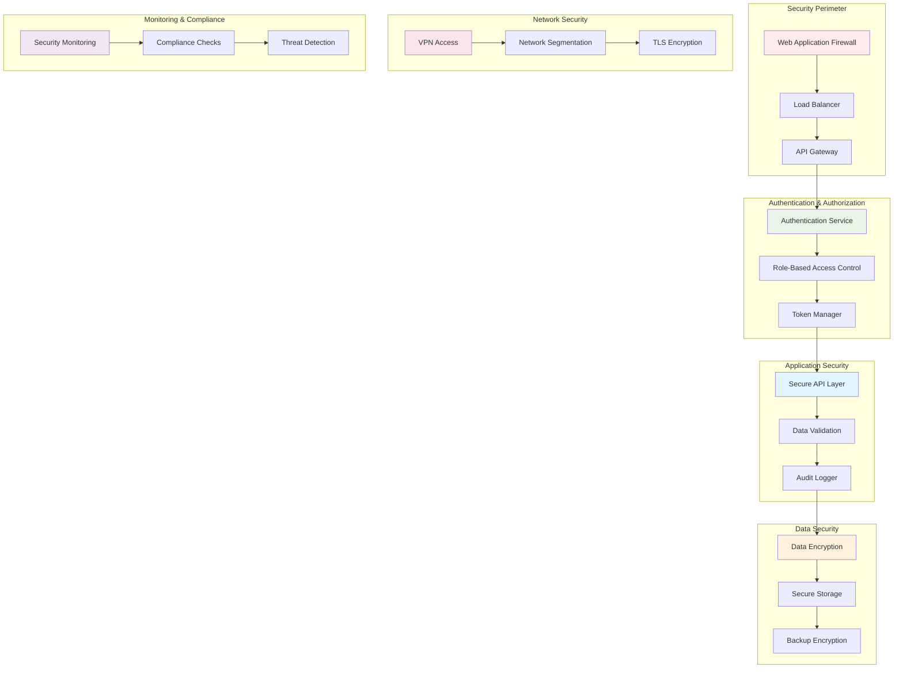

## Scalability Architecture

### Horizontal Scaling Pattern

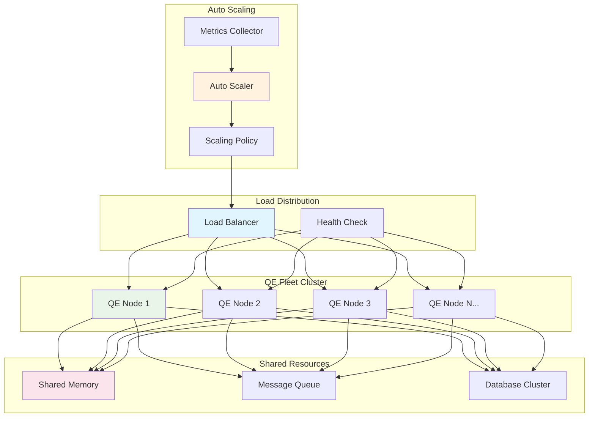

These diagrams provide a comprehensive visual representation of the Agentic QE fleet architecture, showing the relationships between components, data flows, and system interactions. They serve as a reference for implementation teams and stakeholders to understand the system's structure and behavior.