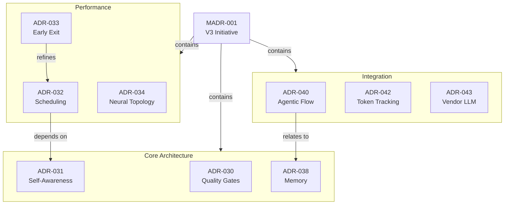

# ADR Migration Plan: Enhanced WH(Y) Format

## Executive Summary

This plan migrates Agentic QE's 20 Architecture Decision Records from the current implementation-heavy format to the enhanced WH(Y) format, achieving:
- **Clearer decisions** through structured 6-part WH(Y) statements
- **Maintainable records** by separating implementation details into SPEC files
- **Impact analysis** through typed dependency tracking
- **Governance readiness** with Definition of Done criteria

**Source:** [cgbarlow/adr](https://github.com/cgbarlow/adr) Enhanced ADR Format proposal

---

## Current State Analysis

### ADR Inventory (20 ADRs)

| ADR | Title | Lines | Bloat Level | Priority |
|-----|-------|-------|-------------|----------|
| ADR-045 | Version-Agnostic Naming | 673 | Critical | P0 |
| ADR-033 | Early Exit Testing | 634 | Critical | P1 |
| ADR-035 | Causal Discovery | 610 | Critical | P1 |
| ADR-034 | Neural Topology Optimizer | 589 | Critical | P1 |
| ADR-032 | Time Crystal Scheduling | 530 | High | P1 |
| ADR-042 | Token Tracking Integration | 518 | High | P2 |
| ADR-031 | Strange Loop Self-Awareness | 484 | High | P2 |
| ADR-047 | Mincut Self-Organizing QE | 484 | High | P2 |
| ADR-040 | Agentic Flow Integration | 418 | Medium | P2 |
| ADR-043 | Vendor Independent LLM | 404 | Medium | P2 |
| ADR-036 | Result Persistence | 326 | Medium | P3 |
| ADR-041 | CLI Enhancement | 317 | Medium | P3 |
| ADR-030 | Coherence Gated Quality Gates | 312 | Medium | P3 |
| ADR-038 | Memory Unification | 284 | Low | P3 |
| ADR-044 | Domain RL Integration | 244 | Low | P3 |
| ADR-046 | V2 Feature Integration | 241 | Low | P3 |
| ADR-048 | V2-V3 Agent Migration | 237 | Low | P3 |
| ADR-037 | Agent Naming | 222 | Low | P3 |
| ADR-039 | MCP Optimization | 201 | Low | P3 |
| ADR-049 | V3 Main Publish | 151 | OK | P4 |

**Target:** All ADRs under 150 lines after migration

### Common Problems Identified

1. **Implementation Details Embedded**
   - Scripts, configs, code examples in ADRs
   - Migration checklists spanning 100+ lines
   - Appendices with mapping tables

2. **Missing Decision Rationale**
   - "Context" sections describe problem but not WHY this solution
   - Alternatives rarely documented
   - Trade-offs buried in prose

3. **No Dependency Tracking**
   - "Related ADRs" mentioned but not typed
   - No way to assess impact of changes
   - Circular dependencies possible

4. **Inconsistent Structure**
   - Some have Implementation Plans, others don't
   - Status tracking varies (Implemented, Accepted, Proposed)
   - Governance metadata absent

---

## Target State

### Directory Structure

```
v3/implementation/
├── adrs/
│   ├── templates/
│   │   ├── ADR-TEMPLATE.md           # Enhanced WH(Y) template
│   │   ├── SPEC-TEMPLATE.md          # Specification template
│   │   └── MADR-TEMPLATE.md          # Master ADR template
│   ├── ADR-030-coherence-gated-quality-gates.md
│   ├── ADR-031-strange-loop-self-awareness.md
│   ├── ... (all ADRs, refactored)
│   ├── MADR-001-v3-implementation-initiative.md  # Master ADR
│   └── index.md                      # Auto-generated index
├── specs/
│   ├── SPEC-030-A-quality-gate-thresholds.md
│   ├── SPEC-030-B-coherence-metrics.md
│   ├── SPEC-045-A-agent-rename-mapping.md
│   ├── SPEC-045-B-cli-migration-script.md
│   └── ...
└── dependencies/
    └── adr-dependencies.yaml         # Machine-readable dependencies
```

### Enhanced ADR Format

```markdown
# ADR-{ID}: {Title}

| Field | Value |
|-------|-------|
| **Decision ID** | ADR-{ID} |
| **Status** | Proposed | Under Review | Approved | Implemented | Superseded |
| **Date** | YYYY-MM-DD |
| **Author** | {Author} |
| **Review Cadence** | 6 months |

---

## WH(Y) Decision Statement

**In the context of** {functional context - what system/component},

**facing** {non-functional concern - performance, security, maintainability challenge},

**we decided for** {the decision - specific technology, pattern, approach},

**and neglected** {alternatives considered but rejected},

**to achieve** {expected benefits - qualities gained},

**accepting that** {trade-offs - costs, risks, limitations}.

---

## Context

{2-3 paragraphs of background, no implementation details}

## Options Considered

### Option 1: {Selected Option} (Selected)
{Brief description, key pros/cons}

### Option 2: {Alternative} (Rejected)
{Brief description, why rejected}

---

## Dependencies

| Relationship | ADR ID | Title | Notes |
|--------------|--------|-------|-------|
| Depends On | ADR-xxx | {Title} | {Why} |
| Relates To | ADR-xxx | {Title} | {How} |
| Part Of | MADR-xxx | {Title} | {Initiative} |

---

## References

| Ref ID | Title | Type | Location |
|--------|-------|------|----------|
| SPEC-{ID}-A | {Title} | Technical Spec | specs/SPEC-{ID}-A.md |
| SPEC-{ID}-B | {Title} | Migration Guide | specs/SPEC-{ID}-B.md |

---

## Governance

| Review Board | Date | Outcome | Next Review |
|--------------|------|---------|-------------|
| Architecture Team | {Date} | Approved | {Date + 6mo} |

## Status History

| Status | Date | Notes |
|--------|------|-------|
| Proposed | {Date} | Initial creation |
| Approved | {Date} | After review |
```

---

## Migration Process

### Phase 1: Infrastructure (Day 1)

**Objective:** Create directory structure and templates

#### Tasks

- [ ] Create `v3/implementation/specs/` directory
- [ ] Create `v3/implementation/adrs/templates/` directory
- [ ] Create `ADR-TEMPLATE.md` with WH(Y) format
- [ ] Create `SPEC-TEMPLATE.md` for specifications
- [ ] Create `MADR-TEMPLATE.md` for master ADRs
- [ ] Create `dependencies/adr-dependencies.yaml` schema

#### Deliverables

```bash
mkdir -p v3/implementation/specs
mkdir -p v3/implementation/adrs/templates
mkdir -p v3/implementation/dependencies
```

---

### Phase 2: Master ADR Creation (Day 1-2)

**Objective:** Create parent ADR for v3 implementation initiative

#### MADR-001: V3 Implementation Initiative

Groups all v3-related ADRs under one parent:

```markdown
# MADR-001: Agentic QE V3 Implementation Initiative

## WH(Y) Decision Statement

**In the context of** Agentic QE's evolution from v2 to v3,

**facing** the need for Domain-Driven Design, O(log n) performance,
self-learning capabilities, and enterprise-grade quality engineering,

**we decided for** a complete architectural rewrite implementing 12 DDD
bounded contexts with ReasoningBank learning and 47 specialized agents,

**and neglected** incremental v2 enhancement (insufficient for goals) and
third-party QE platform adoption (vendor lock-in),

**to achieve** 150x-12,500x search performance, autonomous test generation,
cross-domain learning, and production-grade reliability,

**accepting that** this requires significant development effort, migration
tooling, and coordination across multiple architectural decisions.

## Child ADR Registry

| ADR ID | Title | Status | Phase |
|--------|-------|--------|-------|
| ADR-030 | Coherence Gated Quality Gates | Implemented | Core |
| ADR-031 | Strange Loop Self-Awareness | Implemented | Intelligence |
| ADR-032 | Time Crystal Scheduling | Implemented | Performance |
| ... | ... | ... | ... |
```

---

### Phase 3: Critical ADR Migration (Day 2-5)

**Objective:** Migrate 5 largest ADRs (P0-P1)

#### ADR-045: Version-Agnostic Naming (673 → ~80 lines)

**Extract to specs:**
- `SPEC-045-A-agent-rename-mapping.md` - Complete agent mapping table
- `SPEC-045-B-cli-migration-script.md` - Shell scripts
- `SPEC-045-C-implementation-checklist.md` - Phase checklists
- `SPEC-045-D-v2-compatibility-aliases.md` - Alias mappings

**Refactored WH(Y):**
```markdown
**In the context of** Agentic QE agent, skill, and CLI naming conventions,

**facing** version lock-in from v3- prefixes, user confusion between v2/v3
naming, and documentation debt requiring updates on each version bump,

**we decided for** semantic version-agnostic naming (qe-* prefix instead of
v3-qe-*) for all 47 agents, 12 skills, and CLI binaries,

**and neglected** keeping v3 prefixes (perpetuates lock-in), parallel naming
schemes (doubles maintenance), and version suffixes (same problem),

**to achieve** stable naming across versions, reduced documentation churn,
consistent user experience, and simplified migration paths,

**accepting that** this requires coordinated renaming of 59 files, CLI binary
changes (aqe-v3 → aqe), and user communication about the transition.
```

#### Similar extraction for:
- ADR-033 (Early Exit Testing) → 2-3 SPEC files
- ADR-035 (Causal Discovery) → 2-3 SPEC files
- ADR-034 (Neural Topology) → 2-3 SPEC files
- ADR-032 (Time Crystal) → 2 SPEC files

---

### Phase 4: High Priority Migration (Day 5-8)

**Objective:** Migrate 5 ADRs (P2)

| ADR | Current Lines | Target | SPECs to Create |
|-----|---------------|--------|-----------------|
| ADR-042 | 518 | ~80 | Token schemas, integration patterns |
| ADR-031 | 484 | ~80 | Self-awareness metrics, feedback loops |
| ADR-047 | 484 | ~80 | Mincut algorithms, topology configs |
| ADR-040 | 418 | ~80 | Integration architecture, API contracts |
| ADR-043 | 404 | ~80 | Provider adapters, model configs |

---

### Phase 5: Medium Priority Migration (Day 8-12)

**Objective:** Migrate remaining ADRs (P3-P4)

| ADR | Current Lines | Target |
|-----|---------------|--------|
| ADR-036 | 326 | ~60 |
| ADR-041 | 317 | ~60 |
| ADR-030 | 312 | ~60 |
| ADR-038 | 284 | ~50 |
| ADR-044 | 244 | ~50 |
| ADR-046 | 241 | ~50 |
| ADR-048 | 237 | ~50 |
| ADR-037 | 222 | ~50 |
| ADR-039 | 201 | ~50 |
| ADR-049 | 151 | ~50 |

---

### Phase 6: Dependency Mapping (Day 12-14)

**Objective:** Create dependency graph for all ADRs

#### Dependency Analysis

```yaml
# v3/implementation/dependencies/adr-dependencies.yaml
dependencies:
  - source: ADR-030
    target: ADR-031
    type: RELATES_TO
    notes: Quality gates use self-awareness metrics

  - source: ADR-032
    target: ADR-031
    type: DEPENDS_ON
    notes: Scheduling requires self-awareness signals

  - source: ADR-045
    target: MADR-001
    type: PART_OF
    notes: V3 implementation initiative

  # ... all relationships
```

#### Generate Dependency Graph



---

### Phase 7: Tooling & Validation (Day 14-16)

**Objective:** Create validation tooling

#### ADR Validation Script

```typescript
// scripts/validate-adrs.ts
interface ValidationResult {
  adrId: string;
  passed: boolean;
  checks: {
    whyStatement: boolean;      // All 6 parts present
    lineCount: boolean;         // Under 150 lines
    dependencies: boolean;      // Dependencies section exists
    references: boolean;        // At least one SPEC reference
    governance: boolean;        // Review board documented
  };
}

async function validateADR(path: string): Promise<ValidationResult> {
  // Implementation
}
```

#### Definition of Done Checklist

```markdown
## ADR Definition of Done

### Core (ECADR)
- [ ] **E - Evidence**: Approach validated (PoC, prior art, expert input)
- [ ] **C - Criteria**: At least 2 options compared with trade-offs
- [ ] **A - Agreement**: Stakeholders consulted, decision-maker identified
- [ ] **D - Documentation**: WH(Y) format, published, searchable
- [ ] **R - Review**: Review cadence set, owner assigned

### Extended
- [ ] **Dp - Dependencies**: All relationships documented with types
- [ ] **Rf - References**: Implementation in SPEC files, all links valid
- [ ] **M - Master**: Linked to MADR if part of initiative
```

---

## Migration Checklist Per ADR

For each ADR migration:

```markdown
### ADR-{ID} Migration Checklist

**Pre-Migration**
- [ ] Read current ADR completely
- [ ] Identify implementation details to extract
- [ ] List SPEC files needed
- [ ] Identify dependencies on other ADRs

**WH(Y) Extraction**
- [ ] Write "In the context of" (functional scope)
- [ ] Write "facing" (non-functional concern)
- [ ] Write "we decided for" (the decision)
- [ ] Write "and neglected" (alternatives)
- [ ] Write "to achieve" (benefits)
- [ ] Write "accepting that" (trade-offs)

**Content Separation**
- [ ] Create SPEC-{ID}-A for primary implementation details
- [ ] Create SPEC-{ID}-B for secondary details (if needed)
- [ ] Create SPEC-{ID}-C for migration/scripts (if needed)
- [ ] Update ADR References section with SPEC links

**Dependencies**
- [ ] Identify DEPENDS_ON relationships
- [ ] Identify RELATES_TO relationships
- [ ] Identify PART_OF (link to MADR-001)
- [ ] Add to adr-dependencies.yaml

**Governance**
- [ ] Set status (Proposed/Approved/Implemented)
- [ ] Add governance table with review board
- [ ] Set review cadence (default: 6 months)
- [ ] Add status history

**Validation**
- [ ] ADR under 150 lines
- [ ] All 6 WH(Y) parts present
- [ ] All SPEC links resolve
- [ ] Dependencies in YAML file
- [ ] Passes validate-adrs script
```

---

## Timeline

| Phase | Duration | Deliverables |
|-------|----------|--------------|
| 1. Infrastructure | Day 1 | Templates, directories |
| 2. Master ADR | Day 1-2 | MADR-001 |
| 3. Critical (P0-P1) | Day 2-5 | 5 ADRs + ~15 SPECs |
| 4. High (P2) | Day 5-8 | 5 ADRs + ~10 SPECs |
| 5. Medium (P3-P4) | Day 8-12 | 10 ADRs + ~10 SPECs |
| 6. Dependencies | Day 12-14 | Dependency graph |
| 7. Tooling | Day 14-16 | Validation scripts |

**Total: 16 days (~3 weeks)**

---

## Success Metrics

| Metric | Current | Target |
|--------|---------|--------|
| Average ADR lines | 427 | <100 |
| Largest ADR | 673 lines | <150 lines |
| ADRs with WH(Y) statement | 0% | 100% |
| ADRs with dependencies | 0% | 100% |
| SPEC files | 0 | ~35 |
| Dependency coverage | 0% | 100% |

---

## Risk Mitigation

| Risk | Mitigation |
|------|------------|
| Lost context during extraction | Keep original as backup, review extracted SPECs |
| Broken links | Validation script checks all references |
| Incomplete WH(Y) statements | Checklist enforces all 6 parts |
| Scope creep | Strict phase boundaries, P0-P4 prioritization |

---

## Appendix: Quick Reference

### Relationship Types

| Type | Direction | When to Use |
|------|-----------|-------------|
| DEPENDS_ON | Source → Target | Source requires Target |
| SUPERSEDES | Source → Target | Source replaces Target |
| RELATES_TO | Bidirectional | Shared context |
| REFINES | Source → Target | Source details Target |
| PART_OF | Child → Parent | Child belongs to Master |

### Status Values

| Status | Meaning |
|--------|---------|
| Proposed | Initial draft |
| Under Review | Being evaluated |
| Approved | Decision accepted |
| Implemented | Decision realized |
| Superseded | Replaced by another ADR |
| Retired | No longer applicable |

### File Naming

| Type | Pattern | Example |
|------|---------|---------|
| ADR | `ADR-{NNN}-{slug}.md` | `ADR-045-version-agnostic-naming.md` |
| Master ADR | `MADR-{NNN}-{slug}.md` | `MADR-001-v3-initiative.md` |
| Specification | `SPEC-{ADR}-{letter}-{slug}.md` | `SPEC-045-A-agent-mapping.md` |
