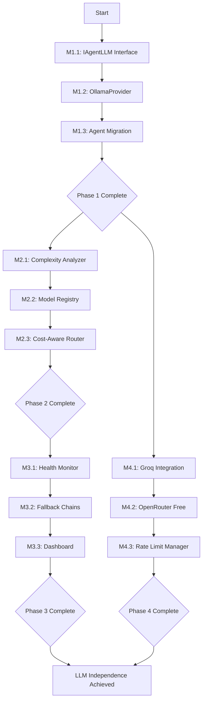

# AQE Fleet LLM Independence - GOAP Implementation Plan
**Date:** December 23, 2025
**Version:** 2.6.1
**Status:** RFC Implementation Plan
**Issue:** GitHub #142 - RFC: AQE Fleet LLM Independence

---

## Executive Summary

This Goal-Oriented Action Planning (GOAP) document outlines the implementation strategy to achieve complete LLM vendor independence for the AQE Fleet. The plan supports three deployment modes: local models, hosted APIs, and free cloud services.

### Current State
- **75% multi-model router complete** with working HybridRouter
- **HIGH vendor lock-in**: 31 files directly reference Claude API
- **Working providers**: ClaudeProvider, OpenRouterProvider, RuvllmProvider
- **Missing**: OllamaProvider, intelligent fallback chains, true multi-provider routing

### Goal State
- Zero vendor lock-in on any single LLM provider
- All 21 QE agents work with any LLM backend
- Three deployment tiers: Local, Hosted, Free Cloud
- Graceful fallback chains with automatic provider switching
- Cost optimization through intelligent model selection

---

## 1. Current State Analysis

### 1.1 What's Implemented (75%)

| Component | Status | Location |
|-----------|--------|----------|
| ILLMProvider Interface | 100% | `src/providers/ILLMProvider.ts` |
| ClaudeProvider | 100% | `src/providers/ClaudeProvider.ts` |
| OpenRouterProvider | 100% | `src/providers/OpenRouterProvider.ts` |
| RuvllmProvider | 95% | `src/providers/RuvllmProvider.ts` |
| HybridRouter | 80% | `src/providers/HybridRouter.ts` |
| Circuit Breakers | 100% | Implemented in HybridRouter |
| Cost Tracking | 100% | Implemented in all providers |
| RuVector Pattern Cache | 90% | `src/memory/RuVectorPatternStore.ts` |

### 1.2 What's Missing (25%)

| Component | Priority | Effort |
|-----------|----------|--------|
| OllamaProvider | CRITICAL | Medium |
| Agent abstraction layer | CRITICAL | High |
| Intelligent model routing | HIGH | Medium |
| Multi-provider fallback chains | HIGH | Medium |
| Free tier management | MEDIUM | Low |
| Provider health dashboard | LOW | Low |

### 1.3 Vendor Lock-in Severity

```
HIGH RISK: 31 files directly import ClaudeProvider or use Claude-specific APIs
- src/agents/*.ts (20 files)
- src/subagents/*.ts (11 files)

MEDIUM RISK: Config defaults to Claude
- .claude/settings.local.json
- package.json scripts

LOW RISK: Documentation references
- docs/**/*.md
```

---

## 2. Goal Decomposition (GOAP Milestones)

### Phase 1: Foundation (Effort: Medium)
**Goal:** Create provider-agnostic agent infrastructure

| Milestone | Preconditions | Actions | Effects |
|-----------|---------------|---------|---------|
| M1.1: Abstract Agent LLM Interface | HybridRouter exists | Create IAgentLLM interface | Agents decoupled from providers |
| M1.2: Implement OllamaProvider | ILLMProvider interface | Port RuvllmProvider patterns | Local model support complete |
| M1.3: Agent Migration | M1.1, M1.2 complete | Update all 31 agent files | Zero Claude direct imports |

### Phase 2: Intelligent Routing (Effort: Medium)
**Goal:** Smart model selection based on task requirements

| Milestone | Preconditions | Actions | Effects |
|-----------|---------------|---------|---------|
| M2.1: Task Complexity Analyzer | Agent abstraction | Implement complexity scoring | Tasks rated 1-10 complexity |
| M2.2: Model Capability Registry | OllamaProvider exists | Build model metadata store | Match tasks to capable models |
| M2.3: Cost-Aware Router | M2.1, M2.2 complete | Enhance HybridRouter | Automatic cost/quality tradeoff |

### Phase 3: Resilience (Effort: Low-Medium)
**Goal:** Automatic failover and recovery

| Milestone | Preconditions | Actions | Effects |
|-----------|---------------|---------|---------|
| M3.1: Provider Health Monitor | Multi-provider setup | Implement health checks | Real-time provider status |
| M3.2: Fallback Chain Config | M3.1 complete | User-configurable chains | Graceful degradation |
| M3.3: Circuit Breaker Dashboard | M3.2 complete | Visualize circuit states | Operational visibility |

### Phase 4: Free Tier Optimization (Effort: Low)
**Goal:** Support users without infrastructure or budget

| Milestone | Preconditions | Actions | Effects |
|-----------|---------------|---------|---------|
| M4.1: Groq Free Tier Integration | Phase 1 complete | Configure 14,400 req/day | Free high-speed inference |
| M4.2: OpenRouter Free Models | Phase 1 complete | Enable 30+ free models | Model variety at zero cost |
| M4.3: Rate Limit Manager | M4.1, M4.2 complete | Implement quota tracking | Stay within free limits |

---

## 3. Action Sequences

### 3.1 OllamaProvider Implementation

```
PRECONDITIONS:
  - ILLMProvider interface exists ✅
  - RuvllmProvider patterns available ✅
  - Ollama installed on target system

ACTIONS:
  1. Create src/providers/OllamaProvider.ts
  2. Implement all 13 ILLMProvider methods
  3. Add model discovery via Ollama API
  4. Support both chat and embeddings
  5. Implement health check with model ping
  6. Add streaming support
  7. Write unit tests (95% coverage target)
  8. Write integration tests with real Ollama

EFFECTS:
  - Local inference available
  - No API costs for local usage
  - Offline capability enabled
```

### 3.2 Agent Migration Pattern

```
PRECONDITIONS:
  - IAgentLLM interface defined
  - HybridRouter updated
  - OllamaProvider available

ACTIONS:
  For each of 31 agent files:
    1. Remove direct ClaudeProvider import
    2. Import IAgentLLM instead
    3. Update constructor to accept IAgentLLM
    4. Replace provider-specific calls with interface methods
    5. Update tests to use mock IAgentLLM
    6. Verify agent works with all 3 provider types

EFFECTS:
  - Agents work with any LLM backend
  - No vendor lock-in
  - Easy provider switching
```

### 3.3 Free Tier Configuration

```yaml
# Example: .aqe/providers.yaml
providers:
  free_tier:
    enabled: true
    primary: groq
    fallback:
      - openrouter_free
      - google_ai_studio

  groq:
    type: groq
    api_key: ${GROQ_API_KEY}
    model: llama-3.3-70b-versatile
    limits:
      requests_per_day: 14400
      tokens_per_minute: 6000

  openrouter_free:
    type: openrouter
    api_key: ${OPENROUTER_API_KEY}
    model: mistralai/devstral-small:free
    limits:
      requests_per_day: 50

  google_ai_studio:
    type: google
    api_key: ${GOOGLE_AI_API_KEY}
    model: gemini-2.5-flash-lite
    limits:
      requests_per_day: 1000
```

---

## 4. Priority Matrix

### Critical Path (Must Have)

| Item | Dependency | Risk if Skipped |
|------|------------|-----------------|
| OllamaProvider | None | Cannot support local models |
| Agent abstraction layer | OllamaProvider | Vendor lock-in remains |
| Fallback chain config | Agent abstraction | No resilience |

### High Priority (Should Have)

| Item | Dependency | Value |
|------|------------|-------|
| Task complexity analyzer | Agent abstraction | Better model selection |
| Cost-aware routing | Complexity analyzer | Cost optimization |
| Groq free tier | Fallback config | Free high-speed inference |

### Medium Priority (Nice to Have)

| Item | Dependency | Value |
|------|------------|-------|
| Provider dashboard | Health monitor | Operational visibility |
| Rate limit manager | Free tier setup | Stay within quotas |
| Model capability registry | Complexity analyzer | Smarter routing |

### Low Priority (Future)

| Item | Dependency | Value |
|------|------------|-------|
| Custom model fine-tuning | Full independence | Specialized QE models |
| Distributed inference | OllamaProvider | Scale local inference |
| Multi-region routing | Full independence | Global latency optimization |

---

## 5. Risk Assessment

### Technical Risks

| Risk | Probability | Impact | Mitigation |
|------|-------------|--------|------------|
| Ollama API changes | Low | Medium | Version pin, integration tests |
| Provider rate limiting | Medium | High | Multi-provider fallback |
| Model quality variance | High | Medium | Complexity-aware routing |
| Breaking changes in agents | Medium | High | Comprehensive test suite |

### Operational Risks

| Risk | Probability | Impact | Mitigation |
|------|-------------|--------|------------|
| Free tier quota exhaustion | High | Medium | Quota tracking, user warnings |
| Provider outages | Medium | High | Automatic failover chains |
| Configuration complexity | Medium | Medium | Sensible defaults, validation |

### Migration Risks

| Risk | Probability | Impact | Mitigation |
|------|-------------|--------|------------|
| Agent regression | Medium | High | Feature flags, gradual rollout |
| Performance degradation | Low | Medium | Benchmarks before/after |
| User confusion | Medium | Low | Clear documentation, examples |

---

## 6. Resource Requirements

### Development Effort (Story Points)

| Phase | Story Points | Complexity |
|-------|--------------|------------|
| Phase 1: Foundation | 21 SP | High |
| Phase 2: Intelligent Routing | 13 SP | Medium |
| Phase 3: Resilience | 8 SP | Low-Medium |
| Phase 4: Free Tier | 5 SP | Low |
| **Total** | **47 SP** | - |

### Technical Requirements

| Requirement | Purpose |
|-------------|---------|
| Ollama installed (local dev) | OllamaProvider testing |
| OpenRouter API key | Integration testing |
| Groq API key | Free tier testing |
| Multi-GPU test environment | RuvllmProvider verification |

---

## 7. Success Criteria

### Phase 1 Success Criteria
- [ ] OllamaProvider passes all ILLMProvider interface tests
- [ ] 0 direct Claude imports in agent files
- [ ] All 21 agents work with local Ollama models
- [ ] Integration tests pass with all 3 provider types

### Phase 2 Success Criteria
- [ ] Task complexity scoring correlates with model requirements
- [ ] Cost tracking accurate within 5% of actual spend
- [ ] Model selection matches task requirements 90%+ of time

### Phase 3 Success Criteria
- [ ] Automatic failover triggers within 5 seconds of provider failure
- [ ] Circuit breakers prevent cascade failures
- [ ] Health dashboard shows real-time provider status

### Phase 4 Success Criteria
- [ ] Users can run full QE workflows on free tiers only
- [ ] Rate limit warnings before quota exhaustion
- [ ] Automatic provider switching at quota limits

---

## 8. Provider Configuration Schema

### Provider Config Type Definition

```typescript
interface ProviderConfig {
  type: 'ollama' | 'openrouter' | 'groq' | 'claude' | 'ruvllm' | 'google' | 'together';
  enabled: boolean;
  priority: number; // Lower = higher priority

  // Authentication
  apiKey?: string;
  baseUrl?: string;

  // Model selection
  defaultModel: string;
  modelOverrides?: Record<TaskType, string>;

  // Rate limiting
  limits?: {
    requestsPerMinute?: number;
    requestsPerDay?: number;
    tokensPerMinute?: number;
    tokensPerDay?: number;
  };

  // Cost tracking
  costPer1MTokens?: {
    input: number;
    output: number;
  };

  // Health monitoring
  healthCheck?: {
    enabled: boolean;
    intervalMs: number;
    timeoutMs: number;
  };

  // Fallback
  fallbackProvider?: string;
}

type TaskType =
  | 'test-generation'
  | 'coverage-analysis'
  | 'code-review'
  | 'bug-detection'
  | 'documentation'
  | 'refactoring';
```

### Example User Configurations

#### Local-First Configuration
```yaml
# For users with local GPU hardware
mode: local_first
providers:
  - type: ollama
    priority: 1
    defaultModel: qwen3-coder:30b
    fallbackProvider: openrouter

  - type: openrouter
    priority: 2
    defaultModel: mistralai/devstral-2
    apiKey: ${OPENROUTER_API_KEY}
```

#### Hosted-Only Configuration
```yaml
# For users without local hardware
mode: hosted
providers:
  - type: groq
    priority: 1
    defaultModel: llama-3.3-70b-versatile
    apiKey: ${GROQ_API_KEY}

  - type: openrouter
    priority: 2
    defaultModel: anthropic/claude-sonnet-4
    apiKey: ${OPENROUTER_API_KEY}
```

#### Free-Tier-Only Configuration
```yaml
# For users without budget or hardware
mode: free_only
providers:
  - type: groq
    priority: 1
    defaultModel: llama-3.3-70b-versatile
    apiKey: ${GROQ_API_KEY}
    limits:
      requestsPerDay: 14400

  - type: openrouter
    priority: 2
    defaultModel: mistralai/devstral-small:free
    apiKey: ${OPENROUTER_API_KEY}
    limits:
      requestsPerDay: 50

  - type: google
    priority: 3
    defaultModel: gemini-2.5-flash-lite
    apiKey: ${GOOGLE_AI_API_KEY}
    limits:
      requestsPerDay: 1000
```

---

## 9. Recommended Open-Source Models

### By Use Case (Based on Research)

| Use Case | Model | Provider | Context | Notes |
|----------|-------|----------|---------|-------|
| Test Generation | Kimi-Dev-72B | Ollama/vLLM | 128K | 60.4% SWE-bench |
| Code Review | Devstral-2 (123B) | OpenRouter | 256K | 72.2% SWE-bench, 7x more efficient than Claude |
| Bug Analysis | RNJ-1 (8B) | Ollama | 32K | 20.8% SWE-bench at only 8B |
| Documentation | Llama 3.3 70B | Groq (free) | 128K | Strong text generation |
| Multi-file Refactoring | Qwen3-Coder-480B | OpenRouter | 256K-1M | SOTA agentic coding |
| Local/Edge | Devstral-Small-2 (24B) | Ollama | 256K | Apache 2.0, efficient |

### Recommended Free Provider Stack

1. **Primary: Groq** - 14,400 requests/day, 300+ tok/sec
2. **Secondary: OpenRouter** - 30+ free models, 50 requests/day
3. **Tertiary: Google AI Studio** - 1,000 requests/day (limited)

---

## 10. Implementation Order



---

## 11. Quick Start Commands

### After Implementation

```bash
# Initialize with local Ollama
aqe init --provider ollama --model qwen3-coder:30b

# Initialize with free cloud tier
aqe init --provider groq --free-tier

# Initialize with multi-provider fallback
aqe init --providers groq,openrouter,ollama --auto-fallback

# Check provider health
aqe providers status

# View quota usage
aqe providers quota
```

---

## 12. References

- [GitHub Issue #142](https://github.com/proffesor-for-testing/agentic-qe/issues/142)
- [Multi-Model Router Analysis](../research/multi-model-router-analysis-2025-12.md)
- [Open-Source LLM Models Research](../research/open-source-llm-models-2025-12.md)
- [LLM Providers Comparison](../research/llm-providers-comparison-2025-12.md)
- [Free Cloud LLM Services](../research/free-llm-cloud-services-2025-12.md)

---

**Generated by:** Agentic QE Fleet GOAP Planner
**Date:** December 23, 2025
