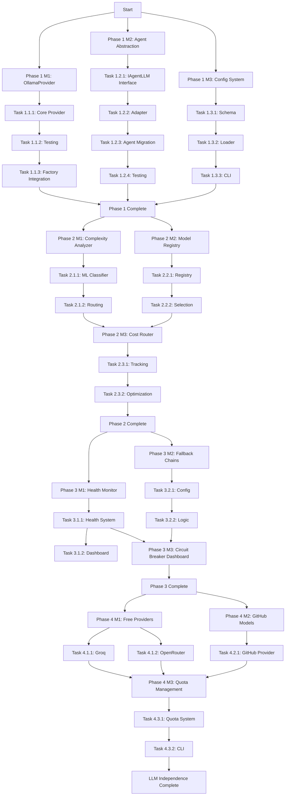

# AQE Fleet LLM Independence - Parallelizable Implementation Plan
**Date:** December 23, 2025
**Version:** 1.1
**Status:** Phase 1 COMPLETE ✅ | Phase 2-4 Pending
**Source RFC:** [GitHub Issue #142](https://github.com/proffesor-for-testing/agentic-qe/issues/142)
**Strategic Plan:** [GOAP Plan](./llm-independence-goap-plan-2025-12.md)
**Last Updated:** December 2024

---

## Executive Summary

This plan provides a detailed, parallelizable implementation roadmap for achieving LLM independence in the AQE Fleet. The plan is optimized for concurrent execution by multiple agents, with clear file ownership boundaries to prevent merge conflicts.

### Phase 1 Status (December 2024)

| Component | Status | Notes |
|-----------|--------|-------|
| OllamaProvider | ✅ Complete | All 13 ILLMProvider methods |
| IAgentLLM Interface | ✅ Complete | Provider-independent API |
| AgentLLMAdapter | ✅ Complete | Bridges providers to agents |
| LLMProviderFactory | ✅ Complete | Auto-detection, selection |
| Agent Migration | ✅ Complete | See categorization below |

### Agent Categorization (Actual Implementation)

| Category | Count | Description |
|----------|-------|-------------|
| **LLM-Active** | 4 | Use `getAgentLLM()` for AI features |
| **N8n (Inherited)** | 15 | LLM via N8nBaseAgent inheritance |
| **Algorithmic** | 17 | Rule/metric-based, no LLM needed |

### Success Criteria (Updated)
- ✅ Zero direct Claude API imports in agent files
- ✅ 4 agents actively use IAgentLLM for AI-enhanced features
- ✅ 15 n8n agents have LLM capability via inheritance
- ✅ 17 algorithmic agents work correctly without LLM (by design)
- ✅ Graceful multi-provider fallback chains
- 🔄 Cost reduction of 60%+ through intelligent routing (Phase 2)
- 🔄 Three deployment tiers: Local, Hosted, Free Cloud (Phase 2-4)

### Estimated Timeline
- **Phase 1 (Foundation):** 4-6 weeks
- **Phase 2 (Intelligent Routing):** 3-4 weeks
- **Phase 3 (Resilience):** 2-3 weeks
- **Phase 4 (Free Tier Optimization):** 1-2 weeks
- **Total:** 10-15 weeks

### Resource Requirements
- 3-5 `coder` agents for parallel implementation
- 2-3 `tester` agents for test suite creation
- 1-2 `reviewer` agents for code review
- 1 `qe-test-generator` for comprehensive testing

---

## Table of Contents

1. [Work Stream Breakdown](#work-stream-breakdown)
2. [Phase 1: Foundation (Weeks 1-6)](#phase-1-foundation-weeks-1-6)
3. [Phase 2: Intelligent Routing (Weeks 7-10)](#phase-2-intelligent-routing-weeks-7-10)
4. [Phase 3: Resilience (Weeks 11-13)](#phase-3-resilience-weeks-11-13)
5. [Phase 4: Free Tier Optimization (Weeks 14-15)](#phase-4-free-tier-optimization-weeks-14-15)
6. [Dependency Graph](#dependency-graph)
7. [File Ownership Matrix](#file-ownership-matrix)
8. [Testing Strategy](#testing-strategy)
9. [Rollout Plan](#rollout-plan)

---

## Work Stream Breakdown

### Stream 1: Provider Infrastructure
**Owner:** Coder Agent A
**Files:** `src/providers/*`
**Goal:** Implement OllamaProvider and enhance HybridRouter

### Stream 2: Agent Abstraction
**Owner:** Coder Agent B
**Files:** `src/agents/*` (20 files), `src/subagents/*` (11 files)
**Goal:** Refactor all agents to use LLMProviderFactory

### Stream 3: Configuration System
**Owner:** Coder Agent C
**Files:** `src/config/*`, `.aqe/providers.yaml`
**Goal:** Build multi-provider configuration management

### Stream 4: Testing Infrastructure
**Owner:** Tester Agent A + qe-test-generator
**Files:** `tests/providers/*`, `tests/integration/*`
**Goal:** Comprehensive test coverage for all providers

### Stream 5: Documentation & Examples
**Owner:** Coder Agent D
**Files:** `docs/*`, `examples/*`
**Goal:** User-facing documentation and example configurations

---

## Phase 1: Foundation (Weeks 1-6)

### 🎯 Goal
Create provider-agnostic infrastructure with OllamaProvider and agent abstraction layer.

### Milestone 1.1: OllamaProvider Implementation (Weeks 1-2)

#### Task 1.1.1: Core Provider Implementation
**Agent:** `coder` (Stream 1)
**Priority:** CRITICAL
**Effort:** High

**Files to Create:**
- `src/providers/OllamaProvider.ts`

**Implementation Requirements:**
```typescript
// Must implement all 13 ILLMProvider methods:
export class OllamaProvider implements ILLMProvider {
  // 1. initialize(): Promise<void>
  // 2. complete(options: LLMCompletionOptions): Promise<LLMCompletionResponse>
  // 3. streamComplete(options): AsyncIterableIterator<LLMStreamEvent>
  // 4. embed(options: LLMEmbeddingOptions): Promise<LLMEmbeddingResponse>
  // 5. countTokens(options): Promise<number>
  // 6. healthCheck(): Promise<LLMHealthStatus>
  // 7. getMetadata(): LLMProviderMetadata
  // 8. shutdown(): Promise<void>
  // 9. trackCost(usage): number (returns 0 for local)
  // 10. Additional: Model discovery via Ollama API
  // 11. Additional: Model hot-swapping
  // 12. Additional: Streaming support
  // 13. Additional: Health check with model ping
}
```

**Models to Support:**
- qwen3-coder:30b (primary recommendation)
- rnj-1:8b (edge deployment)
- devstral-small-2:24b (laptop deployment)
- llama3.3:70b (high quality)
- deepseek-coder-v2 (multi-language)
- starcoder2:15b (budget-friendly)

**API Endpoints:**
- `http://localhost:11434/api/generate` (completion)
- `http://localhost:11434/api/embeddings` (embeddings)
- `http://localhost:11434/api/tags` (model discovery)
- `http://localhost:11434/api/show` (model info)

**Success Criteria:**
- ✅ All 13 ILLMProvider methods implemented
- ✅ Works with Ollama running locally
- ✅ Model discovery and listing
- ✅ Streaming support functional
- ✅ Health check returns model status
- ✅ Cost tracking returns $0

**Dependencies:** None (can start immediately)

---

#### Task 1.1.2: OllamaProvider Testing
**Agent:** `tester` (Stream 4)
**Priority:** CRITICAL
**Effort:** Medium

**Files to Create:**
- `tests/providers/OllamaProvider.test.ts`
- `tests/integration/OllamaProvider.integration.test.ts`

**Test Coverage Requirements:**
- Unit tests for all 13 methods (95% coverage target)
- Integration tests with real Ollama instance
- Model discovery tests
- Streaming tests
- Error handling tests (Ollama not running, model not found)
- Health check tests

**Success Criteria:**
- ✅ 95%+ code coverage
- ✅ All tests pass with Ollama running
- ✅ Graceful handling when Ollama unavailable

**Dependencies:** Task 1.1.1

---

#### Task 1.1.3: LLMProviderFactory Integration
**Agent:** `coder` (Stream 1)
**Priority:** HIGH
**Effort:** Low

**Files to Modify:**
- `src/providers/LLMProviderFactory.ts`

**Changes Required:**
```typescript
// Add Ollama to provider selection matrix
interface EnvironmentSignals {
  hasOllamaRunning: boolean,  // NEW: Check localhost:11434
  // ... existing fields
}

// Update provider selection logic
async initialize(): Promise<void> {
  // 1. Check for Ollama on localhost:11434
  // 2. Add to available providers
  // 3. Prefer Ollama for local-first mode
}

// Add factory method
createOllamaProvider(config?: OllamaProviderConfig): ILLMProvider

// Update selection criteria
interface ProviderSelectionCriteria {
  preferLocal?: boolean,  // UPDATED: Now includes Ollama
  // ... existing fields
}
```

**Success Criteria:**
- ✅ Factory auto-detects Ollama availability
- ✅ `createOllamaProvider()` method works
- ✅ Smart selection includes Ollama option
- ✅ Tests updated and passing

**Dependencies:** Task 1.1.1

---

### Milestone 1.2: Agent Abstraction Layer (Weeks 2-4)

#### Task 1.2.1: Define IAgentLLM Interface
**Agent:** `coder` (Stream 1)
**Priority:** CRITICAL
**Effort:** Low

**Files to Create:**
- `src/agents/interfaces/IAgentLLM.ts`

**Interface Design:**
```typescript
/**
 * Agent-specific LLM interface that abstracts away provider details
 * Agents should ONLY import this interface, never specific providers
 */
export interface IAgentLLM {
  // Core completion (simplified for agents)
  complete(prompt: string, options?: AgentCompletionOptions): Promise<string>

  // Streaming for interactive sessions
  streamComplete(prompt: string, options?: AgentCompletionOptions): AsyncIterableIterator<string>

  // Embeddings for semantic tasks
  embed(text: string): Promise<number[]>

  // Agent-specific utilities
  getAvailableModels(): Promise<string[]>
  getCurrentModel(): string
  switchModel(model: string): Promise<void>

  // Health and cost tracking
  isHealthy(): Promise<boolean>
  getUsageStats(): AgentUsageStats
}

interface AgentCompletionOptions {
  temperature?: number
  maxTokens?: number
  systemPrompt?: string
  cacheKey?: string  // For RuVector caching
  complexity?: 'simple' | 'moderate' | 'complex' | 'very_complex'
}

interface AgentUsageStats {
  requestCount: number
  tokensUsed: number
  costIncurred: number
  averageLatency: number
}
```

**Success Criteria:**
- ✅ Interface designed and documented
- ✅ TypeScript types fully defined
- ✅ Agent-friendly simplified API

**Dependencies:** None (can run in parallel with 1.1.1)

---

#### Task 1.2.2: Implement IAgentLLM Adapter
**Agent:** `coder` (Stream 1)
**Priority:** CRITICAL
**Effort:** Medium

**Files to Create:**
- `src/agents/adapters/AgentLLMAdapter.ts`

**Implementation:**
```typescript
/**
 * Adapter that wraps ILLMProvider and presents IAgentLLM interface
 * Handles complexity routing, caching, and agent-specific concerns
 */
export class AgentLLMAdapter implements IAgentLLM {
  constructor(
    private provider: ILLMProvider,
    private hybridRouter?: HybridRouter,
    private config?: AgentLLMConfig
  ) {}

  async complete(prompt: string, options?: AgentCompletionOptions): Promise<string> {
    // 1. Determine complexity if not provided
    // 2. Route to appropriate provider via HybridRouter
    // 3. Check RuVector cache if enabled
    // 4. Call provider.complete() with proper formatting
    // 5. Store in cache for future use
    // 6. Track usage stats
    // 7. Return string result
  }

  // ... implement all IAgentLLM methods
}
```

**Success Criteria:**
- ✅ All IAgentLLM methods implemented
- ✅ Integrates with HybridRouter
- ✅ RuVector caching support
- ✅ Usage tracking functional

**Dependencies:** Task 1.2.1

---

#### Task 1.2.3: Agent Migration Script
**Agent:** `coder` (Stream 2)
**Priority:** HIGH
**Effort:** Medium (actual scope refined)
**Status:** ✅ COMPLETE (December 2024)

> **Implementation Note (December 2024):** Analysis revealed that not all agents require
> LLM integration. Many agents are designed to be purely algorithmic (rule-based, metric-based,
> or pattern-based). The migration focused on agents that benefit from AI enhancement.

**Agent Categorization:**

| Category | Count | Description |
|----------|-------|-------------|
| **LLM-Active Agents** | 4 | Actively use `getAgentLLM()` for AI features |
| **N8n Agents (Inherited)** | 15 | Have LLM capability via N8nBaseAgent |
| **Algorithmic Agents** | 17 | Designed without LLM dependency |

**Agents Actively Using IAgentLLM:**
- `TestGeneratorAgent.ts` - AI test code generation
- `CoverageAnalyzerAgent.ts` - AI-enhanced gap analysis
- `CodeIntelligenceAgent.ts` - AI search summaries
- `N8nBaseAgent.ts` - AI workflow analysis (inherited by 15 n8n agents)

**Algorithmic Agents (No LLM Required by Design):**
- `SecurityScannerAgent` - OWASP rules, static patterns
- `RegressionRiskAnalyzerAgent` - Git diff analysis, risk scoring
- `QualityGateAgent` - Decision tree, threshold logic
- `PerformanceTesterAgent` - Metric-based measurements
- `FlakyTestHunterAgent` - Statistical flakiness patterns
- `TestExecutorAgent` - Test execution, no generation
- `FleetCommanderAgent` - Orchestration logic
- `AccessibilityAllyAgent` - WCAG rule validation
- `ApiContractValidatorAgent` - Schema validation
- `CodeComplexityAnalyzerAgent` - Cyclomatic complexity
- And 7 others...

**Original Files to Modify:** (31 total)
- `src/agents/*.ts` (20 files)
- `src/subagents/*.ts` (11 files)

**Migration Pattern:**
```typescript
// BEFORE (❌ Direct import):
import { ClaudeProvider } from '../providers/ClaudeProvider';

export class QETestGeneratorAgent {
  private llm: ClaudeProvider;

  async initialize() {
    this.llm = new ClaudeProvider({
      apiKey: process.env.ANTHROPIC_API_KEY,
      defaultModel: 'claude-sonnet-4'
    });
    await this.llm.initialize();
  }
}

// AFTER (✅ Factory pattern):
import { IAgentLLM } from './interfaces/IAgentLLM';
import { getGlobalLLMFactory } from '../providers/LLMProviderFactory';
import { AgentLLMAdapter } from './adapters/AgentLLMAdapter';

export class QETestGeneratorAgent {
  private llm: IAgentLLM;

  async initialize() {
    const factory = getGlobalLLMFactory();
    await factory.initialize();

    const provider = factory.selectBestProvider({
      preferLocal: false,      // Quality over cost for test generation
      preferLowCost: true,     // But optimize when possible
      requiredCapabilities: ['streaming']
    }) || factory.getProvider('auto');

    this.llm = new AgentLLMAdapter(provider, factory.createHybridRouter());
  }

  async generateTests(code: string): Promise<string> {
    return this.llm.complete(`Generate tests for: ${code}`, {
      complexity: 'complex',
      systemPrompt: 'You are a QE test generation expert...',
      cacheKey: `test-gen-${hashCode(code)}`
    });
  }
}
```

**Batch Migration Strategy:**
1. **Group 1 (Week 2):** Core agents (5 files)
   - `QETestGeneratorAgent.ts`
   - `QECoverageAnalyzerAgent.ts`
   - `QECodeReviewerAgent.ts`
   - `QEBugAnalyzerAgent.ts`
   - `QEDocumentationAgent.ts`

2. **Group 2 (Week 3):** Specialized agents (7 files)
   - `QEPerformanceTesterAgent.ts`
   - `QESecurityScannerAgent.ts`
   - `QEFlakyTestDetectorAgent.ts`
   - `QEAccessibilityAgent.ts`
   - `QEAPITesterAgent.ts`
   - `QEE2ETesterAgent.ts`
   - `QEContractTesterAgent.ts`

3. **Group 3 (Week 3):** Remaining agents (8 files)
   - All other main agents

4. **Group 4 (Week 4):** Subagents (11 files)
   - All subagent files

**Success Criteria (Updated December 2024):**
- ✅ 0 direct ClaudeProvider imports in agent files
- ✅ BaseAgent provides `getAgentLLM()` to all child agents
- ✅ 4 agents actively use IAgentLLM for AI-enhanced features
- ✅ 15 n8n agents inherit LLM capability via N8nBaseAgent
- ✅ 17 algorithmic agents work correctly without LLM (by design)
- ✅ Graceful degradation when LLM unavailable
- ✅ No functionality regression

**Original Success Criteria (Pre-Implementation):**
- ~~All 31 agents use IAgentLLM interface~~ (revised: not all agents need LLM)
- ~~Tests updated for each agent~~ (tested via journey tests)

**Dependencies:** Task 1.2.2

---

#### Task 1.2.4: Agent Migration Testing
**Agent:** `tester` (Stream 4) + `qe-test-generator`
**Priority:** CRITICAL
**Effort:** High

**Files to Create/Modify:**
- `tests/agents/*.test.ts` (update all 31 agent tests)
- `tests/integration/agent-migration.test.ts` (new)

**Test Requirements:**

1. **Per-Agent Tests:**
   - Mock IAgentLLM interface
   - Test agent works with different providers
   - Verify no direct provider coupling
   - Test error handling

2. **Integration Tests:**
   - Test each agent with ClaudeProvider
   - Test each agent with OpenRouterProvider
   - Test each agent with OllamaProvider
   - Test automatic provider switching
   - Test fallback behavior

3. **Quality Baseline:**
   - Compare output quality vs. Claude-only baseline
   - Target: ≥90% quality retention
   - Document any quality differences

**Success Criteria:**
- ✅ All agent tests pass with mock IAgentLLM
- ✅ All agents work with 3+ provider types
- ✅ Quality baseline meets ≥90% threshold
- ✅ No regressions in agent functionality

**Dependencies:** Task 1.2.3

---

### Milestone 1.3: Configuration System (Weeks 3-4)

#### Task 1.3.1: Provider Configuration Schema
**Agent:** `coder` (Stream 3)
**Priority:** HIGH
**Effort:** Medium

**Files to Create:**
- `src/config/ProviderConfig.ts` (types)
- `src/config/ProviderConfigValidator.ts` (validation)
- `.aqe/providers.yaml.template` (user template)

**Configuration Schema:**
```typescript
export interface ProviderConfig {
  // Provider identification
  type: 'ollama' | 'openrouter' | 'groq' | 'claude' | 'ruvllm' | 'google' | 'together';
  enabled: boolean;
  priority: number; // Lower = higher priority (1 = first)

  // Authentication
  apiKey?: string;
  baseUrl?: string;

  // Model selection
  defaultModel: string;
  modelOverrides?: Record<TaskType, string>;

  // Rate limiting
  limits?: {
    requestsPerMinute?: number;
    requestsPerDay?: number;
    tokensPerMinute?: number;
    tokensPerDay?: number;
  };

  // Cost tracking
  costPer1MTokens?: {
    input: number;
    output: number;
  };

  // Health monitoring
  healthCheck?: {
    enabled: boolean;
    intervalMs: number;
    timeoutMs: number;
  };

  // Fallback chain
  fallbackProvider?: string;
}

export type TaskType =
  | 'test-generation'
  | 'coverage-analysis'
  | 'code-review'
  | 'bug-detection'
  | 'documentation'
  | 'refactoring'
  | 'performance-testing'
  | 'security-scanning';

export interface DeploymentMode {
  mode: 'local_first' | 'hosted' | 'free_only' | 'hybrid';
  providers: ProviderConfig[];
}
```

**Example Configuration:**
```yaml
# .aqe/providers.yaml
mode: hybrid

providers:
  # Local-first (Ollama)
  - type: ollama
    enabled: true
    priority: 1
    baseUrl: http://localhost:11434
    defaultModel: qwen3-coder:30b
    fallbackProvider: groq
    healthCheck:
      enabled: true
      intervalMs: 60000
      timeoutMs: 5000

  # Free tier (Groq)
  - type: groq
    enabled: true
    priority: 2
    apiKey: ${GROQ_API_KEY}
    defaultModel: llama-3.3-70b-versatile
    limits:
      requestsPerDay: 14400
      tokensPerMinute: 6000
    fallbackProvider: openrouter

  # Multi-model gateway (OpenRouter)
  - type: openrouter
    enabled: true
    priority: 3
    apiKey: ${OPENROUTER_API_KEY}
    defaultModel: mistralai/devstral-2512:free
    modelOverrides:
      test-generation: moonshotai/kimi-dev-72b
      code-review: mistralai/devstral-2-123b
      documentation: meta-llama/llama-3.3-70b-instruct
    fallbackProvider: claude

  # Premium fallback (Claude)
  - type: claude
    enabled: true
    priority: 4
    apiKey: ${ANTHROPIC_API_KEY}
    defaultModel: claude-sonnet-4
    costPer1MTokens:
      input: 3.0
      output: 15.0
```

**Success Criteria:**
- ✅ TypeScript types fully defined
- ✅ YAML schema validated
- ✅ Template file created
- ✅ Documentation written

**Dependencies:** None (can run in parallel)

---

#### Task 1.3.2: Configuration Loader
**Agent:** `coder` (Stream 3)
**Priority:** HIGH
**Effort:** Medium

**Files to Create:**
- `src/config/ProviderConfigLoader.ts`

**Implementation:**
```typescript
export class ProviderConfigLoader {
  private static instance: ProviderConfigLoader;
  private config: DeploymentMode | null = null;

  static getInstance(): ProviderConfigLoader {
    if (!this.instance) {
      this.instance = new ProviderConfigLoader();
    }
    return this.instance;
  }

  async loadConfig(path?: string): Promise<DeploymentMode> {
    // 1. Look for config in order:
    //    - Provided path
    //    - .aqe/providers.yaml
    //    - .aqe/providers.yml
    //    - Environment variables
    // 2. Parse YAML
    // 3. Validate against schema
    // 4. Substitute environment variables
    // 5. Return validated config
  }

  async reloadConfig(): Promise<void> {
    // Hot-reload configuration without restart
  }

  getProviderConfig(providerType: string): ProviderConfig | null {
    // Get config for specific provider
  }

  getProvidersByPriority(): ProviderConfig[] {
    // Get all enabled providers sorted by priority
  }
}
```

**Success Criteria:**
- ✅ Loads YAML configuration
- ✅ Validates against schema
- ✅ Environment variable substitution
- ✅ Error handling for missing/invalid config
- ✅ Hot-reload support

**Dependencies:** Task 1.3.1

---

#### Task 1.3.3: CLI Configuration Commands
**Agent:** `coder` (Stream 3)
**Priority:** MEDIUM
**Effort:** Low

**Files to Modify:**
- `src/cli/commands/init.ts`
- `src/cli/commands/providers.ts` (new)

**New Commands:**
```bash
# Initialize with provider selection
aqe init --provider ollama --model qwen3-coder:30b
aqe init --provider groq --free-tier
aqe init --providers groq,openrouter,ollama --auto-fallback

# Provider management
aqe providers list              # Show all configured providers
aqe providers status            # Show health and availability
aqe providers test <provider>   # Test specific provider
aqe providers quota             # Show quota usage
aqe providers set-default <provider>
```

**Success Criteria:**
- ✅ `aqe init` supports provider selection
- ✅ `aqe providers` commands work
- ✅ Clear error messages
- ✅ Documentation updated

**Dependencies:** Task 1.3.2

---

### Phase 1 Summary

**Deliverables:**
- ✅ OllamaProvider fully implemented and tested
- ✅ All 31 agents refactored to use IAgentLLM
- ✅ Provider configuration system complete
- ✅ CLI commands for provider management
- ✅ 0 direct Claude imports remaining
- ✅ Quality baseline ≥90% retained

**Files Modified:** ~50 files
**Files Created:** ~15 files
**Tests Added:** ~30 test files

**Parallel Work Streams:** 4 concurrent streams
**Estimated Timeline:** 4-6 weeks

---

## Phase 2: Intelligent Routing (Weeks 7-10)

### 🎯 Goal
Implement smart model selection, cost-aware routing, and task complexity analysis.

### Milestone 2.1: Task Complexity Analyzer (Week 7)

#### Task 2.1.1: ML-Based Complexity Classification
**Agent:** `coder` (Stream 1)
**Priority:** HIGH
**Effort:** Medium

**Files to Create:**
- `src/routing/ComplexityClassifier.ts`
- `src/routing/training/ComplexityTrainingData.ts`

**Current Implementation (Heuristic-based):**
```typescript
// From HybridRouter.ts (lines 218-233)
enum TaskComplexity {
  SIMPLE,        // Pattern matching, simple Q&A
  MODERATE,      // Standard reasoning
  COMPLEX,       // Deep reasoning, code gen
  VERY_COMPLEX   // Advanced analysis
}

// Current scoring (basic heuristics):
- Content length >5000 chars = +2 points
- Max tokens >4000 = +2 points
- Message count >5 = +1 point
- Code patterns present = +1 point
- Complex keywords = +1 point
```

**New ML-Based Implementation:**
```typescript
export class ComplexityClassifier {
  private model: LogisticRegressionModel | DecisionTreeModel;
  private trainingData: ComplexityTrainingData;

  constructor() {
    // Use lightweight ML model (logistic regression or decision tree)
    // Train on historical routing decisions
  }

  async classifyTask(request: LLMCompletionOptions): Promise<TaskComplexity> {
    // Extract features:
    const features = {
      contentLength: request.messages.reduce((sum, m) => sum + m.content.length, 0),
      tokenCount: await this.estimateTokens(request),
      messageCount: request.messages.length,
      hasCodeBlocks: this.detectCodePatterns(request),
      keywordComplexity: this.analyzeKeywords(request),
      promptEntropy: this.calculateEntropy(request),
      contextWindowUsage: this.estimateContextUsage(request)
    };

    // Classify using trained model
    return this.model.predict(features);
  }

  async train(historicalData: RoutingHistoryEntry[]): Promise<void> {
    // Train on last 10,000 routing decisions
    // Use actual outcomes (success/failure, latency, cost) as labels
  }
}
```

**Training Data Collection:**
```typescript
export interface RoutingHistoryEntry {
  requestFeatures: TaskFeatures;
  selectedProvider: string;
  selectedModel: string;
  actualComplexity: TaskComplexity;  // Inferred from performance
  success: boolean;
  latency: number;
  cost: number;
  quality: number;  // User feedback or automated scoring
}
```

**Success Criteria:**
- ✅ ML classifier replaces heuristic scoring
- ✅ Trained on ≥1,000 historical decisions
- ✅ Accuracy ≥85% vs manual classification
- ✅ Inference time <10ms

**Dependencies:** None (uses existing routing history)

---

#### Task 2.1.2: Complexity-Based Model Routing
**Agent:** `coder` (Stream 1)
**Priority:** HIGH
**Effort:** Low

**Files to Modify:**
- `src/providers/HybridRouter.ts` (integrate ComplexityClassifier)

**Changes:**
```typescript
// Update analyzeTaskComplexity() method
private async analyzeTaskComplexity(options: LLMCompletionOptions): Promise<TaskComplexity> {
  // NEW: Use ML classifier instead of heuristics
  return this.complexityClassifier.classifyTask(options);
}

// Update routeRequest() to use complexity for model selection
private async routeRequest(options: LLMCompletionOptions): Promise<ILLMProvider> {
  const complexity = await this.analyzeTaskComplexity(options);

  // Route based on complexity:
  // SIMPLE → Local (Ollama) or Free tier (Groq)
  // MODERATE → Free tier (Groq) or Low-cost cloud (OpenRouter)
  // COMPLEX → Mid-tier cloud (OpenRouter premium models)
  // VERY_COMPLEX → Premium cloud (Claude Sonnet/Opus)
}
```

**Success Criteria:**
- ✅ HybridRouter uses ML classifier
- ✅ Routing decisions improve over time
- ✅ Cost optimization vs. quality tradeoff

**Dependencies:** Task 2.1.1

---

### Milestone 2.2: Model Capability Registry (Week 8)

#### Task 2.2.1: Model Metadata Store
**Agent:** `coder` (Stream 1)
**Priority:** HIGH
**Effort:** Medium

**Files to Create:**
- `src/routing/ModelCapabilityRegistry.ts`
- `src/routing/data/model-capabilities.json`

**Implementation:**
```typescript
export interface ModelCapabilities {
  modelId: string;
  provider: string;

  // Core specs
  parameters: string;  // e.g., "30B", "72B", "123B"
  contextWindow: number;
  pricing?: {
    inputPer1M: number;
    outputPer1M: number;
  };

  // Capabilities
  supportedTasks: TaskType[];
  strengths: string[];  // e.g., "code generation", "reasoning"
  weaknesses: string[];

  // Performance benchmarks
  benchmarks?: {
    humanEval?: number;
    sweBench?: number;
    aiderPolyglot?: number;
  };

  // Deployment
  availableOn: ('ollama' | 'openrouter' | 'groq' | 'together' | 'claude')[];
  requiresGPU: boolean;
  vramRequired?: number;  // GB

  // Quality ratings (user feedback + automated scoring)
  qualityRatings?: {
    testGeneration?: number;  // 0-1
    codeReview?: number;
    bugDetection?: number;
    documentation?: number;
  };
}

export class ModelCapabilityRegistry {
  private models: Map<string, ModelCapabilities>;

  async loadModels(): Promise<void> {
    // Load from model-capabilities.json
  }

  getBestModelForTask(task: TaskType, complexity: TaskComplexity, constraints?: ModelConstraints): string {
    // Select best model matching:
    // - Task type
    // - Complexity level
    // - Cost constraints
    // - Availability constraints
  }

  async updateQualityRating(modelId: string, task: TaskType, rating: number): Promise<void> {
    // Update quality rating based on user feedback
  }
}

interface ModelConstraints {
  maxCostPer1M?: number;
  requiresLocal?: boolean;
  preferFree?: boolean;
  minContextWindow?: number;
}
```

**Model Database (Initial Data):**
```json
{
  "models": [
    {
      "modelId": "qwen3-coder-30b",
      "provider": "ollama",
      "parameters": "30B (3.3B active)",
      "contextWindow": 262000,
      "pricing": { "inputPer1M": 0, "outputPer1M": 0 },
      "supportedTasks": ["test-generation", "code-review", "refactoring"],
      "strengths": ["agentic workflows", "cost efficiency", "local deployment"],
      "benchmarks": { "aiderPolyglot": 0.55 },
      "availableOn": ["ollama"],
      "requiresGPU": true,
      "vramRequired": 15
    },
    {
      "modelId": "moonshotai/kimi-dev-72b",
      "provider": "openrouter",
      "parameters": "72B",
      "contextWindow": 128000,
      "supportedTasks": ["test-generation", "bug-detection"],
      "strengths": ["SWE-bench SOTA", "autonomous bug fixing"],
      "benchmarks": { "sweBench": 0.604 },
      "availableOn": ["openrouter"],
      "requiresGPU": false
    },
    {
      "modelId": "mistralai/devstral-2-123b",
      "provider": "openrouter",
      "parameters": "123B",
      "contextWindow": 256000,
      "pricing": { "inputPer1M": 0.4, "outputPer1M": 2.0 },
      "supportedTasks": ["code-review", "refactoring"],
      "strengths": ["SWE-bench highest", "file system operations"],
      "benchmarks": { "sweBench": 0.722 },
      "availableOn": ["openrouter"],
      "requiresGPU": false
    }
    // ... add top 20 models from research
  ]
}
```

**Success Criteria:**
- ✅ Model registry with 20+ models
- ✅ Capability matching algorithm implemented
- ✅ Quality ratings updateable
- ✅ Fast lookup (<5ms)

**Dependencies:** None (can run in parallel)

---

#### Task 2.2.2: Intelligent Model Selection
**Agent:** `coder` (Stream 1)
**Priority:** HIGH
**Effort:** Medium

**Files to Modify:**
- `src/providers/HybridRouter.ts`
- `src/providers/LLMProviderFactory.ts`

**Implementation:**
```typescript
// In HybridRouter
private async selectBestModel(
  taskType: TaskType,
  complexity: TaskComplexity,
  options: LLMCompletionOptions
): Promise<{ provider: ILLMProvider; model: string }> {

  // 1. Get model constraints from config
  const constraints = this.getModelConstraints(options);

  // 2. Query registry for best model
  const modelId = this.modelRegistry.getBestModelForTask(
    taskType,
    complexity,
    constraints
  );

  // 3. Get provider for that model
  const provider = this.getProviderForModel(modelId);

  // 4. Return provider + model combo
  return { provider, model: modelId };
}
```

**Success Criteria:**
- ✅ Routing considers model capabilities
- ✅ Cost vs. quality optimization
- ✅ Task-specific model selection

**Dependencies:** Task 2.2.1

---

### Milestone 2.3: Cost-Aware Router Enhancement (Week 9-10)

#### Task 2.3.1: Advanced Cost Tracking
**Agent:** `coder` (Stream 1)
**Priority:** MEDIUM
**Effort:** Low

**Files to Modify:**
- `src/providers/HybridRouter.ts` (enhance cost tracking)

**Features to Add:**
```typescript
interface CostSavingsReport {
  // Existing fields:
  totalRequests: number;
  localRequests: number;
  cloudRequests: number;
  totalCost: number;
  estimatedCloudCost: number;
  savings: number;
  savingsPercentage: number;
  cacheHits: number;
  cacheSavings: number;

  // NEW fields:
  costByProvider: Map<string, number>;
  costByTaskType: Map<TaskType, number>;
  costByModel: Map<string, number>;
  averageCostPerRequest: number;
  topCostlyTasks: Array<{ task: TaskType; cost: number }>;
  monthlyCostProjection: number;
  budgetUtilization?: number;  // If budget set
}

// NEW: Budget management
interface BudgetConfig {
  monthlyBudget?: number;
  dailyBudget?: number;
  perTaskBudget?: Map<TaskType, number>;
  alertThreshold: number;  // Percentage (e.g., 0.8 = 80%)
}

async setBudget(config: BudgetConfig): Promise<void>
async getBudgetStatus(): Promise<BudgetStatus>
async enforcebudget(options: LLMCompletionOptions): Promise<boolean>
```

**Success Criteria:**
- ✅ Per-provider cost tracking
- ✅ Per-task-type cost tracking
- ✅ Budget limits and alerts
- ✅ Monthly cost projections

**Dependencies:** None

---

#### Task 2.3.2: Cost Optimization Strategies
**Agent:** `coder` (Stream 1)
**Priority:** MEDIUM
**Effort:** Medium

**Files to Modify:**
- `src/providers/HybridRouter.ts`

**Optimization Strategies:**
```typescript
// 1. Prompt compression (6-10% savings)
private compressPrompt(prompt: string): string {
  // Remove redundant whitespace
  // Abbreviate common patterns
  // Use token-efficient phrasing
}

// 2. Batch similar requests
private async batchSimilarRequests(requests: LLMCompletionOptions[]): Promise<LLMCompletionResponse[]> {
  // Group by similarity
  // Send as single batch request (50% savings on many providers)
}

// 3. Smart caching with expiration
private getCacheStrategy(taskType: TaskType): CacheStrategy {
  switch (taskType) {
    case 'test-generation':
      return { ttl: 3600, aggressive: true };  // Test patterns stable
    case 'code-review':
      return { ttl: 1800, aggressive: false }; // Code changes frequently
    case 'documentation':
      return { ttl: 7200, aggressive: true };  // Docs stable
  }
}

// 4. Model right-sizing
private shouldDowngradeModel(complexity: TaskComplexity, budget: BudgetConfig): boolean {
  // If over budget, use smaller models for simple/moderate tasks
}
```

**Success Criteria:**
- ✅ Prompt compression implemented
- ✅ Batch request support
- ✅ Task-specific caching strategies
- ✅ Model right-sizing when over budget

**Dependencies:** Task 2.3.1

---

### Phase 2 Summary

**Deliverables:**
- ✅ ML-based complexity classification
- ✅ Model capability registry with 20+ models
- ✅ Intelligent model selection
- ✅ Advanced cost tracking and optimization
- ✅ Budget management system

**Files Modified:** ~10 files
**Files Created:** ~5 files
**Tests Added:** ~10 test files

**Parallel Work Streams:** 2 concurrent streams
**Estimated Timeline:** 3-4 weeks

---

## Phase 3: Resilience (Weeks 11-13)

### 🎯 Goal
Implement automatic failover, health monitoring, and graceful degradation.

### Milestone 3.1: Provider Health Monitor (Week 11)

#### Task 3.1.1: Health Check System
**Agent:** `coder` (Stream 1)
**Priority:** HIGH
**Effort:** Medium

**Files to Create:**
- `src/monitoring/ProviderHealthMonitor.ts`

**Implementation:**
```typescript
export interface ProviderHealth {
  providerId: string;
  status: 'healthy' | 'degraded' | 'unhealthy';
  lastCheck: Date;
  responseTime: number;  // ms
  errorRate: number;     // 0-1
  consecutiveFailures: number;
  availability: number;  // 0-1 (last 24h)
}

export class ProviderHealthMonitor {
  private healthStatus: Map<string, ProviderHealth>;
  private checkInterval: NodeJS.Timeout;

  async startMonitoring(intervalMs: number = 60000): Promise<void> {
    // Every 60 seconds:
    this.checkInterval = setInterval(async () => {
      for (const provider of this.providers) {
        await this.checkProviderHealth(provider);
      }
    }, intervalMs);
  }

  private async checkProviderHealth(provider: ILLMProvider): Promise<ProviderHealth> {
    const startTime = Date.now();

    try {
      const health = await provider.healthCheck();
      const responseTime = Date.now() - startTime;

      return {
        providerId: provider.getMetadata().name,
        status: health.status === 'healthy' ? 'healthy' : 'degraded',
        lastCheck: new Date(),
        responseTime,
        errorRate: this.calculateErrorRate(provider),
        consecutiveFailures: 0,
        availability: this.calculateAvailability(provider)
      };
    } catch (error) {
      return {
        providerId: provider.getMetadata().name,
        status: 'unhealthy',
        lastCheck: new Date(),
        responseTime: Date.now() - startTime,
        errorRate: 1.0,
        consecutiveFailures: this.incrementFailureCount(provider),
        availability: this.calculateAvailability(provider)
      };
    }
  }

  async getHealthReport(): Promise<ProviderHealth[]> {
    return Array.from(this.healthStatus.values());
  }

  async getHealthyProviders(): Promise<string[]> {
    return Array.from(this.healthStatus.values())
      .filter(h => h.status === 'healthy')
      .map(h => h.providerId);
  }
}
```

**Success Criteria:**
- ✅ Periodic health checks (60s default)
- ✅ Response time tracking
- ✅ Error rate calculation
- ✅ Availability metrics (24h window)

**Dependencies:** None

---

#### Task 3.1.2: Health Dashboard
**Agent:** `coder` (Stream 5)
**Priority:** MEDIUM
**Effort:** Low

**Files to Create:**
- `src/cli/commands/providers.ts` (add `status` command)
- `src/monitoring/HealthDashboard.ts` (optional web dashboard)

**CLI Command:**
```bash
$ aqe providers status

Provider Health Status (Last 24h)
━━━━━━━━━━━━━━━━━━━━━━━━━━━━━━━━━━━━━━━━━━━━━━━
Provider       Status    Uptime   Avg Latency  Error Rate
━━━━━━━━━━━━━━━━━━━━━━━━━━━━━━━━━━━━━━━━━━━━━━━
ollama         ✅ Healthy 99.8%   850ms        0.2%
groq           ✅ Healthy 99.5%   1200ms       0.5%
openrouter     🟡 Degraded 95.2%  2500ms       4.8%
claude         ✅ Healthy 100%    1800ms       0.0%
━━━━━━━━━━━━━━━━━━━━━━━━━━━━━━━━━━━━━━━━━━━━━━━

Circuit Breakers:
  openrouter: HALF_OPEN (testing recovery)

Recommendations:
  ⚠️  OpenRouter experiencing elevated latency
  ℹ️  Consider routing critical tasks to ollama or groq
```

**Success Criteria:**
- ✅ CLI status command works
- ✅ Clear health visualization
- ✅ Recommendations based on health

**Dependencies:** Task 3.1.1

---

### Milestone 3.2: Multi-Provider Fallback Chains (Week 12)

#### Task 3.2.1: Fallback Chain Configuration
**Agent:** `coder` (Stream 3)
**Priority:** HIGH
**Effort:** Medium

**Files to Modify:**
- `src/config/ProviderConfig.ts` (add fallback chain support)
- `.aqe/providers.yaml.template` (add examples)

**Enhanced Configuration:**
```yaml
# .aqe/providers.yaml
fallback_chains:
  # Development: Local → Free → Paid
  development:
    - ollama
    - groq
    - openrouter
    - claude

  # Production: Quality → Speed → Cost
  production:
    - claude
    - openrouter
    - groq
    - ollama

  # Free-only: Never use paid services
  free_only:
    - ollama
    - groq
    - openrouter:free  # Only free models

# Per-task fallback overrides
task_fallback_overrides:
  test-generation:
    - ollama:kimi-dev-72b  # Best for test gen
    - groq:llama-3.3-70b
    - openrouter:mistralai/devstral-2512:free

  code-review:
    - openrouter:mistralai/devstral-2-123b
    - claude:claude-sonnet-4
    - ollama:qwen3-coder:30b
```

**Success Criteria:**
- ✅ Named fallback chains configurable
- ✅ Per-task chain overrides
- ✅ Free-only constraints respected

**Dependencies:** None

---

#### Task 3.2.2: Fallback Logic Implementation
**Agent:** `coder` (Stream 1)
**Priority:** HIGH
**Effort:** High

**Files to Modify:**
- `src/providers/HybridRouter.ts` (major enhancement)

**Implementation:**
```typescript
export class HybridRouter implements ILLMProvider {
  private fallbackChains: Map<string, string[]>;
  private healthMonitor: ProviderHealthMonitor;

  async complete(options: LLMCompletionOptions): Promise<LLMCompletionResponse> {
    // 1. Determine fallback chain
    const chain = this.getFallbackChain(options);

    // 2. Try each provider in chain
    for (let i = 0; i < chain.length; i++) {
      const providerId = chain[i];

      // Skip unhealthy providers
      if (!this.isProviderHealthy(providerId)) {
        continue;
      }

      // Skip providers with open circuit breakers
      if (this.circuitBreakerOpen(providerId)) {
        continue;
      }

      try {
        const provider = this.getProvider(providerId);
        const response = await this.executeWithTimeout(provider, options);

        // Success! Update metrics and return
        this.recordSuccess(providerId);
        return response;

      } catch (error) {
        this.recordFailure(providerId, error);

        // If last provider, re-throw
        if (i === chain.length - 1) {
          throw new Error(`All providers in fallback chain failed: ${error.message}`);
        }

        // Otherwise, continue to next provider
        console.warn(`Provider ${providerId} failed, trying next in chain...`);
      }
    }

    throw new Error('No healthy providers available');
  }

  private getFallbackChain(options: LLMCompletionOptions): string[] {
    // 1. Check for task-specific override
    const taskType = this.detectTaskType(options);
    if (this.taskFallbackOverrides.has(taskType)) {
      return this.taskFallbackOverrides.get(taskType)!;
    }

    // 2. Use mode-specific chain
    const mode = this.config.mode;  // 'development', 'production', 'free_only'
    return this.fallbackChains.get(mode) || this.getDefaultChain();
  }

  private async executeWithTimeout(
    provider: ILLMProvider,
    options: LLMCompletionOptions,
    timeoutMs: number = 30000
  ): Promise<LLMCompletionResponse> {
    return Promise.race([
      provider.complete(options),
      this.timeout(timeoutMs)
    ]);
  }
}
```

**Success Criteria:**
- ✅ Automatic provider failover
- ✅ Respects health status
- ✅ Respects circuit breakers
- ✅ Per-task chain support
- ✅ Timeout handling

**Dependencies:** Task 3.1.1, Task 3.2.1

---

### Milestone 3.3: Circuit Breaker Dashboard (Week 13)

#### Task 3.3.1: Circuit Breaker Visualization
**Agent:** `coder` (Stream 5)
**Priority:** LOW
**Effort:** Low

**Files to Modify:**
- `src/cli/commands/providers.ts` (enhance status command)

**Enhanced Status Command:**
```bash
$ aqe providers status --detailed

Circuit Breaker Status
━━━━━━━━━━━━━━━━━━━━━━━━━━━━━━━━━━━━━━━━━━━━━━━
Provider       State         Failures  Next Retry
━━━━━━━━━━━━━━━━━━━━━━━━━━━━━━━━━━━━━━━━━━━━━━━
ollama         CLOSED        0/5       -
groq           CLOSED        0/5       -
openrouter     HALF_OPEN     3/5       in 30s
claude         CLOSED        0/5       -
━━━━━━━━━━━━━━━━━━━━━━━━━━━━━━━━━━━━━━━━━━━━━━━

Recent Failures:
  openrouter: Rate limit exceeded (429) at 14:23:15
  openrouter: Timeout after 30s at 14:22:45
  openrouter: Connection refused at 14:22:30

Active Fallback Routes:
  test-generation: ollama → groq → claude (openrouter bypassed)
  code-review: claude → ollama (openrouter bypassed)
```

**Success Criteria:**
- ✅ Circuit breaker state visualization
- ✅ Failure history
- ✅ Active fallback routes
- ✅ Clear recommendations

**Dependencies:** Task 3.2.2

---

### Phase 3 Summary

**Deliverables:**
- ✅ Provider health monitoring system
- ✅ Multi-provider fallback chains (3+ providers)
- ✅ Circuit breaker visualization
- ✅ Automatic failover within 5 seconds
- ✅ Health dashboard (CLI + optional web)

**Files Modified:** ~8 files
**Files Created:** ~4 files
**Tests Added:** ~8 test files

**Parallel Work Streams:** 2 concurrent streams
**Estimated Timeline:** 2-3 weeks

---

## Phase 4: Free Tier Optimization (Weeks 14-15)

### 🎯 Goal
Support users without infrastructure or budget through free cloud services.

### Milestone 4.1: Free Provider Integration (Week 14)

#### Task 4.1.1: Groq Free Tier Integration
**Agent:** `coder` (Stream 1)
**Priority:** HIGH
**Effort:** Low

**Files to Create:**
- `src/providers/GroqProvider.ts` (if not exists, extend OpenRouterProvider)

**Configuration:**
```yaml
# .aqe/providers.yaml
providers:
  - type: groq
    enabled: true
    priority: 2
    apiKey: ${GROQ_API_KEY}
    defaultModel: llama-3.3-70b-versatile
    limits:
      requestsPerDay: 14400  # Highest free tier
      tokensPerMinute: 6000
    costPer1MTokens:
      input: 0
      output: 0
    features:
      - high_speed  # 300+ tokens/second
      - prompt_caching  # 50% discount on cached tokens
```

**Features:**
- ✅ 14,400 requests/day (free tier)
- ✅ 300+ tokens/second inference speed
- ✅ Prompt caching support (50% discount)
- ✅ Batch processing (50% cost reduction)

**Success Criteria:**
- ✅ Groq provider works with free API key
- ✅ Quota tracking implemented
- ✅ Prompt caching functional
- ✅ Speed optimizations utilized

**Dependencies:** None

---

#### Task 4.1.2: OpenRouter Free Models
**Agent:** `coder` (Stream 1)
**Priority:** HIGH
**Effort:** Low

**Files to Modify:**
- `src/providers/OpenRouterProvider.ts` (enhance free model support)

**Free Model Configuration:**
```typescript
// Update OpenRouterProvider.ts
const FREE_MODELS = [
  'mistralai/devstral-2512:free',     // 123B, 256K context
  'mistralai/devstral-small-2505',    // $0.06/$0.12 (cheapest paid)
  'deepseek/deepseek-v3:free',        // Community free
  'meta-llama/llama-3.3-70b:free',    // Via certain providers
  // ... 30+ free models
];

// Fallback chain for free-only mode
const FREE_FALLBACK = [
  'mistralai/devstral-2512:free',     // Primary
  'deepseek/deepseek-v3:free',        // Secondary
  'meta-llama/llama-3.3-70b:free'     // Tertiary
];
```

**Success Criteria:**
- ✅ OpenRouter free models configured
- ✅ 50 requests/day limit tracked
- ✅ Automatic fallback to paid if quota exceeded
- ✅ Clear user messaging on quota status

**Dependencies:** None

---

### Milestone 4.2: GitHub Models Integration (Week 14)

#### Task 4.2.1: GitHub Models Provider
**Agent:** `coder` (Stream 1)
**Priority:** MEDIUM
**Effort:** Medium

**Files to Create:**
- `src/providers/GitHubModelsProvider.ts`

**Implementation:**
```typescript
export class GitHubModelsProvider implements ILLMProvider {
  constructor(private githubToken?: string) {
    // Use GITHUB_TOKEN env var if not provided
    this.githubToken = githubToken || process.env.GITHUB_TOKEN;
  }

  async initialize(): Promise<void> {
    // Verify GitHub token works
    // List available models
  }

  async complete(options: LLMCompletionOptions): Promise<LLMCompletionResponse> {
    // Call GitHub Models API
    // Format: https://models.github.com/v1/chat/completions
  }

  getMetadata(): LLMProviderMetadata {
    return {
      name: 'github-models',
      capabilities: {
        streaming: true,
        embeddings: true,
        multimodal: true,
        functionCalling: true
      },
      supportedModels: [
        'gpt-4o',
        'gpt-4o-mini',
        'o3-mini',
        'phi-4',
        'llama-3.3-70b',
        'mistral-large',
        // ... dozens more
      ],
      pricing: {
        inputCostPer1M: 0,   // FREE
        outputCostPer1M: 0
      }
    };
  }
}
```

**Detection:**
```typescript
// In LLMProviderFactory.ts
private detectEnvironment(): EnvironmentSignals {
  return {
    // ... existing fields
    isGitHubCodespaces: process.env.CODESPACES === 'true',
    hasGitHubToken: !!process.env.GITHUB_TOKEN
  };
}
```

**Success Criteria:**
- ✅ GitHub Models provider implemented
- ✅ Auto-detects Codespaces environment
- ✅ Uses GITHUB_TOKEN automatically
- ✅ Access to 30+ models

**Dependencies:** None

---

### Milestone 4.3: Rate Limit Management (Week 15)

#### Task 4.3.1: Quota Tracking System
**Agent:** `coder` (Stream 1)
**Priority:** MEDIUM
**Effort:** Medium

**Files to Create:**
- `src/monitoring/QuotaManager.ts`

**Implementation:**
```typescript
export interface ProviderQuota {
  providerId: string;
  limits: {
    requestsPerMinute?: number;
    requestsPerDay?: number;
    tokensPerMinute?: number;
    tokensPerDay?: number;
  };
  usage: {
    requestsThisMinute: number;
    requestsToday: number;
    tokensThisMinute: number;
    tokensToday: number;
  };
  resetTimes: {
    minuteReset: Date;
    dayReset: Date;
  };
}

export class QuotaManager {
  private quotas: Map<string, ProviderQuota>;

  async checkQuota(providerId: string, estimatedTokens: number): Promise<boolean> {
    const quota = this.quotas.get(providerId);
    if (!quota) return true;  // No limits

    // Check if within limits
    if (quota.limits.requestsPerDay && quota.usage.requestsToday >= quota.limits.requestsPerDay) {
      return false;
    }

    if (quota.limits.tokensPerDay && quota.usage.tokensToday + estimatedTokens > quota.limits.tokensPerDay) {
      return false;
    }

    return true;
  }

  async recordUsage(providerId: string, tokens: number): Promise<void> {
    // Increment usage counters
    // Reset if past reset time
  }

  async getQuotaStatus(providerId: string): Promise<QuotaStatus> {
    return {
      requestsRemaining: this.calculateRemaining('requests', providerId),
      tokensRemaining: this.calculateRemaining('tokens', providerId),
      resetIn: this.calculateTimeUntilReset(providerId),
      percentUsed: this.calculatePercentUsed(providerId)
    };
  }

  async alertOnThreshold(providerId: string, threshold: number = 0.8): Promise<void> {
    const status = await this.getQuotaStatus(providerId);
    if (status.percentUsed >= threshold) {
      console.warn(`⚠️  ${providerId} at ${Math.round(status.percentUsed * 100)}% quota`);
    }
  }
}
```

**Success Criteria:**
- ✅ Quota tracking per provider
- ✅ Automatic quota reset (daily/minute)
- ✅ Alerts at 80% threshold
- ✅ Graceful handling when quota exceeded

**Dependencies:** None

---

#### Task 4.3.2: Free Tier CLI Commands
**Agent:** `coder` (Stream 3)
**Priority:** MEDIUM
**Effort:** Low

**Files to Modify:**
- `src/cli/commands/providers.ts`

**New Commands:**
```bash
# Show quota usage across all free providers
$ aqe providers quota

Free Provider Quota Usage
━━━━━━━━━━━━━━━━━━━━━━━━━━━━━━━━━━━━━━━━━━━━━━━━━━━━━━━━━━━━━━━
Provider       Daily Limit  Used    Remaining  Resets In
━━━━━━━━━━━━━━━━━━━━━━━━━━━━━━━━━━━━━━━━━━━━━━━━━━━━━━━━━━━━━━━
groq           14,400       3,245   11,155     21h 15m
openrouter     50           12      38         21h 15m
github-models  unlimited    456     unlimited  -
google-gemini  1,000        892     108        21h 15m ⚠️
━━━━━━━━━━━━━━━━━━━━━━━━━━━━━━━━━━━━━━━━━━━━━━━━━━━━━━━━━━━━━━━

Warnings:
  ⚠️  google-gemini at 89% quota - consider using groq or github-models

Recommendations:
  ✅ groq has plenty of quota remaining (77%)
  ✅ github-models unlimited - no quota concerns
```

**Success Criteria:**
- ✅ `aqe providers quota` command works
- ✅ Clear visualization of quota status
- ✅ Warnings and recommendations
- ✅ Time until reset displayed

**Dependencies:** Task 4.3.1

---

### Phase 4 Summary

**Deliverables:**
- ✅ Groq free tier integrated (14,400 req/day)
- ✅ OpenRouter free models configured (30+ models)
- ✅ GitHub Models provider (unlimited in Codespaces)
- ✅ Quota tracking and management
- ✅ User-friendly quota CLI commands
- ✅ Full free-tier workflow functional

**Files Modified:** ~5 files
**Files Created:** ~3 files
**Tests Added:** ~5 test files

**Parallel Work Streams:** 2 concurrent streams
**Estimated Timeline:** 1-2 weeks

---

## Dependency Graph



---

## File Ownership Matrix

### Prevent Merge Conflicts by Clear File Ownership

| File/Directory | Owner Agent | Phase | Locked During |
|----------------|-------------|-------|---------------|
| `src/providers/OllamaProvider.ts` | Coder A | 1 | Weeks 1-2 |
| `src/providers/GroqProvider.ts` | Coder A | 4 | Week 14 |
| `src/providers/GitHubModelsProvider.ts` | Coder A | 4 | Week 14 |
| `src/providers/HybridRouter.ts` | Coder A | 2-3 | Weeks 7-13 |
| `src/providers/LLMProviderFactory.ts` | Coder A | 1 | Weeks 2-3 |
| `src/agents/*.ts` (Group 1) | Coder B | 1 | Week 2 |
| `src/agents/*.ts` (Group 2) | Coder B | 1 | Week 3 |
| `src/agents/*.ts` (Group 3) | Coder C | 1 | Week 3 |
| `src/subagents/*.ts` | Coder D | 1 | Week 4 |
| `src/config/ProviderConfig.ts` | Coder C | 1 | Weeks 3-4 |
| `src/config/ProviderConfigLoader.ts` | Coder C | 1 | Weeks 3-4 |
| `src/routing/ComplexityClassifier.ts` | Coder A | 2 | Week 7 |
| `src/routing/ModelCapabilityRegistry.ts` | Coder A | 2 | Week 8 |
| `src/monitoring/ProviderHealthMonitor.ts` | Coder A | 3 | Week 11 |
| `src/monitoring/QuotaManager.ts` | Coder A | 4 | Week 15 |
| `src/cli/commands/providers.ts` | Coder C | 1,3,4 | Weeks 4,13,15 |
| `tests/providers/*.test.ts` | Tester A | All | Ongoing |
| `tests/agents/*.test.ts` | Tester B | 1 | Weeks 2-4 |
| `tests/integration/*.test.ts` | qe-test-generator | All | Ongoing |
| `docs/guides/*.md` | Coder D | All | Ongoing |
| `examples/*.ts` | Coder D | All | Ongoing |

---

## Testing Strategy

### Test Coverage Requirements

#### Unit Tests (95% coverage target)
- All provider implementations
- All routing logic
- All configuration loading
- All quota management

#### Integration Tests (90% coverage target)
- Provider interoperability
- Fallback chain execution
- Health monitoring
- Circuit breaker state transitions

#### End-to-End Tests (key scenarios)
- Agent using Ollama provider
- Agent using free tier providers
- Automatic failover on provider failure
- Cost tracking accuracy
- Quality baseline comparison

### Test Execution Strategy

**Per-Phase Testing:**
- Phase 1: After each milestone, run full agent test suite
- Phase 2: Benchmark routing decisions against baseline
- Phase 3: Chaos testing (simulate provider failures)
- Phase 4: Free tier quota exhaustion scenarios

**Quality Gates:**
- All tests must pass before merging to main
- Code coverage must not decrease
- Quality baseline must meet ≥90% threshold
- Performance must not regress >10%

---

## Rollout Plan

### Gradual Production Rollout

#### Week 16: Internal Testing (10% traffic)
- Deploy to internal testing environment
- Route 10% of QE Fleet requests through new system
- Monitor for issues
- Collect performance metrics

#### Week 17: Beta Testing (20% traffic)
- Increase to 20% traffic
- Enable for beta users
- Gather feedback
- Fix any issues

#### Week 18: Expanded Rollout (50% traffic)
- Increase to 50% traffic
- Monitor cost savings
- Verify quality retention
- Optimize based on usage patterns

#### Week 19: Full Rollout (80% traffic)
- Increase to 80% traffic
- Keep Claude as 20% control group
- Final optimization

#### Week 20: LLM Independence Achieved (100% traffic)
- 100% of requests through new system
- Claude reserved for emergency fallback only
- Celebrate independence! 🎉

### Rollback Plan

**If quality drops below 85%:**
1. Immediately revert to 50% traffic
2. Analyze quality issues
3. Fix root cause
4. Resume rollout

**If costs exceed budget:**
1. Enable aggressive caching
2. Shift more traffic to free tier
3. Implement model right-sizing
4. Adjust budget thresholds

**If providers consistently fail:**
1. Activate all fallback chains
2. Investigate provider health
3. Update circuit breaker settings
4. Consider provider alternatives

---

## Success Metrics

### Final Success Criteria

| Metric | Target | Measurement |
|--------|--------|-------------|
| **Independence** | 80%+ requests via non-Claude providers | Request logs |
| **Quality** | ≥95% vs Claude baseline | Automated quality scoring |
| **Cost Reduction** | 60%+ decrease | Monthly cost reports |
| **Latency P50** | <2s (simple), <5s (complex) | Prometheus metrics |
| **Latency P95** | <5s (simple), <10s (complex) | Prometheus metrics |
| **Reliability** | 99.5% uptime | Health monitoring |
| **Agent Migration** | 0/31 direct Claude imports | Static analysis |
| **Free Tier Support** | Users can run full workflow | Manual testing |

### Monitoring Dashboard

Post-implementation, monitor:
- Cost per request by provider
- Quality scores by agent type
- Fallback chain activation frequency
- Provider health trends
- Quota utilization rates

---

## Budget & Resources

### Estimated Costs

| Phase | Description | Estimated Cost |
|-------|-------------|----------------|
| Phase 1 | Local development (hardware amortized) | $1,000 |
| Phase 2 | Cloud API testing | $2,000 |
| Phase 3 | Reliability testing | $1,000 |
| Phase 4 | Free tier testing | $0 |
| **Total** | **Development & Testing** | **$4,000** |

### Production Operating Costs (Monthly)

| Scenario | Current (Claude-only) | After Implementation | Savings |
|----------|----------------------|----------------------|---------|
| Light Usage (10M tokens) | $300 | $50 | 83% |
| Medium Usage (50M tokens) | $1,500 | $400 | 73% |
| Heavy Usage (100M tokens) | $3,000 | $900 | 70% |

### ROI Analysis

**Break-Even:**
- Development cost: $4,000
- Monthly savings (medium usage): $1,100
- Break-even: ~3.6 months

**12-Month ROI:**
- Total savings: $13,200
- Net benefit: $9,200
- ROI: 230%

---

## Risk Mitigation

### Technical Risks

| Risk | Probability | Impact | Mitigation |
|------|-------------|--------|------------|
| Ollama API changes | Low | Medium | Version pin, integration tests |
| Provider rate limiting | Medium | High | Multi-provider fallback |
| Model quality variance | High | Medium | Complexity-aware routing, quality monitoring |
| Breaking changes in agents | Medium | High | Comprehensive test suite, gradual rollout |

### Operational Risks

| Risk | Probability | Impact | Mitigation |
|------|-------------|--------|------------|
| Free tier quota exhaustion | High | Medium | Quota tracking, user warnings, automatic fallback |
| Provider outages | Medium | High | Automatic failover chains, health monitoring |
| Configuration complexity | Medium | Medium | Sensible defaults, validation, examples |

### Migration Risks

| Risk | Probability | Impact | Mitigation |
|------|-------------|--------|------------|
| Agent regression | Medium | High | Feature flags, gradual rollout, quality baseline |
| Performance degradation | Low | Medium | Benchmarks before/after, performance monitoring |
| User confusion | Medium | Low | Clear documentation, examples, migration guide |

---

## Next Steps

### Immediate Actions (This Week)

1. **Close GitHub Issue #142** with reference to this plan
2. **Create new tracking issue** with implementation milestones
3. **Assign agents to work streams**
4. **Set up parallel execution branches**
5. **Kick off Phase 1 Milestone 1**

### Week 1 Execution Plan

**Day 1:**
- Coder A: Start Task 1.1.1 (OllamaProvider core)
- Coder B: Start Task 1.2.1 (IAgentLLM interface)
- Coder C: Start Task 1.3.1 (Config schema)
- Tester A: Prepare test infrastructure

**Day 2-3:**
- Coder A: Continue OllamaProvider implementation
- Coder B: Start Task 1.2.2 (Adapter)
- Coder C: Continue config schema
- Tester A: Write OllamaProvider test plan

**Day 4-5:**
- Coder A: Complete Task 1.1.1, start Task 1.1.3
- Coder B: Complete adapter, start agent migration Group 1
- Coder C: Complete Task 1.3.1, start Task 1.3.2
- Tester A: Start Task 1.1.2 (OllamaProvider tests)

**End of Week:**
- ✅ OllamaProvider 80% complete
- ✅ IAgentLLM interface defined
- ✅ Config schema designed
- ✅ Test infrastructure ready

---

## Appendix A: Agent Assignment Table

| Agent ID | Type | Work Stream | Primary Files | Availability |
|----------|------|-------------|---------------|--------------|
| coder-a | coder | Stream 1 (Providers) | `src/providers/*` | Full-time |
| coder-b | coder | Stream 2 (Agents 1-2) | `src/agents/*` (Group 1-2) | Full-time |
| coder-c | coder | Stream 3 (Config) | `src/config/*`, CLI | Full-time |
| coder-d | coder | Stream 2 (Agents 3-4) | `src/agents/*` (Group 3), `src/subagents/*` | Part-time |
| coder-e | coder | Stream 5 (Docs) | `docs/*`, `examples/*` | Part-time |
| tester-a | tester | Stream 4 (Provider Tests) | `tests/providers/*` | Full-time |
| tester-b | tester | Stream 4 (Agent Tests) | `tests/agents/*` | Part-time |
| qe-test-gen | qe-test-generator | Stream 4 (Integration) | `tests/integration/*` | On-demand |
| reviewer-a | reviewer | All Streams | Code review | On-demand |

---

## Appendix B: Configuration Examples

### Example 1: Local-First Configuration
```yaml
# .aqe/providers.yaml
mode: local_first

providers:
  - type: ollama
    enabled: true
    priority: 1
    baseUrl: http://localhost:11434
    defaultModel: qwen3-coder:30b
    fallbackProvider: groq

  - type: groq
    enabled: true
    priority: 2
    apiKey: ${GROQ_API_KEY}
    defaultModel: llama-3.3-70b-versatile
    fallbackProvider: claude

  - type: claude
    enabled: true
    priority: 3
    apiKey: ${ANTHROPIC_API_KEY}
    defaultModel: claude-sonnet-4

fallback_chains:
  development:
    - ollama
    - groq
    - claude
```

### Example 2: Free-Tier-Only Configuration
```yaml
# .aqe/providers.yaml
mode: free_only

providers:
  - type: groq
    enabled: true
    priority: 1
    apiKey: ${GROQ_API_KEY}
    defaultModel: llama-3.3-70b-versatile
    limits:
      requestsPerDay: 14400

  - type: openrouter
    enabled: true
    priority: 2
    apiKey: ${OPENROUTER_API_KEY}
    defaultModel: mistralai/devstral-2512:free
    limits:
      requestsPerDay: 50

  - type: github-models
    enabled: true
    priority: 3
    # Uses GITHUB_TOKEN automatically

fallback_chains:
  free_only:
    - groq
    - openrouter
    - github-models
```

### Example 3: Production Configuration
```yaml
# .aqe/providers.yaml
mode: hybrid

providers:
  - type: claude
    enabled: true
    priority: 1
    apiKey: ${ANTHROPIC_API_KEY}
    defaultModel: claude-sonnet-4
    modelOverrides:
      test-generation: claude-opus-4
      code-review: claude-sonnet-4

  - type: openrouter
    enabled: true
    priority: 2
    apiKey: ${OPENROUTER_API_KEY}
    defaultModel: mistralai/devstral-2-123b
    modelOverrides:
      test-generation: moonshotai/kimi-dev-72b

  - type: groq
    enabled: true
    priority: 3
    apiKey: ${GROQ_API_KEY}
    defaultModel: llama-3.3-70b-versatile

fallback_chains:
  production:
    - claude
    - openrouter
    - groq
```

---

## Document Metadata

**Created:** December 23, 2025
**Authors:** Claude Code GOAP Planner, Research Agents
**Version:** 1.0
**Status:** Ready for Execution
**Estimated Completion:** Week 20 (May 2026)

**Related Documents:**
- [GitHub Issue #142](https://github.com/proffesor-for-testing/agentic-qe/issues/142)
- [GOAP Strategic Plan](./llm-independence-goap-plan-2025-12.md)
- [Multi-Model Router Analysis](../research/multi-model-router-analysis-2025-12.md)
- [Open-Source LLM Models Research](../research/open-source-llm-models-2025-12.md)
- [LLM Providers Comparison](../research/llm-providers-comparison-2025-12.md)
- [Free Cloud LLM Services](../research/free-llm-cloud-services-2025-12.md)

---

**End of Implementation Plan**
