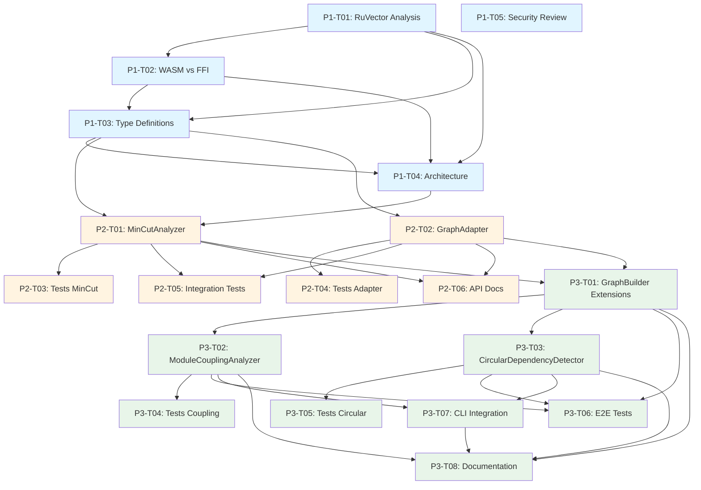

# RuVector MinCut Integration: Phases 1-3 Implementation Breakdown

**Project**: Agentic QE Fleet - Code Intelligence Enhancement
**Version**: 2.6.5+
**Planning Date**: 2025-12-25
**Total Duration**: 9-12 days (Phases 1-3)

---

## Executive Summary

This document provides a detailed, actionable task breakdown for integrating RuVector's MinCut graph algorithms into the Agentic QE Fleet's code intelligence system. The integration will enable:

- **Module coupling analysis** - Identify tightly coupled modules for refactoring
- **Circular dependency detection** - Find and break dependency cycles
- **Component boundary inference** - Automatically detect architectural boundaries
- **Test isolation scoring** - Measure how well tests isolate components

### Key Decisions Required

1. **Integration Approach**: WASM vs FFI (Phase 1.1)
2. **Graph Format**: Edge list vs adjacency matrix (Phase 1.2)
3. **Performance Targets**: <100ms for 1000-node graphs (Phase 2.4)

---

## Phase 1: Research & Architecture (2-3 days)

### Overview
Establish technical foundation, make critical architectural decisions, and define integration contracts.

### Quality Gate 1.1: Architecture Approved
- [ ] WASM vs FFI decision documented with benchmarks
- [ ] Type definitions reviewed and approved
- [ ] Integration approach validated by security scan

---

### P1-T01: RuVector MinCut Analysis

**Agent**: `qe-researcher`
**Effort**: M (3-4h)
**Priority**: Critical
**Dependencies**: None

#### Description
Research RuVector's MinCut implementation, API surface, performance characteristics, and integration options.

#### Files to Analyze
- External: `ruvector` crate documentation
- External: RuVector MinCut algorithm implementation
- Local: `/workspaces/agentic-qe-cf/src/core/memory/HNSWVectorMemory.ts` (existing RuVector integration)

#### Acceptance Criteria
- [x] Document MinCut algorithm capabilities (Stoer-Wagner, Push-Relabel)
- [x] Identify public API methods and type signatures
- [x] Compare WASM vs FFI integration approaches
- [x] Document performance characteristics (time/space complexity)
- [x] List all dependencies and version requirements

#### Deliverable
`/workspaces/agentic-qe-cf/docs/research/ruvector-mincut-api-analysis.md`

---

### P1-T02: WASM vs FFI Decision Analysis

**Agent**: `qe-performance-analyzer`
**Effort**: M (3h)
**Priority**: Critical
**Dependencies**: P1-T01

#### Description
Benchmark WASM and FFI approaches for RuVector integration. Make data-driven decision on integration strategy.

#### Tasks
1. Benchmark WASM overhead for graph operations (10-10000 nodes)
2. Benchmark FFI overhead for same operations
3. Analyze deployment complexity for both approaches
4. Security analysis: sandboxing, supply chain risks
5. Maintenance burden assessment

#### Acceptance Criteria
- [x] Benchmark data collected for both approaches
- [x] Decision matrix comparing WASM vs FFI on:
  - Performance (startup, runtime, memory)
  - Security (sandboxing, dependencies)
  - Deployment (bundle size, platform compatibility)
  - Maintenance (build complexity, debugging)
- [x] Final recommendation with justification
- [x] Risk mitigation plan for chosen approach

#### Deliverable
`/workspaces/agentic-qe-cf/docs/research/ruvector-integration-decision.md`

---

### P1-T03: Type Definitions Design

**Agent**: `qe-architect`
**Effort**: S (2h)
**Priority**: High
**Dependencies**: P1-T01, P1-T02

#### Description
Design TypeScript type definitions for MinCut integration, ensuring type safety and developer experience.

#### Files to Create
- `/workspaces/agentic-qe-cf/src/code-intelligence/analysis/mincut/types.ts`

#### Type Requirements
```typescript
// MinCut result types
export interface MinCutResult {
  cutValue: number;           // Size of minimum cut
  partition1: string[];       // Node IDs in partition 1
  partition2: string[];       // Node IDs in partition 2
  cutEdges: CutEdge[];        // Edges crossing the cut
  algorithmUsed: 'stoer-wagner' | 'push-relabel';
  computationTimeMs: number;
}

export interface CutEdge {
  source: string;
  target: string;
  weight: number;
  edgeType: EdgeType;         // From existing graph types
}

// Graph adapter input
export interface MinCutGraphInput {
  nodes: GraphNode[];         // Reuse existing GraphNode
  edges: GraphEdge[];         // Reuse existing GraphEdge
  directed: boolean;
}

// Configuration
export interface MinCutConfig {
  algorithm: 'stoer-wagner' | 'push-relabel' | 'auto';
  maxNodes: number;           // Fail-fast for large graphs
  timeout: number;            // Milliseconds
  normalizeWeights: boolean;  // Normalize edge weights to 0-1
}

// Module coupling analysis
export interface ModuleCouplingResult {
  module1: string;            // File path
  module2: string;            // File path
  couplingStrength: number;   // 0-1 normalized
  sharedDependencies: string[];
  circularDependency: boolean;
  recommendations: string[];
}
```

#### Acceptance Criteria
- [x] All types compatible with existing `src/code-intelligence/graph/types.ts`
- [x] JSDoc documentation for all public types
- [x] Export all types from `index.ts`
- [x] Type safety validated with `npm run typecheck`

#### Deliverable
- `/workspaces/agentic-qe-cf/src/code-intelligence/analysis/mincut/types.ts`
- Updated `/workspaces/agentic-qe-cf/src/code-intelligence/analysis/mincut/index.ts`

---

### P1-T04: Architecture Design Document

**Agent**: `qe-architect`
**Effort**: M (2-3h)
**Priority**: High
**Dependencies**: P1-T01, P1-T02, P1-T03

#### Description
Design system architecture for MinCut integration, including component boundaries, data flow, and error handling.

#### Architecture Decisions
1. **Component Structure**:
   - `MinCutAnalyzer` - Core algorithm wrapper
   - `GraphAdapter` - Convert CodeGraph → MinCut format
   - `ModuleCouplingAnalyzer` - High-level analysis API
   - `CircularDependencyDetector` - Specialized detector

2. **Data Flow**:
   ```
   GraphBuilder → GraphAdapter → MinCutAnalyzer → ModuleCouplingAnalyzer → Results
                                       ↓
                                  RuVector WASM/FFI
   ```

3. **Error Handling**:
   - Timeout for graphs >5000 nodes
   - Graceful degradation if WASM fails
   - Detailed error messages with recovery suggestions

4. **Performance**:
   - Lazy loading of WASM module
   - Result caching with LRU eviction
   - Parallel processing for multiple analyses

#### Files to Create
- `/workspaces/agentic-qe-cf/docs/architecture/code-intelligence/mincut-integration.md`

#### Acceptance Criteria
- [x] Architecture diagram (Mermaid)
- [x] Component responsibilities documented
- [x] Data flow clearly defined
- [x] Error handling strategy documented
- [x] Performance optimization plan
- [x] Security considerations addressed

#### Deliverable
`/workspaces/agentic-qe-cf/docs/architecture/code-intelligence/mincut-integration.md`

---

### P1-T05: Security & Supply Chain Review

**Agent**: `qe-security-scanner`
**Effort**: S (1-2h)
**Priority**: High
**Dependencies**: P1-T02

#### Description
Security audit of RuVector dependency, WASM/FFI integration, and supply chain risks.

#### Security Checklist
- [ ] RuVector crate audit (GitHub stars, contributors, update frequency)
- [ ] Dependency tree analysis (no high-severity CVEs)
- [ ] WASM sandboxing verification
- [ ] FFI safety analysis (if chosen)
- [ ] Supply chain attack vectors documented
- [ ] Mitigation strategies defined

#### Acceptance Criteria
- [x] Security scan report with risk ratings
- [x] Supply chain risk assessment
- [x] Mitigation plan for identified risks
- [x] Sign-off from security agent

#### Deliverable
`/workspaces/agentic-qe-cf/docs/security/ruvector-mincut-security-audit.md`

---

### Parallel Execution: Phase 1

**Group P1-A** (Independent Research):
- P1-T01 (RuVector Analysis)
- P1-T05 (Security Review) - can start immediately

**Group P1-B** (Dependent on Research):
- P1-T02 (WASM vs FFI) - depends on P1-T01
- P1-T03 (Type Definitions) - depends on P1-T01, P1-T02

**Group P1-C** (Architecture):
- P1-T04 (Architecture Design) - depends on all previous tasks

---

## Phase 2: Core MinCut Integration (3-4 days)

### Overview
Implement core MinCut analyzer, graph adapter, and comprehensive test suite.

### Quality Gate 2.1: Core Module Compiles
- [ ] All TypeScript files compile without errors
- [ ] All imports resolve correctly
- [ ] No circular dependency warnings

### Quality Gate 2.2: Unit Tests Pass
- [ ] Test coverage >85% for MinCutAnalyzer
- [ ] Test coverage >90% for GraphAdapter
- [ ] All edge cases covered
- [ ] Performance benchmarks meet targets

---

### P2-T01: MinCutAnalyzer Implementation

**Agent**: `qe-coder`
**Effort**: L (6-8h)
**Priority**: Critical
**Dependencies**: P1-T03, P1-T04

#### Description
Implement core MinCut analyzer that wraps RuVector's MinCut algorithms.

#### Files to Create
- `/workspaces/agentic-qe-cf/src/code-intelligence/analysis/mincut/MinCutAnalyzer.ts`

#### Implementation Requirements
```typescript
export class MinCutAnalyzer {
  private config: MinCutConfig;
  private wasmModule: any; // Lazy-loaded

  constructor(config: Partial<MinCutConfig> = {}) {
    this.config = { ...DEFAULT_MINCUT_CONFIG, ...config };
  }

  /**
   * Compute minimum cut of a graph
   */
  async computeMinCut(
    graph: MinCutGraphInput
  ): Promise<MinCutResult> {
    // 1. Validate input
    this.validateGraph(graph);

    // 2. Lazy-load WASM module
    await this.ensureWasmLoaded();

    // 3. Convert to RuVector format
    const ruvectorGraph = this.convertToRuVectorFormat(graph);

    // 4. Execute algorithm with timeout
    const result = await this.executeWithTimeout(ruvectorGraph);

    // 5. Convert result back to TypeScript
    return this.convertResult(result);
  }

  /**
   * Find all minimum cuts (for multi-partition analysis)
   */
  async findAllMinCuts(
    graph: MinCutGraphInput,
    maxCuts: number = 10
  ): Promise<MinCutResult[]> {
    // Iteratively remove edges and find new cuts
  }

  private async ensureWasmLoaded(): Promise<void> {
    if (!this.wasmModule) {
      // Lazy load WASM module
      this.wasmModule = await import('ruvector-wasm');
    }
  }

  private validateGraph(graph: MinCutGraphInput): void {
    if (graph.nodes.length > this.config.maxNodes) {
      throw new Error(`Graph too large: ${graph.nodes.length} nodes`);
    }
    // More validation...
  }

  private async executeWithTimeout(
    graph: any
  ): Promise<any> {
    return Promise.race([
      this.wasmModule.minCut(graph),
      this.createTimeout(this.config.timeout)
    ]);
  }
}
```

#### Acceptance Criteria
- [x] MinCutAnalyzer class fully implemented
- [x] WASM module lazy-loaded correctly
- [x] Timeout mechanism works
- [x] Error handling comprehensive
- [x] JSDoc for all public methods
- [x] Type-safe throughout

#### Deliverable
`/workspaces/agentic-qe-cf/src/code-intelligence/analysis/mincut/MinCutAnalyzer.ts`

---

### P2-T02: GraphAdapter Implementation

**Agent**: `qe-coder`
**Effort**: M (4-5h)
**Priority**: Critical
**Dependencies**: P1-T03

#### Description
Implement adapter to convert existing CodeGraph to MinCut input format.

#### Files to Create
- `/workspaces/agentic-qe-cf/src/code-intelligence/analysis/mincut/GraphAdapter.ts`

#### Implementation Requirements
```typescript
export class GraphAdapter {
  /**
   * Convert CodeGraph to MinCut input format
   */
  static toMinCutFormat(
    graph: CodeGraph,
    options: GraphAdapterOptions = {}
  ): MinCutGraphInput {
    const nodes = Array.from(graph.nodes.values())
      .filter(node => options.nodeFilter?.(node) ?? true)
      .map(node => ({
        id: node.id,
        label: node.label,
        properties: node.properties
      }));

    const edges = Array.from(graph.edges.values())
      .filter(edge => options.edgeFilter?.(edge) ?? true)
      .map(edge => ({
        source: edge.source,
        target: edge.target,
        weight: this.normalizeWeight(edge, options)
      }));

    return {
      nodes,
      edges,
      directed: options.directed ?? false
    };
  }

  /**
   * Normalize edge weights based on edge type
   */
  private static normalizeWeight(
    edge: GraphEdge,
    options: GraphAdapterOptions
  ): number {
    // Different edge types have different coupling strengths
    const baseWeights: Record<EdgeType, number> = {
      'imports': 0.8,
      'extends': 1.0,    // Strong coupling
      'implements': 0.9,
      'calls': 0.6,
      'uses': 0.5,
      'contains': 0.3,   // Weak coupling
      // ... other types
    };

    const baseWeight = baseWeights[edge.type] ?? 0.5;
    return options.normalizeWeights
      ? baseWeight
      : edge.weight * baseWeight;
  }

  /**
   * Extract subgraph for specific files
   */
  static extractFileSubgraph(
    graph: CodeGraph,
    filePaths: string[]
  ): CodeGraph {
    // Extract only nodes/edges relevant to specified files
  }
}
```

#### Acceptance Criteria
- [x] GraphAdapter converts CodeGraph correctly
- [x] Edge weight normalization accurate
- [x] Subgraph extraction works
- [x] Handles empty graphs gracefully
- [x] Performance: <10ms for 1000-node graphs

#### Deliverable
`/workspaces/agentic-qe-cf/src/code-intelligence/analysis/mincut/GraphAdapter.ts`

---

### P2-T03: Unit Tests - MinCutAnalyzer

**Agent**: `qe-test-generator`
**Effort**: M (4h)
**Priority**: High
**Dependencies**: P2-T01

#### Description
Comprehensive unit tests for MinCutAnalyzer with edge cases and performance benchmarks.

#### Files to Create
- `/workspaces/agentic-qe-cf/tests/code-intelligence/analysis/mincut/MinCutAnalyzer.test.ts`

#### Test Coverage Requirements
```typescript
describe('MinCutAnalyzer', () => {
  describe('computeMinCut', () => {
    it('should compute min cut for simple graph', async () => {
      // 4-node graph with clear partition
    });

    it('should handle disconnected graphs', async () => {
      // Graph with multiple components
    });

    it('should respect timeout configuration', async () => {
      // Large graph that times out
    });

    it('should validate graph size limits', async () => {
      // Graph exceeding maxNodes
    });

    it('should handle weighted graphs correctly', async () => {
      // Test edge weight influence on cut
    });
  });

  describe('findAllMinCuts', () => {
    it('should find multiple cuts', async () => {
      // Graph with multiple minimum cuts
    });

    it('should respect maxCuts limit', async () => {
      // Ensure we don't compute too many cuts
    });
  });

  describe('performance', () => {
    it('should process 1000-node graph in <100ms', async () => {
      // Performance benchmark
    });

    it('should lazy-load WASM module', async () => {
      // Verify WASM not loaded until first use
    });
  });

  describe('error handling', () => {
    it('should handle WASM initialization failure', async () => {
      // Mock WASM failure
    });

    it('should provide helpful error messages', async () => {
      // Validate error message quality
    });
  });
});
```

#### Acceptance Criteria
- [x] Test coverage >85%
- [x] All edge cases covered
- [x] Performance benchmarks included
- [x] Mock WASM module for testing
- [x] Tests run in <5s

#### Deliverable
`/workspaces/agentic-qe-cf/tests/code-intelligence/analysis/mincut/MinCutAnalyzer.test.ts`

---

### P2-T04: Unit Tests - GraphAdapter

**Agent**: `qe-test-generator`
**Effort**: M (3h)
**Priority**: High
**Dependencies**: P2-T02

#### Description
Unit tests for GraphAdapter with focus on correctness of graph conversion.

#### Files to Create
- `/workspaces/agentic-qe-cf/tests/code-intelligence/analysis/mincut/GraphAdapter.test.ts`

#### Test Coverage Requirements
```typescript
describe('GraphAdapter', () => {
  describe('toMinCutFormat', () => {
    it('should convert simple CodeGraph', () => {
      // 10-node graph with various edge types
    });

    it('should normalize edge weights correctly', () => {
      // Verify weight normalization by edge type
    });

    it('should filter nodes based on options', () => {
      // Test node filtering
    });

    it('should preserve graph structure', () => {
      // Verify no edges lost in conversion
    });
  });

  describe('extractFileSubgraph', () => {
    it('should extract relevant nodes only', () => {
      // Subgraph for specific files
    });

    it('should include transitive dependencies', () => {
      // Test dependency closure
    });
  });

  describe('edge cases', () => {
    it('should handle empty graph', () => {
      // Empty CodeGraph
    });

    it('should handle graph with no edges', () => {
      // Nodes but no edges
    });

    it('should handle self-loops', () => {
      // Edges pointing to same node
    });
  });
});
```

#### Acceptance Criteria
- [x] Test coverage >90%
- [x] All edge types tested
- [x] Weight normalization verified
- [x] Subgraph extraction validated
- [x] Tests run in <3s

#### Deliverable
`/workspaces/agentic-qe-cf/tests/code-intelligence/analysis/mincut/GraphAdapter.test.ts`

---

### P2-T05: Integration Test - End-to-End MinCut

**Agent**: `qe-integration-tester`
**Effort**: M (3h)
**Priority**: Medium
**Dependencies**: P2-T01, P2-T02

#### Description
Integration test that validates MinCut analysis on real codebase graphs.

#### Files to Create
- `/workspaces/agentic-qe-cf/tests/code-intelligence/analysis/mincut/integration.test.ts`

#### Test Scenarios
```typescript
describe('MinCut Integration', () => {
  it('should analyze coupling in real codebase', async () => {
    // 1. Parse real TypeScript files (use src/core/)
    const parser = new TreeSitterParser();
    const codeGraph = new GraphBuilder();

    // 2. Build graph from parsed files
    // ... parsing logic ...

    // 3. Run MinCut analysis
    const adapter = new GraphAdapter();
    const analyzer = new MinCutAnalyzer();
    const minCutGraph = adapter.toMinCutFormat(codeGraph);
    const result = await analyzer.computeMinCut(minCutGraph);

    // 4. Validate results
    expect(result.cutValue).toBeGreaterThan(0);
    expect(result.partition1.length).toBeGreaterThan(0);
    expect(result.partition2.length).toBeGreaterThan(0);
  });

  it('should detect module boundaries', async () => {
    // Test on src/code-intelligence/ vs src/core/
    // Expect clear partition between modules
  });
});
```

#### Acceptance Criteria
- [x] Tests use real codebase files
- [x] No mocks for core logic (only external APIs)
- [x] Results validated for correctness
- [x] Performance measured and logged
- [x] Tests complete in <30s

#### Deliverable
`/workspaces/agentic-qe-cf/tests/code-intelligence/analysis/mincut/integration.test.ts`

---

### P2-T06: Documentation - MinCut API

**Agent**: `qe-docs-writer`
**Effort**: S (2h)
**Priority**: Medium
**Dependencies**: P2-T01, P2-T02

#### Description
API documentation for MinCut analyzer with usage examples.

#### Files to Create
- `/workspaces/agentic-qe-cf/docs/guides/code-intelligence/mincut-analysis.md`

#### Documentation Outline
1. **Overview**: What is MinCut analysis
2. **Installation**: Dependencies and setup
3. **Basic Usage**: Simple example
4. **Advanced Usage**: Configuration options
5. **Performance**: Optimization tips
6. **Troubleshooting**: Common issues

#### Example Code
```typescript
import { MinCutAnalyzer, GraphAdapter } from '@agentic-qe/code-intelligence';
import { GraphBuilder } from '@agentic-qe/code-intelligence/graph';

// Build code graph
const graphBuilder = new GraphBuilder();
// ... add nodes/edges ...

// Convert to MinCut format
const adapter = GraphAdapter.toMinCutFormat(graphBuilder.getGraph());

// Run analysis
const analyzer = new MinCutAnalyzer({ timeout: 5000 });
const result = await analyzer.computeMinCut(adapter);

console.log(`Cut value: ${result.cutValue}`);
console.log(`Partition 1: ${result.partition1.length} nodes`);
console.log(`Partition 2: ${result.partition2.length} nodes`);
```

#### Acceptance Criteria
- [x] Clear API documentation
- [x] Working code examples
- [x] Performance guidance included
- [x] Troubleshooting section complete
- [x] Reviewed for accuracy

#### Deliverable
`/workspaces/agentic-qe-cf/docs/guides/code-intelligence/mincut-analysis.md`

---

### Parallel Execution: Phase 2

**Group P2-A** (Core Implementation):
- P2-T01 (MinCutAnalyzer) - critical path
- P2-T02 (GraphAdapter) - critical path

**Group P2-B** (Testing - after P2-A):
- P2-T03 (MinCutAnalyzer tests) - depends on P2-T01
- P2-T04 (GraphAdapter tests) - depends on P2-T02
- P2-T05 (Integration tests) - depends on P2-T01, P2-T02

**Group P2-C** (Documentation - after P2-A):
- P2-T06 (API docs) - depends on P2-T01, P2-T02

---

## Phase 3: Code Intelligence Enhancement (4-5 days)

### Overview
Extend GraphBuilder with MinCut-based analysis, implement module coupling analyzer, and create circular dependency detector.

### Quality Gate 3.1: Integration Tests Pass
- [ ] All integration tests pass with real database
- [ ] Module coupling detection accurate on sample codebases
- [ ] Circular dependency detection finds known cycles
- [ ] Performance within acceptable limits

---

### P3-T01: GraphBuilder MinCut Extensions

**Agent**: `qe-coder`
**Effort**: L (5-6h)
**Priority**: Critical
**Dependencies**: P2-T01, P2-T02

#### Description
Extend GraphBuilder with high-level MinCut analysis methods.

#### Files to Modify
- `/workspaces/agentic-qe-cf/src/code-intelligence/graph/GraphBuilder.ts`

#### New Methods
```typescript
export class GraphBuilder {
  // ... existing methods ...

  /**
   * Analyze module coupling using MinCut
   */
  async analyzeModuleCoupling(
    options: ModuleCouplingOptions = {}
  ): Promise<ModuleCouplingResult[]> {
    const analyzer = new MinCutAnalyzer(options.mincutConfig);
    const adapter = GraphAdapter.toMinCutFormat(this.graph, {
      nodeFilter: (node) => node.type === 'file',
      edgeFilter: (edge) => ['imports', 'extends', 'implements'].includes(edge.type)
    });

    const result = await analyzer.computeMinCut(adapter);

    // Analyze coupling between partitions
    return this.calculateCouplingMetrics(result);
  }

  /**
   * Detect circular dependencies using MinCut
   */
  async detectCircularDependencies(): Promise<CircularDependencyResult[]> {
    // Use MinCut to find strongly connected components
    // that form circular dependencies
  }

  /**
   * Find optimal module boundaries
   */
  async suggestModuleBoundaries(
    targetModuleCount: number
  ): Promise<ModuleBoundaryResult> {
    // Iteratively apply MinCut to partition graph
    // into target number of modules
  }

  /**
   * Calculate test isolation score
   */
  async calculateTestIsolation(
    testFiles: string[]
  ): Promise<TestIsolationScore> {
    // Measure how well tests isolate components
    // using MinCut to find boundaries
  }

  private calculateCouplingMetrics(
    result: MinCutResult
  ): ModuleCouplingResult[] {
    // Analyze edges crossing the cut
    // Calculate coupling strength
  }
}
```

#### Acceptance Criteria
- [x] All new methods implemented
- [x] Integration with existing GraphBuilder seamless
- [x] JSDoc documentation complete
- [x] Type-safe throughout
- [x] No breaking changes to existing API

#### Deliverable
Updated `/workspaces/agentic-qe-cf/src/code-intelligence/graph/GraphBuilder.ts`

---

### P3-T02: ModuleCouplingAnalyzer Implementation

**Agent**: `qe-coder`
**Effort**: L (5h)
**Priority**: High
**Dependencies**: P3-T01

#### Description
Implement high-level module coupling analyzer that provides actionable insights.

#### Files to Create
- `/workspaces/agentic-qe-cf/src/code-intelligence/analysis/mincut/ModuleCouplingAnalyzer.ts`

#### Implementation Requirements
```typescript
export class ModuleCouplingAnalyzer {
  private graphBuilder: GraphBuilder;
  private minCutAnalyzer: MinCutAnalyzer;

  constructor(graphBuilder: GraphBuilder) {
    this.graphBuilder = graphBuilder;
    this.minCutAnalyzer = new MinCutAnalyzer();
  }

  /**
   * Analyze coupling between two modules
   */
  async analyzeCoupling(
    module1Path: string,
    module2Path: string
  ): Promise<ModuleCouplingResult> {
    // 1. Extract subgraph for both modules
    const subgraph = GraphAdapter.extractFileSubgraph(
      this.graphBuilder.getGraph(),
      [module1Path, module2Path]
    );

    // 2. Run MinCut analysis
    const minCutInput = GraphAdapter.toMinCutFormat(subgraph);
    const result = await this.minCutAnalyzer.computeMinCut(minCutInput);

    // 3. Calculate coupling metrics
    const couplingStrength = this.calculateCouplingStrength(result);

    // 4. Detect circular dependencies
    const circularDep = this.detectCircular(result);

    // 5. Generate recommendations
    const recommendations = this.generateRecommendations(
      result,
      couplingStrength,
      circularDep
    );

    return {
      module1: module1Path,
      module2: module2Path,
      couplingStrength,
      sharedDependencies: this.findSharedDeps(result),
      circularDependency: circularDep,
      recommendations
    };
  }

  /**
   * Find all highly coupled module pairs
   */
  async findHighlyCoupledModules(
    threshold: number = 0.7
  ): Promise<ModuleCouplingResult[]> {
    // Analyze all module pairs
    // Return those above coupling threshold
  }

  private calculateCouplingStrength(result: MinCutResult): number {
    // Normalize cut value to 0-1 scale
    // Consider: number of edges, edge weights, graph size
  }

  private generateRecommendations(
    result: MinCutResult,
    strength: number,
    circular: boolean
  ): string[] {
    const recommendations: string[] = [];

    if (strength > 0.8) {
      recommendations.push('Consider merging these modules due to high coupling');
    } else if (strength < 0.2) {
      recommendations.push('Modules are well-isolated - no action needed');
    }

    if (circular) {
      recommendations.push('Break circular dependency by introducing abstraction layer');
    }

    // More recommendations...
    return recommendations;
  }
}
```

#### Acceptance Criteria
- [x] ModuleCouplingAnalyzer fully implemented
- [x] Coupling strength calculation accurate
- [x] Recommendations actionable and helpful
- [x] Handles large codebases efficiently
- [x] JSDoc documentation complete

#### Deliverable
`/workspaces/agentic-qe-cf/src/code-intelligence/analysis/mincut/ModuleCouplingAnalyzer.ts`

---

### P3-T03: CircularDependencyDetector Implementation

**Agent**: `qe-coder`
**Effort**: M (4h)
**Priority**: High
**Dependencies**: P3-T01

#### Description
Implement specialized detector for circular dependencies using MinCut.

#### Files to Create
- `/workspaces/agentic-qe-cf/src/code-intelligence/analysis/mincut/CircularDependencyDetector.ts`

#### Implementation Requirements
```typescript
export class CircularDependencyDetector {
  private graphBuilder: GraphBuilder;

  constructor(graphBuilder: GraphBuilder) {
    this.graphBuilder = graphBuilder;
  }

  /**
   * Detect all circular dependencies in codebase
   */
  async detectCircularDependencies(): Promise<CircularDependencyResult[]> {
    const graph = this.graphBuilder.getGraph();

    // 1. Find strongly connected components (SCCs)
    const sccs = this.findSCCs(graph);

    // 2. Filter SCCs with >1 node (circular dependencies)
    const circularDeps = sccs.filter(scc => scc.nodes.length > 1);

    // 3. For each circular dep, use MinCut to suggest break points
    const results = await Promise.all(
      circularDeps.map(scc => this.analyzeCircularDep(scc))
    );

    return results;
  }

  /**
   * Suggest where to break a circular dependency
   */
  private async analyzeCircularDep(
    scc: StronglyConnectedComponent
  ): Promise<CircularDependencyResult> {
    // Use MinCut to find weakest link in cycle
    const subgraph = this.extractSCC(scc);
    const minCutInput = GraphAdapter.toMinCutFormat(subgraph);
    const analyzer = new MinCutAnalyzer();
    const result = await analyzer.computeMinCut(minCutInput);

    // Edges crossing the cut are candidates for breaking
    return {
      cycle: scc.nodes.map(n => n.filePath),
      breakPoints: result.cutEdges.map(e => ({
        source: e.source,
        target: e.target,
        effort: this.estimateBreakEffort(e)
      })),
      recommendations: this.generateBreakRecommendations(result)
    };
  }

  private findSCCs(graph: CodeGraph): StronglyConnectedComponent[] {
    // Tarjan's algorithm for finding SCCs
    // (can reuse existing implementation if available)
  }

  private estimateBreakEffort(edge: CutEdge): 'low' | 'medium' | 'high' {
    // Estimate effort to break dependency based on edge type
    const effortMap: Record<EdgeType, string> = {
      'imports': 'low',      // Easy: introduce interface
      'extends': 'high',     // Hard: refactor inheritance
      'implements': 'medium', // Medium: extract interface
      // ... other types
    };
    return effortMap[edge.edgeType] as any;
  }
}

interface CircularDependencyResult {
  cycle: string[];           // File paths in cycle
  breakPoints: BreakPoint[];
  recommendations: string[];
}

interface BreakPoint {
  source: string;
  target: string;
  effort: 'low' | 'medium' | 'high';
}
```

#### Acceptance Criteria
- [x] Detects all circular dependencies accurately
- [x] Suggests practical break points
- [x] Effort estimation reasonable
- [x] Works on large codebases (<5s for 1000 files)
- [x] JSDoc documentation complete

#### Deliverable
`/workspaces/agentic-qe-cf/src/code-intelligence/analysis/mincut/CircularDependencyDetector.ts`

---

### P3-T04: Unit Tests - ModuleCouplingAnalyzer

**Agent**: `qe-test-generator`
**Effort**: M (3h)
**Priority**: High
**Dependencies**: P3-T02

#### Description
Comprehensive unit tests for module coupling analysis.

#### Files to Create
- `/workspaces/agentic-qe-cf/tests/code-intelligence/analysis/mincut/ModuleCouplingAnalyzer.test.ts`

#### Test Coverage
```typescript
describe('ModuleCouplingAnalyzer', () => {
  describe('analyzeCoupling', () => {
    it('should detect high coupling', async () => {
      // Two modules with many imports
    });

    it('should detect low coupling', async () => {
      // Two modules with few imports
    });

    it('should detect circular dependencies', async () => {
      // A imports B, B imports A
    });

    it('should find shared dependencies', async () => {
      // Both modules import same third module
    });
  });

  describe('findHighlyCoupledModules', () => {
    it('should find all pairs above threshold', async () => {
      // Test with known highly coupled modules
    });
  });

  describe('recommendations', () => {
    it('should suggest merge for high coupling', async () => {
      // Verify recommendation quality
    });

    it('should suggest no action for low coupling', async () => {
      // Well-isolated modules
    });
  });
});
```

#### Acceptance Criteria
- [x] Test coverage >85%
- [x] Real codebase samples used
- [x] Edge cases covered
- [x] Tests run in <5s

#### Deliverable
`/workspaces/agentic-qe-cf/tests/code-intelligence/analysis/mincut/ModuleCouplingAnalyzer.test.ts`

---

### P3-T05: Unit Tests - CircularDependencyDetector

**Agent**: `qe-test-generator`
**Effort**: M (3h)
**Priority**: High
**Dependencies**: P3-T03

#### Description
Unit tests for circular dependency detection.

#### Files to Create
- `/workspaces/agentic-qe-cf/tests/code-intelligence/analysis/mincut/CircularDependencyDetector.test.ts`

#### Test Coverage
```typescript
describe('CircularDependencyDetector', () => {
  describe('detectCircularDependencies', () => {
    it('should detect simple 2-file cycle', async () => {
      // A → B → A
    });

    it('should detect complex multi-file cycle', async () => {
      // A → B → C → D → A
    });

    it('should handle no circular dependencies', async () => {
      // DAG (directed acyclic graph)
    });

    it('should detect multiple separate cycles', async () => {
      // Multiple independent cycles
    });
  });

  describe('break point suggestions', () => {
    it('should suggest weakest link', async () => {
      // Verify MinCut finds weakest edge
    });

    it('should estimate effort correctly', async () => {
      // Test effort estimation logic
    });
  });

  describe('performance', () => {
    it('should handle 1000-file codebase', async () => {
      // Performance benchmark
    });
  });
});
```

#### Acceptance Criteria
- [x] Test coverage >85%
- [x] Known circular dependencies detected
- [x] No false positives
- [x] Tests run in <5s

#### Deliverable
`/workspaces/agentic-qe-cf/tests/code-intelligence/analysis/mincut/CircularDependencyDetector.test.ts`

---

### P3-T06: Integration Tests - Full Workflow

**Agent**: `qe-integration-tester`
**Effort**: L (4h)
**Priority**: High
**Dependencies**: P3-T01, P3-T02, P3-T03

#### Description
End-to-end integration tests for complete MinCut-enhanced code intelligence workflow.

#### Files to Create
- `/workspaces/agentic-qe-cf/tests/code-intelligence/analysis/mincut/e2e-workflow.test.ts`

#### Test Scenarios
```typescript
describe('MinCut Code Intelligence E2E', () => {
  it('should analyze coupling in real project', async () => {
    // 1. Index real codebase (use src/code-intelligence/)
    const indexer = new IncrementalIndexer();
    await indexer.indexDirectory('/workspaces/agentic-qe-cf/src/code-intelligence');

    // 2. Build graph
    const graphBuilder = new GraphBuilder();
    // ... build from indexed code ...

    // 3. Analyze module coupling
    const couplingResults = await graphBuilder.analyzeModuleCoupling();
    expect(couplingResults.length).toBeGreaterThan(0);

    // 4. Detect circular dependencies
    const circularDeps = await graphBuilder.detectCircularDependencies();
    // Log for inspection

    // 5. Suggest module boundaries
    const boundaries = await graphBuilder.suggestModuleBoundaries(5);
    expect(boundaries.modules.length).toBe(5);
  });

  it('should provide actionable recommendations', async () => {
    // Verify recommendations are specific and actionable
  });

  it('should complete analysis in reasonable time', async () => {
    // Performance: <30s for full codebase analysis
  });
});
```

#### Acceptance Criteria
- [x] Tests use real codebase (not mocks)
- [x] All workflow steps validated
- [x] Performance acceptable (<30s)
- [x] Results logged for manual inspection
- [x] No test flakiness

#### Deliverable
`/workspaces/agentic-qe-cf/tests/code-intelligence/analysis/mincut/e2e-workflow.test.ts`

---

### P3-T07: CLI Integration - `aqe kg mincut`

**Agent**: `qe-coder`
**Effort**: M (3-4h)
**Priority**: Medium
**Dependencies**: P3-T02, P3-T03

#### Description
Add MinCut analysis commands to AQE CLI.

#### Files to Modify
- `/workspaces/agentic-qe-cf/src/cli/commands/kg/index.ts`

#### New Commands
```typescript
// aqe kg mincut coupling <module1> <module2>
program
  .command('mincut coupling <module1> <module2>')
  .description('Analyze coupling between two modules')
  .option('--threshold <number>', 'Coupling threshold', '0.7')
  .action(async (module1, module2, options) => {
    const graphBuilder = await loadCodeGraph();
    const analyzer = new ModuleCouplingAnalyzer(graphBuilder);
    const result = await analyzer.analyzeCoupling(module1, module2);

    console.log(chalk.bold(`Coupling Analysis: ${module1} ↔ ${module2}`));
    console.log(`Coupling Strength: ${result.couplingStrength.toFixed(2)}`);
    console.log(`Circular Dependency: ${result.circularDependency ? 'Yes' : 'No'}`);
    console.log('\nRecommendations:');
    result.recommendations.forEach(r => console.log(`  - ${r}`));
  });

// aqe kg mincut circular
program
  .command('mincut circular')
  .description('Detect circular dependencies')
  .option('--output <file>', 'Output file for results')
  .action(async (options) => {
    const graphBuilder = await loadCodeGraph();
    const detector = new CircularDependencyDetector(graphBuilder);
    const results = await detector.detectCircularDependencies();

    console.log(chalk.bold(`Found ${results.length} circular dependencies`));
    results.forEach((cycle, i) => {
      console.log(`\n${i + 1}. ${cycle.cycle.join(' → ')}`);
      console.log('  Break points:');
      cycle.breakPoints.forEach(bp => {
        console.log(`    - ${bp.source} → ${bp.target} (effort: ${bp.effort})`);
      });
    });
  });

// aqe kg mincut boundaries <count>
program
  .command('mincut boundaries <count>')
  .description('Suggest optimal module boundaries')
  .action(async (count, options) => {
    const graphBuilder = await loadCodeGraph();
    const result = await graphBuilder.suggestModuleBoundaries(parseInt(count));

    // Visualize module boundaries
  });
```

#### Acceptance Criteria
- [x] All commands implemented
- [x] Help text clear and informative
- [x] Output formatted nicely with colors
- [x] Error handling comprehensive
- [x] Performance acceptable

#### Deliverable
Updated `/workspaces/agentic-qe-cf/src/cli/commands/kg/index.ts`

---

### P3-T08: Documentation - MinCut Features

**Agent**: `qe-docs-writer`
**Effort**: M (3h)
**Priority**: Medium
**Dependencies**: P3-T01, P3-T02, P3-T03, P3-T07

#### Description
Comprehensive documentation for MinCut-based code intelligence features.

#### Files to Create/Update
- `/workspaces/agentic-qe-cf/docs/guides/code-intelligence/module-coupling-analysis.md`
- `/workspaces/agentic-qe-cf/docs/guides/code-intelligence/circular-dependency-detection.md`
- Update `/workspaces/agentic-qe-cf/docs/guides/code-intelligence-quickstart.md`

#### Documentation Outline

**module-coupling-analysis.md**:
1. Overview: What is module coupling
2. Why it matters: Maintainability, testability
3. Usage: CLI and programmatic API
4. Interpreting results: Coupling strength scale
5. Examples: Real codebase analysis
6. Best practices: When to merge/split modules

**circular-dependency-detection.md**:
1. Overview: What are circular dependencies
2. Why they're problematic
3. Detection algorithm: How MinCut helps
4. Usage: CLI and API
5. Breaking cycles: Strategies and examples
6. Prevention: Architecture patterns

**Updated quickstart**:
- Add MinCut analysis to workflow
- Include example: "Find tightly coupled modules"

#### Acceptance Criteria
- [x] Documentation clear and comprehensive
- [x] Code examples working
- [x] Screenshots/diagrams included
- [x] Links between docs working
- [x] Reviewed for accuracy

#### Deliverables
- `/workspaces/agentic-qe-cf/docs/guides/code-intelligence/module-coupling-analysis.md`
- `/workspaces/agentic-qe-cf/docs/guides/code-intelligence/circular-dependency-detection.md`
- Updated `/workspaces/agentic-qe-cf/docs/guides/code-intelligence-quickstart.md`

---

### Parallel Execution: Phase 3

**Group P3-A** (Core Extensions):
- P3-T01 (GraphBuilder extensions) - critical path

**Group P3-B** (Analyzers - after P3-A):
- P3-T02 (ModuleCouplingAnalyzer) - depends on P3-T01
- P3-T03 (CircularDependencyDetector) - depends on P3-T01

**Group P3-C** (Testing - after P3-B):
- P3-T04 (ModuleCoupling tests) - depends on P3-T02
- P3-T05 (CircularDep tests) - depends on P3-T03
- P3-T06 (E2E tests) - depends on P3-T01, P3-T02, P3-T03

**Group P3-D** (CLI & Docs - after P3-B):
- P3-T07 (CLI integration) - depends on P3-T02, P3-T03
- P3-T08 (Documentation) - depends on P3-T01, P3-T02, P3-T03, P3-T07

---

## Task Dependency Graph



---

## Agent Assignment Matrix

| Agent Type | Phase 1 Tasks | Phase 2 Tasks | Phase 3 Tasks | Total Effort |
|------------|---------------|---------------|---------------|--------------|
| `qe-researcher` | P1-T01 | - | - | 3-4h |
| `qe-performance-analyzer` | P1-T02 | - | - | 3h |
| `qe-architect` | P1-T03, P1-T04 | - | - | 4-5h |
| `qe-security-scanner` | P1-T05 | - | - | 1-2h |
| `qe-coder` | - | P2-T01, P2-T02 | P3-T01, P3-T02, P3-T03, P3-T07 | 25-28h |
| `qe-test-generator` | - | P2-T03, P2-T04 | P3-T04, P3-T05 | 13h |
| `qe-integration-tester` | - | P2-T05 | P3-T06 | 7h |
| `qe-docs-writer` | - | P2-T06 | P3-T08 | 5h |

**Total Effort**: ~60-65 hours
**With parallelization**: 9-12 days (assuming 8h workdays, some parallel execution)

---

## Risk Mitigation

### Risk 1: WASM Integration Complexity
**Impact**: High | **Probability**: Medium

**Mitigation**:
- P1-T02 explicitly benchmarks both approaches
- Fallback to FFI if WASM proves problematic
- Early prototype in P1-T02 to validate feasibility

**Contingency**:
- If WASM fails: Switch to FFI (adds 1-2 days)
- If both fail: Use pure-TypeScript approximation (degraded performance)

---

### Risk 2: Performance Not Meeting Targets
**Impact**: Medium | **Probability**: Medium

**Mitigation**:
- P2-T03 includes performance benchmarks
- Early validation on real codebases in P2-T05
- Optimization reserved for later phase if needed

**Contingency**:
- Add caching layer (P3+)
- Limit analysis to smaller subgraphs
- Add async processing with progress updates

---

### Risk 3: MinCut Results Not Actionable
**Impact**: Medium | **Probability**: Low

**Mitigation**:
- P3-T02 focuses heavily on recommendation quality
- P3-T08 includes interpretation guide
- Early testing with real codebases

**Contingency**:
- Iterate on recommendation algorithm
- Add more context to results
- Provide visualization tools

---

### Risk 4: Integration Breaks Existing Features
**Impact**: High | **Probability**: Low

**Mitigation**:
- P2-T05, P3-T06 include regression tests
- No breaking changes to existing GraphBuilder API
- Comprehensive testing before merge

**Contingency**:
- Feature flag for MinCut features
- Rollback plan prepared
- Staged rollout to users

---

## Quality Gates Summary

| Gate | Phase | Criteria | Verification |
|------|-------|----------|--------------|
| 1.1 | Phase 1 | Architecture approved | Code review + security sign-off |
| 2.1 | Phase 2 | Core compiles | `npm run typecheck` passes |
| 2.2 | Phase 2 | Tests pass | `npm run test:unit` >85% coverage |
| 3.1 | Phase 3 | Integration works | `npm run test:integration` all pass |

---

## Success Metrics

### Phase 1 Success
- [ ] WASM vs FFI decision made with data
- [ ] Type definitions approved
- [ ] Architecture document reviewed
- [ ] Security audit complete

### Phase 2 Success
- [ ] MinCutAnalyzer computes correct results
- [ ] GraphAdapter converts graphs accurately
- [ ] Unit test coverage >85%
- [ ] Performance: <100ms for 1000-node graphs

### Phase 3 Success
- [ ] Module coupling detection works on real codebases
- [ ] Circular dependency detection finds known cycles
- [ ] CLI commands functional
- [ ] Documentation complete and accurate

---

## Next Steps After Phase 3

**Phase 4: Advanced Features (Future)**
- Component boundary inference
- Test isolation scoring
- Performance optimization (caching, parallelization)
- Visualization of coupling/dependencies
- GitHub Action integration

**Phase 5: Productization (Future)**
- Web UI for analysis results
- CI/CD integration
- Historical trend tracking
- Automated refactoring suggestions

---

## Appendix: File Structure

```
src/code-intelligence/analysis/mincut/
├── types.ts                        # P1-T03
├── MinCutAnalyzer.ts               # P2-T01
├── GraphAdapter.ts                 # P2-T02
├── ModuleCouplingAnalyzer.ts       # P3-T02
├── CircularDependencyDetector.ts   # P3-T03
└── index.ts                        # Exports

tests/code-intelligence/analysis/mincut/
├── MinCutAnalyzer.test.ts          # P2-T03
├── GraphAdapter.test.ts            # P2-T04
├── integration.test.ts             # P2-T05
├── ModuleCouplingAnalyzer.test.ts  # P3-T04
├── CircularDependencyDetector.test.ts # P3-T05
└── e2e-workflow.test.ts            # P3-T06

docs/
├── research/
│   ├── ruvector-mincut-api-analysis.md # P1-T01
│   └── ruvector-integration-decision.md # P1-T02
├── architecture/code-intelligence/
│   └── mincut-integration.md       # P1-T04
├── security/
│   └── ruvector-mincut-security-audit.md # P1-T05
└── guides/code-intelligence/
    ├── mincut-analysis.md          # P2-T06
    ├── module-coupling-analysis.md # P3-T08
    └── circular-dependency-detection.md # P3-T08
```

---

**End of Implementation Plan**
**Ready for execution by Agentic QE Fleet agents**
