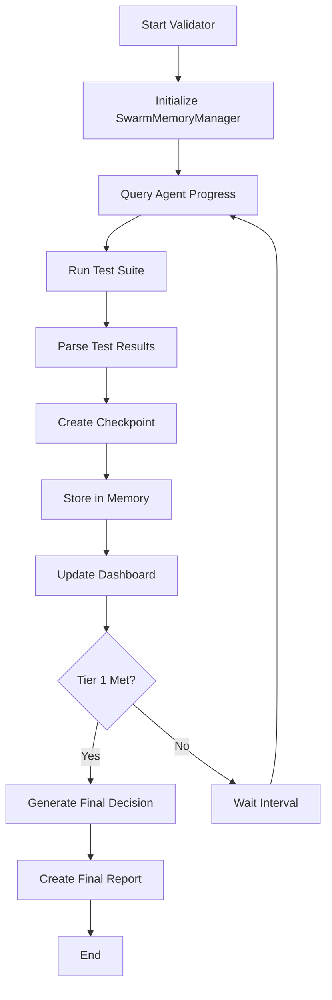

# Stabilization Validation Guide

## 🎯 Mission Overview

**Goal:** Validate achievement of Tier 1 stabilization targets:
- ✅ 50%+ pass rate
- ✅ 30+ test suites passing
- ✅ <30s execution time

## 🚀 Quick Start

### Single Validation Run
```bash
npx ts-node scripts/stabilization-validator.ts single
```

### Continuous Monitoring (Every 3 minutes)
```bash
./scripts/monitor-stabilization.sh 3
```

Or using the TypeScript validator:
```bash
npx ts-node scripts/stabilization-validator.ts continuous 3
```

## 📊 Monitoring Dashboard

Real-time dashboard: `docs/reports/STABILIZATION-DASHBOARD.md`

Updates automatically on each validation cycle with:
- Current pass rate
- Suites passing count
- Execution time
- Agent status
- Tier 1 progress percentage

## 💾 Data Storage

All metrics stored in SwarmMemoryManager (`/.swarm/memory.db`):

### Checkpoint Data
```typescript
// Key: aqe/stabilization/checkpoint-{N}
{
  timestamp: number,
  checkpointNumber: number,
  passRate: number,
  testsPassing: number,
  testsFailing: number,
  suitesPassing: number,
  agentProgress: Record<string, string>,
  tier1Criteria: {
    passRate50: boolean,
    suitesStable: boolean,
    executionFast: boolean
  }
}
```

### Tier 1 Check
```typescript
// Key: aqe/stabilization/tier1-check
{
  timestamp: number,
  passRate: boolean,
  suitesStable: boolean,
  executionFast: boolean,
  met: boolean
}
```

### Final Decision
```typescript
// Key: aqe/stabilization/final-decision
{
  decision: 'GO-CONDITIONAL',
  tier: 1,
  passRate: number,
  metricsComparison: { before, after, improvement },
  agentContributions: Record<string, any>,
  nextSteps: string,
  recommendation: string
}
```

## 🔍 Querying Validation Data

### View Latest Checkpoint
```bash
node -e "
const { SwarmMemoryManager } = require('./dist/core/memory/SwarmMemoryManager.js');
const path = require('path');

async function query() {
  const memory = new SwarmMemoryManager(path.join(process.cwd(), '.swarm/memory.db'));
  await memory.initialize();
  const checkpoint = await memory.retrieve('aqe/stabilization/checkpoint-1', { partition: 'coordination' });
  console.log(JSON.stringify(checkpoint, null, 2));
  await memory.close();
}
query();
"
```

### Check Agent Progress
```bash
node -e "
const { SwarmMemoryManager } = require('./dist/core/memory/SwarmMemoryManager.js');
const path = require('path');

async function query() {
  const memory = new SwarmMemoryManager(path.join(process.cwd(), '.swarm/memory.db'));
  await memory.initialize();

  const agents = ['TEST-CLEANUP', 'JEST-ENV-FIX', 'CORE-TEST-STABILIZATION'];
  for (const agent of agents) {
    const status = await memory.retrieve(\`tasks/\${agent}/status\`, { partition: 'coordination' });
    console.log(\`\${agent}:\`, status);
  }

  await memory.close();
}
query();
"
```

### Check Tier 1 Status
```bash
node -e "
const { SwarmMemoryManager } = require('./dist/core/memory/SwarmMemoryManager.js');
const path = require('path');

async function query() {
  const memory = new SwarmMemoryManager(path.join(process.cwd(), '.swarm/memory.db'));
  await memory.initialize();
  const tier1 = await memory.retrieve('aqe/stabilization/tier1-check', { partition: 'coordination' });
  console.log(JSON.stringify(tier1, null, 2));
  await memory.close();
}
query();
"
```

## 📈 Validation Workflow



## 🎯 Tier 1 Criteria Details

### 1. Pass Rate ≥ 50%
- **Current Baseline:** 30.5%
- **Target:** 50%+
- **Measurement:** (tests passing / total tests) × 100

### 2. Suites Passing ≥ 30
- **Current Baseline:** 5 suites
- **Target:** 30+ suites
- **Measurement:** Count of test suites with all tests passing

### 3. Execution Time < 30s
- **Current Baseline:** ~17s
- **Target:** <30s
- **Measurement:** Total test suite execution time in seconds

## 📝 Checkpoint Logs

All test runs logged to: `docs/reports/stabilization-checkpoint-{timestamp}.log`

Contains full Jest output including:
- Test results
- Suite results
- Error messages
- Stack traces
- Performance metrics

## ✅ Success Criteria

When ALL three Tier 1 criteria are met:
1. Validator stores final decision in memory
2. Dashboard shows 100% Tier 1 progress
3. Final report generated: `TIER-1-STABILIZATION-COMPLETE.md`
4. GO-CONDITIONAL decision issued

## 🚀 Next Steps After Tier 1

Once Tier 1 is achieved, the final report will include:
- Tier 2 roadmap (70% pass rate, 20% coverage)
- Required implementations (8-10h estimate)
- Agent contribution summary
- Before/after metrics comparison

## 🛠️ Troubleshooting

### Validator Fails to Run
```bash
# Ensure TypeScript compilation
npm run build

# Check database exists
ls -la .swarm/memory.db
```

### No Agent Progress Data
```bash
# Agents may not have reported yet
# Check if agents are running:
ps aux | grep "agent"
```

### Tests Not Running
```bash
# Verify Jest configuration
npm test -- --version

# Check test files exist
find tests -name "*.test.ts" | wc -l
```

## 📞 Support

For issues or questions:
1. Check dashboard: `docs/reports/STABILIZATION-DASHBOARD.md`
2. Review checkpoint logs
3. Query SwarmMemoryManager for agent status
4. Consult agent implementation files in `.claude/agents/`

---

*Stabilization Validator - Real-time monitoring and validation for test stabilization efforts*
