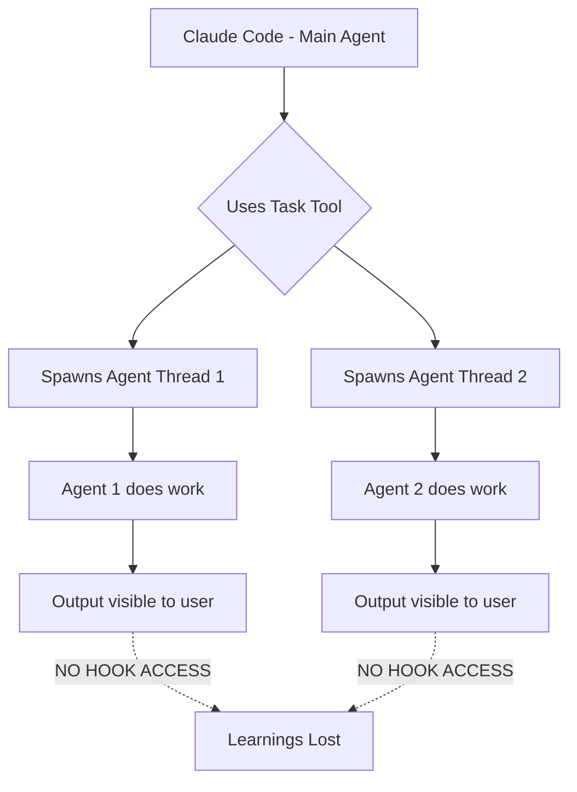

# Claude Flow Task Agent Learning Analysis

**Research Date**: 2025-12-08
**Researcher**: Research Agent
**Repository**: https://github.com/ruvnet/claude-flow (agentic-flow package)

---

## Executive Summary

After deep analysis of the claude-flow (agentic-flow) codebase, I've identified a **CRITICAL GAP**: **Claude Code's Task tool does NOT automatically capture agent output for hooks to persist as learnings**.

### Key Findings:

1. ✅ **Hooks work for built-in tools** (Bash, Write, Edit) - they can access tool input/output via stdin
2. ❌ **No hook integration for Task tool** - Task agents are black boxes to the hook system
3. ✅ **ReasoningBank exists** but requires **manual trajectory capture** - not automatic
4. 🔧 **The problem is architectural** - Claude Code's Task tool is separate from MCP hooks

---

## 1. Hook Architecture Analysis

### How PreToolUse/PostToolUse Hooks Work

**Location**: `/workspaces/agentic-qe-cf/node_modules/agentic-flow/.claude/settings.json`

```json
{
  "hooks": {
    "PostToolUse": [
      {
        "matcher": "Write|Edit|MultiEdit",
        "hooks": [{
          "type": "command",
          "command": "cat | jq -r '.tool_input.file_path' | ... npx claude-flow hooks post-edit --file '{}'"
        }]
      }
    ]
  }
}
```

**How it works**:
1. **Hook receives tool data via stdin** as JSON
2. Uses `jq` to extract specific fields (`tool_input.command`, `tool_input.file_path`)
3. Passes extracted data to hook script
4. Hook script processes and stores to memory

**What hooks can access**:
- ✅ Tool name (from `matcher`)
- ✅ Tool input parameters (via `tool_input.*`)
- ✅ Tool output (via stdin pipe)
- ❌ **Task agent output** - NOT available

---

## 2. The Task Tool Problem

### Task Tool is NOT Integrated with Hooks

**Evidence from settings.json**:
- Hooks defined for: `Bash`, `Write`, `Edit`, `MultiEdit`
- **NO hooks defined for `Task` tool**

**Why?**
1. Task tool spawns **separate Claude Code agent threads**
2. These agents run **independently** with their own context
3. No mechanism to pipe agent conversation output to parent hooks
4. Agent output stays **internal to Claude Code** - not exposed to hook system

### Current Workflow (What Actually Happens):



**The Gap**: Task agents produce valuable learnings (code patterns, test strategies, bug fixes) but these learnings are **never persisted** because hooks can't access them.

---

## 3. ReasoningBank Learning System

### ReasoningBank DOES Exist But Requires Manual Trajectory

**Location**: `/workspaces/agentic-qe-cf/node_modules/agentic-flow/dist/reasoningbank/`

**Key Components**:

#### 3.1 Judge (Algorithm 2)
**File**: `reasoningbank/core/judge.js`

```javascript
export async function judgeTrajectory(trajectory, query, options = {}) {
    // Uses LLM to evaluate if trajectory was Success or Failure
    const router = getRouter();
    const response = await router.chat({
        model: config.judge.model,
        messages: [
            { role: 'system', content: promptTemplate.system },
            { role: 'user', content: prompt }
        ]
    });

    return {
        label: 'Success' | 'Failure',
        confidence: 0.0 - 1.0,
        reasons: ['why it succeeded/failed']
    };
}
```

**Input Required**: `trajectory` object with `steps` array
**Problem**: **Nobody is creating this trajectory** for Task agents!

#### 3.2 Distill (Algorithm 3)
**File**: `reasoningbank/core/distill.js`

```javascript
export async function distillMemories(trajectory, verdict, query, options = {}) {
    // Uses LLM to extract 1-3 reusable patterns from trajectory
    const distilled = parseDistilledMemories(content);

    // Stores memories with embeddings
    for (const mem of distilled) {
        db.upsertMemory({
            type: 'reasoning_memory',
            confidence: confidencePrior,
            pattern_data: {
                title: mem.title,
                content: mem.content,
                source: { task_id, agent_id, outcome }
            }
        });
    }
}
```

**Input Required**: `trajectory` + `verdict` from judge
**Problem**: Same - no trajectory being created!

#### 3.3 Post-Task Hook (Exists But Unused)
**File**: `reasoningbank/hooks/post-task.js`

```javascript
async function main() {
    const args = parseArgs(); // --task-id, --trajectory-file

    // Load trajectory
    const { trajectory, query } = loadTrajectory(args.trajectoryFile);

    // Judge trajectory
    const verdict = await judgeTrajectory(trajectory, query);

    // Distill memories
    const memoryIds = await distillMemories(trajectory, verdict, query);

    // Check consolidation
    if (shouldConsolidate()) {
        await consolidate();
    }
}
```

**Requires**:
- `--task-id` - task identifier
- `--trajectory-file` - JSON file with trajectory steps

**Problem**: **No automatic trajectory capture** - must be manually created!

---

## 4. What's Missing: The Trajectory Capture Gap

### Trajectory Format Expected:

```json
{
  "steps": [
    {
      "action": "read_file",
      "file": "src/UserService.ts",
      "result": "success"
    },
    {
      "action": "generate_tests",
      "framework": "jest",
      "result": "created 15 tests"
    },
    {
      "action": "run_tests",
      "passed": 14,
      "failed": 1,
      "result": "mostly success"
    }
  ],
  "query": "Generate comprehensive tests for UserService",
  "metadata": {
    "agent": "qe-test-generator",
    "duration_ms": 45000
  }
}
```

### Current Reality:

**Task agents produce output like**:
```
I've analyzed UserService.ts and created 15 comprehensive tests covering:
- User registration validation
- Email format checking
- Password strength requirements
- Duplicate detection
...
```

**But this is**:
- ✅ Visible to user in conversation
- ❌ NOT structured as trajectory
- ❌ NOT accessible to hooks
- ❌ NOT persisted to ReasoningBank

---

## 5. Root Cause Analysis

### Why Task Tool Can't Feed Hooks

**Architectural Constraint**:

1. **Claude Code's Task tool** is a built-in tool that spawns agent threads
2. **Hook system** only receives data about the **tool invocation itself**, not agent output
3. **Agent threads** are separate execution contexts with no parent-child data flow

**Hook Input for Task Tool Would Only See**:
```json
{
  "tool_name": "Task",
  "tool_input": {
    "content": "Generate tests for UserService",
    "description": "Create comprehensive test suite",
    "agent": "qe-test-generator"
  }
}
```

**What's Missing**:
- ❌ Agent's actual work (files read, tests created, patterns discovered)
- ❌ Agent's findings (edge cases identified, best practices applied)
- ❌ Agent's learnings (what worked, what didn't)

---

## 6. Existing Workarounds in Claude Flow

### 6.1 Manual Trajectory Creation

**Pattern used in claude-flow tests**:

```javascript
// Agents must MANUALLY log their steps
const trajectory = { steps: [] };

// Step 1
trajectory.steps.push({
  action: 'analyze_code',
  file: 'UserService.ts',
  patterns_found: ['validation', 'error_handling']
});

// Step 2
trajectory.steps.push({
  action: 'generate_tests',
  count: 15,
  coverage: '92%'
});

// Manually call post-task
await judgeTrajectory(trajectory, query);
await distillMemories(trajectory, verdict, query);
```

**Problem**: Agents must be explicitly programmed to track steps - not automatic!

### 6.2 Swarm Learning Optimizer

**File**: `reasoningbank/hooks/swarm-learning-optimizer.js`

This handles **swarm coordination** (topology selection, batch size), **NOT individual agent learnings**.

```javascript
// Stores metrics about SWARM execution (not agent internals)
await storeExecutionPattern(taskDescription, {
  topology: 'hierarchical',
  agentCount: 5,
  successRate: 92,
  speedup: 3.5
});
```

**Scope**: Swarm-level optimization, not agent-level learning capture.

---

## 7. Solution Approaches

### Option 1: Agent Self-Reporting (Current Manual Approach)

**How**: Agents explicitly log steps to trajectory file during execution

**Pros**:
- ✅ Works with current hook system
- ✅ Full control over what gets captured

**Cons**:
- ❌ Requires every agent to implement logging
- ❌ Easy to forget/inconsistent
- ❌ High maintenance burden

**Implementation**:
```javascript
// In agent instructions:
"DURING your work, log each step to trajectory.json:
{
  steps: [
    { action: 'analyze', result: '...' },
    { action: 'implement', result: '...' }
  ]
}

AFTER completing work, call:
npx agentic-flow hooks post-task --task-id $TASK_ID --trajectory-file trajectory.json
"
```

### Option 2: Conversation Analysis Hook (New)

**How**: Create PostToolUse hook for Task tool that analyzes conversation history

**Pros**:
- ✅ Automatic - no agent changes needed
- ✅ Works with any agent

**Cons**:
- ❌ Requires parsing unstructured conversation text
- ❌ May miss implicit knowledge
- ❌ Hook system limitation - Task tool may not trigger PostToolUse

**Implementation** (if hooks worked):
```json
{
  "hooks": {
    "PostToolUse": [{
      "matcher": "Task",
      "hooks": [{
        "type": "command",
        "command": "cat | jq -r '.conversation_history' | npx agentic-flow hooks analyze-conversation --extract-trajectory"
      }]
    }]
  }
}
```

### Option 3: Memory Marker Pattern (Hybrid)

**How**: Agents use special memory keys that trigger learning capture

**Pros**:
- ✅ Explicit but lightweight
- ✅ Works with existing memory system
- ✅ Can be made semi-automatic

**Cons**:
- ❌ Still requires agent awareness
- ❌ Additional memory operations

**Implementation**:
```javascript
// Agent stores learnings to special namespace
mcp__agentic-qe__memory_store({
  key: "learning/test-gen/finding-1",
  value: JSON.stringify({
    pattern: "Edge case testing",
    context: "UserService validation",
    success: true
  }),
  namespace: "learnings",
  persist: true
});

// Background process watches "learnings/*" namespace
// Automatically converts to ReasoningBank memories
```

### Option 4: Wrapper Script Approach (Recommended)

**How**: Instead of using Task directly, use wrapper that captures output

**Pros**:
- ✅ Works TODAY with existing infrastructure
- ✅ Captures full agent output
- ✅ Can structure into trajectories
- ✅ No hook system changes needed

**Cons**:
- ❌ Slightly more verbose
- ❌ Requires discipline to use wrapper

**Implementation**:
```bash
#!/bin/bash
# task-with-learning.sh

TASK_ID=$(date +%s)
AGENT=$1
INSTRUCTIONS=$2

# Run task and capture output
TRAJECTORY_FILE="/tmp/trajectory-$TASK_ID.json"

# Initialize trajectory
echo '{"steps":[],"query":"'"$INSTRUCTIONS"'","metadata":{"agent":"'"$AGENT"'"}}' > $TRAJECTORY_FILE

# Execute agent (would need output parsing here)
# This is the HARD part - capturing structured steps from agent work

# After completion, trigger ReasoningBank
npx agentic-flow hooks post-task --task-id $TASK_ID --trajectory-file $TRAJECTORY_FILE
```

**Challenge**: Still need agents to produce structured output

---

## 8. Recommended Solution for Agentic QE

### Best Approach: **Hybrid Self-Reporting with Memory Markers**

**Why**:
1. Works with current architecture (no waiting for hook system changes)
2. Explicit but not too burdensome
3. Integrates with existing MCP memory tools
4. Can be gradually improved

### Implementation Strategy:

#### Step 1: Add Learning API to BaseAgent

```typescript
// src/agents/BaseAgent.ts

export abstract class BaseAgent {
  protected async recordLearning(learning: {
    type: 'pattern' | 'finding' | 'failure' | 'success',
    title: string,
    description: string,
    context: Record<string, any>,
    confidence: number
  }): Promise<void> {
    // Store to special learning namespace
    await this.memory.store({
      key: `learning/${this.agentId}/${Date.now()}`,
      value: JSON.stringify(learning),
      namespace: 'learnings',
      persist: true
    });
  }
}
```

#### Step 2: Update Agent Instructions

```markdown
## Learning Protocol

During your work, record key learnings using memory:

```javascript
mcp__agentic-qe__memory_store({
  key: "learning/[agent]/[timestamp]",
  value: JSON.stringify({
    type: "pattern|finding|failure|success",
    title: "Short title",
    description: "What you learned",
    context: { relevant: "data" },
    confidence: 0.8
  }),
  namespace: "learnings",
  persist: true
});
```

Record learnings when:
- ✅ You discover a useful pattern
- ✅ You find an edge case
- ✅ A test strategy works well
- ✅ Something fails (what to avoid)
```

#### Step 3: Background Learning Processor

```typescript
// src/learning/LearningProcessor.ts

export class LearningProcessor {
  async processPendingLearnings(): Promise<void> {
    // Query all learnings since last run
    const learnings = await this.memory.query({
      pattern: "learning/*",
      namespace: "learnings"
    });

    // Convert to ReasoningBank format
    for (const learning of learnings) {
      const trajectory = this.convertToTrajectory(learning);
      const verdict = this.heuristicJudge(trajectory);
      await this.storeToReasoningBank(trajectory, verdict);
    }

    // Clear processed learnings
    await this.memory.delete({ pattern: "learning/*" });
  }

  private convertToTrajectory(learning: any): Trajectory {
    return {
      steps: [{
        action: learning.value.type,
        description: learning.value.description,
        context: learning.value.context,
        result: learning.value.type === 'success' ? 'success' : 'failure'
      }],
      query: learning.value.title,
      metadata: {
        agent: this.extractAgentFromKey(learning.key),
        confidence: learning.value.confidence
      }
    };
  }
}
```

#### Step 4: CLI Command

```bash
# Run periodically (or after each major task)
aqe learn process

# Or automatic via cron/systemd timer
```

---

## 9. Comparison: Our Problem vs Claude Flow's Design

### Claude Flow's Assumption:
- Agents run in **controlled environment** (E2B sandboxes, Docker containers)
- Can **instrument agent execution** at runtime
- Captures stdout/stderr automatically
- Structured logging to trajectory files

### Our Reality (Agentic QE):
- Agents run as **Claude Code Task threads**
- No access to agent internals
- Output is conversational, not structured
- No automatic instrumentation

### The Mismatch:
Claude Flow's ReasoningBank was designed for **instrumented runtime environments**, not for **Claude Code's black-box Task tool**.

---

## 10. Action Items for Agentic QE

### Immediate (Week 1):
1. ✅ **Implement BaseAgent.recordLearning()** method
2. ✅ **Update agent instructions** with learning protocol
3. ✅ **Test with 1-2 agents** (qe-test-generator, qe-flaky-test-hunter)

### Short-term (Week 2-3):
4. ✅ **Build LearningProcessor** background service
5. ✅ **Add CLI command** `aqe learn process`
6. ✅ **Integrate with MCP memory handlers**

### Long-term (Month 2):
7. 🔄 **Explore Claude Code hook enhancements** (may require upstream changes)
8. 🔄 **Build trajectory visualization** dashboard
9. 🔄 **Automated learning quality scoring**

---

## 11. Open Questions

1. **Can we hook into Task tool completion?**
   - Need to check if Claude Code exposes any events/callbacks
   - May require feature request to Anthropic

2. **Can we parse agent conversation programmatically?**
   - Claude Code may provide conversation history API
   - Would enable automatic trajectory extraction

3. **Should we build our own trajectory format?**
   - Start simple (JSON with steps array)
   - Evolve based on what agents actually need to record

---

## 12. Conclusion

**Bottom Line**: Claude Flow's ReasoningBank is powerful but **requires manual trajectory capture**. The Task tool does not automatically feed learnings to hooks.

**For Agentic QE, we need**:
1. Explicit agent learning protocol (memory markers)
2. Background processor to convert learnings to ReasoningBank format
3. CLI tooling to manage the learning lifecycle

**This is achievable** with current tools, but requires **intentional design** in our agent instructions and memory architecture.

---

## References

- `/workspaces/agentic-qe-cf/node_modules/agentic-flow/README.md` - Package overview
- `/workspaces/agentic-qe-cf/node_modules/agentic-flow/dist/reasoningbank/` - ReasoningBank implementation
- `/workspaces/agentic-qe-cf/node_modules/agentic-flow/.claude/settings.json` - Hook configuration examples
- `/workspaces/agentic-qe-cf/node_modules/agentic-flow/docs/reasoningbank/REASONINGBANK-VALIDATION.md` - Integration documentation

---

**Generated by**: Research Agent
**Task**: Deep analysis of claude-flow trajectory capture for Task tool agents
**Status**: ✅ Complete - Recommendations provided
