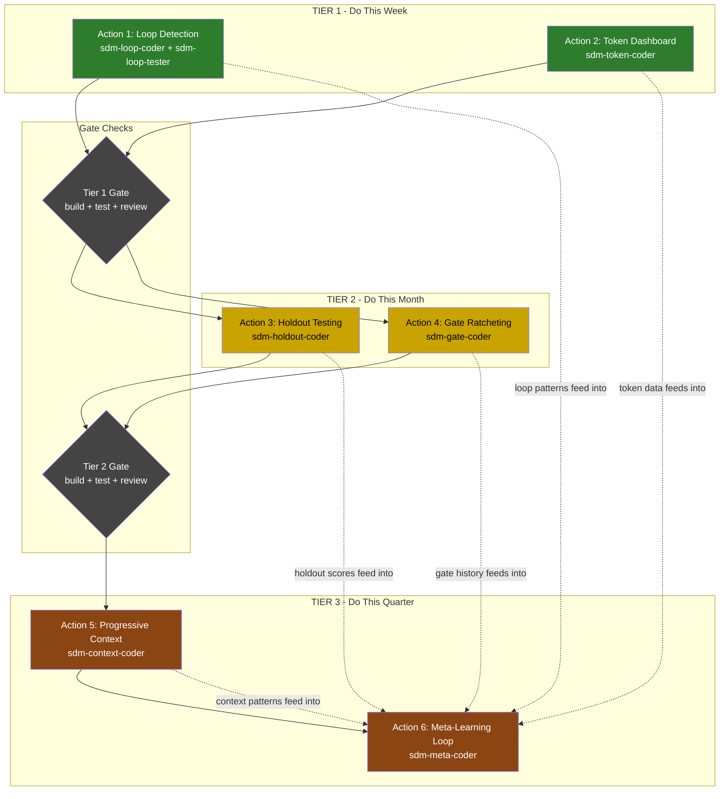

# StrongDM Software Factory Implementation Plan

**Source**: Six Thinking Hats Analysis (`docs/six-hats-strongdm-analysis.md`)
**Date**: 2026-02-08
**Status**: Ready for execution
**Execution Model**: Claude Flow swarm orchestration with QE agents

---

## Table of Contents

1. [Executive Summary](#executive-summary)
2. [Swarm Initialization](#swarm-initialization)
3. [Agent Assignments](#agent-assignments)
4. [Memory Namespaces](#memory-namespaces)
5. [Dependency Graph](#dependency-graph)
6. [File Ownership Matrix](#file-ownership-matrix)
7. [Execution Plan by Tier](#execution-plan-by-tier)
   - [Tier 1: Do This Week](#tier-1-do-this-week)
   - [Tier 2: Do This Month](#tier-2-do-this-month)
   - [Tier 3: Do This Quarter](#tier-3-do-this-quarter)
8. [Gate Checks](#gate-checks)
9. [Rollback Plan](#rollback-plan)
10. [Estimated Token Budget](#estimated-token-budget)
11. [Success Metrics](#success-metrics)

---

## Executive Summary

This plan implements 6 actions derived from the Six Thinking Hats analysis of StrongDM Software Factory recommendations. Actions are organized into 3 tiers by confidence and effort. Each tier must pass gate checks before the next tier begins.

All work is executed through Claude Flow hierarchical swarm orchestration with 8 specialized QE agents sharing HNSW-indexed memory under the `aqe/strongdm-impl/*` namespace. Parallel execution is used within each tier where file ownership does not conflict. Sequential execution is enforced where dependencies exist.

**Key principle**: Two agents must NEVER edit the same file simultaneously. The file ownership matrix below is the authoritative reference for conflict avoidance.

---

## Swarm Initialization

### Pre-flight checks

```bash
# Verify clean build state before any changes
npm run build
npm test -- --run

# Start the Claude Flow daemon
npx @claude-flow/cli@latest daemon start

# Run doctor to verify environment
npx @claude-flow/cli@latest doctor --fix
```

### Initialize the swarm

```bash
npx @claude-flow/cli@latest swarm init \
  --topology hierarchical \
  --max-agents 8 \
  --strategy specialized \
  --v3-mode
```

### Initialize shared memory namespace

```bash
# Create the root namespace for this implementation
npx @claude-flow/cli@latest memory store \
  --key "plan-metadata" \
  --value '{"status":"initialized","tier":1,"startedAt":"'$(date -Iseconds)'"}' \
  --namespace "aqe/strongdm-impl"

# Store the file ownership matrix for agent coordination
npx @claude-flow/cli@latest memory store \
  --key "file-ownership-matrix" \
  --value '{"version":1,"locked":false}' \
  --namespace "aqe/strongdm-impl/coordination"
```

---

## Agent Assignments

8 agents are spawned in the hierarchical swarm. The coordinator agent orchestrates and does not own files directly.

| Agent ID | Agent Type | Role | Assigned Actions |
|----------|-----------|------|-----------------|
| `sdm-coord` | `hierarchical-coordinator` | Orchestrator. Dispatches tasks, monitors progress, enforces gate checks. | Coordination only |
| `sdm-loop-coder` | `coder` | Implements loop detection logic in anti-drift middleware and strange-loop | Action 1 |
| `sdm-loop-tester` | `tester` | Writes tests for loop detection, validates 3-strike behavior | Action 1 |
| `sdm-token-coder` | `coder` | Wires token dashboard summary into CLI and MCP tool | Action 2 |
| `sdm-holdout-coder` | `coder` | Implements holdout test metadata and CI filtering | Action 3 |
| `sdm-gate-coder` | `coder` | Implements auto-ratcheting on coherence gate thresholds | Action 4 |
| `sdm-context-coder` | `coder` | Implements progressive context revelation for agent spawning | Action 5 |
| `sdm-meta-coder` | `coder` | Closes meta-learning loop across all subsystems | Action 6 |

### Agent spawn commands

```bash
# Spawn coordinator
npx @claude-flow/cli@latest agent spawn \
  -t hierarchical-coordinator \
  --name sdm-coord \
  --capabilities "orchestration,gate-checking,progress-tracking"

# Spawn workers (run all in one message via Task tool)
npx @claude-flow/cli@latest agent spawn -t coder --name sdm-loop-coder \
  --capabilities "anti-drift,loop-detection,event-bus"
npx @claude-flow/cli@latest agent spawn -t tester --name sdm-loop-tester \
  --capabilities "testing,loop-detection,vitest"
npx @claude-flow/cli@latest agent spawn -t coder --name sdm-token-coder \
  --capabilities "token-tracking,cli,dashboard"
npx @claude-flow/cli@latest agent spawn -t coder --name sdm-holdout-coder \
  --capabilities "test-generation,holdout,ci"
npx @claude-flow/cli@latest agent spawn -t coder --name sdm-gate-coder \
  --capabilities "coherence,quality-gates,ratcheting"
npx @claude-flow/cli@latest agent spawn -t coder --name sdm-context-coder \
  --capabilities "agent-spawning,context,memory"
npx @claude-flow/cli@latest agent spawn -t coder --name sdm-meta-coder \
  --capabilities "learning,metrics,optimization"
```

---

## Memory Namespaces

All agents share the following HNSW-indexed memory namespaces for cross-agent coordination:

| Namespace | Purpose | Written By | Read By |
|-----------|---------|------------|---------|
| `aqe/strongdm-impl` | Plan metadata, tier status, overall progress | `sdm-coord` | All |
| `aqe/strongdm-impl/coordination` | File locks, agent status, conflict resolution | All agents | All agents |
| `aqe/strongdm-impl/action-1` | Loop detection patterns, 3-strike signatures, test results | `sdm-loop-coder`, `sdm-loop-tester` | `sdm-meta-coder` |
| `aqe/strongdm-impl/action-2` | Token dashboard formats, budget summaries, cost models | `sdm-token-coder` | `sdm-meta-coder` |
| `aqe/strongdm-impl/action-3` | Holdout test metadata schema, CI filter configs | `sdm-holdout-coder` | `sdm-meta-coder` |
| `aqe/strongdm-impl/action-4` | Ratchet thresholds, gate history, escalation rules | `sdm-gate-coder` | `sdm-meta-coder` |
| `aqe/strongdm-impl/action-5` | Context revelation patterns, file request tracking | `sdm-context-coder` | `sdm-meta-coder` |
| `aqe/strongdm-impl/action-6` | Unified metrics schema, learning loop config | `sdm-meta-coder` | All |
| `aqe/strongdm-impl/loop-patterns` | Detected loop signatures for fleet-wide learning | `sdm-loop-coder` | All agents (fleet) |
| `aqe/strongdm-impl/gate-results` | Gate check pass/fail per tier | `sdm-coord` | All |

### Memory operations example

```bash
# Agent stores completion signal
npx @claude-flow/cli@latest memory store \
  --key "action-1-status" \
  --value '{"complete":true,"testsPass":true,"filesModified":["anti-drift-middleware.ts"]}' \
  --namespace "aqe/strongdm-impl/action-1"

# Coordinator queries for completion
npx @claude-flow/cli@latest memory search \
  --query "action status complete" \
  --namespace "aqe/strongdm-impl"
```

---

## Dependency Graph



### Dependency rules

| Rule | Description |
|------|-------------|
| **PARALLEL** | Actions 1 and 2 run concurrently (Tier 1) |
| **PARALLEL** | Actions 3 and 4 run concurrently (Tier 2) |
| **SEQUENTIAL** | Action 5 starts only after Tier 2 gate passes |
| **SEQUENTIAL** | Action 6 starts only after Action 5 completes |
| **GATE** | Tier 1 gate must pass before Tier 2 begins |
| **GATE** | Tier 2 gate must pass before Tier 3 begins |

---

## File Ownership Matrix

Each file is owned by exactly one agent. No two agents edit the same file. If a file requires changes from multiple actions, it is assigned to the primary action agent and the secondary action stores its requirements in shared memory for the primary agent to implement.

### Tier 1 File Ownership

| File | Owner Agent | Action | Modification Type |
|------|------------|--------|-------------------|
| `v3/src/kernel/anti-drift-middleware.ts` | `sdm-loop-coder` | 1 | Extend with tool-call signature tracking |
| `v3/src/strange-loop/strange-loop.ts` | `sdm-loop-coder` | 1 | Add loop cycle detection hooks |
| `v3/src/strange-loop/healing-controller.ts` | `sdm-loop-coder` | 1 | Add loop recovery action type |
| `v3/src/kernel/event-bus.ts` | `sdm-loop-coder` | 1 | Add `loop.detected` event type |
| `v3/src/hooks/cross-phase-hooks.ts` | `sdm-loop-coder` | 1 | Add loop detection hook trigger |
| `v3/src/learning/real-qe-reasoning-bank.ts` | `sdm-loop-coder` | 1 | Add `storeLoopPattern()` method |
| `tests/unit/kernel/loop-detection.test.ts` | `sdm-loop-tester` | 1 | New test file for loop detection |
| `tests/unit/kernel/anti-drift-loop.test.ts` | `sdm-loop-tester` | 1 | New test file for anti-drift loop integration |
| `v3/src/learning/token-tracker.ts` | `sdm-token-coder` | 2 | Add `formatDashboardSummary()` method |
| `v3/src/integrations/agentic-flow/model-router/budget-enforcer.ts` | `sdm-token-coder` | 2 | Add `getSessionCostSummary()` |
| `v3/src/mcp/tools/analysis/token-usage.ts` | `sdm-token-coder` | 2 | Add dashboard summary operation |
| `v3/src/cli/commands/token-usage.ts` | `sdm-token-coder` | 2 | Add `--dashboard` flag for terminal summary |
| `v3/src/optimization/token-optimizer-service.ts` | `sdm-token-coder` | 2 | Wire dashboard into optimizer output |

### Tier 2 File Ownership

| File | Owner Agent | Action | Modification Type |
|------|------------|--------|-------------------|
| `v3/src/domains/test-generation/interfaces/test-generator.interface.ts` | `sdm-holdout-coder` | 3 | Add `holdout` metadata field to test output |
| `v3/src/domains/test-generation/services/test-generator.ts` | `sdm-holdout-coder` | 3 | Implement 10% holdout selection logic |
| `v3/src/domains/test-generation/services/tdd-generator.ts` | `sdm-holdout-coder` | 3 | Propagate holdout flag in TDD flow |
| `v3/src/domains/coverage-analysis/services/` | `sdm-holdout-coder` | 3 | Track holdout vs non-holdout coverage separately |
| `v3/src/learning/skill-validation-learner.ts` | `sdm-holdout-coder` | 3 | Add holdout pass rate tracking |
| `tests/unit/domains/test-generation/holdout.test.ts` | `sdm-holdout-coder` | 3 | New test file for holdout logic |
| `v3/src/domains/quality-assessment/coherence/gate-controller.ts` | `sdm-gate-coder` | 4 | Add auto-ratchet logic to `evaluate()` |
| `v3/src/domains/quality-assessment/coherence/lambda-calculator.ts` | `sdm-gate-coder` | 4 | Add ratchet threshold storage |
| `v3/src/domains/quality-assessment/coherence/types.ts` | `sdm-gate-coder` | 4 | Add `RatchetConfig` and `RatchetHistory` types |
| `v3/src/domains/quality-assessment/services/quality-gate.ts` | `sdm-gate-coder` | 4 | Wire ratcheting into gate evaluation |
| `v3/src/domains/quality-assessment/services/coherence-gate.ts` | `sdm-gate-coder` | 4 | Integrate ratchet with coherence decisions |
| `tests/unit/domains/quality-assessment/ratcheting.test.ts` | `sdm-gate-coder` | 4 | New test file for ratchet behavior |

### Tier 3 File Ownership

| File | Owner Agent | Action | Modification Type |
|------|------------|--------|-------------------|
| `v3/src/kernel/interfaces.ts` | `sdm-context-coder` | 5 | Extend `AgentSpawnConfig` with context strategy |
| `v3/src/kernel/agent-coordinator.ts` | `sdm-context-coder` | 5 | Implement lazy context loading on spawn |
| `v3/src/learning/experience-capture.ts` | `sdm-context-coder` | 5 | Track which files agents request |
| `v3/src/learning/experience-capture-middleware.ts` | `sdm-context-coder` | 5 | Add context request interception |
| `v3/src/kernel/unified-memory.ts` | `sdm-context-coder` | 5 | Add context prediction query methods |
| `tests/unit/kernel/progressive-context.test.ts` | `sdm-context-coder` | 5 | New test file for context revelation |
| `v3/src/learning/metrics-tracker.ts` | `sdm-meta-coder` | 6 | Add unified cross-action metrics collection |
| `v3/src/learning/pattern-store.ts` | `sdm-meta-coder` | 6 | Add meta-pattern storage for optimization configs |
| `v3/src/learning/pattern-lifecycle.ts` | `sdm-meta-coder` | 6 | Add self-optimization lifecycle hooks |
| `v3/src/learning/aqe-learning-engine.ts` | `sdm-meta-coder` | 6 | Wire meta-learning feedback into engine |
| `tests/unit/learning/meta-learning.test.ts` | `sdm-meta-coder` | 6 | New test file for meta-learning loop |

### Conflict resolution protocol

If an agent discovers it needs to modify a file owned by another agent:

1. Store the required change as a structured request in shared memory:
   ```bash
   npx @claude-flow/cli@latest memory store \
     --key "cross-agent-request-{requestId}" \
     --value '{"requester":"sdm-meta-coder","owner":"sdm-loop-coder","file":"anti-drift-middleware.ts","change":"Add getLoopMetrics() export","priority":"medium"}' \
     --namespace "aqe/strongdm-impl/coordination"
   ```
2. The coordinator (`sdm-coord`) routes the request to the owning agent.
3. The owning agent implements the change and stores confirmation in memory.
4. The requesting agent reads confirmation before proceeding.

---

## Execution Plan by Tier

### Tier 1: Do This Week

**Timeline**: Days 1-2
**Parallelism**: Actions 1 and 2 run concurrently

#### Action 1: Add Loop Detection to Hooks System

**Agent**: `sdm-loop-coder` (implementation), `sdm-loop-tester` (tests)
**Effort**: 1-2 days
**Risk**: Low

##### Step 1.1: Extend `anti-drift-middleware.ts` with tool-call signature tracking

Add a `ToolCallSignatureTracker` class to the existing anti-drift middleware:

```typescript
// New types to add at top of file
export interface ToolCallSignature {
  readonly hash: string;           // FNV-1a hash of tool name + args
  readonly toolName: string;
  readonly argsFingerprint: string; // truncated hash of serialized args
  readonly timestamp: number;
}

export interface LoopDetectionConfig {
  readonly maxIdenticalCalls: number;    // default: 3 (3-strike rule)
  readonly windowMs: number;             // default: 30000 (30 seconds)
  readonly steeringMessage: string;      // injected after 3 identical calls
  readonly enableFleetLearning: boolean; // store patterns in HNSW
}

export interface LoopDetectionResult {
  readonly isLoop: boolean;
  readonly callCount: number;
  readonly signature: ToolCallSignature;
  readonly action: 'allow' | 'warn' | 'steer';
}
```

Implementation details:
- Maintain a sliding window (`CircularBuffer<ToolCallSignature>`) of recent tool calls per agent
- Hash each tool call using FNV-1a (reuse existing `hashBasedEmbedding` infrastructure)
- On each call, check if the same signature has appeared `maxIdenticalCalls` times within `windowMs`
- Strike 1: log warning
- Strike 2: log warning + emit `loop.warning` event on EventBus
- Strike 3: inject steering prompt + emit `loop.detected` event + store pattern in ReasoningBank

##### Step 1.2: Add loop events to `event-bus.ts`

Register two new event types in the EventBus subscription index:
- `loop.warning` - emitted on strike 2
- `loop.detected` - emitted on strike 3

These events carry `LoopDetectionResult` as their payload.

##### Step 1.3: Connect to `strange-loop.ts` and `healing-controller.ts`

- Add a `loopDetected` case to `SelfHealingActionType` in `healing-controller.ts`
- In `strange-loop.ts`, subscribe to `loop.detected` events and trigger the Observe-Model-Decide-Act cycle
- The healing action for loops: inject a steering prompt suggesting alternative approaches

##### Step 1.4: Store loop patterns in ReasoningBank

Add a `storeLoopPattern()` method to `real-qe-reasoning-bank.ts`:

```typescript
async storeLoopPattern(pattern: {
  toolCallSignature: string;
  agentId: string;
  taskType: string;
  steeringUsed: string;
  resolved: boolean;
}): Promise<Result<string, Error>>
```

This stores the loop signature as a QEPattern with type `'anti-pattern'` and domain `'learning-optimization'` so the fleet can recognize the pattern before it occurs in future tasks.

##### Step 1.5: Hook integration in `cross-phase-hooks.ts`

Add a new hook trigger type `'loop-detected'` to the `HookTrigger` interface:

```typescript
interface HookTrigger {
  event: 'agent-complete' | 'phase-start' | 'phase-end' | 'manual' | 'loop-detected';
  // ...existing fields
}
```

##### Step 1.6: Write tests (sdm-loop-tester)

Create test files:
- `tests/unit/kernel/loop-detection.test.ts`:
  - Test 3-strike detection with identical tool calls
  - Test sliding window expiry (calls outside window do not count)
  - Test different tool calls do not trigger loop detection
  - Test steering message injection on strike 3
  - Test event emission on strikes 2 and 3
- `tests/unit/kernel/anti-drift-loop.test.ts`:
  - Test integration between anti-drift middleware and loop detection
  - Test loop pattern storage in ReasoningBank
  - Test healing controller response to loop events

#### Action 2: Surface Token Budget Dashboard

**Agent**: `sdm-token-coder`
**Effort**: 1 day
**Risk**: None

##### Step 2.1: Add `formatDashboardSummary()` to `token-tracker.ts`

Add a new method to `TokenMetricsCollector`:

```typescript
static formatDashboardSummary(): string {
  // Returns a compact terminal-friendly string:
  // "Token Usage Today: 250,432 tokens ($3.75) | Saved: 45,200 tokens ($0.68) via pattern reuse"
  // "Budget: $3.75 / $25.00 (15%) | Tier split: Haiku 72% | Sonnet 25% | Opus 3%"
}
```

Uses the existing `getSessionSummary()` and `getTokenEfficiency()` methods internally. Formats costs using the existing `formatCostUsd()` utility. Adds ANSI color codes for terminal readability (green for under-budget, yellow for 80%+, red for over-budget).

##### Step 2.2: Add `getSessionCostSummary()` to `budget-enforcer.ts`

Add a method to the `BudgetEnforcer` class that returns current session spending:

```typescript
getSessionCostSummary(): {
  totalSpentUsd: number;
  dailyLimitUsd: number;
  utilizationPercent: number;
  byTier: Record<ModelTier, { spent: number; limit: number; requests: number }>;
}
```

This aggregates from the existing `TierUsageTracker` instances.

##### Step 2.3: Add `--dashboard` flag to `token-usage.ts` CLI command

Extend the `createTokenUsageCommand()` to add:

```typescript
.option('--dashboard', 'Show compact terminal dashboard summary')
```

When `--dashboard` is passed, call `TokenMetricsCollector.formatDashboardSummary()` and print to stdout.

##### Step 2.4: Add `dashboard` operation to MCP token-usage tool

Extend the `TokenUsageParams.operation` union type to include `'dashboard'`, which returns the formatted dashboard summary as the MCP tool result. This allows IDE integrations (VS Code, Cursor) to display the token budget inline.

##### Step 2.5: Wire into `aqe-costs` skill output

The existing `aqe-costs` skill should call the new dashboard endpoint. Store the wiring instructions in shared memory for the skill maintainer:

```bash
npx @claude-flow/cli@latest memory store \
  --key "aqe-costs-dashboard-wiring" \
  --value '{"skill":"aqe-costs","newEndpoint":"TokenMetricsCollector.formatDashboardSummary()","status":"ready-for-wiring"}' \
  --namespace "aqe/strongdm-impl/action-2"
```

#### Tier 1 Parallel Execution Group

```
TIME --->

Day 1 AM:
  [sdm-loop-coder]  Step 1.1: Extend anti-drift-middleware.ts
  [sdm-token-coder]  Step 2.1: Add formatDashboardSummary() to token-tracker.ts

Day 1 PM:
  [sdm-loop-coder]  Step 1.2: Add loop events to event-bus.ts
  [sdm-loop-coder]  Step 1.3: Connect to strange-loop.ts + healing-controller.ts
  [sdm-token-coder]  Step 2.2: Add getSessionCostSummary() to budget-enforcer.ts
  [sdm-token-coder]  Step 2.3: Add --dashboard flag to CLI

Day 2 AM:
  [sdm-loop-coder]  Step 1.4: Store loop patterns in ReasoningBank
  [sdm-loop-coder]  Step 1.5: Hook integration in cross-phase-hooks.ts
  [sdm-loop-tester]  Step 1.6: Write all loop detection tests
  [sdm-token-coder]  Step 2.4: Add dashboard operation to MCP tool
  [sdm-token-coder]  Step 2.5: Wire aqe-costs skill

Day 2 PM:
  [sdm-coord]  Run Tier 1 gate checks (build + test + review)
```

---

### Tier 2: Do This Month

**Timeline**: Week 2-3
**Precondition**: Tier 1 gate passed
**Parallelism**: Actions 3 and 4 run concurrently

#### Action 3: Implement "Friday Test Surprise" Holdout Testing

**Agent**: `sdm-holdout-coder`
**Effort**: 1 week
**Risk**: Medium (scenario staleness)

##### Step 3.1: Add `holdout` metadata to test generation interfaces

Extend `test-generator.interface.ts` to include holdout metadata:

```typescript
export interface GeneratedTestMetadata {
  // ...existing fields
  /** Whether this test is a holdout (excluded from dev runs, CI-release-gate only) */
  holdout: boolean;
  /** Timestamp when the holdout was generated */
  holdoutGeneratedAt?: number;
  /** Holdout batch ID for tracking cohorts */
  holdoutBatchId?: string;
}
```

##### Step 3.2: Implement 10% holdout selection in `test-generator.ts`

Add holdout selection logic to the test generation pipeline:

```typescript
private selectForHoldout(tests: GeneratedTest[]): GeneratedTest[] {
  // Deterministic selection: hash test ID, select bottom 10%
  // Use FNV-1a hash (already available in codebase) for determinism
  // Ensures the same test is always holdout or not, regardless of run order
  const holdoutThreshold = Math.floor(tests.length * 0.10);
  const sorted = tests.sort((a, b) => fnvHash(a.id) - fnvHash(b.id));
  return sorted.slice(0, holdoutThreshold).map(t => ({ ...t, metadata: { ...t.metadata, holdout: true } }));
}
```

##### Step 3.3: Propagate holdout flag through TDD generator

In `tdd-generator.ts`, pass the holdout metadata through the TDD generation flow so tests generated via TDD mode also participate in holdout selection.

##### Step 3.4: Track holdout pass rate in coverage analysis

Add holdout-aware coverage tracking:
- Separate coverage metrics for holdout tests vs regular tests
- Store holdout pass rates over time in the metrics tracker
- Enable trend analysis: "Holdout pass rate: 87% (up from 82% last month)"

##### Step 3.5: Integrate with skill validation learner

In `skill-validation-learner.ts`, add holdout pass rate as a quality signal:

```typescript
interface HoldoutMetrics {
  totalHoldoutTests: number;
  holdoutPassRate: number;
  holdoutPassRateTrend: 'improving' | 'stable' | 'declining';
  lastEvaluatedAt: number;
}
```

##### Step 3.6: CI configuration for holdout-only runs

Create a script or vitest config filter that can be used in CI:

```bash
# Regular dev run (excludes holdouts)
npm test -- --run --exclude-holdout

# CI release gate (holdouts only)
npm test -- --run --holdout-only
```

Implementation: Use vitest's `--testPathPattern` or a custom reporter that reads the holdout metadata. Store the filter logic in a vitest plugin or setup file.

##### Step 3.7: Write tests for holdout logic

Create `tests/unit/domains/test-generation/holdout.test.ts`:
- Test 10% selection is deterministic
- Test holdout flag propagates through TDD flow
- Test holdout tests are excluded from dev runs
- Test holdout tests are included in CI release gate
- Test holdout pass rate tracking over time
- Test staleness detection (holdouts older than configured threshold)

#### Action 4: Extend Coherence Gates with Auto-Ratcheting

**Agent**: `sdm-gate-coder`
**Effort**: 1 week
**Risk**: Medium (too-strict gates)

##### Step 4.1: Add ratchet types to `coherence/types.ts`

```typescript
export interface RatchetConfig {
  /** Enable auto-ratcheting */
  enabled: boolean;
  /** Number of consecutive passes required before ratcheting up */
  consecutivePassesRequired: number; // default: 5
  /** Percentage to increase threshold by on ratchet */
  ratchetIncrementPercent: number; // default: 2
  /** Maximum threshold value (ceiling to prevent over-tightening) */
  maxThreshold: number; // default: 95
  /** Never decrease, only tighten */
  monotonic: true; // always true, enforced by type system
  /** Cooldown period between ratchets (milliseconds) */
  cooldownMs: number; // default: 7 days
}

export interface RatchetHistory {
  /** Dimension that was ratcheted */
  dimension: keyof QualityDimensions;
  /** Previous threshold */
  previousThreshold: number;
  /** New threshold after ratchet */
  newThreshold: number;
  /** Timestamp of the ratchet */
  ratchetedAt: number;
  /** Number of consecutive passes that triggered the ratchet */
  consecutivePasses: number;
}
```

##### Step 4.2: Implement ratchet logic in `gate-controller.ts`

Extend `CoherenceGateController` with ratcheting:

```typescript
private ratchetState: Map<string, {
  consecutivePasses: number;
  currentThreshold: number;
  lastRatchetAt: number;
  history: RatchetHistory[];
}>;

/**
 * After a successful gate evaluation, check if any dimension
 * should be ratcheted up.
 */
private checkRatchet(decision: QualityGateDecision, dimensions: QualityDimensions): RatchetHistory[] {
  // For each dimension:
  // 1. If decision is 'deploy' or 'canary', increment consecutivePasses
  // 2. If consecutivePasses >= config.consecutivePassesRequired:
  //    a. Check cooldown period
  //    b. Increase threshold by config.ratchetIncrementPercent
  //    c. Cap at config.maxThreshold
  //    d. Reset consecutivePasses
  //    e. Record RatchetHistory entry
  // 3. If decision is 'quarantine' or 'rollback', reset consecutivePasses (do NOT decrease threshold)
}
```

Key invariant: **Thresholds NEVER decrease.** The `monotonic: true` field in `RatchetConfig` is a type-level enforcement. The `checkRatchet()` method must assert this invariant and throw if violated.

##### Step 4.3: Wire ratcheting into lambda calculator

In `lambda-calculator.ts`, read ratcheted thresholds when calculating quality lambda. The ratcheted thresholds replace the static `CoherenceGatePolicy` thresholds for dimensions that have been ratcheted.

##### Step 4.4: Integrate with quality gate service

In `quality-gate.ts` and `coherence-gate.ts`, pass the ratcheted thresholds through gate evaluation. Add a `ratchetHistory` field to `GateResult` so consumers can see which dimensions have been tightened.

##### Step 4.5: Persist ratchet state

Store ratchet state in the unified memory (SQLite) so it survives process restarts:

```bash
# Ratchet state stored in unified memory
namespace: aqe/quality-gates/ratchet
key: ratchet-state-{dimension}
value: { currentThreshold, consecutivePasses, lastRatchetAt, history[] }
```

##### Step 4.6: Write tests for ratcheting

Create `tests/unit/domains/quality-assessment/ratcheting.test.ts`:
- Test threshold increases after N consecutive passes
- Test threshold NEVER decreases (monotonic invariant)
- Test cooldown period is respected
- Test maximum threshold ceiling
- Test reset on quarantine/rollback (passes reset, threshold stays)
- Test ratchet history is recorded correctly
- Test persistence survives restart
- Test integration with coherence gate decisions

#### Tier 2 Parallel Execution Group

```
TIME --->

Week 2:
  [sdm-holdout-coder]  Steps 3.1-3.3: Interface changes, selection logic, TDD propagation
  [sdm-gate-coder]     Steps 4.1-4.2: Ratchet types, gate controller logic

Week 3:
  [sdm-holdout-coder]  Steps 3.4-3.7: Coverage tracking, skill validation, CI config, tests
  [sdm-gate-coder]     Steps 4.3-4.6: Lambda calc, quality gate wiring, persistence, tests

End of Week 3:
  [sdm-coord]  Run Tier 2 gate checks (build + test + review)
```

---

### Tier 3: Do This Quarter

**Timeline**: Weeks 4-10
**Precondition**: Tier 2 gate passed
**Parallelism**: Action 5 then Action 6 (sequential - A6 depends on A5 outputs)

#### Action 5: Progressive Context Revelation

**Agent**: `sdm-context-coder`
**Effort**: 2-3 weeks
**Risk**: High (behavior change)

##### Step 5.1: Extend `AgentSpawnConfig` in `interfaces.ts`

Add context strategy configuration:

```typescript
export interface AgentSpawnConfig {
  // ...existing fields
  /** Context loading strategy */
  contextStrategy?: ContextStrategy;
}

export type ContextStrategy = 'full' | 'lazy' | 'predictive';

export interface LazyContextConfig {
  /** Start with task description only (no pre-loaded files) */
  taskDescriptionOnly: boolean;
  /** Maximum files to pre-load based on prediction */
  maxPreloadFiles: number; // default: 3
  /** Minimum prediction confidence to pre-load */
  minPredictionConfidence: number; // default: 0.7
}
```

##### Step 5.2: Implement lazy context loading in `agent-coordinator.ts`

Modify the `spawn()` method in `DefaultAgentCoordinator`:

```typescript
async spawn(config: AgentSpawnConfig): Promise<Result<string, Error>> {
  // ...existing limit check

  if (config.contextStrategy === 'lazy' || config.contextStrategy === 'predictive') {
    // Do NOT pre-load full codebase context
    // Instead, provide only the task description
    // Agent will request files on demand via fetchContext()
  }

  if (config.contextStrategy === 'predictive') {
    // Query HNSW memory for similar past tasks
    // Pre-load only the files that past agents requested
    const predictions = await this.predictContextNeeds(config);
    // Pre-load top N files with confidence > threshold
  }
  // ...rest of spawn logic
}
```

##### Step 5.3: Track file requests in `experience-capture.ts`

Add file request tracking to the experience capture system:

```typescript
interface FileRequestEvent {
  agentId: string;
  taskType: string;
  filePath: string;
  requestedAt: number;
  wasUseful: boolean; // set after task completion based on whether file content appeared in output
}
```

Record every file an agent requests during task execution. After task completion, mark each file as useful or not based on whether its content influenced the output.

##### Step 5.4: Add context request interception in `experience-capture-middleware.ts`

Intercept file read operations from agents:

```typescript
async interceptFileRequest(agentId: string, filePath: string): Promise<void> {
  // Record the request
  await this.captureFileRequest({
    agentId,
    taskType: this.currentContext?.domain || 'unknown',
    filePath,
    requestedAt: Date.now(),
    wasUseful: false, // updated after task completion
  });
}
```

##### Step 5.5: Add context prediction queries to `unified-memory.ts`

Add HNSW-powered context prediction:

```typescript
async predictContextFiles(taskDescription: string, taskType: string): Promise<{
  files: Array<{ path: string; confidence: number; reason: string }>;
  basedOnExperiences: number;
}> {
  // 1. Embed the task description
  // 2. Search HNSW for similar past tasks
  // 3. Aggregate file request patterns from similar tasks
  // 4. Rank by frequency and usefulness
  // 5. Return top N with confidence scores
}
```

##### Step 5.6: Write tests

Create `tests/unit/kernel/progressive-context.test.ts`:
- Test lazy spawn provides only task description
- Test predictive spawn queries HNSW for similar tasks
- Test file request tracking records correctly
- Test usefulness scoring after task completion
- Test prediction accuracy improves over time (mock HNSW results)
- Test fallback to full context when no predictions available
- Test `maxPreloadFiles` limit is respected
- Test `minPredictionConfidence` threshold is enforced

#### Action 6: Close the Meta-Learning Loop

**Agent**: `sdm-meta-coder`
**Effort**: 3-4 weeks
**Risk**: Medium (complexity)
**Precondition**: Action 5 complete (uses context patterns as input)

##### Step 6.1: Unified metrics schema in `metrics-tracker.ts`

Extend `LearningMetricsSnapshot` with cross-action metrics:

```typescript
export interface UnifiedMetricsSnapshot extends LearningMetricsSnapshot {
  /** Loop detection metrics (from Action 1) */
  loopDetection: {
    loopsDetectedToday: number;
    tokensSavedByPrevention: number;
    topLoopPatterns: Array<{ signature: string; frequency: number }>;
  };

  /** Token budget metrics (from Action 2) */
  tokenBudget: {
    dailySpendUsd: number;
    dailyLimitUsd: number;
    savingsFromPatternReuse: number;
    tierDistribution: Record<string, number>;
  };

  /** Holdout test metrics (from Action 3) */
  holdoutTesting: {
    holdoutPassRate: number;
    holdoutPassRateTrend: 'improving' | 'stable' | 'declining';
    totalHoldoutTests: number;
  };

  /** Gate ratcheting metrics (from Action 4) */
  gateRatcheting: {
    ratchetsThisQuarter: number;
    currentThresholds: Record<string, number>;
    lastRatchetDate: number | null;
  };

  /** Progressive context metrics (from Action 5) */
  progressiveContext: {
    avgTokensPerSpawn: number;
    tokenReductionPercent: number;
    predictionAccuracy: number;
  };
}
```

##### Step 6.2: Meta-pattern storage in `pattern-store.ts`

Add a new pattern type for optimization configurations:

```typescript
// In qe-patterns.ts, add to QEPatternType union:
export type QEPatternType =
  // ...existing types
  | 'meta-optimization'; // patterns that describe optimal system configurations

// Meta-pattern structure
export interface MetaOptimizationPattern {
  /** Task type this optimization applies to */
  taskType: string;
  /** Optimal configuration discovered */
  config: {
    contextStrategy: ContextStrategy;
    modelTier: number;
    maxTokenBudget: number;
    gateThresholds: Record<string, number>;
    holdoutPercentage: number;
  };
  /** How this config was discovered */
  discoveredVia: 'correlation' | 'ab-test' | 'regression';
  /** Confidence in this optimization */
  confidence: number;
  /** Number of tasks that validated this config */
  validationCount: number;
}
```

##### Step 6.3: Self-optimization lifecycle in `pattern-lifecycle.ts`

Add lifecycle hooks for meta-optimization patterns:

```typescript
/**
 * Evaluate whether a meta-optimization pattern should be promoted,
 * deprecated, or adjusted based on unified metrics.
 */
async evaluateMetaPatterns(snapshot: UnifiedMetricsSnapshot): Promise<{
  promotions: MetaOptimizationPattern[];
  deprecations: MetaOptimizationPattern[];
  suggestions: OptimizationSuggestion[];
}> {
  // 1. Query all active meta-optimization patterns
  // 2. For each pattern, check if its predicted outcomes match actual metrics
  // 3. If metrics improved: promote (increase confidence)
  // 4. If metrics declined: deprecate (decrease confidence, do NOT apply)
  // 5. Generate new suggestions from correlations in the unified metrics
}
```

##### Step 6.4: Wire meta-learning into `aqe-learning-engine.ts`

Add a `runMetaLearningCycle()` method to the learning engine:

```typescript
async runMetaLearningCycle(): Promise<{
  metricsCollected: UnifiedMetricsSnapshot;
  patternsEvaluated: number;
  suggestionsGenerated: OptimizationSuggestion[];
  autoApplied: number;
}> {
  // 1. Collect unified metrics snapshot
  // 2. Evaluate existing meta-patterns against snapshot
  // 3. Generate new optimization suggestions
  // 4. Auto-apply suggestions with confidence > 0.9 and risk 'low'
  // 5. Store results in ReasoningBank
  // 6. Return summary for dashboard display
}
```

The meta-learning cycle runs:
- **On-demand**: via MCP tool or CLI command
- **Scheduled**: daily at end-of-session (via post-task hook)
- **Triggered**: when any gate check fails (to learn from failures)

##### Step 6.5: Write tests

Create `tests/unit/learning/meta-learning.test.ts`:
- Test unified metrics snapshot aggregation from all actions
- Test meta-pattern promotion on improved metrics
- Test meta-pattern deprecation on declined metrics
- Test suggestion generation from correlations
- Test auto-apply threshold (only high-confidence, low-risk)
- Test meta-learning cycle end-to-end
- Test integration with existing learning engine
- Test persistence of meta-patterns across sessions

#### Tier 3 Sequential Execution

```
TIME --->

Weeks 4-5:
  [sdm-context-coder]  Steps 5.1-5.3: Interface changes, lazy loading, file tracking

Week 6:
  [sdm-context-coder]  Steps 5.4-5.6: Middleware interception, HNSW prediction, tests

Weeks 7-8:
  [sdm-meta-coder]     Steps 6.1-6.2: Unified metrics schema, meta-pattern storage

Weeks 9-10:
  [sdm-meta-coder]     Steps 6.3-6.5: Self-optimization lifecycle, engine wiring, tests

End of Week 10:
  [sdm-coord]  Run Tier 3 gate checks (build + test + review)
```

---

## Gate Checks

### Tier 1 Gate (after Actions 1 and 2)

| Check | Command | Pass Criteria |
|-------|---------|---------------|
| Build | `npm run build` | Zero errors |
| Unit Tests | `npm test -- --run` | All pass, no regressions |
| Loop Detection Smoke Test | `npm test -- --run tests/unit/kernel/loop-detection.test.ts` | 3-strike detection works |
| Token Dashboard Smoke Test | `npm test -- --run` + verify `--dashboard` flag | Dashboard output is non-empty |
| Lint | `npm run lint` | No new lint errors |
| File Ownership | Check shared memory for cross-agent conflicts | Zero unresolved conflicts |
| Memory Namespace | Query `aqe/strongdm-impl/action-1` and `action-2` | Both have `complete: true` |

```bash
# Tier 1 gate execution script
npm run build && \
npm test -- --run && \
npm run lint && \
npx @claude-flow/cli@latest memory search --query "action status" --namespace "aqe/strongdm-impl"
```

### Tier 2 Gate (after Actions 3 and 4)

| Check | Command | Pass Criteria |
|-------|---------|---------------|
| Build | `npm run build` | Zero errors |
| Full Test Suite | `npm test -- --run` | All pass, no regressions |
| Holdout Selection Test | `npm test -- --run tests/unit/domains/test-generation/holdout.test.ts` | 10% selection is deterministic |
| Ratcheting Test | `npm test -- --run tests/unit/domains/quality-assessment/ratcheting.test.ts` | Monotonic invariant holds |
| Integration Test | Verify holdout + ratchet do not interfere | No cross-action regressions |
| Lint | `npm run lint` | No new lint errors |

```bash
# Tier 2 gate execution script
npm run build && \
npm test -- --run && \
npm run lint
```

### Tier 3 Gate (after Actions 5 and 6)

| Check | Command | Pass Criteria |
|-------|---------|---------------|
| Build | `npm run build` | Zero errors |
| Full Test Suite | `npm test -- --run` | All pass, no regressions |
| Progressive Context Test | `npm test -- --run tests/unit/kernel/progressive-context.test.ts` | Lazy spawn works |
| Meta-Learning Test | `npm test -- --run tests/unit/learning/meta-learning.test.ts` | Cycle completes |
| Performance Benchmark | Measure token usage per spawn (before/after) | >= 20% reduction |
| Lint | `npm run lint` | No new lint errors |
| Full System Integration | Run a complete swarm task with all 6 actions active | No crashes, metrics collected |

```bash
# Tier 3 gate execution script
npm run build && \
npm test -- --run && \
npm run lint
```

---

## Rollback Plan

### Per-action rollback

Each action is implemented in a separate git branch. If an action fails gate checks, its branch is abandoned without merging.

```bash
# Branch naming convention
git checkout -b strongdm/action-1-loop-detection
git checkout -b strongdm/action-2-token-dashboard
git checkout -b strongdm/action-3-holdout-testing
git checkout -b strongdm/action-4-gate-ratcheting
git checkout -b strongdm/action-5-progressive-context
git checkout -b strongdm/action-6-meta-learning
```

### Tier-level rollback

If a tier gate fails, ALL branches in that tier are reverted:

```bash
# Rollback Tier 1 (if gate fails)
git checkout main
git branch -D strongdm/action-1-loop-detection
git branch -D strongdm/action-2-token-dashboard

# Clean up memory namespaces
npx @claude-flow/cli@latest memory delete --namespace "aqe/strongdm-impl/action-1"
npx @claude-flow/cli@latest memory delete --namespace "aqe/strongdm-impl/action-2"
```

### Feature flags for runtime rollback

Each action includes a feature flag that can disable the new behavior without code changes:

| Action | Feature Flag | Default |
|--------|-------------|---------|
| 1 | `AQE_LOOP_DETECTION_ENABLED` | `true` |
| 2 | `AQE_TOKEN_DASHBOARD_ENABLED` | `true` |
| 3 | `AQE_HOLDOUT_TESTING_ENABLED` | `false` (opt-in during validation) |
| 4 | `AQE_GATE_RATCHETING_ENABLED` | `false` (opt-in during validation) |
| 5 | `AQE_PROGRESSIVE_CONTEXT_ENABLED` | `false` (opt-in during validation) |
| 6 | `AQE_META_LEARNING_ENABLED` | `false` (opt-in during validation) |

Feature flags are checked at the entry point of each new code path. If disabled, the code falls through to the existing behavior with zero overhead.

### Emergency rollback

If a production issue is traced to any StrongDM change:

1. Set all feature flags to `false` (immediate, no deploy needed if flags are env vars)
2. Revert the merge commit on `main`
3. Clear the HNSW memory namespaces
4. Notify the team via the existing incident response process

---

## Estimated Token Budget

### Cost model

Based on the 3-tier model routing (ADR-026):

| Tier | Cost/1K tokens | Use Case |
|------|---------------|----------|
| Tier 1 (WASM) | $0.00 | Simple transforms |
| Tier 2 (Haiku) | $0.0002 | Simple tasks |
| Tier 3 (Sonnet/Opus) | $0.003-$0.015 | Complex reasoning |

### Per-tier estimates

| Tier | Actions | Agent Count | Est. Tasks | Model Tier | Est. Tokens | Est. Cost |
|------|---------|-------------|------------|------------|-------------|-----------|
| Tier 1 | 1, 2 | 3 (2 coders + 1 tester) | ~40 tasks | Mostly Tier 2/3 | ~800K tokens | $2.40 - $12.00 |
| Tier 2 | 3, 4 | 2 coders | ~60 tasks | Mostly Tier 2/3 | ~1.2M tokens | $3.60 - $18.00 |
| Tier 3 | 5, 6 | 2 coders | ~100 tasks | Mostly Tier 3 | ~2.0M tokens | $6.00 - $30.00 |
| **Total** | | **7 workers + 1 coord** | **~200 tasks** | | **~4.0M tokens** | **$12.00 - $60.00** |

### Cost controls

- Budget enforcer (existing `budget-enforcer.ts`) caps daily spend at configured limit
- Each agent gets a per-task token budget (configurable in spawn config)
- Loop detection (Action 1, once implemented) prevents runaway token consumption
- Pattern reuse (existing `token-optimizer-service.ts`) reduces repeat work

### Budget monitoring during execution

```bash
# Check budget during execution
npx @claude-flow/cli@latest memory retrieve \
  --key "token-budget-status" \
  --namespace "aqe/strongdm-impl/coordination"

# After Action 2 is complete, use the new dashboard
aqe token-usage --dashboard
```

---

## Success Metrics

Tracked continuously during and after implementation.

| Action | Metric | Target | Measurement Method |
|--------|--------|--------|-------------------|
| 1. Loop Detection | Token waste prevented per week | > $50 saved | Compare token spend before/after; count prevented loops x avg loop cost |
| 2. Token Dashboard | User engagement with cost data | > 60% of sessions view dashboard | Track `--dashboard` CLI invocations and MCP `dashboard` operation calls |
| 3. Holdout Testing | Holdout pass rate trend | Improving month-over-month | Query `aqe/strongdm-impl/action-3` namespace for holdout pass rates by month |
| 4. Gate Ratcheting | Gate threshold increases per quarter | 2-3 ratchets | Count entries in `RatchetHistory[]` per quarter |
| 5. Progressive Context | Tokens per agent spawn | -40% reduction | Compare `avgTokensPerSpawn` before/after in unified metrics |
| 6. Meta-Learning | Self-optimization suggestions adopted | > 5/month | Count meta-patterns with `confidence > 0.9` promoted per month |

### Metric collection commands

```bash
# Loop detection savings
npx @claude-flow/cli@latest memory search \
  --query "loop detected prevented savings" \
  --namespace "aqe/strongdm-impl/loop-patterns"

# Token dashboard engagement
npx @claude-flow/cli@latest memory search \
  --query "dashboard invocation count" \
  --namespace "aqe/strongdm-impl/action-2"

# Holdout pass rate trend
npx @claude-flow/cli@latest memory search \
  --query "holdout pass rate monthly" \
  --namespace "aqe/strongdm-impl/action-3"

# Ratchet history
npx @claude-flow/cli@latest memory search \
  --query "ratchet threshold increase" \
  --namespace "aqe/strongdm-impl/action-4"

# Context token reduction
npx @claude-flow/cli@latest memory search \
  --query "tokens per spawn reduction" \
  --namespace "aqe/strongdm-impl/action-5"

# Meta-learning suggestions adopted
npx @claude-flow/cli@latest memory search \
  --query "meta-pattern promoted high confidence" \
  --namespace "aqe/strongdm-impl/action-6"
```

---

## Appendix A: ADR References

| ADR | Title | Relevance |
|-----|-------|-----------|
| ADR-021 | QE ReasoningBank for Pattern Learning | Loop pattern storage (Action 1), meta-patterns (Action 6) |
| ADR-026 | 3-Tier Model Routing | Token budget tiers (Action 2), model selection (Action 5) |
| ADR-030 | 4-Tier Compute Allocation | Coherence gates (Action 4), lambda calculator |
| ADR-031 | Strange Loop Self-Awareness | Loop detection healing (Action 1) |
| ADR-042 | Token Tracking and Reduction | Token dashboard (Action 2), budget enforcer |
| ADR-051 | Multi-Model Router | Budget enforcement, experience capture middleware |
| ADR-052 | Coherence Integration | Gate ratcheting (Action 4), coherence decisions |
| ADR-056 | Skill Validation System | Holdout integration (Action 3) |
| ADR-060 | Semantic Anti-Drift | Loop detection middleware (Action 1) |
| ADR-061 | Asymmetric Learning Rates | Pattern lifecycle (Action 6) |

## Appendix B: New ADRs Required

| Proposed ADR | Title | Triggered By |
|-------------|-------|-------------|
| ADR-062 | Tool-Call Loop Detection and Steering | Action 1 |
| ADR-063 | Holdout Test Framework | Action 3 |
| ADR-064 | Coherence Gate Auto-Ratcheting | Action 4 |
| ADR-065 | Progressive Context Revelation | Action 5 |
| ADR-066 | Meta-Learning Optimization Loop | Action 6 |

## Appendix C: Complete Execution Checklist

```
Tier 1 (Days 1-2):
  [ ] Pre-flight: npm run build passes
  [ ] Pre-flight: npm test -- --run passes
  [ ] Swarm initialized with hierarchical topology, max 8 agents
  [ ] Shared memory namespace aqe/strongdm-impl created
  [ ] Action 1: anti-drift-middleware.ts extended with ToolCallSignatureTracker
  [ ] Action 1: event-bus.ts has loop.warning and loop.detected events
  [ ] Action 1: strange-loop.ts subscribes to loop.detected
  [ ] Action 1: healing-controller.ts has loopDetected action type
  [ ] Action 1: real-qe-reasoning-bank.ts has storeLoopPattern()
  [ ] Action 1: cross-phase-hooks.ts has loop-detected trigger
  [ ] Action 1: loop-detection.test.ts passes (6+ test cases)
  [ ] Action 1: anti-drift-loop.test.ts passes (3+ test cases)
  [ ] Action 2: token-tracker.ts has formatDashboardSummary()
  [ ] Action 2: budget-enforcer.ts has getSessionCostSummary()
  [ ] Action 2: token-usage.ts CLI has --dashboard flag
  [ ] Action 2: token-usage.ts MCP has dashboard operation
  [ ] Action 2: aqe-costs skill wiring documented in memory
  [ ] GATE: npm run build passes
  [ ] GATE: npm test -- --run passes (all, including new tests)
  [ ] GATE: npm run lint passes

Tier 2 (Weeks 2-3):
  [ ] Action 3: test-generator.interface.ts has holdout metadata
  [ ] Action 3: test-generator.ts has 10% holdout selection
  [ ] Action 3: tdd-generator.ts propagates holdout flag
  [ ] Action 3: Coverage analysis tracks holdout separately
  [ ] Action 3: skill-validation-learner.ts has HoldoutMetrics
  [ ] Action 3: CI filter for holdout-only runs
  [ ] Action 3: holdout.test.ts passes (6+ test cases)
  [ ] Action 4: coherence/types.ts has RatchetConfig and RatchetHistory
  [ ] Action 4: gate-controller.ts has checkRatchet() with monotonic invariant
  [ ] Action 4: lambda-calculator.ts reads ratcheted thresholds
  [ ] Action 4: quality-gate.ts passes ratcheted thresholds
  [ ] Action 4: coherence-gate.ts integrates ratchet with coherence decisions
  [ ] Action 4: Ratchet state persisted in unified memory
  [ ] Action 4: ratcheting.test.ts passes (8+ test cases)
  [ ] GATE: npm run build passes
  [ ] GATE: npm test -- --run passes (all, including new tests)
  [ ] GATE: npm run lint passes

Tier 3 (Weeks 4-10):
  [ ] Action 5: interfaces.ts has ContextStrategy and LazyContextConfig
  [ ] Action 5: agent-coordinator.ts implements lazy/predictive spawn
  [ ] Action 5: experience-capture.ts tracks file requests
  [ ] Action 5: experience-capture-middleware.ts intercepts file reads
  [ ] Action 5: unified-memory.ts has predictContextFiles()
  [ ] Action 5: progressive-context.test.ts passes (8+ test cases)
  [ ] Action 6: metrics-tracker.ts has UnifiedMetricsSnapshot
  [ ] Action 6: pattern-store.ts supports meta-optimization patterns
  [ ] Action 6: pattern-lifecycle.ts has evaluateMetaPatterns()
  [ ] Action 6: aqe-learning-engine.ts has runMetaLearningCycle()
  [ ] Action 6: meta-learning.test.ts passes (8+ test cases)
  [ ] GATE: npm run build passes
  [ ] GATE: npm test -- --run passes (all, including new tests)
  [ ] GATE: npm run lint passes
  [ ] GATE: Token per spawn reduction measured >= 20%
```
