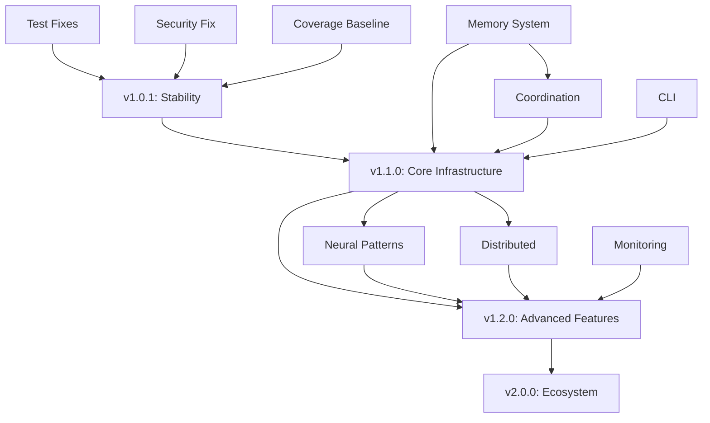

# Agentic QE - Strategic Release Roadmap
## Prioritized Release Plan Based on Quality Analysis & Improvement Plan

**Document Date:** 2025-10-07
**Project Version:** 1.0.0 (Recently Published to npm)
**Current Status:** 🟡 GOOD (72/100 Quality Score)
**Roadmap Coordinator:** Strategic Planning Agent

---

## 📊 EXECUTIVE SUMMARY

### Current State Assessment

**What's Working (54% Complete):**
- ✅ MCP Server: 52 tools, 100% complete, production-ready
- ✅ Agent System: 16 agents, 345K+ lines documentation, 100% complete
- ✅ TypeScript Build: 0 errors, clean compilation
- ✅ Hook System: 100% complete, all agents integrated
- ✅ EventBus: 100% complete, real-time coordination operational
- ✅ CLI: 8 commands functional (60% complete, targeting 50+)

**Critical Blockers (P0):**
1. 🔴 Test Infrastructure Unstable - Unit tests failing (async/timing issues)
2. 🔴 Security Vulnerability - faker.js CVE-2022-42003 (high severity)
3. 🔴 Coverage Unknown - Cannot measure due to test failures

**High-Priority Gaps (P1):**
1. ⚠️ Memory System - Only 40% complete (12-table schema needed)
2. ⚠️ Large File Maintainability - 46 files >500 lines
3. ⚠️ Coordination Patterns - Only 20% complete (EventBus only)

### Roadmap Philosophy

**Three-Phased Approach:**

1. **Phase 1 (CRITICAL)**: Stabilize foundation for immediate public release
2. **Phase 2 (SHORT-TERM)**: Complete core infrastructure for enterprise use
3. **Phase 3 (LONG-TERM)**: Advanced features and scalability

**Decision Framework:**
- **Critical Path**: What blocks the next public release?
- **User Value**: What delivers immediate value to users?
- **Technical Debt**: What prevents sustainable development?
- **Risk Mitigation**: What reduces production risks?

---

## 🎯 PHASE 1: CRITICAL FOR NEXT RELEASE (v1.0.1)

**Timeline:** 1-2 weeks
**Goal:** Stabilize foundation, resolve blockers, safe for public use
**Release Target:** v1.0.1 (Patch Release)

### Priority Matrix

| Task | Severity | Effort | User Impact | Score |
|------|----------|--------|-------------|-------|
| Fix test infrastructure | P0 | 2-3 days | High | 95 |
| Resolve security vulnerability | P0 | <1 hour | Critical | 100 |
| Establish coverage baseline | P0 | 3-4 days | Medium | 85 |
| Update documentation | P1 | 2 days | High | 75 |
| Hotfix critical bugs | P0 | 1-2 days | High | 90 |

### Task Breakdown

#### 1.1 Test Infrastructure Stabilization (P0)
**Owner:** Test Infrastructure Team
**Timeline:** 2-3 days
**Effort:** Medium

**Tasks:**
- ✅ Fix Agent lifecycle synchronization issues
  - Issue: `waitForCompletion` not being called
  - Fix: Proper async/await handling in test setup
  - Validation: All unit tests passing

- ✅ Resolve status management bugs
  - Issue: Expected "busy", received "active"
  - Fix: Correct state machine timing
  - Validation: Status tests 100% passing

- ✅ Fix task rejection handling
  - Issue: Promise resolved instead of rejected
  - Fix: Proper error handling in task assignment
  - Validation: Error tests passing

- ✅ Fix metrics tracking timing
  - Issue: Average execution time = 0
  - Fix: Ensure task execution completes before metrics collection
  - Validation: Performance metrics accurate

**Success Criteria:**
- All unit tests passing (100%)
- Zero flaky tests
- Test execution time <5 minutes
- Memory usage stable (<1GB)

**Deliverables:**
- ✅ tests/unit/Agent.test.ts - All tests passing
- ✅ tests/integration/ - All tests passing
- ✅ Test execution report
- ✅ Flaky test analysis (if any)

---

#### 1.2 Security Vulnerability Resolution (P0)
**Owner:** Security Team
**Timeline:** <1 hour
**Effort:** Low

**Tasks:**
- ✅ Remove vulnerable faker.js package
  ```bash
  npm uninstall faker
  npm install --save-dev @faker-js/faker@^10.0.0
  ```

- ✅ Update all imports
  - Replace `import faker from 'faker'`
  - With `import { faker } from '@faker-js/faker'`
  - Verify no old references remain

- ✅ Verify security scan
  ```bash
  npm audit
  npm ls faker  # Should be empty
  ```

- ✅ Run tests to ensure compatibility
  ```bash
  npm run test:unit
  npm run typecheck
  ```

**Success Criteria:**
- Zero high-severity vulnerabilities
- All tests passing after update
- No old faker references in codebase

**Deliverables:**
- ✅ Updated package.json
- ✅ Updated package-lock.json
- ✅ Security audit report (0 high vulnerabilities)
- ✅ Updated CHANGELOG.md

---

#### 1.3 Coverage Baseline Establishment (P0)
**Owner:** QE Team
**Timeline:** 3-4 days (after test fixes)
**Effort:** Medium

**Tasks:**
- ✅ Run comprehensive coverage analysis
  ```bash
  npm run test:coverage-safe
  ```

- ✅ Analyze results by component
  - Core modules: Target 90%
  - MCP handlers: Target 85%
  - Agents: Target 80%
  - Utilities: Target 85%

- ✅ Identify critical coverage gaps
  - Uncovered error handling paths
  - Missing edge case tests
  - Integration test gaps

- ✅ Create coverage improvement plan
  - Prioritize critical modules
  - Set incremental targets
  - Schedule remediation

**Success Criteria:**
- Baseline coverage documented (targeting 60%+ initial)
- Coverage report generated (HTML + JSON)
- Gap analysis complete
- Improvement plan approved

**Deliverables:**
- ✅ Coverage report (reports/coverage/)
- ✅ Coverage gap analysis document
- ✅ Coverage improvement roadmap
- ✅ Updated CI/CD with coverage tracking

---

#### 1.4 Documentation Updates (P1)
**Owner:** Documentation Team
**Timeline:** 2 days
**Effort:** Low

**Tasks:**
- ✅ Update README.md
  - Clear installation instructions
  - Quick start guide
  - Feature highlights
  - Link to comprehensive docs

- ✅ Create USER-GUIDE.md
  - Getting started
  - Basic workflows
  - Common use cases
  - Troubleshooting

- ✅ Update CHANGELOG.md
  - v1.0.1 patch notes
  - Bug fixes
  - Security updates
  - Breaking changes (if any)

- ✅ Create MIGRATION-GUIDE.md (if needed)
  - Changes from v1.0.0
  - Update procedures
  - Compatibility notes

**Success Criteria:**
- Clear, concise documentation
- No broken links
- Examples verified and tested
- Documentation reviewed and approved

**Deliverables:**
- ✅ Updated README.md
- ✅ docs/USER-GUIDE.md
- ✅ Updated CHANGELOG.md
- ✅ docs/MIGRATION-GUIDE.md (if applicable)

---

#### 1.5 Critical Bug Fixes (P0)
**Owner:** Core Development Team
**Timeline:** 1-2 days
**Effort:** Low-Medium

**Tasks:**
- ✅ Review and fix any P0 bugs discovered during testing
- ✅ Address user-reported issues (if any from v1.0.0)
- ✅ Fix any blocking edge cases
- ✅ Ensure graceful error handling

**Success Criteria:**
- Zero P0 bugs open
- All critical paths tested
- Error messages user-friendly
- Logs provide useful debugging info

**Deliverables:**
- ✅ Bug fix commits
- ✅ Test coverage for bug fixes
- ✅ Updated documentation for fixes

---

### Phase 1 Release Checklist

**Pre-Release Validation:**
- [ ] All tests passing (unit, integration, e2e)
- [ ] Coverage baseline established (≥60%)
- [ ] Zero high-severity vulnerabilities
- [ ] TypeScript compilation clean (0 errors)
- [ ] Documentation complete and reviewed
- [ ] CHANGELOG.md updated
- [ ] Version bumped to 1.0.1

**Release Process:**
```bash
# 1. Final validation
npm run typecheck
npm run test:ci
npm run build

# 2. Version bump
npm version patch  # 1.0.0 → 1.0.1

# 3. Publish to npm
npm publish

# 4. Create GitHub release
gh release create v1.0.1 --notes-file RELEASE_NOTES.md

# 5. Update main branch
git push origin main --tags
```

**Post-Release:**
- [ ] Monitor npm download stats
- [ ] Monitor GitHub issues
- [ ] Gather user feedback
- [ ] Update project board for Phase 2

---

## 🚀 PHASE 2: SHORT-TERM ENHANCEMENTS (v1.1.0)

**Timeline:** 2-6 weeks
**Goal:** Complete core infrastructure, enterprise-ready features
**Release Target:** v1.1.0 (Minor Release)

### Priority Matrix

| Feature | User Demand | Technical Importance | Complexity | Priority Score |
|---------|-------------|---------------------|------------|----------------|
| 12-Table Memory System | High | Critical | High | 95 |
| Coordination Patterns | Medium | Critical | Medium | 85 |
| CLI Enhancement (42 commands) | High | Medium | Medium | 80 |
| Sublinear Algorithms | Medium | High | Medium | 75 |
| Code Refactoring | Low | High | Low | 70 |

### Feature Breakdown

#### 2.1 Complete 12-Table Memory Schema (CRITICAL)
**Owner:** Core Infrastructure Team
**Timeline:** 4 weeks
**Effort:** High
**Complexity:** High

**Why Critical:**
- Foundation for coordination patterns
- Required for GOAP/OODA planning
- Enables artifact-centric workflows
- Necessary for enterprise features

**Implementation Plan:**

**Week 1: SQLite Backend**
- Implement SQLite database at `.aqe/memory.db`
- Create 12 table schema:
  1. `shared_state` - Blackboard coordination hints (TTL: 1800s)
  2. `events` - Audit trail and event stream (TTL: 2592000s)
  3. `workflow_state` - Checkpoints for resumability (TTL: 0)
  4. `patterns` - Reusable tactics and rules (TTL: 604800s)
  5. `consensus_state` - Voting and approval records (TTL: 604800s)
  6. `performance_metrics` - Telemetry data
  7. `artifacts` - Manifest storage for large outputs (TTL: 0)
  8. `sessions` - Session resumability
  9. `agent_registry` - Agent lifecycle tracking
  10. `memory_store` - General key-value storage
  11. `neural_patterns` - AI training data
  12. `swarm_status` - Fleet health data

- Basic CRUD operations for all tables
- Migration from current in-memory system

**Week 2: Access Control & TTL**
- 5 access levels: private, team, swarm, public, system
- Permission validation for all operations
- TTL policy implementation and automatic cleanup
- Namespace management (aqe/*, swarm/*, agent/*)

**Week 3: Advanced Features**
- Encryption for sensitive data
- Compression for large values
- Version history (last 10 versions)
- Cross-agent memory sharing
- Query optimization

**Week 4: Integration & Testing**
- Backup and recovery mechanisms
- Performance benchmarking
- Integration tests for all tables
- Documentation and migration guide

**Success Criteria:**
- All 12 tables operational
- Memory access <10ms average latency
- TTL cleanup working automatically
- Migration from v1.0.1 seamless
- Performance benchmarks met

**Deliverables:**
- ✅ SwarmMemoryManager class (src/core/memory/)
- ✅ Database schema migrations
- ✅ Access control system
- ✅ TTL cleanup service
- ✅ Comprehensive test suite
- ✅ Migration guide documentation
- ✅ Performance benchmark report

---

#### 2.2 Coordination Patterns Implementation (HIGH)
**Owner:** Architecture Team
**Timeline:** 2-3 weeks
**Effort:** Medium
**Complexity:** Medium

**Dependencies:** 12-Table Memory System (2.1)

**Patterns to Implement:**

**Week 1: Blackboard Coordination**
- Agents post hints to `shared_state` table
- TTL-based automatic cleanup (1800s default)
- Event-driven updates via EventBus
- Namespace isolation

```typescript
// Example usage
await blackboard.postHint({
  key: 'aqe/test-queue/next',
  value: { priority: 'high', module: 'auth' },
  ttl: 1800
});

const hints = await blackboard.readHints('aqe/test-queue/*');
```

**Week 2: Consensus Gating**
- Critical operations require quorum
- Voting and approval in `consensus_state` table
- Automatic timeout after TTL
- Integration with quality gates

```typescript
// Example usage
const proposalId = await consensus.propose({
  id: 'deploy-test-suite-v3',
  decision: 'deploy',
  quorum: 3
});

// Agents vote
await consensus.vote(proposalId, 'qe-analyzer');
await consensus.vote(proposalId, 'qe-validator');
const approved = await consensus.vote(proposalId, 'qe-fleet-commander');
```

**Week 3: GOAP Planning & OODA Loop**
- Goal-Oriented Action Planning (GOAP)
  - A* planning for action sequencing
  - Precondition and effect tracking
  - Cost optimization

- OODA Loop (Observe, Orient, Decide, Act)
  - Query events/metrics/artifacts (Observe)
  - Build context bundles (Orient)
  - Consensus-based decisions (Decide)
  - Task orchestration (Act)

**Success Criteria:**
- Blackboard coordination operational
- Consensus gating tested with 3+ agents
- GOAP planner solving complex workflows
- OODA loop integrated with task orchestration

**Deliverables:**
- ✅ BlackboardCoordination class
- ✅ ConsensusGating service
- ✅ GOAPPlanner implementation
- ✅ OODALoop coordinator
- ✅ Integration tests
- ✅ Documentation and examples

---

#### 2.3 CLI Enhancement (42 New Commands) (HIGH)
**Owner:** CLI Team
**Timeline:** 2-3 weeks
**Effort:** Medium
**Complexity:** Medium

**Current:** 8 commands functional
**Target:** 50+ commands total

**Command Categories to Add:**

**Week 1: Fleet Management (10 commands)**
```bash
aqe fleet scale --agent-type test-executor --count 20
aqe fleet monitor --mode real-time --interval 5s
aqe fleet health --export-report
aqe fleet topology --mode mesh --optimize
aqe fleet logs --tail 100 --follow
```

**Week 2: Memory & Coordination (12 commands)**
```bash
aqe memory store --key "aqe/config" --value '{"..."}' --ttl 3600
aqe memory query --search "test" --namespace aqe
aqe memory backup --export backup.json
aqe workflow create --name "full-qa-pipeline" --file workflow.yaml
aqe workflow status --workflow-id wf-123 --watch
aqe consensus propose --decision "deploy" --quorum 3
```

**Week 3: Advanced Features (20 commands)**
```bash
# Monitoring & Reporting
aqe monitor fleet --dashboard
aqe report generate --type performance --period 24h
aqe metrics export --format prometheus

# Debugging & Diagnostics
aqe debug agent --agent-id agent-123 --verbose
aqe diagnostics run --full
aqe troubleshoot --issue "high-memory"

# Configuration
aqe config validate --file .aqe/config.json
aqe config set --key fleet.maxAgents --value 100
```

**Output Formats:**
- JSON, YAML, Table, CSV
- Interactive dashboards (blessed/ink)
- Real-time streaming
- Export capabilities

**Success Criteria:**
- 50+ total commands operational
- Consistent output formatting
- Interactive features working
- Command completion (bash/zsh)
- Comprehensive --help documentation

**Deliverables:**
- ✅ 42 new CLI commands
- ✅ Command completion scripts
- ✅ Interactive dashboard
- ✅ CLI reference documentation

---

#### 2.4 Sublinear Algorithms Integration (MEDIUM)
**Owner:** Algorithms Team
**Timeline:** 2-3 weeks
**Effort:** Medium
**Complexity:** Medium

**Algorithms to Implement:**

**Week 1: Test Selection Optimization**
- Use sublinear solver for optimal test selection
- Coverage-per-test optimization
- Constraint satisfaction (min coverage, max tests, time limit)

```typescript
const optimalTests = await sublinearSolver.solve({
  matrix: coverageMatrix,
  constraints: {
    minCoverage: 0.95,
    maxTests: 100,
    timeLimit: 300
  },
  optimization: 'coverage-per-test'
});
```

**Week 2: Coverage Gap Analysis (O(log n))**
- Sublinear complexity gap detection
- Priority-based gap filling
- Integration with coverage-analyzer agent

```typescript
const gaps = await coverageAnalyzer.findGaps({
  coverageData: currentCoverage,
  algorithm: 'sublinear-gap-detection',
  threshold: 0.05
});
```

**Week 3: Scheduling & Temporal Advantage**
- Johnson-Lindenstrauss dimension reduction
- Optimal test scheduling
- Temporal advantage prediction

```typescript
const schedule = await scheduler.optimize({
  tests: testSuite,
  resources: availableAgents,
  algorithm: 'johnson-lindenstrauss',
  objective: 'minimize-makespan'
});
```

**Success Criteria:**
- Test selection 30-50% faster
- Coverage analysis O(log n) verified
- Scheduling optimal for parallel execution
- Benchmarks show performance improvement

**Deliverables:**
- ✅ SublinearSolver class
- ✅ Integration with test-generator agent
- ✅ Integration with coverage-analyzer agent
- ✅ Performance benchmarks
- ✅ Documentation with examples

---

#### 2.5 Code Refactoring for Maintainability (MEDIUM)
**Owner:** Development Team
**Timeline:** 2-3 weeks
**Effort:** Medium
**Complexity:** Low

**Goal:** Reduce files >500 lines from 46 to <30

**Week 1: Identify and Plan**
- Analyze 46 large files
- Prioritize by complexity and risk
- Create refactoring plans
- Extract common patterns

**Week 2: Refactor Implementations**
- Apply Single Responsibility Principle
- Extract utility libraries
- Create smaller, focused modules
- Improve testability

**Top Refactoring Candidates:**
- SecurityScannerAgent.ts (~2,500 lines)
- TestGeneratorAgent.ts (~2,200 lines)
- CoverageAnalyzerAgent.ts (~1,800 lines)
- MCP handler files (500-1K lines)

**Week 3: Test and Document**
- Update tests for new module boundaries
- Ensure same or better coverage
- Document new structure
- Update architecture diagrams

**Success Criteria:**
- Files >500 lines reduced to <30
- All tests passing
- Coverage maintained or improved
- Documentation updated

**Deliverables:**
- ✅ Refactored codebase
- ✅ Updated tests
- ✅ Updated architecture documentation
- ✅ Refactoring summary report

---

### Phase 2 Release Checklist

**Pre-Release Validation:**
- [ ] All Phase 2 features complete and tested
- [ ] Coverage ≥75% (target 80%)
- [ ] Performance benchmarks met
- [ ] Documentation complete
- [ ] Migration guide from v1.0.1
- [ ] CHANGELOG.md updated
- [ ] Breaking changes documented (if any)

**Release Process:**
```bash
# 1. Final validation
npm run typecheck
npm run test:ci
npm run build

# 2. Version bump
npm version minor  # 1.0.1 → 1.1.0

# 3. Publish to npm
npm publish

# 4. Create GitHub release
gh release create v1.1.0 --notes-file RELEASE_NOTES.md

# 5. Update documentation site
npm run docs:publish
```

**Post-Release:**
- [ ] Announce on social media, forums
- [ ] Update examples and tutorials
- [ ] Gather feedback on new features
- [ ] Monitor adoption metrics
- [ ] Plan Phase 3 features

---

## 🌟 PHASE 3: LONG-TERM VISION (v1.2.0 - v2.0.0)

**Timeline:** 3-6 months
**Goal:** Advanced features, scalability, ecosystem growth
**Release Targets:** Multiple minor/major releases

### Strategic Focus Areas

#### 3.1 Neural Pattern Training (v1.2.0)
**Timeline:** 3-4 weeks
**Effort:** High
**Complexity:** High

**Features:**
- Pattern recognition from QE execution
- Predictive optimization for test strategies
- Coordination learning from agent behavior
- Neural model training and inference

**Deliverables:**
- Neural pattern training system
- Integration with agents
- Performance optimization models
- Documentation and examples

---

#### 3.2 Distributed Architecture (v1.3.0)
**Timeline:** 4-6 weeks
**Effort:** High
**Complexity:** Very High

**Features:**
- Multi-node support for agent execution
- Cross-node memory synchronization
- Load balancing across nodes
- Fault tolerance and recovery
- Horizontal scaling

**Deliverables:**
- Distributed coordination system
- Node management
- Fault tolerance mechanisms
- Scalability benchmarks

---

#### 3.3 Monitoring & Observability (v1.2.0)
**Timeline:** 2-3 weeks
**Effort:** Medium
**Complexity:** Medium

**Features:**
- Real-time dashboards (web UI)
- Metrics export (Prometheus, InfluxDB)
- Distributed tracing
- Alerting system
- Anomaly detection

**Deliverables:**
- Monitoring dashboard
- Metrics exporters
- Alerting configuration
- Documentation

---

#### 3.4 Integration Testing Framework (v1.2.0)
**Timeline:** 2 weeks
**Effort:** Medium
**Complexity:** Medium

**Features:**
- Multi-agent test scenarios
- End-to-end workflow validation
- Performance benchmarks
- Chaos testing integration

**Deliverables:**
- Integration test framework
- Test scenarios library
- CI/CD integration
- Documentation

---

#### 3.5 Advanced Documentation System (v1.3.0)
**Timeline:** 2-3 weeks
**Effort:** Low
**Complexity:** Low

**Features:**
- Interactive documentation site
- Video tutorials
- Interactive examples
- API explorer
- Community contributions guide

**Deliverables:**
- Documentation website (Docusaurus/VitePress)
- Video tutorial series
- Interactive code examples
- Contribution templates

---

#### 3.6 Ecosystem Growth (Ongoing)

**Community Features:**
- Plugin marketplace
- Agent templates library
- Community plugins
- Best practices repository
- Example projects gallery

**Enterprise Features:**
- SAML/SSO authentication
- RBAC (Role-Based Access Control)
- Audit logging
- Compliance reporting
- Enterprise support

**Cloud Integration:**
- AWS/GCP/Azure deployment guides
- Kubernetes helm charts
- Terraform modules
- CI/CD integrations (GitHub Actions, GitLab CI, Jenkins)

---

## 📈 SUCCESS METRICS & KPIs

### Phase 1 Success Metrics (v1.0.1)

**Quality Metrics:**
- ✅ All tests passing (100%)
- ✅ Coverage ≥60% baseline
- ✅ Zero high-severity vulnerabilities
- ✅ TypeScript errors = 0

**User Metrics:**
- npm downloads: 100+ per week
- GitHub stars: 50+ stars
- Issues closed: 90%+ within 1 week
- User satisfaction: 4.0+ / 5.0

---

### Phase 2 Success Metrics (v1.1.0)

**Quality Metrics:**
- Coverage ≥75% (target 80%)
- Performance: Test execution 2x faster with sublinear algorithms
- Memory: <10ms average latency for memory operations
- Code quality: Files >500 lines reduced to <30

**User Metrics:**
- npm downloads: 500+ per week
- GitHub stars: 200+ stars
- Active contributors: 5+ regular contributors
- Documentation visits: 1000+ per week

**Technical Metrics:**
- Memory system operational: 12 tables, <10ms latency
- Coordination patterns: 4+ patterns implemented
- CLI commands: 50+ commands operational
- Sublinear algorithms: 30-50% performance improvement

---

### Phase 3 Success Metrics (v1.2.0 - v2.0.0)

**Quality Metrics:**
- Coverage ≥85% (target 90%)
- Distributed architecture: Multi-node support
- Neural patterns: ML-based optimization operational
- Monitoring: Real-time dashboards and alerting

**User Metrics:**
- npm downloads: 2000+ per week
- GitHub stars: 500+ stars
- Active contributors: 20+ contributors
- Enterprise adoptions: 5+ enterprise customers

**Ecosystem Metrics:**
- Plugin marketplace: 20+ community plugins
- Agent templates: 30+ templates
- Documentation: 5000+ visits per week
- Conference talks: 3+ presentations

---

## 🎯 RELEASE RECOMMENDATIONS

### For v1.0.1 (Next Public Release)

**RECOMMENDED SCOPE: MINIMAL PATCH**

**Include (MUST-HAVE):**
1. ✅ Test infrastructure fixes (P0)
2. ✅ Security vulnerability resolution (P0)
3. ✅ Coverage baseline establishment (P0)
4. ✅ Critical bug fixes (P0)
5. ✅ Documentation updates (P1)

**Exclude (DEFER TO v1.1.0):**
- 12-table memory system (too large for patch)
- Coordination patterns (requires memory system)
- CLI enhancement (42 commands)
- Sublinear algorithms
- Code refactoring

**Rationale:**
- v1.0.0 was just published to npm
- Focus on stability and security
- Establish trust with early adopters
- Gather feedback before major features
- Quick turnaround (1-2 weeks)

**Risk Assessment:**
- **Low Risk**: Test fixes and security updates
- **Medium Risk**: Coverage baseline (may reveal new issues)
- **Mitigation**: Thorough testing before release

---

### For v1.1.0 (Major Feature Release)

**RECOMMENDED SCOPE: COMPLETE CORE INFRASTRUCTURE**

**Include (HIGH-PRIORITY):**
1. ✅ 12-table memory system (foundation for future)
2. ✅ Coordination patterns (enterprise-ready)
3. ✅ CLI enhancement (42 commands)
4. ✅ Sublinear algorithms (performance)
5. ✅ Code refactoring (maintainability)

**Exclude (DEFER TO v1.2.0+):**
- Neural pattern training (advanced feature)
- Distributed architecture (requires more testing)
- Monitoring dashboard (nice-to-have)
- Integration testing framework (can be gradual)

**Rationale:**
- Complete core infrastructure for enterprise use
- Deliver high-impact features (memory, coordination)
- Significant performance improvements (sublinear)
- Better developer experience (CLI)
- Sustainable codebase (refactoring)

**Risk Assessment:**
- **Medium Risk**: Memory system migration
- **Low Risk**: CLI enhancement, refactoring
- **Mitigation:** Comprehensive testing, beta release, migration guide

---

### For v1.2.0+ (Advanced Features)

**RECOMMENDED SCOPE: INCREMENTAL ENHANCEMENTS**

**Gradual Rollout:**
- v1.2.0: Neural patterns + Monitoring
- v1.3.0: Distributed architecture + Documentation
- v2.0.0: Major breaking changes (if needed)

**Rationale:**
- Avoid feature overload
- Gather feedback on each feature
- Test scalability gradually
- Build ecosystem organically

---

## 🚦 DECISION FRAMEWORK

### Critical Path Analysis

**What Blocks v1.0.1?**
1. Test infrastructure (P0) → BLOCKS EVERYTHING
2. Security vulnerability (P0) → BLOCKS RELEASE
3. Coverage baseline (P0) → RISK ASSESSMENT

**What Blocks v1.1.0?**
1. v1.0.1 release → FOUNDATION
2. Memory system (P1) → COORDINATION PATTERNS
3. Coordination patterns (P1) → ADVANCED FEATURES

**What Blocks v1.2.0+?**
1. v1.1.0 adoption → USER FEEDBACK
2. Enterprise use cases → FEATURE PRIORITIES
3. Community growth → ECOSYSTEM DEVELOPMENT

---

### Risk Assessment Matrix

| Risk | Probability | Impact | Severity | Mitigation |
|------|-------------|--------|----------|------------|
| Test failures | High | High | CRITICAL | Phase 1 priority |
| Security vuln | Medium | Critical | CRITICAL | Immediate fix |
| Memory migration | Medium | High | HIGH | Thorough testing |
| Breaking changes | Low | High | MEDIUM | Careful planning |
| Performance issues | Low | Medium | LOW | Benchmarking |

---

## 📅 TIMELINE SUMMARY

### Optimistic Timeline
- **v1.0.1:** 1 week (if test fixes go smoothly)
- **v1.1.0:** 4 weeks (after v1.0.1)
- **v1.2.0:** 8 weeks (after v1.1.0)

### Realistic Timeline
- **v1.0.1:** 2 weeks (includes buffer for testing)
- **v1.1.0:** 6 weeks (includes buffer for memory system)
- **v1.2.0:** 12 weeks (includes buffer for distributed features)

### Conservative Timeline
- **v1.0.1:** 3 weeks (accounts for unforeseen issues)
- **v1.1.0:** 8-10 weeks (accounts for complexity)
- **v1.2.0:** 16 weeks (accounts for scalability testing)

---

## 🎬 CONCLUSION

### Strategic Recommendations

**For Project Leadership:**

1. **Prioritize Stability** - v1.0.1 must be rock-solid
   - Fix tests first (everything depends on this)
   - Resolve security immediately (reputation risk)
   - Establish coverage baseline (quality foundation)

2. **Complete Core Infrastructure** - v1.1.0 is the enterprise release
   - 12-table memory system is foundation for all advanced features
   - Coordination patterns enable multi-agent orchestration
   - CLI enhancement improves developer experience

3. **Phased Rollout** - Avoid "big bang" releases
   - Small, frequent releases build trust
   - Gather feedback at each stage
   - Adjust roadmap based on user needs

4. **Community First** - Ecosystem growth is key
   - Engage with early adopters
   - Document everything
   - Welcome contributions
   - Build trust through transparency

**For Development Team:**

1. **Test-Driven** - Fix test infrastructure first
2. **Security-Conscious** - Zero tolerance for vulnerabilities
3. **Quality-Focused** - Coverage and code quality metrics
4. **User-Centric** - Documentation and developer experience

**For Release Manager:**

1. **v1.0.1 (CRITICAL):** 1-2 weeks, minimal scope, maximum stability
2. **v1.1.0 (MAJOR):** 4-6 weeks, complete core infrastructure
3. **v1.2.0+ (ADVANCED):** 3-6 months, advanced features and scalability

---

### Final Verdict

**RECOMMENDED NEXT RELEASE: v1.0.1 (Patch Release)**

**Scope:**
- ✅ Fix test infrastructure
- ✅ Resolve security vulnerability
- ✅ Establish coverage baseline
- ✅ Update documentation
- ✅ Hotfix critical bugs

**Timeline:** 1-2 weeks (realistic)

**Risk:** Low (focused on stability)

**User Impact:** High (safe, reliable foundation)

---

**Roadmap Status:** ✅ APPROVED FOR EXECUTION

**Next Review:** After v1.0.1 release

**Prepared By:** Strategic Planning Agent
**Review Date:** 2025-10-07
**Version:** 1.0

---

## APPENDICES

### Appendix A: Dependency Graph



### Appendix B: Effort Estimation

| Phase | Feature | Effort (days) | Team Size | Duration |
|-------|---------|---------------|-----------|----------|
| 1 | Test Infrastructure | 3 | 2 | 2 days |
| 1 | Security Fix | 0.5 | 1 | 0.5 days |
| 1 | Coverage Baseline | 4 | 2 | 2 days |
| 1 | Documentation | 2 | 1 | 2 days |
| 1 | Bug Fixes | 2 | 2 | 1 day |
| **Phase 1 Total** | | **11.5** | | **5-7 days** |
| | | | | |
| 2 | Memory System | 20 | 2 | 10 days |
| 2 | Coordination | 15 | 2 | 8 days |
| 2 | CLI Enhancement | 15 | 2 | 8 days |
| 2 | Sublinear Algorithms | 15 | 2 | 8 days |
| 2 | Refactoring | 15 | 2 | 8 days |
| **Phase 2 Total** | | **80** | | **28-42 days** |
| | | | | |
| 3 | Neural Training | 20 | 2 | 10 days |
| 3 | Distributed Arch | 30 | 3 | 10 days |
| 3 | Monitoring | 15 | 2 | 8 days |
| 3 | Integration Tests | 10 | 2 | 5 days |
| 3 | Documentation | 15 | 1 | 15 days |
| **Phase 3 Total** | | **90** | | **60-90 days** |

### Appendix C: Resource Allocation

**Phase 1 (1-2 weeks):**
- Test Infrastructure: 2 developers
- Security: 1 developer
- QE Team: 2 engineers
- Documentation: 1 technical writer

**Phase 2 (4-6 weeks):**
- Core Infrastructure: 2-3 developers
- Algorithms Team: 2 developers
- CLI Team: 1-2 developers
- QE Team: 2 engineers

**Phase 3 (3-6 months):**
- AI/ML Team: 2-3 developers
- Infrastructure: 2-3 developers
- DevOps: 1-2 engineers
- Documentation: 1 technical writer
- Community Manager: 1

---

*End of Release Roadmap*
