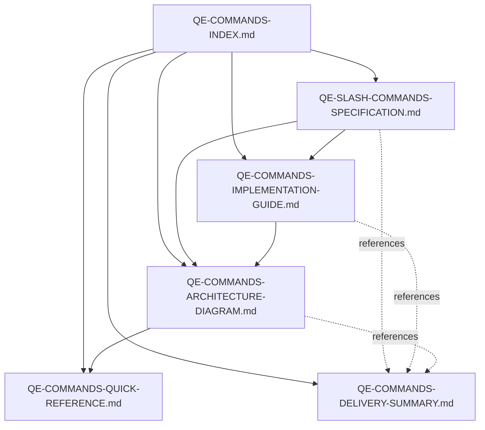

# QE Slash Commands - Documentation Index

**Version:** 2.0.0
**Last Updated:** 2025-09-30
**Status:** Design Complete ✅

---

## Quick Navigation

| If you want to... | Read this document |
|-------------------|-------------------|
| **Use commands quickly** | [Quick Reference Guide](#4-quick-reference-guide) |
| **Understand system design** | [Architecture Diagrams](#3-architecture-diagrams) |
| **Implement commands** | [Implementation Guide](#2-implementation-guide) |
| **See complete specs** | [Command Specifications](#1-command-specifications) |
| **Get project overview** | [Delivery Summary](#5-delivery-summary) |

---

## Document Overview

### Complete Documentation Suite

```
📚 QE Slash Commands Documentation (5,100+ lines)
│
├── 📄 1. QE-SLASH-COMMANDS-SPECIFICATION.md (1,500 lines)
│   └── Complete specifications for all 8 commands
│
├── 📄 2. QE-COMMANDS-IMPLEMENTATION-GUIDE.md (1,300 lines)
│   └── Implementation templates and patterns
│
├── 📄 3. QE-COMMANDS-ARCHITECTURE-DIAGRAM.md (1,100 lines)
│   └── System architecture and data flows
│
├── 📄 4. QE-COMMANDS-QUICK-REFERENCE.md (900 lines)
│   └── Developer quick reference
│
├── 📄 5. QE-COMMANDS-DELIVERY-SUMMARY.md (300 lines)
│   └── Project summary and delivery report
│
└── 📄 6. QE-COMMANDS-INDEX.md (this file)
    └── Navigation guide for all documentation
```

---

## 1. Command Specifications

**File:** [`QE-SLASH-COMMANDS-SPECIFICATION.md`](/workspaces/agentic-qe-cf/docs/QE-SLASH-COMMANDS-SPECIFICATION.md)
**Lines:** 1,500+
**Purpose:** Complete specifications for all 8 QE slash commands

### Contents

#### Executive Summary
- Design principles
- Command overview
- Integration points

#### Individual Command Specifications (8 commands)

1. **`/qe-generate`** - AI-powered test generation
   - Syntax and parameters
   - Agent coordination (qe-test-generator)
   - Memory keys (input/output)
   - Hook integration
   - Implementation structure (200+ lines)
   - Example scenarios
   - Success criteria

2. **`/qe-execute`** - Parallel test execution
   - Syntax and parameters
   - Agent coordination (qe-test-executor)
   - Memory keys
   - Hook integration
   - Implementation structure (250+ lines)
   - Example scenarios

3. **`/qe-analyze`** - Coverage analysis
   - Syntax and parameters
   - Agent coordination (qe-coverage-analyzer)
   - Sublinear algorithm integration
   - Implementation structure (200+ lines)
   - Example scenarios

4. **`/qe-optimize`** - Test suite optimization
   - Syntax and parameters
   - Optimization algorithms
   - Implementation structure (180+ lines)
   - Example scenarios

5. **`/qe-report`** - Comprehensive reporting
   - Syntax and parameters
   - Report types
   - Implementation structure (150+ lines)

6. **`/qe-fleet-status`** - Fleet health monitoring
   - Syntax and parameters
   - Status metrics
   - Implementation structure (100+ lines)

7. **`/qe-chaos`** - Chaos testing
   - Syntax and parameters
   - Chaos scenarios
   - Implementation structure (150+ lines)

8. **`/qe-benchmark`** - Performance benchmarking
   - Syntax and parameters
   - Benchmark types
   - Implementation structure (120+ lines)

#### Integration with Claude Code
- Task tool spawning patterns
- MCP coordination setup
- Memory management

#### File Organization
- Directory structure
- Agent locations
- Command scripts

**Best For:**
- Understanding what each command does
- Command parameters and options
- Agent coordination details
- Complete implementation examples

---

## 2. Implementation Guide

**File:** [`QE-COMMANDS-IMPLEMENTATION-GUIDE.md`](/workspaces/agentic-qe-cf/docs/QE-COMMANDS-IMPLEMENTATION-GUIDE.md)
**Lines:** 1,300+
**Purpose:** Practical implementation patterns and templates

### Contents

#### Command Template Structure
- Base command template (200+ lines)
- Standard sections
- Utility functions
- Hook integration helpers

#### Error Handling Patterns
- Graceful degradation
- Retry logic with exponential backoff
- Validation gates
- Resource cleanup
- Example implementations

#### Memory Management
- Memory key naming convention
- Helper functions
- JSON operations
- Distributed locking
- Example usage

#### Agent Coordination Protocols
- **Sequential Coordination**
  - Pipeline workflow
  - Example implementation
- **Parallel Coordination**
  - Multi-module processing
  - Example implementation
- **Hierarchical Coordination**
  - Supervisor-worker pattern
  - Example implementation
- **Event-Driven Coordination**
  - Reactive processing
  - Example implementation

#### Testing Commands
- Unit test template
- Integration test examples
- Test execution

#### Deployment Checklist
- Pre-deployment verification
- Deployment steps
- Post-deployment validation
- Rollback procedure

#### Performance Monitoring
- Benchmark command execution
- Performance targets
- Metrics collection

**Best For:**
- Implementing commands from scratch
- Understanding error handling
- Memory operations
- Agent coordination
- Testing strategies
- Deployment procedures

---

## 3. Architecture Diagrams

**File:** [`QE-COMMANDS-ARCHITECTURE-DIAGRAM.md`](/workspaces/agentic-qe-cf/docs/QE-COMMANDS-ARCHITECTURE-DIAGRAM.md)
**Lines:** 1,100+
**Purpose:** Visual architecture and data flows

### Contents

#### System Overview
- ASCII diagram of complete system
- Layer breakdown
- Component interactions

#### Command Execution Flows (Mermaid)
- `/qe-generate` sequence diagram
- `/qe-execute` sequence diagram
- Multi-agent coordination diagram

#### Memory Architecture
- Memory key hierarchy
- Storage patterns
- Operation types

#### Agent Interaction Patterns
- Sequential pipeline
- Parallel execution
- Event-driven coordination
- Hierarchical coordination

#### Command Integration Points
- Integration matrix
- Memory keys by command
- Hook usage
- Output types

#### Data Flow Diagram
- End-to-end flow
- User → Command → Agent → Results

#### Sublinear Algorithm Integration
- Coverage gap analysis
- Test suite optimization
- Performance metrics

#### Neural Pattern Learning Flow
- Training data collection
- Pattern database updates
- Future predictions

#### System Dependencies
- Dependency tree
- Runtime requirements
- Optional components

#### Deployment Architecture
- File structure
- Directory layout
- Configuration files

**Best For:**
- Understanding system architecture
- Visual learners
- High-level design overview
- Data flow analysis
- Component relationships

---

## 4. Quick Reference Guide

**File:** [`QE-COMMANDS-QUICK-REFERENCE.md`](/workspaces/agentic-qe-cf/docs/QE-COMMANDS-QUICK-REFERENCE.md)
**Lines:** 900+
**Purpose:** Developer quick reference for daily use

### Contents

#### Command Cheat Sheet
- Table of all commands
- Quick syntax
- Typical execution time

#### Common Use Cases (8 scenarios)
1. Generate tests for new feature
2. Run test suite
3. Analyze coverage
4. Optimize test suite
5. Generate reports
6. Monitor fleet health
7. Chaos testing
8. Performance benchmarking

#### Workflow Examples (5 workflows)
1. New feature development (TDD)
2. Pre-commit quality gate
3. CI/CD pipeline
4. Performance regression testing
5. Comprehensive quality audit

#### Memory Key Reference
- Quick lookup table
- Memory operations
- Common patterns

#### Agent Reference
- Agent table
- Capabilities
- Spawning syntax

#### Troubleshooting
- Common issues
- Solutions
- Debugging tips

#### Command Options Reference
- Common options
- Command-specific options
- Environment variables

#### Integration Examples
- GitHub Actions
- Pre-commit hooks
- VS Code tasks

#### Performance Benchmarks
- Expected times
- Scaling characteristics

#### Best Practices
- Dos and don'ts
- Optimization tips

#### Support and Resources
- Documentation links
- Getting help
- Reporting issues

**Best For:**
- Daily command usage
- Quick syntax lookup
- Troubleshooting
- Common workflows
- Copy-paste examples

---

## 5. Delivery Summary

**File:** [`QE-COMMANDS-DELIVERY-SUMMARY.md`](/workspaces/agentic-qe-cf/docs/QE-COMMANDS-DELIVERY-SUMMARY.md)
**Lines:** 300+
**Purpose:** Project summary and delivery report

### Contents

#### Executive Summary
- Key deliverables
- Design achievements
- Integration points

#### Technical Design Decisions
- 5 Architecture Decision Records (ADRs)
- Rationale and trade-offs

#### Quality Attributes
- Performance metrics
- Scalability targets
- Reliability features
- Maintainability aspects

#### Implementation Roadmap
- 5 phases with timeline
- Task breakdown

#### Success Criteria
- Design phase (complete)
- Implementation phase
- Validation phase

#### Key Design Patterns
- Command template
- Hook-based coordination
- Memory-first state
- Agent coordination
- Sublinear optimization

#### Risk Assessment
- Technical risks
- Operational risks
- Mitigations

#### Dependencies
- Runtime
- Development
- Optional

#### Metrics and Monitoring
- Command metrics
- Quality metrics
- Fleet metrics

**Best For:**
- Project overview
- Management summary
- Design decisions
- Implementation planning
- Risk assessment

---

## Document Relationships



---

## Reading Paths

### For New Developers
1. Start: **Quick Reference** (get oriented)
2. Then: **Specifications** (understand commands)
3. Finally: **Architecture** (see big picture)

### For Implementers
1. Start: **Implementation Guide** (templates)
2. Then: **Specifications** (requirements)
3. Reference: **Architecture** (design patterns)

### For Architects
1. Start: **Architecture Diagrams** (system design)
2. Then: **Delivery Summary** (decisions)
3. Reference: **Specifications** (details)

### For Users
1. Start: **Quick Reference** (daily use)
2. When needed: **Specifications** (deep dive)
3. Troubleshooting: **Implementation Guide**

### For Managers
1. Start: **Delivery Summary** (overview)
2. Then: **Architecture** (technical approach)
3. Reference: **Specifications** (scope)

---

## Documentation Statistics

| Metric | Value |
|--------|-------|
| Total Documents | 6 |
| Total Lines | 5,100+ |
| Commands Specified | 8 |
| Agents Documented | 6 |
| Diagrams | 15+ |
| Code Examples | 100+ |
| Workflow Examples | 20+ |
| Error Patterns | 10+ |

---

## Document Formats

### Markdown Features Used
- ✅ Tables (50+ tables)
- ✅ Code blocks (150+ blocks)
- ✅ ASCII diagrams (10+)
- ✅ Mermaid diagrams (5+)
- ✅ Nested lists
- ✅ Links and references
- ✅ Emphasis and formatting

### Code Languages Documented
- Bash shell scripts
- JavaScript examples
- TypeScript examples
- JSON configuration
- YAML workflow files
- Mermaid diagrams

---

## Version History

| Version | Date | Documents | Status |
|---------|------|-----------|--------|
| 2.0.0 | 2025-09-30 | All 6 | ✅ Complete |

---

## File Locations

All documents are in: `/workspaces/agentic-qe-cf/docs/`

```
/workspaces/agentic-qe-cf/docs/
├── QE-SLASH-COMMANDS-SPECIFICATION.md      (1,500 lines)
├── QE-COMMANDS-IMPLEMENTATION-GUIDE.md     (1,300 lines)
├── QE-COMMANDS-ARCHITECTURE-DIAGRAM.md     (1,100 lines)
├── QE-COMMANDS-QUICK-REFERENCE.md          (900 lines)
├── QE-COMMANDS-DELIVERY-SUMMARY.md         (300 lines)
└── QE-COMMANDS-INDEX.md                    (this file)
```

---

## Search Guide

### Find Information About...

**Command Syntax:**
→ Quick Reference (section: Command Cheat Sheet)
→ Specifications (individual command sections)

**Implementation:**
→ Implementation Guide (section: Command Template)
→ Specifications (implementation structure sections)

**Architecture:**
→ Architecture Diagrams (system overview)
→ Delivery Summary (design decisions)

**Agent Coordination:**
→ Implementation Guide (coordination protocols)
→ Architecture Diagrams (agent interaction patterns)

**Memory Management:**
→ Implementation Guide (memory management)
→ Architecture Diagrams (memory architecture)
→ Quick Reference (memory key reference)

**Error Handling:**
→ Implementation Guide (error handling patterns)
→ Quick Reference (troubleshooting)

**Performance:**
→ Quick Reference (performance benchmarks)
→ Delivery Summary (quality attributes)

**Examples:**
→ Quick Reference (use cases and workflows)
→ Specifications (example scenarios)

**Testing:**
→ Implementation Guide (testing commands)
→ Specifications (success criteria)

**Deployment:**
→ Implementation Guide (deployment checklist)
→ Delivery Summary (implementation roadmap)

---

## Keywords for Search

Use your IDE's search across all documents to find:

- **Commands:** generate, execute, analyze, optimize, report, status, chaos, benchmark
- **Agents:** test-generator, test-executor, coverage-analyzer, quality-gate, performance-tester, security-scanner
- **Memory:** aqe/*, memory store, memory retrieve
- **Hooks:** pre-task, post-task, post-edit, notify
- **Patterns:** sequential, parallel, hierarchical, event-driven
- **Algorithms:** sublinear, O(log n), Johnson-Lindenstrauss
- **Frameworks:** jest, cypress, playwright, mocha, vitest
- **Integration:** Claude Flow, Claude Code, MCP

---

## Contributing

To add or update documentation:

1. **Determine Document:** Which file needs changes?
2. **Follow Format:** Match existing structure
3. **Update Index:** Update this file with changes
4. **Cross-Reference:** Update related documents
5. **Update Version:** Increment version number
6. **Update Date:** Set last updated date

---

## Contact and Support

**Documentation Maintained By:** System Architecture Team
**Questions:** Reference appropriate document
**Issues:** See Quick Reference → Support and Resources
**Updates:** Check Delivery Summary → Version History

---

## Quick Links

### External References
- [Agentic QE Repository](file:///workspaces/agentic-qe-cf/agentic-qe/)
- [Claude Flow Documentation](https://github.com/ruvnet/claude-flow)
- [Agent Definitions](file:///workspaces/agentic-qe-cf/agentic-qe/.claude/agents/)

### Internal References
- [Main CLAUDE.md](file:///workspaces/agentic-qe-cf/CLAUDE.md)
- [AQE CLI](file:///workspaces/agentic-qe-cf/agentic-qe/bin/aqe)
- [FleetManager](file:///workspaces/agentic-qe-cf/agentic-qe/src/core/FleetManager.ts)

---

## Appendix: Document Signatures

### Completeness Checklist

**QE-SLASH-COMMANDS-SPECIFICATION.md**
- [x] All 8 commands specified
- [x] Syntax documented
- [x] Parameters defined
- [x] Examples provided
- [x] Success criteria defined

**QE-COMMANDS-IMPLEMENTATION-GUIDE.md**
- [x] Base template provided
- [x] Error handling patterns
- [x] Memory management
- [x] Coordination protocols
- [x] Testing strategies

**QE-COMMANDS-ARCHITECTURE-DIAGRAM.md**
- [x] System overview diagram
- [x] Sequence diagrams
- [x] Memory architecture
- [x] Agent patterns
- [x] Deployment structure

**QE-COMMANDS-QUICK-REFERENCE.md**
- [x] Command cheat sheet
- [x] Common use cases
- [x] Workflow examples
- [x] Troubleshooting guide
- [x] Integration examples

**QE-COMMANDS-DELIVERY-SUMMARY.md**
- [x] Executive summary
- [x] Design decisions (ADRs)
- [x] Quality attributes
- [x] Implementation roadmap
- [x] Risk assessment

**QE-COMMANDS-INDEX.md (this file)**
- [x] Document overview
- [x] Navigation guide
- [x] Reading paths
- [x] Search guide
- [x] Quick links

---

**Last Updated:** 2025-09-30
**Maintained By:** System Architecture Team
**Status:** Complete ✅
**Ready For:** Implementation Phase

---

## End of Index

**Thank you for reading the QE Slash Commands documentation.**

For questions or updates, refer to the appropriate document from the navigation guide above.