# QE ReasoningBank Visual Architecture (v1.1.0)

## 1. System Architecture Diagram

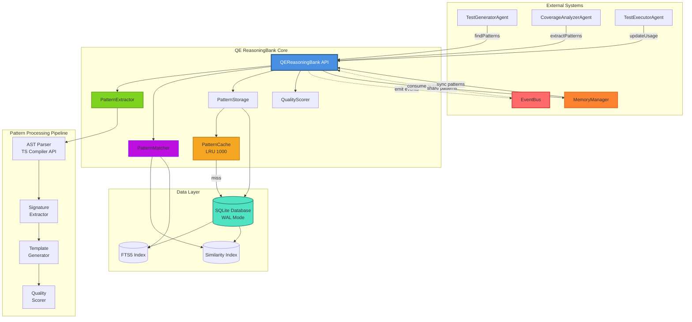

## 2. Data Flow Diagram

### 2.1 Pattern Storage Flow

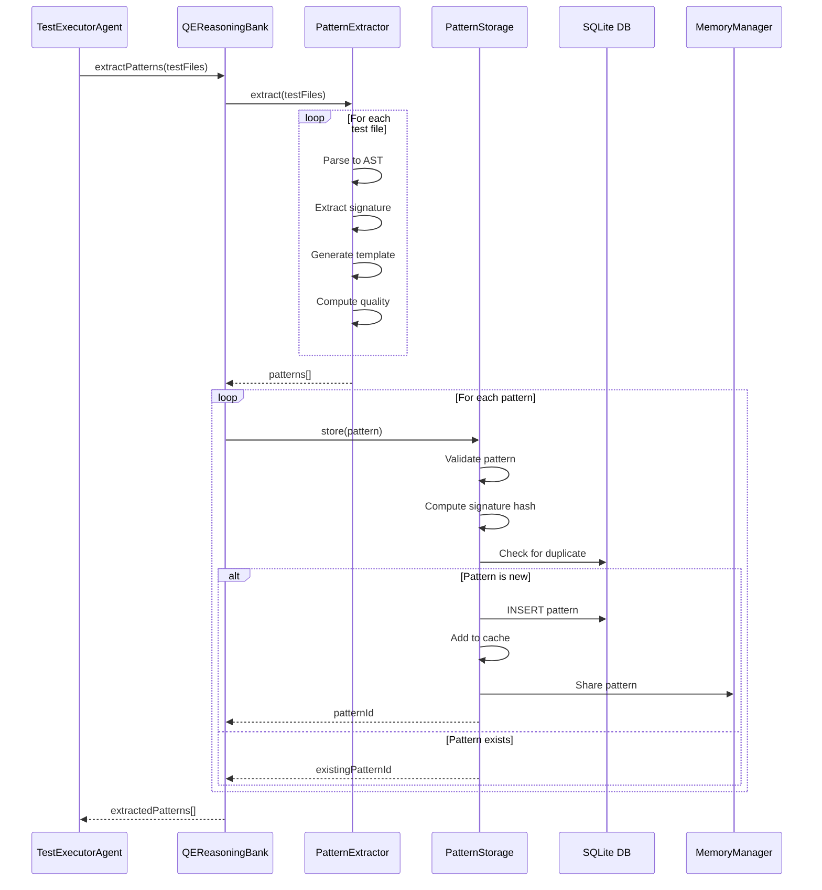

### 2.2 Pattern Matching Flow

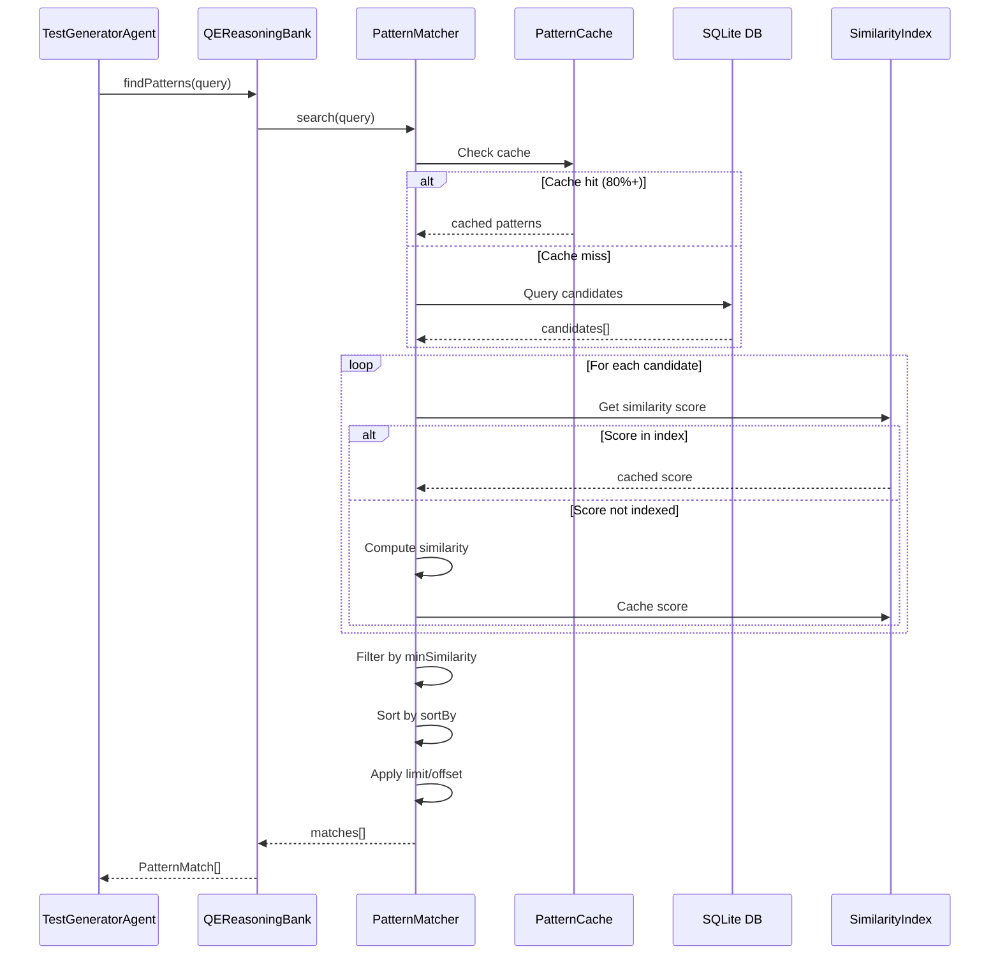

### 2.3 Usage Tracking Flow

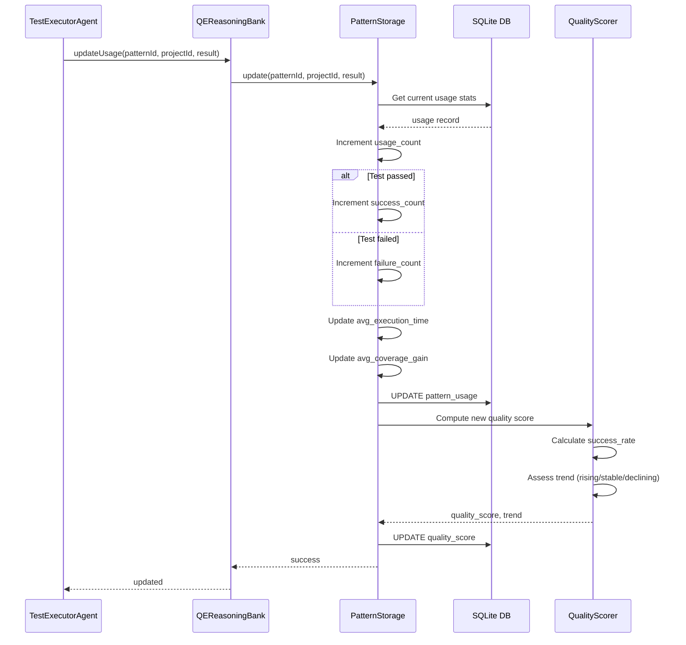

## 3. Component Interaction Diagram

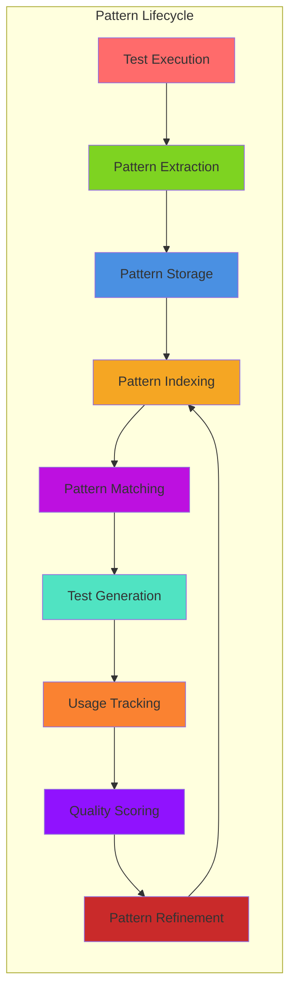

## 4. Database Schema ERD

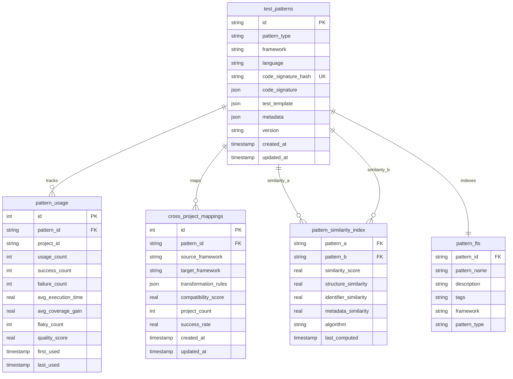

## 5. Pattern Extraction Pipeline

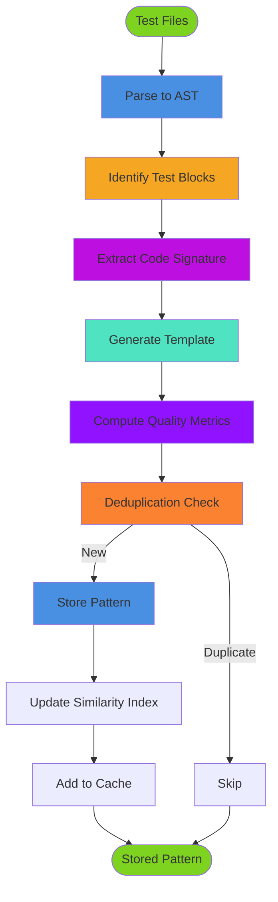

## 6. Pattern Matching Algorithm

```mermaid
flowchart TD
    Query([Pattern Query]) --> Cache{Cache<br/>Hit?}

    Cache -->|Yes 80%| CachePatterns[Get Cached Patterns]
    Cache -->|No 20%| DBQuery[Query Database]

    DBQuery --> Candidates[Get Candidates]
    Candidates --> FTS[Full-Text Search]
    FTS --> Filter[Filter by Framework/Type]

    CachePatterns --> Score[Compute Similarity Scores]
    Filter --> Score

    Score --> StructureSim[Structure Similarity<br/>40%]
    Score --> IdentifierSim[Identifier Similarity<br/>30%]
    Score --> MetadataSim[Metadata Similarity<br/>20%]
    Score --> UsageSim[Usage Score<br/>10%]

    StructureSim --> Combine[Combine Scores]
    IdentifierSim --> Combine
    MetadataSim --> Combine
    UsageSim --> Combine

    Combine --> MinSim{Score >=<br/>minSimilarity?}

    MinSim -->|Yes| Keep[Keep Match]
    MinSim -->|No| Discard[Discard]

    Keep --> Sort[Sort by sortBy]
    Discard --> Sort

    Sort --> Limit[Apply Limit/Offset]
    Limit --> Return([PatternMatch[]])

    style Query fill:#7ED321
    style Cache fill:#F5A623
    style Score fill:#BD10E0
    style Return fill:#7ED321
```

## 7. Quality Scoring System

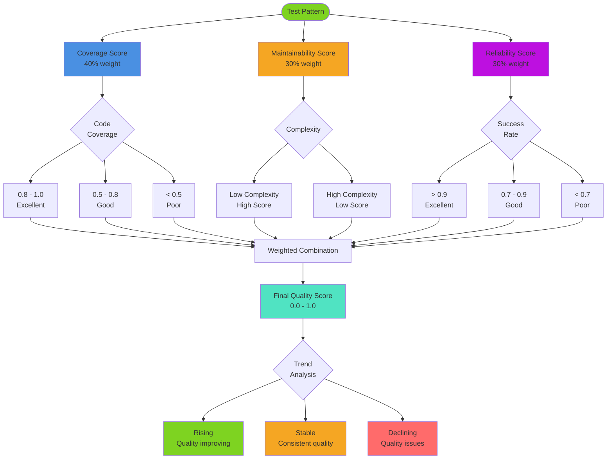

## 8. Cross-Framework Pattern Sharing

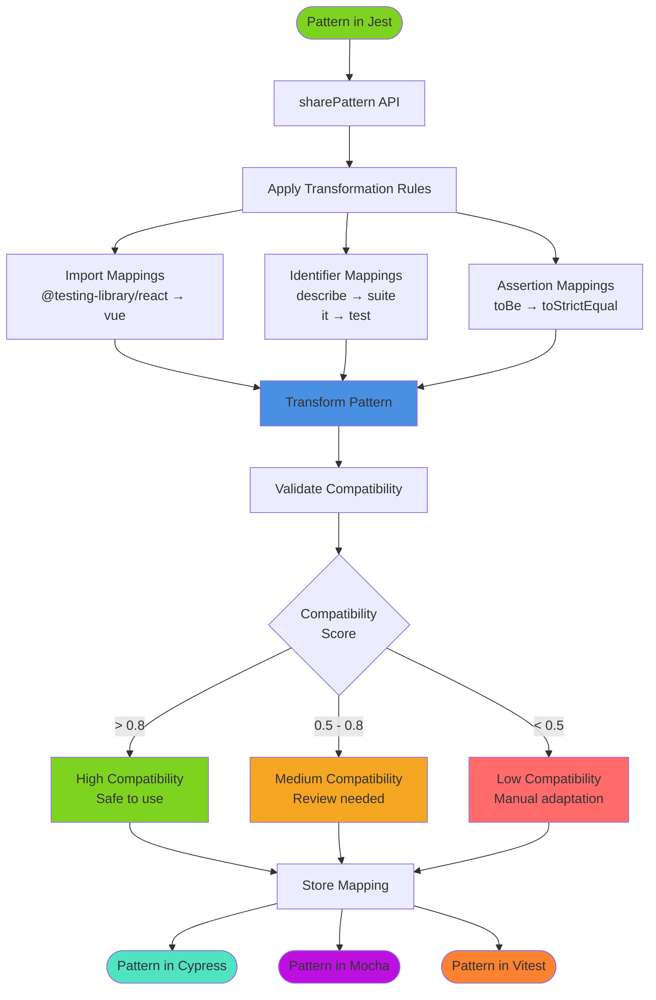

## 9. Performance Optimization Strategy

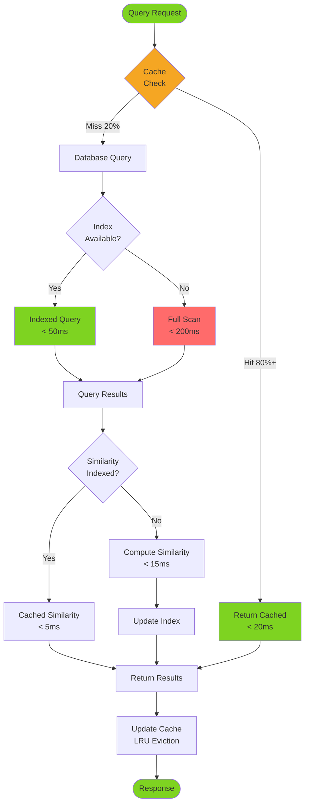

## 10. Agent Integration Architecture

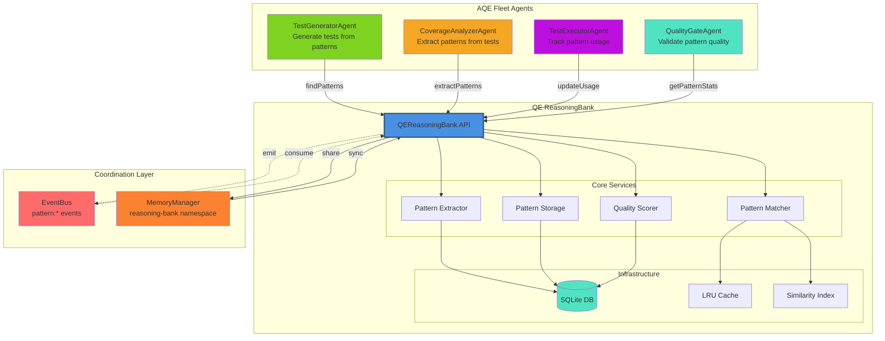

---

**Architecture Version:** 1.1.0
**Status:** ✓ Design Complete
**Last Updated:** 2025-10-16
