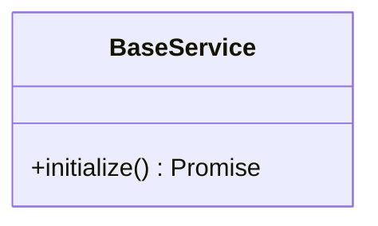
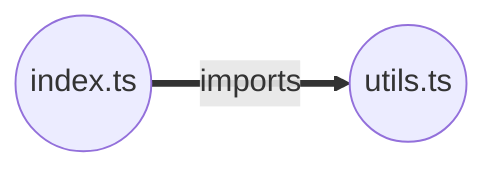
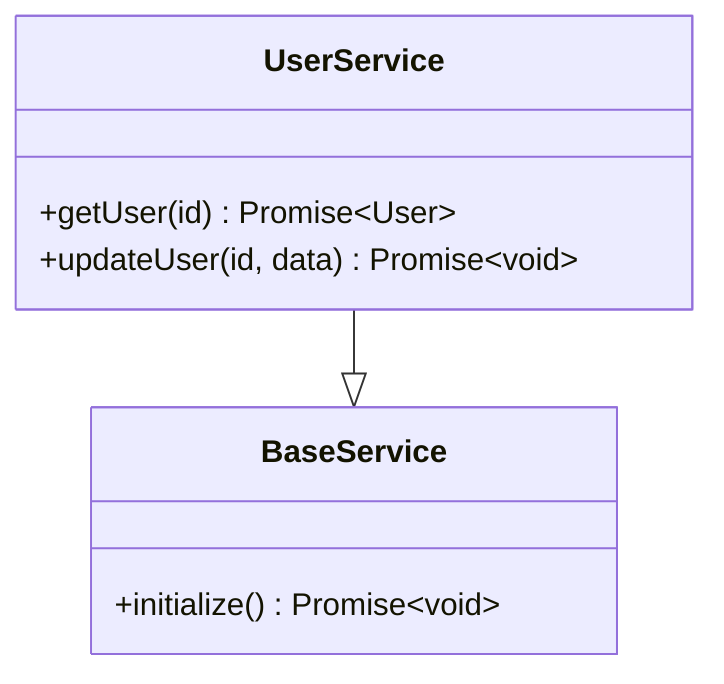
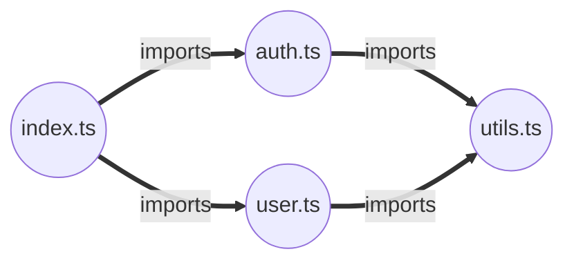
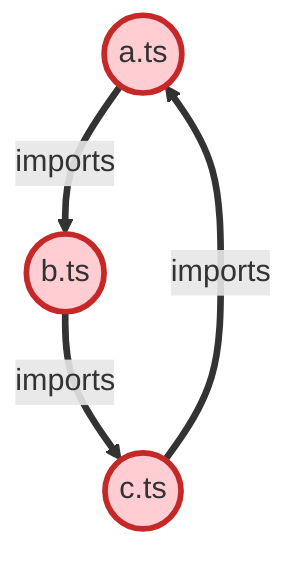

# Code Intelligence Visualization

Generate GitHub-compatible Mermaid diagrams from Code Intelligence graphs to visualize code structure, dependencies, and relationships.

## Features

- **Class Diagrams**: Visualize OOP hierarchies with inheritance, interfaces, methods, and properties
- **Dependency Graphs**: Show module dependencies and import relationships
- **Circular Dependency Detection**: Automatically detect and highlight circular dependencies
- **Customizable Output**: Filter by node/edge types, limit size, customize styling
- **GitHub Compatible**: All diagrams render directly in GitHub markdown

## Installation

The visualization tools are part of the Code Intelligence system:

```typescript
import {
  MermaidGenerator,
  ClassDiagramBuilder,
  DependencyGraphBuilder,
} from './src/code-intelligence/visualization/index.js';
```

## Quick Start

### Class Diagrams

Generate class diagrams showing inheritance and relationships:

```typescript
import { GraphBuilder } from './src/code-intelligence/graph/GraphBuilder.js';
import { ClassDiagramBuilder } from './src/code-intelligence/visualization/index.js';

const builder = new GraphBuilder();

// Add classes
const baseClass = builder.addNode('class', 'BaseService', '/src/BaseService.ts', 1, 20, 'typescript', {
  methods: [
    { name: 'initialize', visibility: 'public', returnType: 'Promise<void>' },
  ],
});

// Generate diagram
const diagram = ClassDiagramBuilder.build(
  builder.getAllNodes(),
  builder.getAllEdges(),
  {
    includeMethods: true,
    includeProperties: true,
  }
);

console.log(diagram);
```

**Output:**



### Dependency Graphs

Visualize module dependencies:

```typescript
import { DependencyGraphBuilder } from './src/code-intelligence/visualization/index.js';

const diagram = DependencyGraphBuilder.build(
  nodes,  // GraphNode[]
  edges,  // GraphEdge[]
  {
    direction: 'LR',
    showExternal: false,
    highlightCycles: true,
  }
);
```

**Output:**



### Circular Dependency Detection

Automatically detect and highlight circular dependencies:

```typescript
import { MermaidGenerator } from './src/code-intelligence/visualization/index.js';

const diagram = MermaidGenerator.generateDependencyGraphWithCycles(
  nodes,
  edges
);
```

Circular dependencies are highlighted in red with a warning message.

## API Reference

### MermaidGenerator

Core generator for all diagram types.

#### `generate(nodes, edges, type, options)`

Generate a Mermaid diagram.

**Parameters:**
- `nodes: GraphNode[]` - Nodes to include
- `edges: GraphEdge[]` - Edges to include
- `type: 'classDiagram' | 'graph' | 'flowchart'` - Diagram type
- `options?: MermaidOptions` - Customization options

**Options:**
```typescript
interface MermaidOptions {
  maxNodes?: number;           // Limit nodes (default: 50)
  includeLegend?: boolean;     // Add legend (default: true)
  direction?: 'TB' | 'LR' | 'RL' | 'BT';  // Graph direction
  theme?: 'default' | 'dark' | 'forest' | 'neutral';
  nodeTypeFilter?: NodeType[]; // Filter by node types
  edgeTypeFilter?: EdgeType[]; // Filter by edge types
}
```

#### `findCircularDependencies(nodes, edges)`

Detect circular dependencies in the graph.

**Returns:** `string[][]` - Array of cycles (each cycle is an array of node IDs)

#### `generateDependencyGraphWithCycles(nodes, edges, options)`

Generate dependency graph with circular dependencies highlighted.

### ClassDiagramBuilder

Generate class diagrams with inheritance and members.

#### `build(nodes, edges, options)`

Build a class diagram.

**Options:**
```typescript
interface ClassDiagramOptions extends MermaidOptions {
  includeMethods?: boolean;      // Show methods (default: true)
  includeProperties?: boolean;   // Show properties (default: true)
  showParameters?: boolean;      // Show method params (default: true)
  showReturnTypes?: boolean;     // Show return types (default: true)
  groupByNamespace?: boolean;    // Group by namespace (default: false)
}
```

#### `buildHierarchy(rootClassId, nodes, edges, options)`

Build inheritance hierarchy for a specific class.

**Parameters:**
- `rootClassId: string` - Root class node ID
- Returns complete hierarchy (superclasses and subclasses)

#### `buildInterfaceOverview(nodes, edges, options)`

Generate diagram showing interfaces and implementing classes.

### DependencyGraphBuilder

Generate dependency graphs and analyze dependencies.

#### `build(nodes, edges, options)`

Build a dependency graph.

**Options:**
```typescript
interface DependencyGraphOptions extends MermaidOptions {
  directOnly?: boolean;          // Show direct deps only (default: false)
  maxDepth?: number;             // Max traversal depth (default: 3)
  highlightCycles?: boolean;     // Highlight circular deps (default: true)
  groupByDirectory?: boolean;    // Group by directory (default: false)
  showExternal?: boolean;        // Show node_modules (default: false)
}
```

#### `buildDependencyTree(rootFileId, nodes, edges, options)`

Build dependency tree starting from a specific file.

#### `buildReverseDependencies(targetFileId, nodes, edges, options)`

Show all files that depend on a target file.

#### `analyzeDependencies(nodes, edges)`

Analyze dependency metrics.

**Returns:**
```typescript
interface DependencyMetrics {
  totalFiles: number;
  totalDependencies: number;
  avgDependenciesPerFile: number;
  mostImported: Array<{ file: string; imports: number }>;
  mostImporting: Array<{ file: string; dependencies: number }>;
  circularDependencies: number;
  circularDependencyPaths: string[][];
}
```

#### `generateDependencyMatrix(nodes, edges)`

Generate a markdown table showing the dependency matrix.

## Examples

### Example 1: Class Hierarchy

```typescript
const diagram = ClassDiagramBuilder.buildHierarchy(
  'UserService',
  nodes,
  edges
);
```



### Example 2: Module Dependencies

```typescript
const diagram = DependencyGraphBuilder.build(
  nodes,
  edges,
  { direction: 'LR' }
);
```



### Example 3: Circular Dependencies

```typescript
const diagram = MermaidGenerator.generateDependencyGraphWithCycles(
  nodes,
  edges
);
```



### Example 4: Dependency Matrix

```typescript
const matrix = DependencyGraphBuilder.generateDependencyMatrix(
  nodes,
  edges
);
```

**Output:**

| File | index.ts | utils.ts | auth.ts |
|------|----------|----------|---------|
| index.ts |  |  | X |
| utils.ts |  |  |  |
| auth.ts |  | X |  |

## Customization

### Node Styling

Different node types have different shapes and colors:

- **File**: Circle (blue)
- **Class**: Rounded rectangle (purple)
- **Interface**: Rounded rectangle (green)
- **Function/Method**: Rectangle (orange)
- **Variable/Type**: Diamond (pink)
- **Import/Export**: Hexagon (teal)

### Edge Types

Different relationship types use different arrows:

- **Inheritance**: `--|>` (solid line with arrow)
- **Implementation**: `..|>` (dotted line with arrow)
- **Import**: `==>` (thick arrow)
- **Call**: `.->` (dotted arrow)
- **Uses**: `-->` (regular arrow)

### Filtering

Filter nodes and edges:

```typescript
const diagram = MermaidGenerator.generate(nodes, edges, 'graph', {
  nodeTypeFilter: ['class', 'interface'],  // Only classes and interfaces
  edgeTypeFilter: ['extends', 'implements'],  // Only inheritance
  maxNodes: 20,  // Limit to 20 nodes
});
```

## Best Practices

1. **Limit Graph Size**: Use `maxNodes` option for large codebases to prevent overwhelming diagrams
2. **Filter Strategically**: Use node/edge type filters to focus on specific relationships
3. **Check for Cycles**: Always run circular dependency detection on module graphs
4. **Use Hierarchies**: For large class hierarchies, use `buildHierarchy()` to focus on specific classes
5. **External Dependencies**: Set `showExternal: false` to hide node_modules for cleaner diagrams

## Integration with Code Intelligence

Visualization works seamlessly with the Code Intelligence system:

```typescript
import { CodeIntelligenceEngine } from './src/code-intelligence/CodeIntelligenceEngine.js';
import { DependencyGraphBuilder } from './src/code-intelligence/visualization/index.js';

const engine = new CodeIntelligenceEngine({
  projectRoot: '/path/to/project',
});

await engine.initialize();

// Get graph from engine
const graph = engine.getGraph();

// Generate visualization
const diagram = DependencyGraphBuilder.build(
  Array.from(graph.nodes.values()),
  Array.from(graph.edges.values())
);

console.log(diagram);
```

## Running Examples

A complete example is available:

```bash
npx tsx examples/code-intelligence/visualize-graph.ts
```

This demonstrates:
- Class diagrams with inheritance
- Dependency graphs with imports
- Circular dependency detection
- Dependency metrics and analysis
- Dependency matrix
- Dependency trees
- Reverse dependencies

## Testing

Comprehensive test coverage:

```bash
npx vitest run tests/code-intelligence/visualization/
```

Tests cover:
- Mermaid syntax generation
- Node/edge filtering
- Circular dependency detection
- Class hierarchy building
- Dependency analysis
- Edge cases and error handling

## GitHub Integration

All generated diagrams are GitHub-compatible. Simply paste the Mermaid syntax into a markdown file or issue:

\`\`\`mermaid
[paste diagram here]
\`\`\`

GitHub will automatically render the diagram.

## Troubleshooting

### Diagram Too Large

**Problem**: Graph has too many nodes to visualize clearly.

**Solution**: Use `maxNodes` option and node type filters:

```typescript
const diagram = MermaidGenerator.generate(nodes, edges, 'graph', {
  maxNodes: 20,
  nodeTypeFilter: ['file'],  // Only show files
});
```

### Circular Dependencies Not Detected

**Problem**: Known circular dependencies not highlighted.

**Solution**: Ensure edge types are `'imports'` or `'uses'`:

```typescript
const cycles = MermaidGenerator.findCircularDependencies(nodes, edges);
console.log(`Found ${cycles.length} circular dependencies`);
```

### Special Characters in Labels

**Problem**: Node labels with special characters break diagram.

**Solution**: Labels are automatically sanitized. Check generated output:

```typescript
// Special characters are replaced with underscores
'My.Class<T>' → 'My_Class_T_'
```

## Contributing

To add new visualization features:

1. Add methods to appropriate builder class
2. Write comprehensive tests
3. Update documentation with examples
4. Ensure GitHub compatibility

## References

- [Mermaid Documentation](https://mermaid.js.org/)
- [Code Intelligence System](./README-code-intelligence.md)
- [Graph Builder API](./graph-builder.md)
- [GitHub Mermaid Support](https://github.blog/2022-02-14-include-diagrams-markdown-files-mermaid/)
