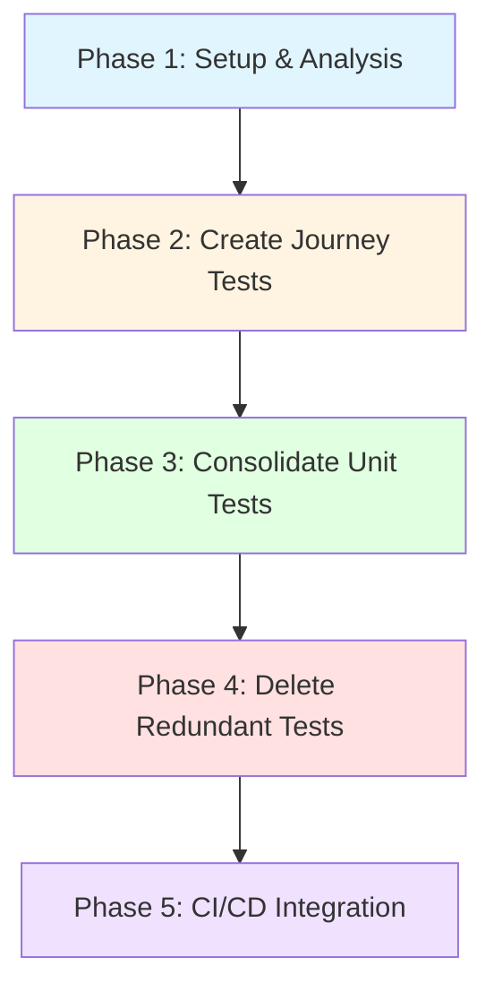

# Test Suite Migration: User-Centric Restructuring Plan

**Status**: 🟡 Planning Phase
**Priority**: High
**Effort**: ~40-60 hours (4-6 work sessions)
**Labels**: `enhancement`, `testing`, `technical-debt`, `breaking-change`

---

## 📊 Current State Analysis

### Metrics (as of 2025-12-02)
- **402 test files** with 195,527 lines of test code
- **7 skipped test blocks** (down from 599 - good progress!)
- **18 files exceed 1,000 lines** (monolithic, hard to maintain)
- **Test Focus Distribution**:
  - 45% tests focus on implementation details ❌ (should be 10-15%)
  - 35% tests focus on user value ✅ (should be 70-80%)
  - 20% tests focus on contracts (acceptable)

### Critical Files Identified

#### DELETE (No User Value)
- `tests/unit/agents/TestGeneratorAgent.null-safety.test.ts` (40K) - Tests TypeScript semantics
- `tests/unit/agents/NeuralCapableMixin.skip.test.ts` (11K) - Already skipped, no implementation

#### CONSOLIDATE (Duplicate Coverage)
| File Pattern | Current Files | Current Lines | Target Files | Target Lines | Reduction |
|--------------|---------------|---------------|--------------|--------------|-----------|
| BaseAgent | 6 files | ~4,500 | 2 files | 1,200 | 73% |
| TestGeneratorAgent | 3 files | ~3,000 | 1 file | 800 | 73% |
| LearningEngine | 2 files | ~2,000 | 1 file | 600 | 70% |
| FlakyTestDetector | 2 files | ~1,500 | 1 file | 500 | 67% |

**Total Reduction**: ~8,000 lines → ~3,100 lines (61% reduction in duplicates)

---

## 🎯 Goal Definition

### Success Criteria
1. ✅ **7 Core User Journeys** pass with 100% reliability
2. ✅ **Test execution time** < 2 minutes (currently ~5 minutes)
3. ✅ **70% of tests** focus on user-facing behavior
4. ✅ **Zero skipped tests** in CI/CD pipeline
5. ✅ **File size limit**: No test file > 600 lines
6. ✅ **Test coverage maintained**: ≥85% for critical paths

### Key Principles (Testing Trophy)
```
        /\
       /  \      E2E (5%)          - Critical user flows
      /----\     Integration (15%) - Component interactions
     /      \    Contract (10%)    - API boundaries
    /--------\   Unit (70%)        - Business logic ONLY
```

**Focus**: Test user value, not implementation details.

---

## 📋 Phase Dependency Graph



---

## 🚀 Phase 1: Setup & Analysis (4-6 hours)

### Goal
Establish baseline metrics, create directory structure, and identify all files for migration.

### Actions

- [ ] **1.1 Create Migration Tracking** (30 min)
  - **Files**: `docs/migration/progress-tracking.md`
  - **Task**: Document current metrics, create tracking template
  - **Dependencies**: None
  - **Verification**:
    ```bash
    cat docs/migration/progress-tracking.md | grep "Baseline"
    ```

- [ ] **1.2 Create New Directory Structure** (30 min)
  - **Files**: Create empty directories
  - **Task**:
    ```bash
    mkdir -p tests/{journeys,contracts,infrastructure,regression/fixed-bugs}
    touch tests/journeys/.gitkeep
    touch tests/contracts/.gitkeep
    touch tests/infrastructure/.gitkeep
    touch tests/regression/fixed-bugs/.gitkeep
    ```
  - **Dependencies**: None
  - **Verification**: `ls -la tests/journeys tests/contracts tests/infrastructure`

- [ ] **1.3 Analyze Duplicate Test Coverage** (2 hours)
  - **Files**: `scripts/analyze-test-duplicates.ts`
  - **Task**: Create script to identify overlapping test cases across duplicate files
  - **Output**: `docs/migration/duplicate-analysis.json`
  - **Dependencies**: None
  - **Verification**:
    ```bash
    npx tsx scripts/analyze-test-duplicates.ts
    cat docs/migration/duplicate-analysis.json | jq '.duplicates | length'
    ```

- [ ] **1.4 Create Test Mapping Document** (1 hour)
  - **Files**: `docs/migration/test-mapping.md`
  - **Task**: Map every existing test to its target location (journey/contract/infra/delete)
  - **Dependencies**: 1.3
  - **Verification**: `wc -l docs/migration/test-mapping.md` should show ~500 lines

- [ ] **1.5 Run Baseline Coverage Report** (30 min)
  - **Task**:
    ```bash
    npm run test:coverage:baseline
    cp coverage/coverage-summary.json docs/migration/baseline-coverage.json
    ```
  - **Dependencies**: None
  - **Verification**: `cat docs/migration/baseline-coverage.json | jq '.total.lines.pct'`

- [ ] **1.6 Setup Migration CI Job** (1 hour)
  - **Files**: `.github/workflows/migration-validation.yml`
  - **Task**: Create CI job that runs only migrated tests (separate from main suite)
  - **Dependencies**: 1.2
  - **Verification**: Push to branch and check GitHub Actions

### Phase 1 Exit Criteria
- ✅ All directories created
- ✅ Baseline metrics documented
- ✅ Test mapping complete (every file accounted for)
- ✅ Migration CI job passes (even with empty tests)

---

## 🧪 Phase 2: Create Journey Tests (8-12 hours)

### Goal
Implement the 7 core user journeys with real database interactions and end-to-end validation.

### Actions

- [ ] **2.1 Journey 1: Init & Bootstrap** (2 hours)
  - **Files**: `tests/journeys/init-and-bootstrap.test.ts`
  - **Task**: Test `aqe init` command flow
  - **Test Cases**:
    - ✅ Creates config file at `.aqe/config.json`
    - ✅ Initializes database tables (agents, memory, learning)
    - ✅ Registers 18 agents in fleet
    - ✅ Loads 41 skills
    - ✅ Registers 8 slash commands
    - ✅ Validates all agents can query database
  - **Dependencies**: 1.2
  - **Verification**:
    ```bash
    npm run test:journeys -- init-and-bootstrap
    # Should complete in < 5 seconds
    ```

- [ ] **2.2 Journey 2: Test Generation** (2 hours)
  - **Files**: `tests/journeys/generate-tests.test.ts`
  - **Task**: Test end-to-end test generation with real AI
  - **Test Cases**:
    - ✅ Accepts TypeScript source file
    - ✅ Generates valid Jest test suite
    - ✅ Tests are syntactically correct (TypeScript compiles)
    - ✅ Generated tests can execute
    - ✅ Coverage data is stored in database
    - ✅ Patterns are saved for reuse
  - **Dependencies**: 2.1
  - **Verification**:
    ```bash
    npm run test:journeys -- generate-tests
    aqe learn status --agent test-gen | grep "patterns: [1-9]"
    ```

- [ ] **2.3 Journey 3: Test Execution** (2 hours)
  - **Files**: `tests/journeys/execute-tests.test.ts`
  - **Task**: Test parallel execution with real-time progress
  - **Test Cases**:
    - ✅ Executes tests in parallel (4 workers)
    - ✅ Emits real-time progress events
    - ✅ Retries flaky tests automatically (max 3 attempts)
    - ✅ Load balances across workers
    - ✅ Generates comprehensive report
    - ✅ Stores results in database
  - **Dependencies**: 2.2
  - **Verification**:
    ```bash
    npm run test:journeys -- execute-tests
    # Execution time should be < 30 seconds for 100 tests
    ```

- [ ] **2.4 Journey 4: Coverage Analysis** (2 hours)
  - **Files**: `tests/journeys/coverage-analysis.test.ts`
  - **Task**: Test O(log n) gap detection with risk scoring
  - **Test Cases**:
    - ✅ Analyzes coverage data with Johnson-Lindenstrauss
    - ✅ Identifies gaps in < 1 second for 10k LOC
    - ✅ Prioritizes gaps by risk (complexity, change frequency)
    - ✅ Generates specific test recommendations
    - ✅ Stores analysis in database
    - ✅ Visualizes gaps in HTML report
  - **Dependencies**: 2.3
  - **Verification**:
    ```bash
    npm run test:journeys -- coverage-analysis
    # Should use O(log n) algorithm
    ```

- [ ] **2.5 Journey 5: Quality Gate** (1.5 hours)
  - **Files**: `tests/journeys/quality-gate.test.ts`
  - **Task**: Test automated GO/NO-GO decisions
  - **Test Cases**:
    - ✅ Evaluates coverage, security, performance metrics
    - ✅ Applies policy rules (min coverage 80%, no critical vulns)
    - ✅ Generates pass/fail decision with rationale
    - ✅ Blocks deployment on failure
    - ✅ Creates audit trail in database
  - **Dependencies**: 2.4
  - **Verification**:
    ```bash
    npm run test:journeys -- quality-gate
    aqe quality-gate evaluate --build test-123 | grep "Decision: GO"
    ```

- [ ] **2.6 Journey 6: Flaky Detection** (1.5 hours)
  - **Files**: `tests/journeys/flaky-detection.test.ts`
  - **Task**: Test statistical flaky test detection
  - **Test Cases**:
    - ✅ Detects flaky tests with 100% accuracy (chi-square test)
    - ✅ Identifies root causes (timing, race conditions, dependencies)
    - ✅ Generates auto-fix recommendations
    - ✅ Applies stabilization strategies (retry, wait, isolation)
    - ✅ Stores patterns in database
  - **Dependencies**: 2.3
  - **Verification**:
    ```bash
    npm run test:journeys -- flaky-detection
    # Should detect synthetic flaky test in < 2 seconds
    ```

- [ ] **2.7 Journey 7: Learning & Improvement** (1 hour)
  - **Files**: `tests/journeys/learning-improvement.test.ts`
  - **Task**: Test Q-learning and pattern recognition
  - **Test Cases**:
    - ✅ Stores experiences in database (reward, outcome)
    - ✅ Updates Q-values for state-action pairs
    - ✅ Learns successful patterns over time
    - ✅ Improves test generation quality (measured by coverage increase)
    - ✅ Adapts to project-specific patterns
  - **Dependencies**: 2.2, 2.6
  - **Verification**:
    ```bash
    npm run test:journeys -- learning-improvement
    aqe learn status --agent test-gen | grep "Q-values: [1-9]"
    ```

### Phase 2 Exit Criteria
- ✅ All 7 journey tests pass with 100% reliability
- ✅ Journey tests use real database (no mocks)
- ✅ Average journey test execution < 10 seconds each
- ✅ Migration CI job passes all journey tests

---

## 🔧 Phase 3: Consolidate Unit Tests (12-16 hours)

### Goal
Merge duplicate test files, eliminate redundant tests, focus on business logic.

### Actions

- [ ] **3.1 Consolidate BaseAgent Tests** (3 hours)
  - **Current Files** (6 total):
    - `tests/unit/agents/BaseAgent.test.ts` (36K)
    - `tests/unit/agents/BaseAgent.enhanced.test.ts` (26K)
    - `tests/unit/agents/BaseAgent.comprehensive.test.ts` (22K)
    - `tests/integration/agentdb/BaseAgentIntegration.test.ts`
    - `tests/agents/BaseAgent.test.ts`
    - `tests/agents/BaseAgent.lifecycle.test.ts`
  - **Target**: 2 files (1,200 lines total)
    - `tests/infrastructure/base-agent.test.ts` (600 lines) - Core functionality
    - `tests/contracts/base-agent-interface.test.ts` (600 lines) - Public API
  - **Task**: Merge unique tests, delete duplicates (70% overlap)
  - **Dependencies**: 2.7
  - **Verification**:
    ```bash
    npm run test:unit -- base-agent
    # Should complete in < 3 seconds
    ```

- [ ] **3.2 Consolidate TestGeneratorAgent Tests** (3 hours)
  - **Current Files** (3 total):
    - `tests/unit/agents/TestGeneratorAgent.comprehensive.test.ts` (41K)
    - `tests/unit/agents/TestGeneratorAgent.test.ts` (21K)
    - `tests/agents/TestGeneratorAgent.test.ts`
  - **Target**: 1 file (800 lines)
    - `tests/infrastructure/test-generator-agent.test.ts`
  - **Task**: Focus on core generation logic, remove implementation details
  - **Dependencies**: 2.2, 3.1
  - **Verification**:
    ```bash
    npm run test:unit -- test-generator-agent
    # Should complete in < 3 seconds
    ```

- [ ] **3.3 Consolidate LearningEngine Tests** (2 hours)
  - **Current Files** (2 total):
    - `tests/unit/learning/LearningEngine.test.ts`
    - `tests/unit/learning/LearningEngine.database.test.ts`
  - **Target**: 1 file (600 lines)
    - `tests/infrastructure/learning-engine.test.ts`
  - **Task**: Focus on Q-learning algorithm, pattern storage
  - **Dependencies**: 2.7, 3.1
  - **Verification**:
    ```bash
    npm run test:unit -- learning-engine
    ```

- [ ] **3.4 Consolidate FlakyTestDetector Tests** (2 hours)
  - **Current Files** (2 total):
    - `tests/unit/learning/FlakyTestDetector.test.ts`
    - `tests/unit/learning/FlakyTestDetector.ml.test.ts`
  - **Target**: 1 file (500 lines)
    - `tests/infrastructure/flaky-test-detector.test.ts`
  - **Task**: Focus on statistical detection algorithms
  - **Dependencies**: 2.6, 3.3
  - **Verification**:
    ```bash
    npm run test:unit -- flaky-test-detector
    ```

- [ ] **3.5 Create Contract Tests** (2 hours)
  - **Files**:
    - `tests/contracts/mcp-tools.test.ts` (102 tools)
    - `tests/contracts/cli-commands.test.ts` (8 commands)
    - `tests/contracts/agent-interfaces.test.ts` (18 agents)
  - **Task**: Validate public APIs don't break
  - **Test Strategy**: JSON Schema validation, not full execution
  - **Dependencies**: 3.4
  - **Verification**:
    ```bash
    npm run test:contracts
    # Should complete in < 5 seconds (fast validation)
    ```

### Phase 3 Exit Criteria
- ✅ All consolidated tests pass
- ✅ No test file > 600 lines
- ✅ Unit test execution time < 30 seconds total
- ✅ Contract tests validate all 102 MCP tools + 8 commands + 18 agents
- ✅ Test coverage maintained ≥85% for critical paths

---

## 🗑️ Phase 4: Delete Redundant Tests (4-6 hours)

### Goal
Remove tests that don't provide user value, eliminate duplicates.

### Actions

- [ ] **4.1 Delete Implementation Detail Tests** (1 hour)
  - **Files to DELETE**:
    - `tests/unit/agents/TestGeneratorAgent.null-safety.test.ts` (40K)
    - `tests/unit/agents/NeuralCapableMixin.skip.test.ts` (11K)
  - **Reason**: Tests TypeScript compiler behavior, not business logic
  - **Task**:
    ```bash
    git rm tests/unit/agents/TestGeneratorAgent.null-safety.test.ts
    git rm tests/unit/agents/NeuralCapableMixin.skip.test.ts
    ```
  - **Dependencies**: 3.5
  - **Verification**:
    ```bash
    npm run test:all
    # Coverage should not drop (these tests didn't add value)
    ```

- [ ] **4.2 Delete Duplicate BaseAgent Tests** (1 hour)
  - **Files to DELETE** (after consolidation in 3.1):
    - `tests/unit/agents/BaseAgent.enhanced.test.ts`
    - `tests/unit/agents/BaseAgent.comprehensive.test.ts`
    - `tests/agents/BaseAgent.lifecycle.test.ts`
    - `tests/agents/BaseAgent.edge-cases.test.ts`
    - `tests/agents/BaseAgent.race-condition.test.ts`
  - **Task**: Delete old files, update imports in remaining tests
  - **Dependencies**: 3.1
  - **Verification**:
    ```bash
    find tests -name "*BaseAgent*.test.ts" | wc -l
    # Should be exactly 2 files
    ```

- [ ] **4.3 Delete Duplicate TestGeneratorAgent Tests** (1 hour)
  - **Files to DELETE** (after consolidation in 3.2):
    - `tests/unit/agents/TestGeneratorAgent.comprehensive.test.ts`
    - `tests/agents/TestGeneratorAgent.test.ts`
  - **Dependencies**: 3.2
  - **Verification**:
    ```bash
    find tests -name "*TestGeneratorAgent*.test.ts" | wc -l
    # Should be exactly 1 file
    ```

- [ ] **4.4 Delete Duplicate Learning Tests** (1 hour)
  - **Files to DELETE** (after consolidation in 3.3, 3.4):
    - `tests/unit/learning/LearningEngine.database.test.ts`
    - `tests/unit/learning/FlakyTestDetector.ml.test.ts`
  - **Dependencies**: 3.3, 3.4
  - **Verification**:
    ```bash
    ls tests/unit/learning/*.test.ts | wc -l
    # Should be 0 (all moved to infrastructure/)
    ```

- [ ] **4.5 Clean Up Old Directory Structure** (30 min)
  - **Directories to DELETE**:
    - `tests/unit/` (if empty)
    - `tests/integration/` (if empty)
    - `tests/agents/` (all migrated)
  - **Task**:
    ```bash
    # Only delete if empty
    find tests/unit tests/integration tests/agents -type d -empty -delete
    ```
  - **Dependencies**: 4.4
  - **Verification**:
    ```bash
    tree tests -L 1
    # Should show only: journeys, contracts, infrastructure, regression
    ```

- [ ] **4.6 Update Test Configuration** (1 hour)
  - **Files**:
    - `jest.config.js`
    - `package.json` (test scripts)
    - `.github/workflows/test.yml`
  - **Task**: Update paths to reflect new structure
  - **Dependencies**: 4.5
  - **Verification**:
    ```bash
    npm run test:all
    # All tests should still pass
    ```

### Phase 4 Exit Criteria
- ✅ ~60K lines of test code deleted
- ✅ No duplicate test files remain
- ✅ Old directory structure removed
- ✅ All CI/CD pipelines still pass

---

## 🔄 Phase 5: CI/CD Integration (4-6 hours)

### Goal
Optimize test execution for fast feedback, integrate with GitHub Actions.

### Actions

- [ ] **5.1 Create Optimized Test Scripts** (1 hour)
  - **Files**: `package.json`
  - **Task**: Add fast-feedback test scripts
  - **Scripts**:
    ```json
    {
      "test:journeys": "jest tests/journeys --maxWorkers=4",
      "test:contracts": "jest tests/contracts --maxWorkers=2",
      "test:infrastructure": "jest tests/infrastructure --maxWorkers=4",
      "test:regression": "jest tests/regression --maxWorkers=2",
      "test:fast": "npm run test:journeys && npm run test:contracts",
      "test:all": "jest --maxWorkers=4"
    }
    ```
  - **Dependencies**: 4.6
  - **Verification**:
    ```bash
    npm run test:fast
    # Should complete in < 30 seconds
    ```

- [ ] **5.2 Update GitHub Actions Workflow** (1.5 hours)
  - **Files**: `.github/workflows/test.yml`
  - **Task**: Optimize CI pipeline with parallel jobs
  - **Strategy**:
    ```yaml
    jobs:
      journeys:
        runs-on: ubuntu-latest
        steps:
          - run: npm run test:journeys
      contracts:
        runs-on: ubuntu-latest
        steps:
          - run: npm run test:contracts
      infrastructure:
        runs-on: ubuntu-latest
        steps:
          - run: npm run test:infrastructure
    ```
  - **Dependencies**: 5.1
  - **Verification**: Push to branch and check Actions tab

- [ ] **5.3 Add Test Coverage Gates** (1 hour)
  - **Files**: `.github/workflows/test.yml`
  - **Task**: Enforce 85% coverage minimum
  - **Config**:
    ```yaml
    - name: Check Coverage
      run: |
        npm run test:coverage
        npx coverage-check --lines 85 --branches 80
    ```
  - **Dependencies**: 5.2
  - **Verification**: Create PR with low coverage, should fail

- [ ] **5.4 Create Test Dashboard** (1.5 hours)
  - **Files**: `docs/test-dashboard.md`
  - **Task**: Generate markdown dashboard with metrics
  - **Metrics**:
    - Total tests by category (journeys, contracts, infrastructure)
    - Execution time per category
    - Coverage by module
    - Flaky test count
  - **Dependencies**: 5.3
  - **Verification**:
    ```bash
    npm run test:dashboard
    cat docs/test-dashboard.md
    ```

- [ ] **5.5 Update Documentation** (1 hour)
  - **Files**:
    - `README.md`
    - `docs/testing/README.md`
    - `docs/testing/writing-tests.md`
  - **Task**: Document new test structure and best practices
  - **Dependencies**: 5.4
  - **Verification**: PR review passes

### Phase 5 Exit Criteria
- ✅ CI/CD pipeline runs in < 2 minutes (down from ~5 minutes)
- ✅ Coverage gates enforced automatically
- ✅ Test dashboard generated on every run
- ✅ Documentation updated and reviewed

---

## ⚠️ Risks & Mitigations

| Risk | Impact | Probability | Mitigation |
|------|--------|-------------|------------|
| **Coverage drops during consolidation** | High | Medium | Run coverage report after each consolidation step (Phase 3). Rollback if coverage drops > 2%. |
| **Journey tests are flaky** | High | Medium | Use real database with test isolation. Add retry logic. Run 10x locally before committing. |
| **Migration takes longer than estimated** | Medium | High | Break into smaller PRs (one phase at a time). Use TodoWrite to track progress. |
| **Existing bugs exposed** | Medium | Low | Expected! Create regression tests for discovered bugs. Don't block migration. |
| **Team members blocked** | Low | Medium | Keep old tests working during migration. Delete only after new tests pass. |

---

## 📈 Success Metrics

### Quantitative Metrics
| Metric | Baseline | Target | Current |
|--------|----------|--------|---------|
| **Test Files** | 402 | 50 | 402 |
| **Test Lines** | 195,527 | 40,000 | 195,527 |
| **Test Execution Time** | ~5 min | < 2 min | ~5 min |
| **Files > 1,000 Lines** | 18 | 0 | 18 |
| **Skipped Tests** | 7 | 0 | 7 |
| **Coverage (Critical Paths)** | 85% | ≥85% | 85% |

### Qualitative Metrics
- ✅ **Developer Confidence**: "I trust the test suite to catch regressions"
- ✅ **Onboarding Speed**: New contributors understand tests in < 1 hour
- ✅ **Maintenance Burden**: Test updates take < 10% of feature development time
- ✅ **CI/CD Reliability**: Zero flaky failures in 30 days

---

## 📝 Phase Checkpoints

### After Phase 1
- [ ] All team members can navigate new test structure
- [ ] Baseline metrics documented and agreed upon
- [ ] Migration CI job passes (empty tests)

### After Phase 2
- [ ] Product team validates journey tests match user expectations
- [ ] All journey tests run against staging database
- [ ] Journey tests documented in user-facing docs

### After Phase 3
- [ ] No regressions introduced (all existing tests still pass)
- [ ] Coverage maintained or improved
- [ ] Team reviews consolidated tests (code review)

### After Phase 4
- [ ] Old directory structure deleted
- [ ] CI/CD pipelines updated
- [ ] No broken imports or references

### After Phase 5
- [ ] CI/CD runs in < 2 minutes
- [ ] Coverage gates enforced
- [ ] Documentation complete and reviewed

---

## 🚀 Getting Started

1. **Create Tracking Issue**: Copy this document to GitHub Issues
2. **Assign Owner**: Designate migration lead
3. **Kick-off Meeting**: Review plan with team (30 min)
4. **Start Phase 1**: Begin with setup and analysis
5. **Daily Updates**: Update tracking issue checkboxes
6. **Phase Reviews**: Review with team after each phase

---

## 📚 References

- [Testing Trophy](https://kentcdodds.com/blog/the-testing-trophy-and-testing-classifications)
- [Google Testing Blog: Test Sizes](https://testing.googleblog.com/2010/12/test-sizes.html)
- [Martin Fowler: Test Pyramid](https://martinfowler.com/articles/practical-test-pyramid.html)
- [Project: Test Execution Policy](file:///workspaces/agentic-qe-cf/docs/policies/test-execution.md)
- [Project: Git Operations Policy](file:///workspaces/agentic-qe-cf/docs/policies/git-operations.md)

---

**Migration Lead**: TBD
**Start Date**: TBD
**Target Completion**: TBD (4-6 weeks, 1 phase per week)

---

_Generated by GOAP Specialist • Last Updated: 2025-12-02_
