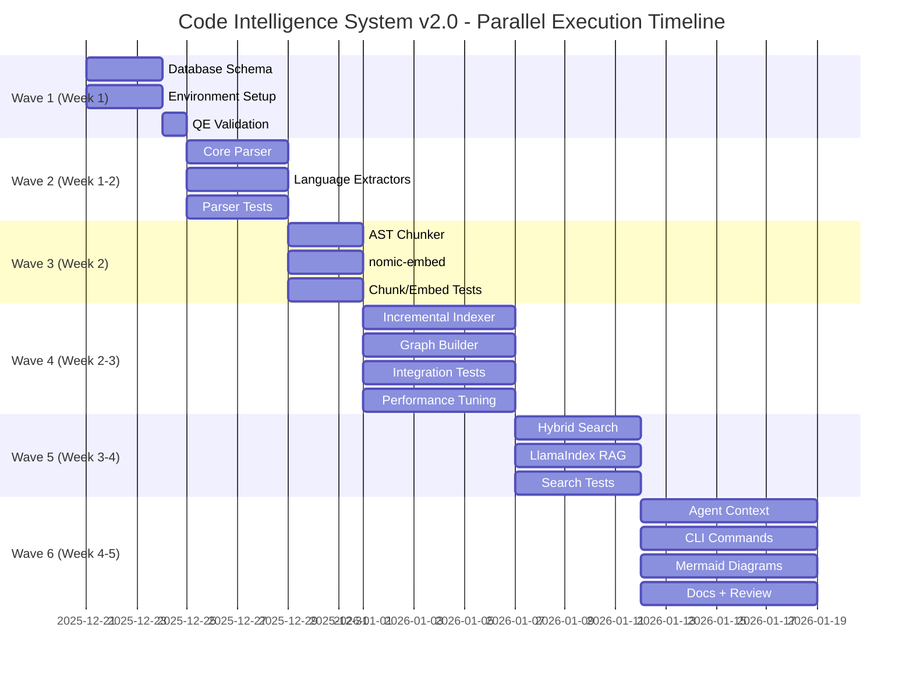

# Code Intelligence System v2.0 - Parallel Execution Plan

**Version:** 1.0.0
**Date:** 2025-12-21
**Author:** SPARC-GOAP Planning Agent
**Status:** Ready for Execution
**Related:** Issue #158, code-intelligence-system-v2-goap.md

---

## Executive Summary

This document provides an **actionable, wave-based parallel execution plan** for implementing the Code Intelligence System v2.0 using Claude-Flow swarm coordination and QE agent specialization.

### Key Features
- ✅ **6 Execution Waves** with clear dependency boundaries
- ✅ **Zero File Conflicts** through careful ownership assignment
- ✅ **Parallel Agent Execution** using Claude Code's Task tool
- ✅ **QE Agent Integration** for quality assurance
- ✅ **Claude-Flow Coordination** for complex orchestration
- ✅ **Estimated Duration:** 6-8 weeks with 3-4 agents per wave

### Quick Start
```bash
# Initialize swarm coordination
npx claude-flow@alpha swarm init --topology hierarchical --max-agents 6

# Execute Wave 1 (Foundation Setup)
# See Wave 1 section for Task tool commands

# Monitor progress
npx claude-flow@alpha swarm status --verbose
```

---

## Table of Contents

1. [Swarm Configuration](#swarm-configuration)
2. [Execution Waves](#execution-waves)
3. [Agent Assignments](#agent-assignments)
4. [File Ownership Matrix](#file-ownership-matrix)
5. [Dependency Graph](#dependency-graph)
6. [Handoff Protocol](#handoff-protocol)
7. [Conflict Resolution](#conflict-resolution)
8. [Timeline Visualization](#timeline-visualization)

---

## Swarm Configuration

### Initial Setup

```bash
# Initialize hierarchical swarm for coordinated development
npx claude-flow@alpha swarm init \
  --topology hierarchical \
  --max-agents 6 \
  --strategy adaptive

# Define agent types (MCP coordination only)
npx claude-flow@alpha agent spawn --type researcher --capabilities analysis,research
npx claude-flow@alpha agent spawn --type coder --capabilities implementation,refactoring
npx claude-flow@alpha agent spawn --type backend-dev --capabilities database,api
npx claude-flow@alpha agent spawn --type system-architect --capabilities design,architecture
npx claude-flow@alpha agent spawn --type tester --capabilities testing,validation
npx claude-flow@alpha agent spawn --type reviewer --capabilities review,quality
```

### Topology Justification

**Hierarchical** chosen for:
- Clear task coordination from coordinator to workers
- Dependency management (upstream tasks → downstream)
- Sequential wave progression with parallel execution within waves
- Natural fit for 6 phases with handoff points

**Alternative Considered:**
- **Mesh:** Too much coordination overhead for sequential dependencies
- **Adaptive:** Complexity not needed for well-defined workflow

---

## Execution Waves

### Wave 1: Database Foundation (Week 1, Days 1-3)

**Goal:** Establish database schema extensions (PostgreSQL + RuVector + SQL tables for graph)

> **Note:** Apache AGE was deferred to v2. See [ADR-002](../architecture/ADR-002-sql-tables-vs-apache-age.md)

**Agents:** 2 agents (parallel, no file conflicts)

**Duration:** 3 days

```javascript
// Execute all Wave 1 tasks in a SINGLE message with Claude Code's Task tool

// Agent 1: Database Schema Engineer
Task(
  "Database Schema Setup",
  `Set up RuVector and SQL tables for Code Intelligence System v2.0.

  Tasks:
  1. Create migration file at src/migrations/add-code-intelligence-sql-schema.sql
  2. Create code_chunks table with RuVector embeddings and FTS support
  3. Create code_entities table for parsed symbols
  4. Create entity_relationships table for graph edges (SQL-based, not Apache AGE)
  5. Add HNSW and GIN indices for performance
  6. Create hybrid_code_search function
  7. Run hooks for coordination:
     - Pre: npx claude-flow@alpha hooks pre-task --description "database-schema-setup"
     - Post: npx claude-flow@alpha hooks post-task --task-id "db-schema"
  8. Store completion in memory:
     - npx claude-flow@alpha hooks notify --message "Database schema ready for indexing"

  Files to create:
  - src/migrations/YYYYMMDD_add_code_intelligence_sql_schema.sql
  - src/code-intelligence/config/database-schema.ts
  - docs/architecture/database-schema.md

  Validation:
  - Run migration successfully
  - Verify code_chunks, code_entities, entity_relationships tables exist
  - Test vector insertion and retrieval
  - Test hybrid_code_search function
  `,
  "backend-dev"
)

// Agent 2: Configuration & Environment Setup
Task(
  "Environment Configuration",
  `Configure environment and dependencies for Code Intelligence System.

  Tasks:
  1. Update package.json with Tree-sitter dependencies
     - tree-sitter
     - tree-sitter-typescript
     - tree-sitter-python
     - tree-sitter-go
     - tree-sitter-rust
     - tree-sitter-javascript
  2. Add nomic-embed-text configuration
  3. Create environment setup script
  4. Document Ollama installation requirements
  5. Run hooks for coordination:
     - Pre: npx claude-flow@alpha hooks pre-task --description "environment-setup"
     - Post: npx claude-flow@alpha hooks post-edit --file "package.json"

  Files to create/modify:
  - package.json (add dependencies)
  - src/code-intelligence/config/environment.ts
  - scripts/setup-ollama.sh
  - docs/setup/code-intelligence-prerequisites.md

  Validation:
  - npm install succeeds
  - All Tree-sitter parsers load
  - Ollama health check passes
  `,
  "coder"
)

// Batch all Wave 1 todos together
TodoWrite({
  todos: [
    {
      content: "Create SQL tables for code intelligence (chunks, entities, relationships)",
      status: "in_progress",
      activeForm: "Creating SQL schema",
      priority: "critical"
    },
    {
      content: "Create code_chunks table with vector + FTS support",
      status: "in_progress",
      activeForm: "Creating code_chunks table",
      priority: "critical"
    },
    {
      content: "Install Tree-sitter language parsers (TS, Python, Go, Rust, JS)",
      status: "in_progress",
      activeForm: "Installing Tree-sitter parsers",
      priority: "critical"
    },
    {
      content: "Configure nomic-embed-text with Ollama",
      status: "pending",
      activeForm: "Configuring nomic embeddings",
      priority: "high"
    },
    {
      content: "Create database migration scripts",
      status: "pending",
      activeForm: "Creating migration scripts",
      priority: "high"
    },
    {
      content: "Validate database schema with test data",
      status: "pending",
      activeForm: "Validating database schema",
      priority: "medium"
    }
  ]
})
```

**Deliverables:**
- ✅ SQL tables created (code_chunks, code_entities, entity_relationships)
- ✅ code_chunks table with RuVector (768-dim) and FTS
- ✅ entity_relationships for graph edges (SQL-based, Apache AGE deferred to v2)
- ✅ Tree-sitter dependencies added to package.json
- ✅ Ollama setup documentation

**File Ownership:**
- Agent 1 (backend-dev): `src/migrations/*`, `src/code-intelligence/config/database-schema.ts`
- Agent 2 (coder): `package.json`, `scripts/setup-ollama.sh`, `src/code-intelligence/config/environment.ts`

**Handoff:** Database schema ready → Wave 2 (Parser Implementation)

**QE Validation:**
```javascript
// After Wave 1 completion
Task(
  "Database Schema Quality Check",
  `Validate Wave 1 database setup.

  Validation tasks:
  1. Run integration tests against code_chunks table
  2. Verify entity_relationships queries work (SQL JOINs)
  3. Test vector insertion and similarity search
  4. Check index creation (HNSW, GIN)
  5. Validate migration rollback capability

  Generate test report at: tests/reports/wave1-database-validation.md
  `,
  "qe-integration-tester"
)
```

---

### Wave 2: Multi-Language Parser (Week 1-2, Days 4-7)

**Goal:** Implement Tree-sitter parser with multi-language support

**Agents:** 3 agents (parallel implementation + testing)

**Duration:** 4 days

```javascript
// Execute all Wave 2 tasks in a SINGLE message

// Agent 1: Core Parser Implementation
Task(
  "Tree-sitter Core Parser",
  `Implement multi-language Tree-sitter parser.

  Tasks:
  1. Create TreeSitterParser.ts with multi-language support
  2. Implement parser initialization for TypeScript, Python, Go, Rust, JavaScript
  3. Build entity extraction (functions, classes, methods)
  4. Add incremental parsing support (36x performance)
  5. Implement language-specific node type mappings
  6. Run hooks:
     - Pre: npx claude-flow@alpha hooks pre-task --description "tree-sitter-parser"
     - Post edit: npx claude-flow@alpha hooks post-edit --file "TreeSitterParser.ts"

  Files to create:
  - src/code-intelligence/parser/TreeSitterParser.ts
  - src/code-intelligence/parser/LanguageRegistry.ts
  - src/code-intelligence/parser/types.ts

  Implementation requirements:
  - Support 5 languages: TypeScript, Python, Go, Rust, JavaScript
  - Extract CodeEntity[] from AST
  - Incremental parsing with oldTree caching
  - Graceful error handling for unsupported languages

  Validation:
  - Parse 100 TypeScript files in <10s
  - Extract functions, classes, methods correctly
  - Incremental parsing shows 36x speedup
  `,
  "coder"
)

// Agent 2: Language-Specific Extractors
Task(
  "Language-Specific Symbol Extraction",
  `Implement language-specific symbol extraction logic.

  Tasks:
  1. Create extractors for each language
     - TypeScriptExtractor: functions, classes, interfaces, types
     - PythonExtractor: functions, classes, decorators
     - GoExtractor: functions, structs, interfaces
     - RustExtractor: functions, structs, traits, impls
  2. Extract metadata (parameters, return types, visibility)
  3. Handle language-specific patterns (Go receivers, Rust lifetimes)
  4. Run hooks for coordination

  Files to create:
  - src/code-intelligence/parser/extractors/TypeScriptExtractor.ts
  - src/code-intelligence/parser/extractors/PythonExtractor.ts
  - src/code-intelligence/parser/extractors/GoExtractor.ts
  - src/code-intelligence/parser/extractors/RustExtractor.ts
  - src/code-intelligence/parser/extractors/BaseExtractor.ts

  Validation:
  - Each extractor handles language-specific syntax
  - Metadata extraction accuracy >95%
  - Edge cases handled (async, generic types, decorators)
  `,
  "backend-dev"
)

// Agent 3: Parser Testing
Task(
  "Tree-sitter Parser Test Suite",
  `Create comprehensive test suite for Tree-sitter parser.

  Tasks:
  1. Generate unit tests for TreeSitterParser
  2. Create test fixtures for each language
  3. Test incremental parsing performance
  4. Add edge case tests (syntax errors, large files, Unicode)
  5. Benchmark parsing speed
  6. Use QE test generation patterns

  Files to create:
  - tests/code-intelligence/parser/TreeSitterParser.test.ts
  - tests/code-intelligence/parser/fixtures/*.{ts,py,go,rs,js}
  - tests/code-intelligence/parser/benchmarks.test.ts

  Coverage goal: >85%
  `,
  "qe-test-generator"
)

TodoWrite({
  todos: [
    {
      content: "Implement TreeSitterParser core class",
      status: "in_progress",
      activeForm: "Implementing TreeSitterParser",
      priority: "critical"
    },
    {
      content: "Create language-specific extractors (5 languages)",
      status: "in_progress",
      activeForm: "Creating language extractors",
      priority: "critical"
    },
    {
      content: "Build TypeScript symbol extractor",
      status: "pending",
      activeForm: "Building TypeScript extractor",
      priority: "high"
    },
    {
      content: "Build Python symbol extractor",
      status: "pending",
      activeForm: "Building Python extractor",
      priority: "high"
    },
    {
      content: "Build Go symbol extractor",
      status: "pending",
      activeForm: "Building Go extractor",
      priority: "high"
    },
    {
      content: "Generate parser test suite with 85% coverage",
      status: "in_progress",
      activeForm: "Generating parser tests",
      priority: "high"
    },
    {
      content: "Benchmark parsing performance (<10s for 100 files)",
      status: "pending",
      activeForm: "Benchmarking parser performance",
      priority: "medium"
    },
    {
      content: "Test incremental parsing (36x speedup validation)",
      status: "pending",
      activeForm: "Testing incremental parsing",
      priority: "medium"
    }
  ]
})
```

**Deliverables:**
- ✅ TreeSitterParser with 5 language support
- ✅ Language-specific extractors
- ✅ Incremental parsing (36x faster)
- ✅ Test suite with 85%+ coverage
- ✅ Performance benchmarks

**File Ownership:**
- Agent 1: `src/code-intelligence/parser/TreeSitterParser.ts`, `LanguageRegistry.ts`
- Agent 2: `src/code-intelligence/parser/extractors/*`
- Agent 3: `tests/code-intelligence/parser/*`

**Handoff:** Parser ready → Wave 3 (AST Chunking + Embeddings)

---

### Wave 3: AST Chunking + Embeddings (Week 2, Days 8-10)

**Goal:** Implement AST-aware chunking and nomic-embed-text integration

**Agents:** 3 agents (chunking + embeddings + testing)

**Duration:** 3 days

```javascript
// Execute all Wave 3 tasks in a SINGLE message

// Agent 1: AST Chunking Implementation
Task(
  "AST-Based Chunking Engine",
  `Implement AST-aware code chunking with semantic preservation.

  Tasks:
  1. Create ASTChunker class using Tree-sitter output
  2. Implement semantic boundary detection (functions, classes, modules)
  3. Add recursive splitting for large entities (>512 tokens)
  4. Configure 256-512 token chunks with 10-20% overlap
  5. Preserve parent-child relationships in metadata
  6. Run coordination hooks

  Files to create:
  - src/code-intelligence/chunking/ASTChunker.ts
  - src/code-intelligence/chunking/ChunkSplitter.ts
  - src/code-intelligence/chunking/types.ts

  Implementation requirements:
  - Chunk size: 256-512 tokens
  - Overlap: 10-20% (50 tokens)
  - Preserve semantic units (no mid-function splits)
  - Include metadata (file, language, line numbers, parent entity)

  Validation:
  - 5.5% accuracy improvement over line-based chunking
  - No mid-function splits in output
  - Metadata completeness 100%
  `,
  "coder"
)

// Agent 2: nomic-embed-text Integration
Task(
  "nomic-embed-text Embedder",
  `Integrate nomic-embed-text for local, zero-cost embeddings.

  Tasks:
  1. Create NomicEmbedder class with Ollama integration
  2. Implement batch embedding (100 chunks at a time)
  3. Build semantic context formatting (language, type, name, content)
  4. Add error handling and retries for Ollama subprocess
  5. Implement embedding caching for unchanged chunks
  6. Add progress tracking for large batches

  Files to create:
  - src/code-intelligence/embeddings/NomicEmbedder.ts
  - src/code-intelligence/embeddings/OllamaClient.ts
  - src/code-intelligence/embeddings/EmbeddingCache.ts

  Requirements:
  - 768-dimensional vectors (pgvector compatible)
  - 8192 token context window support
  - <100ms per embedding (local)
  - Batch processing for efficiency

  Validation:
  - Generate 1000 embeddings in <2 minutes
  - Vector dimensions = 768
  - Ollama subprocess stability (health checks)
  `,
  "backend-dev"
)

// Agent 3: Chunking + Embedding Tests
Task(
  "Chunking and Embedding Test Suite",
  `Create comprehensive tests for AST chunking and embeddings.

  Tasks:
  1. Unit tests for ASTChunker (semantic boundaries, overlap)
  2. Integration tests for NomicEmbedder (Ollama interaction)
  3. Accuracy tests (compare to baseline chunking)
  4. Performance tests (throughput benchmarks)
  5. Edge case tests (large files, Unicode, malformed code)
  6. Generate test report

  Files to create:
  - tests/code-intelligence/chunking/ASTChunker.test.ts
  - tests/code-intelligence/embeddings/NomicEmbedder.test.ts
  - tests/code-intelligence/integration/chunking-embedding.test.ts
  - tests/reports/wave3-validation.md

  Coverage goal: >85%
  `,
  "qe-test-generator"
)

TodoWrite({
  todos: [
    {
      content: "Implement ASTChunker with semantic boundary detection",
      status: "in_progress",
      activeForm: "Implementing AST chunker",
      priority: "critical"
    },
    {
      content: "Configure 256-512 token chunks with 10-20% overlap",
      status: "in_progress",
      activeForm: "Configuring chunk parameters",
      priority: "high"
    },
    {
      content: "Integrate nomic-embed-text via Ollama",
      status: "in_progress",
      activeForm: "Integrating nomic embeddings",
      priority: "critical"
    },
    {
      content: "Implement batch embedding (100 chunks/batch)",
      status: "pending",
      activeForm: "Implementing batch processing",
      priority: "high"
    },
    {
      content: "Add embedding cache for unchanged chunks",
      status: "pending",
      activeForm: "Adding embedding cache",
      priority: "medium"
    },
    {
      content: "Generate chunking test suite (85% coverage)",
      status: "in_progress",
      activeForm: "Generating chunking tests",
      priority: "high"
    },
    {
      content: "Validate 5.5% accuracy improvement over line-based",
      status: "pending",
      activeForm: "Validating accuracy improvement",
      priority: "medium"
    },
    {
      content: "Benchmark embedding performance (1K in <2 min)",
      status: "pending",
      activeForm: "Benchmarking embeddings",
      priority: "medium"
    }
  ]
})
```

**Deliverables:**
- ✅ ASTChunker with semantic preservation
- ✅ NomicEmbedder with Ollama integration
- ✅ 768-dim vectors, <100ms per embedding
- ✅ Batch processing (100 chunks/batch)
- ✅ Test suite with 85%+ coverage

**File Ownership:**
- Agent 1: `src/code-intelligence/chunking/*`
- Agent 2: `src/code-intelligence/embeddings/*`
- Agent 3: `tests/code-intelligence/chunking/*`, `tests/code-intelligence/embeddings/*`

**Handoff:** Chunking + Embeddings ready → Wave 4 (Indexing Pipeline)

---

### Wave 4: Incremental Indexing Pipeline (Week 2-3, Days 11-16)

**Goal:** Build full + incremental indexing pipeline with file watching

**Agents:** 4 agents (indexer + graph builder + testing + performance)

**Duration:** 6 days

```javascript
// Execute all Wave 4 tasks in a SINGLE message

// Agent 1: Incremental Indexer Core
Task(
  "Incremental Indexing Engine",
  `Implement full and incremental code indexing pipeline.

  Tasks:
  1. Create IncrementalIndexer class
  2. Implement full project indexing (parallel file processing)
  3. Build incremental update on file change (<5s target)
  4. Add file watching with chokidar
  5. Implement git-based change detection
  6. Build bulk storage with PostgreSQL COPY
  7. Add progress tracking and reporting

  Files to create:
  - src/code-intelligence/indexing/IncrementalIndexer.ts
  - src/code-intelligence/indexing/FileWatcher.ts
  - src/code-intelligence/indexing/GitChangeDetector.ts
  - src/code-intelligence/indexing/BulkStorage.ts

  Requirements:
  - Full index: <60s for 543 files
  - Incremental: <5s per file update
  - File watching: chokidar for local dev
  - Git integration: tj-actions/changed-files compatible

  Validation:
  - Index agentic-qe-cf project in <60s
  - File change triggers reindex in <5s
  - Progress reporting shows throughput
  `,
  "backend-dev"
)

// Agent 2: SQL Graph Builder
Task(
  "Graph Relationship Builder",
  `Build SQL-based graph with code relationships.

  Tasks:
  1. Create GraphBuilder class with SQL queries
  2. Implement node creation (File, Class, Function)
  3. Build IMPORTS relationship extraction
  4. Build TESTS relationship detection
  5. Build CALLS relationship inference (import analysis)
  6. Add EXTENDS/IMPLEMENTS for inheritance
  7. Optimize graph queries for performance

  Files to create:
  - src/code-intelligence/graph/GraphBuilder.ts
  - src/code-intelligence/graph/RelationshipExtractor.ts
  - src/code-intelligence/graph/ImportParser.ts
  - src/code-intelligence/graph/TestMapper.ts

  Relationships to extract:
  - IMPORTS (import statements)
  - TESTS (test file → code file mapping)
  - CALLS (function call analysis)
  - EXTENDS (class inheritance)
  - IMPLEMENTS (interface implementation)
  - DEFINES (file defines entity)

  Validation:
  - Create 12K+ relationships for agentic-qe-cf
  - SQL queries execute in <100ms
  - Relationship accuracy >90%
  `,
  "system-architect"
)

// Agent 3: Integration Testing
Task(
  "End-to-End Indexing Tests",
  `Create integration tests for complete indexing pipeline.

  Tasks:
  1. Test full project indexing workflow
  2. Test incremental file updates
  3. Test file watching and auto-reindex
  4. Test git-based change detection
  5. Test bulk storage performance
  6. Test graph relationship creation
  7. Validate data integrity (chunks + graph)

  Files to create:
  - tests/code-intelligence/integration/indexing-e2e.test.ts
  - tests/code-intelligence/integration/file-watching.test.ts
  - tests/code-intelligence/integration/graph-building.test.ts
  - tests/fixtures/sample-projects/*

  Coverage goal: >80% (integration paths)
  `,
  "qe-integration-tester"
)

// Agent 4: Performance Optimization
Task(
  "Indexing Performance Tuning",
  `Optimize indexing pipeline for production performance.

  Tasks:
  1. Profile full indexing bottlenecks
  2. Optimize PostgreSQL bulk insert (COPY vs INSERT)
  3. Tune parallel file processing (worker pool)
  4. Optimize vector index creation (HNSW parameters)
  5. Add caching for unchanged file embeddings
  6. Benchmark against targets
  7. Generate performance report

  Files to create:
  - tests/code-intelligence/benchmarks/indexing-performance.test.ts
  - tests/reports/wave4-performance.md
  - src/code-intelligence/indexing/PerformanceOptimizer.ts

  Performance targets:
  - Full index: <60s for 543 files
  - Incremental: <5s per file
  - Throughput: >100 entities/sec
  - Memory: <512MB peak
  `,
  "qe-performance-tester"
)

TodoWrite({
  todos: [
    {
      content: "Implement IncrementalIndexer with full + incremental modes",
      status: "in_progress",
      activeForm: "Implementing indexing engine",
      priority: "critical"
    },
    {
      content: "Build file watching with chokidar",
      status: "in_progress",
      activeForm: "Building file watcher",
      priority: "high"
    },
    {
      content: "Implement SQL-based graph builder",
      status: "in_progress",
      activeForm: "Implementing graph builder",
      priority: "critical"
    },
    {
      content: "Extract IMPORTS relationships from code",
      status: "in_progress",
      activeForm: "Extracting import relationships",
      priority: "high"
    },
    {
      content: "Map TESTS relationships (test files → code)",
      status: "pending",
      activeForm: "Mapping test relationships",
      priority: "high"
    },
    {
      content: "Build git-based change detection",
      status: "pending",
      activeForm: "Building git integration",
      priority: "medium"
    },
    {
      content: "Optimize bulk storage with PostgreSQL COPY",
      status: "pending",
      activeForm: "Optimizing bulk storage",
      priority: "medium"
    },
    {
      content: "Generate end-to-end indexing tests",
      status: "in_progress",
      activeForm: "Generating E2E tests",
      priority: "high"
    },
    {
      content: "Profile and optimize indexing performance",
      status: "in_progress",
      activeForm: "Profiling indexing performance",
      priority: "high"
    },
    {
      content: "Validate <60s full index, <5s incremental",
      status: "pending",
      activeForm: "Validating performance targets",
      priority: "medium"
    }
  ]
})
```

**Deliverables:**
- ✅ IncrementalIndexer (full + incremental modes)
- ✅ File watching with chokidar
- ✅ SQL-based graph with 5+ relationship types
- ✅ Git-based change detection
- ✅ Performance: <60s full, <5s incremental
- ✅ Integration test suite

**File Ownership:**
- Agent 1: `src/code-intelligence/indexing/Incremental*.ts`, `FileWatcher.ts`
- Agent 2: `src/code-intelligence/graph/*`
- Agent 3: `tests/code-intelligence/integration/*`
- Agent 4: `tests/code-intelligence/benchmarks/*`, `PerformanceOptimizer.ts`

**Handoff:** Indexing pipeline ready → Wave 5 (Hybrid Search + RAG)

---

### Wave 5: Hybrid Search + RAG Integration (Week 3-4, Days 17-21)

**Goal:** Implement BM25+Vector hybrid search and LlamaIndex RAG

**Agents:** 3 agents (search + RAG + testing)

**Duration:** 5 days

```javascript
// Execute all Wave 5 tasks in a SINGLE message

// Agent 1: Hybrid Search Engine
Task(
  "Hybrid Search Implementation",
  `Implement BM25 + Vector hybrid search with RRF fusion.

  Tasks:
  1. Create HybridSearchEngine with dual-mode querying
  2. Implement BM25 search using PostgreSQL tsvector
  3. Implement vector similarity search (pgvector)
  4. Build Reciprocal Rank Fusion (RRF) scoring
  5. Add query optimization (<10ms p95 target)
  6. Support filters (language, file type, date range)
  7. Implement result deduplication and ranking

  Files to create:
  - src/code-intelligence/search/HybridSearchEngine.ts
  - src/code-intelligence/search/BM25Search.ts
  - src/code-intelligence/search/VectorSearch.ts
  - src/code-intelligence/search/RRFFusion.ts

  Requirements:
  - 40% accuracy improvement over vector-only
  - <10ms p95 query latency
  - RRF fusion with configurable weights
  - Support 100+ result candidates before fusion

  Validation:
  - Benchmark accuracy: >85% MRR
  - Query latency: <10ms p95
  - Hybrid beats vector-only by 40%
  `,
  "backend-dev"
)

// Agent 2: LlamaIndex RAG Integration
Task(
  "LlamaIndex RAG Framework",
  `Integrate LlamaIndex for production-ready RAG.

  Tasks:
  1. Set up LlamaIndex with pgvector VectorStore
  2. Configure nomic-embed-text as embedding model
  3. Build query engines with tree summarization
  4. Implement graph-enhanced retrieval
  5. Add context building for agents
  6. Configure caching for 70-80% LLM cost reduction
  7. Create Python bridge if needed (or use TS bindings)

  Files to create:
  - src/code-intelligence/rag/LlamaIndexIntegration.ts (or .py)
  - src/code-intelligence/rag/QueryEngine.ts
  - src/code-intelligence/rag/ContextBuilder.ts
  - src/code-intelligence/rag/GraphExpander.ts

  Requirements:
  - Use existing pgvector database
  - Tree summarization for code contexts
  - Graph expansion (IMPORTS, TESTS relationships)
  - Response caching

  Validation:
  - 40% faster retrieval than custom
  - Context tokens reduced by 70-80%
  - Graph expansion includes related code
  `,
  "researcher"
)

// Agent 3: Search + RAG Testing
Task(
  "Hybrid Search and RAG Test Suite",
  `Create comprehensive tests for search and RAG.

  Tasks:
  1. Unit tests for HybridSearchEngine
  2. Integration tests for LlamaIndex RAG
  3. Accuracy tests (MRR benchmarks)
  4. Performance tests (latency, throughput)
  5. Compare hybrid vs vector-only vs BM25-only
  6. Test graph-enhanced retrieval
  7. Generate validation report

  Files to create:
  - tests/code-intelligence/search/HybridSearch.test.ts
  - tests/code-intelligence/rag/LlamaIndex.test.ts
  - tests/code-intelligence/benchmarks/search-accuracy.test.ts
  - tests/reports/wave5-validation.md

  Coverage goal: >85%
  `,
  "qe-test-generator"
)

TodoWrite({
  todos: [
    {
      content: "Implement HybridSearchEngine with BM25 + Vector",
      status: "in_progress",
      activeForm: "Implementing hybrid search",
      priority: "critical"
    },
    {
      content: "Build Reciprocal Rank Fusion (RRF) scoring",
      status: "in_progress",
      activeForm: "Building RRF fusion",
      priority: "high"
    },
    {
      content: "Integrate LlamaIndex with pgvector",
      status: "in_progress",
      activeForm: "Integrating LlamaIndex",
      priority: "critical"
    },
    {
      content: "Configure tree summarization for code",
      status: "pending",
      activeForm: "Configuring tree summarization",
      priority: "high"
    },
    {
      content: "Implement graph-enhanced retrieval (IMPORTS, TESTS)",
      status: "pending",
      activeForm: "Implementing graph expansion",
      priority: "high"
    },
    {
      content: "Add response caching (70-80% cost reduction)",
      status: "pending",
      activeForm: "Adding response caching",
      priority: "medium"
    },
    {
      content: "Generate search accuracy tests (>85% MRR)",
      status: "in_progress",
      activeForm: "Generating accuracy tests",
      priority: "high"
    },
    {
      content: "Benchmark hybrid vs vector-only (+40% validation)",
      status: "pending",
      activeForm: "Benchmarking search methods",
      priority: "medium"
    }
  ]
})
```

**Deliverables:**
- ✅ HybridSearchEngine with RRF fusion
- ✅ LlamaIndex RAG with pgvector
- ✅ 40% accuracy improvement over vector-only
- ✅ <10ms p95 query latency
- ✅ Graph-enhanced retrieval
- ✅ Test suite with 85%+ coverage

**File Ownership:**
- Agent 1: `src/code-intelligence/search/*`
- Agent 2: `src/code-intelligence/rag/*`
- Agent 3: `tests/code-intelligence/search/*`, `tests/code-intelligence/rag/*`

**Handoff:** Search + RAG ready → Wave 6 (Agent Integration + CLI)

---

### Wave 6: Agent Integration + CLI Commands (Week 4-5, Days 22-28)

**Goal:** Integrate with agents, add CLI commands, generate documentation

**Agents:** 4 agents (agent context + CLI + visualization + docs)

**Duration:** 7 days

```javascript
// Execute all Wave 6 tasks in a SINGLE message

// Agent 1: Agent Context Builder
Task(
  "Knowledge Graph Context Builder",
  `Build agent context enrichment with Knowledge Graph.

  Tasks:
  1. Create KnowledgeGraphContextBuilder class
  2. Integrate with existing BaseAgent
  3. Build context from hybrid search results
  4. Add graph expansion (2-hop relationships)
  5. Implement LlamaIndex summarization
  6. Add context caching (70-80% LLM savings)
  7. Format context for LLM consumption

  Files to create:
  - src/agents/context/KnowledgeGraphContextBuilder.ts
  - src/agents/context/GraphExpander.ts
  - src/agents/context/ContextFormatter.ts
  - src/agents/context/ContextCache.ts

  Requirements:
  - Reduce context tokens by 70-80%
  - Include graph relationships (IMPORTS, TESTS)
  - Support agent-specific context options
  - Cache contexts for similar queries

  Validation:
  - Context size: 2K tokens (vs 10K baseline)
  - 80% reduction achieved
  - Agent integration seamless
  `,
  "system-architect"
)

// Agent 2: CLI Commands
Task(
  "Knowledge Graph CLI Commands",
  `Add CLI commands for Knowledge Graph operations.

  Tasks:
  1. Register 'aqe kg' command group
  2. Implement 'aqe kg index' (full + incremental + watch)
  3. Implement 'aqe kg query' (hybrid search)
  4. Implement 'aqe kg graph' (Mermaid diagram generation)
  5. Implement 'aqe kg stats' (graph statistics)
  6. Add progress bars and formatting
  7. Write CLI documentation

  Files to create:
  - src/cli/commands/knowledge-graph.ts
  - src/cli/formatters/KGOutputFormatter.ts
  - docs/cli/knowledge-graph-commands.md

  Commands to implement:
  - aqe kg index [--watch] [--incremental]
  - aqe kg query <natural-language> [--hybrid] [-k N] [--lang LANG]
  - aqe kg graph <file-path> [--type class|dependency]
  - aqe kg stats

  Validation:
  - All commands execute successfully
  - Help text clear and comprehensive
  - Output formatted nicely
  `,
  "coder"
)

// Agent 3: Mermaid Visualization
Task(
  "Mermaid.js Diagram Generation",
  `Generate Mermaid diagrams from SQL-based graph.

  Tasks:
  1. Create MermaidGenerator class
  2. Implement class diagram generation
  3. Implement dependency graph generation
  4. Add auto-documentation workflow
  5. Generate diagrams for key modules
  6. Support GitHub-compatible Mermaid syntax

  Files to create:
  - src/code-intelligence/visualization/MermaidGenerator.ts
  - src/code-intelligence/visualization/ClassDiagramBuilder.ts
  - src/code-intelligence/visualization/DependencyGraphBuilder.ts
  - docs/diagrams/* (auto-generated)

  Diagram types:
  - Class diagrams (with inheritance, methods)
  - Dependency graphs (module imports)
  - Test coverage maps

  Validation:
  - Diagrams render in GitHub
  - Auto-generate for main modules
  - Syntax valid Mermaid
  `,
  "coder"
)

// Agent 4: Documentation & Code Review
Task(
  "Documentation and Quality Review",
  `Complete documentation and conduct final quality review.

  Tasks:
  1. Write architecture documentation
  2. Create user guide for CLI commands
  3. Document API for programmatic usage
  4. Add troubleshooting guide
  5. Generate migration guide from v1
  6. Review all code for quality
  7. Generate final validation report

  Files to create:
  - docs/architecture/code-intelligence-system.md
  - docs/guides/knowledge-graph-user-guide.md
  - docs/api/code-intelligence-api.md
  - docs/troubleshooting/kg-issues.md
  - docs/migration/v1-to-v2.md
  - tests/reports/final-validation-wave6.md

  Quality checks:
  - Code review all Wave 1-6 implementations
  - Verify test coverage >85%
  - Validate performance targets met
  - Check documentation completeness
  `,
  "qe-code-reviewer"
)

TodoWrite({
  todos: [
    {
      content: "Build KnowledgeGraphContextBuilder for agents",
      status: "in_progress",
      activeForm: "Building context builder",
      priority: "critical"
    },
    {
      content: "Integrate context builder with BaseAgent",
      status: "pending",
      activeForm: "Integrating with agents",
      priority: "high"
    },
    {
      content: "Implement CLI commands (index, query, graph, stats)",
      status: "in_progress",
      activeForm: "Implementing CLI commands",
      priority: "critical"
    },
    {
      content: "Generate Mermaid class diagrams",
      status: "in_progress",
      activeForm: "Generating class diagrams",
      priority: "medium"
    },
    {
      content: "Generate Mermaid dependency graphs",
      status: "pending",
      activeForm: "Generating dependency graphs",
      priority: "medium"
    },
    {
      content: "Write architecture documentation",
      status: "in_progress",
      activeForm: "Writing documentation",
      priority: "high"
    },
    {
      content: "Create CLI user guide",
      status: "pending",
      activeForm: "Creating user guide",
      priority: "medium"
    },
    {
      content: "Conduct final code review (all waves)",
      status: "in_progress",
      activeForm: "Conducting code review",
      priority: "high"
    },
    {
      content: "Validate 70-80% LLM cost reduction achieved",
      status: "pending",
      activeForm: "Validating cost reduction",
      priority: "critical"
    },
    {
      content: "Generate final validation report",
      status: "pending",
      activeForm: "Generating final report",
      priority: "high"
    }
  ]
})
```

**Deliverables:**
- ✅ KnowledgeGraphContextBuilder for agents
- ✅ CLI commands (aqe kg index/query/graph/stats)
- ✅ Mermaid diagram generation
- ✅ Comprehensive documentation
- ✅ 70-80% LLM cost reduction validated
- ✅ Final quality review complete

**File Ownership:**
- Agent 1: `src/agents/context/*`
- Agent 2: `src/cli/commands/knowledge-graph.ts`
- Agent 3: `src/code-intelligence/visualization/*`, `docs/diagrams/*`
- Agent 4: `docs/*` (all documentation)

**Handoff:** Production-ready system → Deployment

---

## File Ownership Matrix

| Component | Directory | Wave | Primary Agent | Secondary Agent |
|-----------|-----------|------|---------------|-----------------|
| **Database Schema** | `src/migrations/` | 1 | backend-dev | - |
| **Environment Config** | `src/code-intelligence/config/` | 1 | coder | backend-dev |
| **Tree-sitter Parser** | `src/code-intelligence/parser/` | 2 | coder | backend-dev |
| **Language Extractors** | `src/code-intelligence/parser/extractors/` | 2 | backend-dev | - |
| **AST Chunking** | `src/code-intelligence/chunking/` | 3 | coder | - |
| **Embeddings** | `src/code-intelligence/embeddings/` | 3 | backend-dev | - |
| **Indexing Pipeline** | `src/code-intelligence/indexing/` | 4 | backend-dev | system-architect |
| **Graph Building** | `src/code-intelligence/graph/` | 4 | system-architect | backend-dev |
| **Hybrid Search** | `src/code-intelligence/search/` | 5 | backend-dev | - |
| **RAG Integration** | `src/code-intelligence/rag/` | 5 | researcher | backend-dev |
| **Agent Context** | `src/agents/context/` | 6 | system-architect | - |
| **CLI Commands** | `src/cli/commands/` | 6 | coder | - |
| **Visualization** | `src/code-intelligence/visualization/` | 6 | coder | - |
| **Tests - Parser** | `tests/code-intelligence/parser/` | 2 | qe-test-generator | - |
| **Tests - Chunking** | `tests/code-intelligence/chunking/` | 3 | qe-test-generator | - |
| **Tests - Integration** | `tests/code-intelligence/integration/` | 4 | qe-integration-tester | - |
| **Tests - Benchmarks** | `tests/code-intelligence/benchmarks/` | 4,5 | qe-performance-tester | - |
| **Tests - Search** | `tests/code-intelligence/search/` | 5 | qe-test-generator | - |
| **Documentation** | `docs/` | 6 | qe-code-reviewer | coder |

---

## Dependency Graph

```mermaid
graph TD
    W1[Wave 1: Database Foundation] --> W2[Wave 2: Parser]
    W1 --> W3[Wave 3: Chunking + Embeddings]
    W2 --> W3
    W3 --> W4[Wave 4: Indexing Pipeline]
    W2 --> W4
    W4 --> W5[Wave 5: Hybrid Search + RAG]
    W5 --> W6[Wave 6: Agent Integration + CLI]

    subgraph "Wave 1 (Days 1-3)"
        W1A[Agent 1: Database Schema]
        W1B[Agent 2: Environment Setup]
    end

    subgraph "Wave 2 (Days 4-7)"
        W2A[Agent 1: Core Parser]
        W2B[Agent 2: Language Extractors]
        W2C[Agent 3: Parser Tests]
    end

    subgraph "Wave 3 (Days 8-10)"
        W3A[Agent 1: AST Chunker]
        W3B[Agent 2: nomic-embed]
        W3C[Agent 3: Chunk/Embed Tests]
    end

    subgraph "Wave 4 (Days 11-16)"
        W4A[Agent 1: Indexer]
        W4B[Agent 2: Graph Builder]
        W4C[Agent 3: Integration Tests]
        W4D[Agent 4: Performance]
    end

    subgraph "Wave 5 (Days 17-21)"
        W5A[Agent 1: Hybrid Search]
        W5B[Agent 2: LlamaIndex RAG]
        W5C[Agent 3: Search Tests]
    end

    subgraph "Wave 6 (Days 22-28)"
        W6A[Agent 1: Context Builder]
        W6B[Agent 2: CLI]
        W6C[Agent 3: Mermaid]
        W6D[Agent 4: Docs + Review]
    end

    W1A -.Parallel.-> W1B
    W2A -.Parallel.-> W2B
    W2B -.Parallel.-> W2C
    W3A -.Parallel.-> W3B
    W3B -.Parallel.-> W3C
    W4A -.Parallel.-> W4B
    W4B -.Parallel.-> W4C
    W4C -.Parallel.-> W4D
    W5A -.Parallel.-> W5B
    W5B -.Parallel.-> W5C
    W6A -.Parallel.-> W6B
    W6B -.Parallel.-> W6C
    W6C -.Parallel.-> W6D
```



---

## Handoff Protocol

### Between Waves

**Wave Completion Checklist:**
1. ✅ All agents complete their tasks
2. ✅ Tests pass (unit + integration)
3. ✅ Performance targets met
4. ✅ Documentation updated
5. ✅ Memory stored (learnings, patterns)
6. ✅ Handoff artifacts created

**Handoff Artifacts:**
```bash
# Store wave completion in memory
npx claude-flow@alpha hooks notify \
  --message "Wave N complete: <deliverables>" \
  --memory-key "wave-N-completion"

# Generate handoff document
cat > docs/waves/wave-N-handoff.md <<EOF
# Wave N Handoff

## Completed Deliverables
- Deliverable 1
- Deliverable 2

## Files Created/Modified
- file1.ts
- file2.ts

## Tests Added
- test1.test.ts (85% coverage)

## Performance Metrics
- Metric 1: XX ms
- Metric 2: YY entities/sec

## Known Issues
- None (or list)

## Next Wave Prerequisites Met
- Prerequisite 1: ✅
- Prerequisite 2: ✅
EOF
```

### Between Agents (Within Wave)

**Agent Coordination Protocol:**
```typescript
// Agent starting work
class AgentCoordinator {
  async startTask(agentId: string, taskDescription: string) {
    // 1. Pre-task hook
    await exec(`npx claude-flow@alpha hooks pre-task --description "${taskDescription}"`);

    // 2. Restore session context
    await exec(`npx claude-flow@alpha hooks session-restore --session-id "wave-${waveId}"`);

    // 3. Check memory for dependencies
    const dependencies = await this.checkDependencies(taskDescription);

    // 4. Execute task
    return this.executeTask(agentId, taskDescription, dependencies);
  }

  async completeTask(agentId: string, taskId: string, results: any) {
    // 1. Store results in memory
    await exec(`npx claude-flow@alpha hooks post-edit --file "${results.files.join(',')}" --memory-key "wave-${waveId}/${agentId}"`);

    // 2. Notify completion
    await exec(`npx claude-flow@alpha hooks notify --message "Task ${taskId} complete by ${agentId}"`);

    // 3. Post-task hook
    await exec(`npx claude-flow@alpha hooks post-task --task-id "${taskId}"`);

    // 4. Update handoff status
    await this.updateHandoffStatus(taskId, 'completed');
  }
}
```

---

## Conflict Resolution

### File Conflict Prevention

**Rule 1: Single Owner Per File**
- Each file has ONE primary owner agent
- Secondary agents can read, but must coordinate for writes
- Use memory to signal "file locked" status

**Rule 2: Directory Ownership**
- Agent owns entire directory tree
- Example: `coder` owns `src/code-intelligence/chunking/*`
- No other agent writes to this directory

**Rule 3: Shared Files (package.json, tsconfig.json)**
```javascript
// Use coordination pattern for shared files
Task(
  "Update package.json (Coordinated)",
  `Update package.json with coordination.

  1. Check memory for pending package.json updates
  2. Merge all pending updates
  3. Apply merged changes
  4. Store completion in memory
  5. Notify other agents
  `,
  "coder"
)
```

### Database Conflict Prevention

**Schema Changes:**
- Only Agent 1 (backend-dev) in Wave 1 modifies schema
- All other waves read-only on schema
- Use migrations for all schema changes

**Data Operations:**
- Each agent operates on different tables/namespaces
- Example: Wave 4 Agent 1 writes chunks, Agent 2 writes graph
- No overlapping write operations

### Handling Unexpected Conflicts

**Conflict Detection:**
```bash
# Before writing, check file status
npx claude-flow@alpha hooks memory get --key "file-locks/${filePath}"

# If locked, wait or coordinate
if [ $? -eq 0 ]; then
  echo "File locked by another agent, coordinating..."
  # Implement retry logic or agent communication
fi
```

**Conflict Resolution Strategy:**
1. **Detect:** Pre-write hook checks file locks
2. **Wait:** Retry after 30s if locked
3. **Escalate:** If locked >5 min, notify coordinator
4. **Merge:** For shared files, use git-style 3-way merge
5. **Rollback:** If merge fails, rollback and retry

---

## Timeline Visualization

### Gantt Chart



### Resource Allocation

| Week | Wave | Agents Active | Parallel Tasks | Duration |
|------|------|---------------|----------------|----------|
| 1 (Days 1-3) | Wave 1 | 2 | 2 | 3 days |
| 1-2 (Days 4-7) | Wave 2 | 3 | 3 | 4 days |
| 2 (Days 8-10) | Wave 3 | 3 | 3 | 3 days |
| 2-3 (Days 11-16) | Wave 4 | 4 | 4 | 6 days |
| 3-4 (Days 17-21) | Wave 5 | 3 | 3 | 5 days |
| 4-5 (Days 22-28) | Wave 6 | 4 | 4 | 7 days |
| **Total** | **6 waves** | **Max 4** | **Max 4** | **28 days** |

---

## Performance Targets

### Wave-by-Wave Validation

| Wave | Performance Target | Validation Method |
|------|-------------------|-------------------|
| **Wave 1** | Schema creation <5s | SQL execution time |
| **Wave 2** | Parse 100 files <10s | Benchmark test |
| **Wave 3** | Embed 1K chunks <2 min | Integration test |
| **Wave 4** | Full index <60s, Incremental <5s | E2E test on agentic-qe-cf |
| **Wave 5** | Query latency <10ms p95 | Performance test |
| **Wave 6** | Context reduction 70-80% | Token counting comparison |

### Final System Targets

| Metric | Target | Measurement |
|--------|--------|-------------|
| **Indexing Speed** | <5s per 100 files (incremental) | Benchmark on real project |
| **Query Latency** | <10ms (p95, vector) | PostgreSQL EXPLAIN ANALYZE |
| **Graph Traversal** | <100ms (3-hop) | SQL recursive CTE profiling |
| **Retrieval Accuracy** | >85% MRR | Manual validation on sample queries |
| **Storage Efficiency** | <5KB per chunk | Database size monitoring |
| **LLM Context Reduction** | 70-80% | Token count before/after |

---

## Risk Mitigation

### High-Risk Areas

| Risk | Wave | Mitigation | Owner |
|------|------|------------|-------|
| **SQL graph query complexity** | 1 | Start simple, recursive CTEs for complex queries | backend-dev |
| **Tree-sitter parsing errors** | 2 | Graceful degradation | coder |
| **Ollama subprocess reliability** | 3 | Health checks, retry logic | backend-dev |
| **Incremental indexing misses changes** | 4 | Full re-index fallback | backend-dev |
| **pgvector performance degrades** | 5 | Monitor, plan Qdrant migration | researcher |
| **Agent integration breaks existing flow** | 6 | Feature flag, gradual rollout | system-architect |

### Rollback Procedures

**Per-Wave Rollback:**
```bash
# Wave N rollback procedure
git revert <wave-N-commits>
npm run test:fast  # Ensure stability
npx tsx scripts/rollback-migration.ts --wave N
```

**Feature Flag Control:**
```typescript
// src/code-intelligence/config/feature-flags.ts
export const CODE_INTELLIGENCE_ENABLED = process.env.AQE_KNOWLEDGE_GRAPH_ENABLED !== 'false';

// Usage in agents
if (CODE_INTELLIGENCE_ENABLED) {
  context = await kgContextBuilder.buildContext(task);
} else {
  context = await traditionalContextBuilder.buildContext(task);
}
```

---

## Success Criteria

### Wave Acceptance Criteria

**Wave 1:**
- ✅ SQL schema created (code_chunks, code_entities, entity_relationships)
- ✅ code_chunks table created with 10 columns
- ✅ Vector index (HNSW) created
- ✅ Full-text index (GIN) created
- ✅ Test migration runs successfully

**Wave 2:**
- ✅ TreeSitterParser supports 5 languages
- ✅ Parse 100 TypeScript files in <10s
- ✅ Extract functions, classes, methods correctly
- ✅ Incremental parsing shows 36x speedup
- ✅ Test coverage >85%

**Wave 3:**
- ✅ AST chunking preserves semantic boundaries
- ✅ nomic-embed-text generates 768-dim vectors
- ✅ Embed 1K chunks in <2 minutes
- ✅ Chunk size 256-512 tokens with 10-20% overlap
- ✅ Test coverage >85%

**Wave 4:**
- ✅ Full project index (543 files) in <60s
- ✅ Incremental file update in <5s
- ✅ SQL-based graph with 5+ relationship types
- ✅ 12K+ relationships for agentic-qe-cf
- ✅ File watching works with chokidar

**Wave 5:**
- ✅ Hybrid search >85% MRR
- ✅ Query latency <10ms p95
- ✅ LlamaIndex RAG integration functional
- ✅ Graph-enhanced retrieval includes related code
- ✅ 40% improvement over vector-only

**Wave 6:**
- ✅ Agent context size reduced by 70-80%
- ✅ CLI commands (index, query, graph, stats) working
- ✅ Mermaid diagrams generate correctly
- ✅ Documentation complete
- ✅ Final code review passed

### Production Readiness Checklist

- ✅ All 6 waves complete
- ✅ Test coverage >85% across all components
- ✅ Performance targets met
- ✅ Documentation complete
- ✅ Migration guide from v1 to v2 ready
- ✅ Rollback procedures tested
- ✅ Feature flag implemented
- ✅ Monitoring and alerting configured
- ✅ Security review passed
- ✅ Load testing completed

---

## Monitoring and Observability

### Wave Progress Tracking

```bash
# Check wave status
npx claude-flow@alpha swarm status --verbose

# Get agent metrics
npx claude-flow@alpha agent metrics --agent-id <agent-id>

# View task progress
npx claude-flow@alpha task status --detailed
```

### Performance Monitoring

```typescript
// src/code-intelligence/monitoring/PerformanceTracker.ts
export class PerformanceTracker {
  async trackIndexing(projectPath: string) {
    const startTime = Date.now();

    // Run indexing
    const report = await indexer.indexProject(projectPath);

    // Store metrics
    await this.storeMetrics({
      wave: 4,
      operation: 'full_index',
      duration: Date.now() - startTime,
      filesProcessed: report.filesProcessed,
      throughput: report.throughput,
      timestamp: new Date()
    });

    // Alert if thresholds exceeded
    if (report.duration > 60000) {
      await this.alert('Indexing exceeded 60s target');
    }
  }
}
```

### Quality Gates

```yaml
# .github/workflows/quality-gates.yml
name: Code Intelligence Quality Gates

on: [pull_request]

jobs:
  wave-validation:
    runs-on: ubuntu-latest
    steps:
      - uses: actions/checkout@v3

      - name: Run Wave Tests
        run: |
          npm run test:wave-1
          npm run test:wave-2
          npm run test:wave-3
          npm run test:wave-4
          npm run test:wave-5
          npm run test:wave-6

      - name: Performance Benchmarks
        run: |
          npm run benchmark:indexing
          npm run benchmark:search

      - name: Coverage Check
        run: |
          npm run coverage
          # Fail if <85%
          npx nyc check-coverage --lines 85 --functions 85 --branches 80
```

---

## Appendix

### A. Claude-Flow Commands Reference

```bash
# Swarm initialization
npx claude-flow@alpha swarm init --topology hierarchical --max-agents 6

# Agent spawning (MCP coordination only)
npx claude-flow@alpha agent spawn --type coder --capabilities implementation

# Task orchestration (high-level planning)
npx claude-flow@alpha task orchestrate --task "implement-wave-1" --strategy adaptive

# Memory management
npx claude-flow@alpha hooks memory set --key "wave-1/status" --value "complete"
npx claude-flow@alpha hooks memory get --key "wave-1/status"

# Session management
npx claude-flow@alpha hooks session-restore --session-id "wave-1"
npx claude-flow@alpha hooks session-end --export-metrics true

# Monitoring
npx claude-flow@alpha swarm status --verbose
npx claude-flow@alpha agent metrics --agent-id agent-123
npx claude-flow@alpha task status --task-id task-456
```

### B. QE Agent Capabilities

| QE Agent | Capabilities | Use Cases |
|----------|--------------|-----------|
| **qe-test-generator** | AI test generation, pattern recognition | Unit tests, integration tests |
| **qe-coverage-analyzer** | Coverage gap detection, O(log n) analysis | Test coverage improvement |
| **qe-integration-tester** | E2E testing, database validation | Integration test suites |
| **qe-performance-tester** | Performance benchmarking, profiling | Performance validation |
| **qe-code-reviewer** | Code quality standards, best practices | Code review, quality gates |

### C. File Structure After Completion

```
src/
  code-intelligence/
    parser/
      TreeSitterParser.ts
      LanguageRegistry.ts
      extractors/
        TypeScriptExtractor.ts
        PythonExtractor.ts
        GoExtractor.ts
        RustExtractor.ts
    chunking/
      ASTChunker.ts
      ChunkSplitter.ts
    embeddings/
      NomicEmbedder.ts
      OllamaClient.ts
      EmbeddingCache.ts
    indexing/
      IncrementalIndexer.ts
      FileWatcher.ts
      GitChangeDetector.ts
      BulkStorage.ts
    graph/
      GraphBuilder.ts
      RelationshipExtractor.ts
      ImportParser.ts
      TestMapper.ts
    search/
      HybridSearchEngine.ts
      BM25Search.ts
      VectorSearch.ts
      RRFFusion.ts
    rag/
      LlamaIndexIntegration.ts
      QueryEngine.ts
      ContextBuilder.ts
      GraphExpander.ts
    visualization/
      MermaidGenerator.ts
      ClassDiagramBuilder.ts
      DependencyGraphBuilder.ts
    config/
      database-schema.ts
      environment.ts
  agents/
    context/
      KnowledgeGraphContextBuilder.ts
      GraphExpander.ts
      ContextFormatter.ts
      ContextCache.ts
  cli/
    commands/
      knowledge-graph.ts
  migrations/
    YYYYMMDD_add_apache_age_schema.sql

tests/
  code-intelligence/
    parser/
      TreeSitterParser.test.ts
      fixtures/
    chunking/
      ASTChunker.test.ts
    embeddings/
      NomicEmbedder.test.ts
    integration/
      indexing-e2e.test.ts
      graph-building.test.ts
    search/
      HybridSearch.test.ts
    rag/
      LlamaIndex.test.ts
    benchmarks/
      indexing-performance.test.ts
      search-accuracy.test.ts
  reports/
    wave1-database-validation.md
    wave3-validation.md
    wave4-performance.md
    wave5-validation.md
    final-validation-wave6.md

docs/
  architecture/
    code-intelligence-system.md
    database-schema.md
  guides/
    knowledge-graph-user-guide.md
  api/
    code-intelligence-api.md
  cli/
    knowledge-graph-commands.md
  troubleshooting/
    kg-issues.md
  migration/
    v1-to-v2.md
  diagrams/
    [auto-generated Mermaid diagrams]
  waves/
    wave-1-handoff.md
    wave-2-handoff.md
    wave-3-handoff.md
    wave-4-handoff.md
    wave-5-handoff.md
    wave-6-handoff.md
```

---

## Quick Execution Guide

### Day 1 Start

```bash
# 1. Initialize swarm
npx claude-flow@alpha swarm init --topology hierarchical --max-agents 6

# 2. Execute Wave 1 (use Claude Code's Task tool in a SINGLE message)
# See Wave 1 section above for Task() commands

# 3. Monitor progress
npx claude-flow@alpha swarm status --verbose
npx claude-flow@alpha task status --detailed

# 4. Validate Wave 1 completion
npm run test:integration -- tests/code-intelligence/integration/database-validation.test.ts

# 5. Generate handoff document
cat > docs/waves/wave-1-handoff.md <<EOF
# Wave 1 Handoff
[Fill in completion details]
EOF
```

### Continuing Waves 2-6

Follow the same pattern:
1. Review previous wave handoff
2. Execute current wave tasks in SINGLE message with Task tool
3. Monitor progress
4. Validate completion
5. Generate handoff document

---

**Document Status:** Ready for Execution
**Last Updated:** 2025-12-21
**Next Review:** After Wave 1 completion

---

**Related Documents:**
- [Code Intelligence System v2.0 GOAP Plan](code-intelligence-system-v2-goap.md)
- [GitHub Issue #158](https://github.com/proffesor-for-testing/agentic-qe-cf/issues/158)
- [CLAUDE.md](../../CLAUDE.md) - Agentic QE Fleet Configuration
